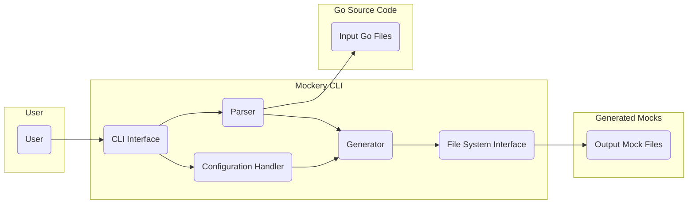

## Project Design Document: Mockery - Go Mock Code Autogenerator

**Version:** 1.1
**Date:** October 26, 2023
**Author:** AI Software Architecture Expert

### 1. Introduction

This document details the design of the Mockery project, a command-line tool designed to automate the generation of mock implementations for Go interfaces, primarily for use in testing. This document provides a comprehensive overview of the system's architecture, components, and data flow, specifically tailored for subsequent threat modeling activities.

### 2. Goals and Objectives

The core objectives of the Mockery project are:

*   Automated generation of mock implementations for Go interfaces.
*   Reduction of boilerplate code in Go unit tests.
*   Provision of a configurable and extensible Go mocking solution.
*   Seamless integration into standard Go development workflows.

### 3. System Architecture

Mockery operates as a command-line application. It analyzes Go source code to identify interfaces and then generates corresponding mock implementations in Go.

*   **Key Components:**
    *   **CLI:** The user interaction point, responsible for parsing command-line arguments and initiating the mock generation process.
    *   **Parser:** Analyzes Go source code files to identify interfaces and extract their method signatures. It utilizes the Go standard library's `go/parser` and `go/ast` packages.
    *   **Generator:** Takes the parsed interface information and generates the mock implementation code. This involves creating a struct and methods that mimic the interface.
    *   **Configuration:** Manages user-defined settings, such as output paths, naming conventions, and mocking framework choices.
    *   **File System Interaction:** Handles reading input Go files and writing the generated mock files to the file system.

### 4. Data Flow

The mock code generation process in Mockery involves the following steps:

1. The user executes the Mockery CLI, providing arguments specifying the target interface(s) and any configuration options.
2. The CLI component receives the command and parses the provided arguments.
3. The CLI instructs the Parser to load and parse the specified Go source code files.
4. The Parser analyzes the Abstract Syntax Tree (AST) of the Go code to locate the target interface(s) and extract their method signatures (names, parameters, and return types).
5. The Parser transmits the extracted interface details to the Generator.
6. The Configuration component provides the Generator with any relevant user-defined settings.
7. The Generator uses the interface information and configuration to generate the Go code for the mock implementation. This includes:
    *   Defining a struct, often embedding a mock object from a chosen framework (e.g., `mock.Mock`).
    *   Generating methods on the struct that correspond to the interface methods.
    *   Implementing the mock behavior using the selected mocking framework's API (e.g., methods for setting expectations and return values).
8. The Generator utilizes the File System Interaction component to write the generated mock code to the designated output directory.
9. The CLI provides feedback to the user regarding the success or failure of the operation.

### 5. Component Details

*   **CLI Interface:**
    *   Leverages libraries like `spf13/cobra` for command-line argument parsing and command structure.
    *   Accepts flags to specify target interfaces, output directories, naming conventions, and the desired mocking framework.
    *   Provides error handling and feedback to the user through the command line.

*   **Parser:**
    *   Utilizes the `go/parser` package to parse Go source files into an Abstract Syntax Tree (AST) representation.
    *   Employs the `go/ast` package to traverse the AST and identify interface declarations within the parsed code.
    *   Extracts detailed method signatures, including parameter names, data types, and return types.
    *   Handles various forms of interface declarations, including those with embedded interfaces.

*   **Generator:**
    *   Employs Go's `text/template` package to generate the mock code based on the parsed interface information and configuration settings.
    *   Supports different template formats to accommodate various Go mocking frameworks (e.g., `testify/mock`, `gomock`).
    *   Allows for customization of the generated code through configuration options, such as prefixes or suffixes for mock names.
    *   Ensures the generated code is syntactically correct Go code and aligns with Go coding conventions.

*   **Configuration Handler:**
    *   Loads configuration settings from files (e.g., `.mockery.yaml`, `.mockery.yml`) or from command-line flags.
    *   Supports a range of configuration options, including:
        *   The output directory for the generated mock files.
        *   Filename naming patterns for the generated mocks.
        *   The package name to be used for the generated mock files.
        *   The specific mocking framework to be used for generating the mock code.
        *   Paths to custom templates for code generation.
        *   Patterns for excluding specific files or directories from processing.

*   **File System Interface:**
    *   Uses standard Go `os` and `io/ioutil` (or `io`) packages for interacting with the file system.
    *   Reads the content of input Go source files for parsing.
    *   Writes the generated mock code to new files in the specified output directory.
    *   Handles file creation and overwriting based on the provided configuration.

### 6. Security Considerations (For Threat Modeling)

This section outlines potential security considerations relevant for threat modeling.

*   **Input Validation Vulnerabilities:**
    *   **Malicious Go Code Parsing:** Mockery parses arbitrary Go source code provided as input. A malicious actor could craft a Go file designed to exploit vulnerabilities within the `go/parser` or `go/ast` packages, potentially leading to denial-of-service or unexpected behavior during parsing.
    *   **Configuration File Manipulation:** If Mockery reads configuration from files, a malicious actor with write access to these files could modify them to influence Mockery's behavior. This could lead to the generation of backdoored or incorrect mock code, or potentially trigger unintended file system operations.

*   **Output Integrity Risks:**
    *   **Compromised Output Directory:** If the output directory for generated mock files lacks proper access controls, a malicious actor could modify the generated mock files. This could lead to tests passing with faulty mocks, masking real issues in the codebase.

*   **Dependency Chain Vulnerabilities:**
    *   Mockery relies on external Go packages. Vulnerabilities in these dependencies (e.g., `spf13/cobra`, specific mocking framework libraries) could be exploited if not properly managed and updated.

*   **Configuration Exploitation:**
    *   **Path Traversal in Templates:** If Mockery allows users to specify custom templates, improper sanitization of template paths could allow a malicious actor to use path traversal techniques to access or overwrite arbitrary files on the system.
    *   **Unintended Code Generation:** Maliciously crafted configurations could potentially lead to the generation of code that introduces vulnerabilities or undesirable behavior in the testing environment.

*   **Access Control Issues:**
    *   Insufficient access controls on the Mockery executable itself or the directories it operates on could allow unauthorized users to execute the tool or modify its configuration.

### 7. Dependencies

Mockery depends on the following key components:

*   **Go Standard Library:** Specifically, packages like `go/parser` and `go/ast` for code analysis, `text/template` for code generation, and `os` and `io` for file system operations. These dependencies are generally considered stable but should still be considered in vulnerability assessments.
*   **`spf13/cobra`:** This library is used for building the command-line interface, handling argument parsing, and command structure. Vulnerabilities in `cobra` could potentially affect Mockery's security.
*   **Mocking Framework Libraries (Optional):** Depending on the configuration, Mockery might interact with specific mocking frameworks like `github.com/stretchr/testify/mock` or `go.uber.org/mock`. Security vulnerabilities in these frameworks could indirectly impact projects using mocks generated by Mockery.

### 8. Deployment

Mockery is typically deployed as a standalone command-line executable. Common deployment methods include:

*   **Local Installation:** Developers install Mockery on their local machines using `go install` or by downloading pre-built binaries. Security considerations here involve ensuring the downloaded binary is from a trusted source.
*   **CI/CD Pipelines:** Mockery is frequently used within Continuous Integration/Continuous Deployment pipelines to automatically generate mocks during the build process. Security considerations in this context involve securing the CI/CD environment and ensuring that the Mockery executable used is trusted.

### 9. Future Enhancements and Potential Security Implications

While not part of the current design, future enhancements could introduce new security considerations:

*   **Web Interface for Mock Generation:** Introducing a web interface would expose Mockery to web-based vulnerabilities like Cross-Site Scripting (XSS) or Cross-Site Request Forgery (CSRF).
*   **Plugin System for Custom Generators:** Allowing users to create and use custom code generators as plugins could introduce risks associated with executing untrusted code. Proper sandboxing and validation would be crucial.
*   **Remote Mock Generation Service:** Offering Mockery as a remote service would introduce network security concerns, including authentication, authorization, and data transmission security.

This revised document provides an enhanced and more detailed overview of the Mockery project's design, with a specific focus on aspects relevant to threat modeling.