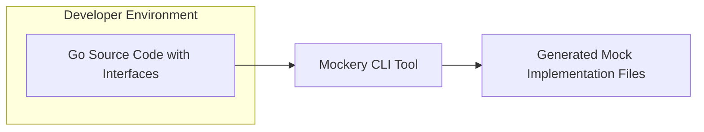
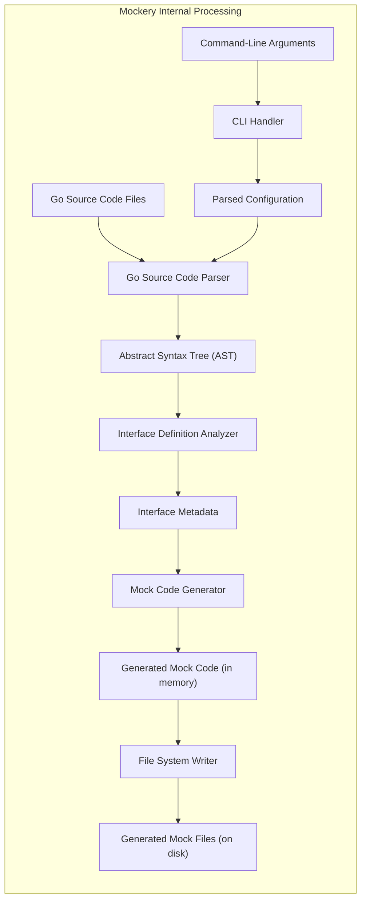

# Project Design Document: Mockery

**Version:** 1.1
**Date:** October 26, 2023
**Author:** AI Software Architect

## 1. Introduction

This document provides a detailed design overview of the Mockery project, a widely used Go library for generating mock implementations of Go interfaces. The primary purpose of this document is to clearly articulate the architecture, internal components, and data flow within Mockery. This detailed design serves as a foundational resource for subsequent threat modeling activities, enabling a comprehensive assessment of potential security risks.

## 2. Goals and Non-Goals

### 2.1 Goals

*   Present a clear and comprehensive architectural overview of the Mockery project.
*   Thoroughly identify and describe the key internal components of Mockery and their interactions.
*   Detail the data flow within the Mockery generation process, from input to output.
*   Establish a solid and well-defined foundation for future threat modeling and security analysis.

### 2.2 Non-Goals

*   In-depth, line-by-line code-level implementation details of Mockery's internals.
*   Performance evaluation, benchmarking results, or optimization strategies for Mockery.
*   Specific identification and analysis of existing security vulnerabilities within the current codebase (this is the objective of the subsequent threat modeling).
*   Comprehensive instructions or tutorials on how to use Mockery (this information is readily available in the project's official documentation).

## 3. Architectural Overview

Mockery functions as a command-line interface (CLI) tool that processes Go source code files to automatically generate mock implementations for specified interfaces. The fundamental process involves parsing the provided Go code, identifying the target interfaces, and then generating corresponding Go code that implements these interfaces for testing purposes.

**High-Level Process Breakdown:**

*   A developer provides Go source code files containing interface definitions as input to the Mockery CLI tool.
*   The Mockery CLI parses the provided Go source code to understand its structure and identify interfaces.
*   Based on the identified interfaces, Mockery generates new Go source code files containing mock implementations.
*   These generated mock implementation files are then outputted to a designated directory within the developer's project.

## 4. Detailed Design

### 4.1 Components

*   **Command-Line Interface (CLI) Handler:**
    *   Responsible for receiving and interpreting commands and arguments passed to the Mockery CLI tool.
    *   Utilizes libraries like `flag` or `spf13/cobra` (or similar) to manage command-line options.
    *   Determines the target interfaces for mocking, the output directory for generated files, and other configuration parameters.
*   **Go Source Code Parser:**
    *   Leverages the standard Go library packages `go/parser` and `go/ast` to perform lexical analysis and syntactic analysis of the input Go source code.
    *   Constructs an Abstract Syntax Tree (AST) representing the structure of the Go code.
    *   Extracts crucial information about interfaces, including their method signatures, parameter types, return types, and associated documentation.
*   **Interface Definition Analyzer:**
    *   Traverses the generated Abstract Syntax Tree (AST) to specifically locate and identify interface definitions within the parsed code.
    *   Collects detailed metadata about each identified interface, such as method names, parameter lists (including types), return value lists (including types), and any associated comments or documentation.
*   **Mock Code Generator:**
    *   Takes the analyzed interface definition data as input.
    *   Implements the core logic for generating the Go source code for the mock implementation.
    *   Creates a struct type that will serve as the mock.
    *   Generates methods on this struct that correspond to the methods defined in the original interface.
    *   These generated methods typically include logic for recording calls, setting up return values, and potentially panicking or performing other actions based on predefined expectations.
*   **File System Writer:**
    *   Handles the process of writing the generated mock implementation code to physical Go source code files on the file system.
    *   Manages file creation, ensures proper formatting of the generated code (often using `go/format`), and writes the content to the specified output directory.

### 4.2 Data Flow

**Detailed Data Flow Description:**

1. **Input:** The Mockery process begins with the user providing `Command-Line Arguments` (A) specifying the target interfaces and output location, along with the `Go Source Code Files` (B) containing the interface definitions.
2. **CLI Handling:** The `CLI Handler` (C) parses the `Command-Line Arguments` (A) to extract configuration information, resulting in `Parsed Configuration` (D).
3. **Source Code Parsing:** The `Go Source Code Parser` (E) takes the `Parsed Configuration` (D) and the `Go Source Code Files` (B) as input. It analyzes the source code and generates an `Abstract Syntax Tree (AST)` (F) representing the code's structure.
4. **Interface Analysis:** The `Interface Definition Analyzer` (G) traverses the `Abstract Syntax Tree (AST)` (F) to identify interface definitions and extracts relevant details, producing `Interface Metadata` (H). This metadata includes method signatures, parameter types, and return types.
5. **Mock Generation:** The `Mock Code Generator` (I) receives the `Interface Metadata` (H) and uses it as a blueprint to generate the `Generated Mock Code (in memory)` (J). This code implements the interfaces with methods designed for testing purposes.
6. **File Writing:** The `File System Writer` (K) takes the `Generated Mock Code (in memory)` (J) and writes it to physical files, resulting in the `Generated Mock Files (on disk)` (L) in the specified output directory.

## 5. Security Considerations (For Threat Modeling)

This section highlights potential areas of security concern that will be investigated further during the dedicated threat modeling process.

*   **Input Validation and Sanitization:**
    *   How rigorously does Mockery validate the paths provided for Go source code files and the specified interface names?
    *   Could a malicious actor provide specially crafted file paths or interface names that could lead to unexpected file system access or other vulnerabilities?
*   **Code Generation Vulnerabilities:**
    *   Are there potential flaws in the logic used by the `Mock Code Generator` that could lead to the generation of insecure or syntactically incorrect mock code?
    *   Could a carefully crafted interface definition exploit weaknesses in the generation process, potentially leading to code injection or other issues in downstream usage of the generated mocks?
*   **File System Interaction Risks:**
    *   How does Mockery handle file creation, writing, and potential overwriting of existing files in the specified output directory?
    *   Are there any race conditions or other vulnerabilities associated with file system operations that could be exploited? Could a malicious actor potentially overwrite critical files?
*   **Dependency Vulnerabilities:**
    *   Does Mockery rely on any external Go libraries or dependencies that might contain known security vulnerabilities?
    *   What mechanisms are in place to manage and update these dependencies to mitigate potential risks?
*   **Command Injection Potential:**
    *   Is there any possibility of command injection vulnerabilities if Mockery processes user-provided input (e.g., through command-line arguments) without proper sanitization?
    *   Could a malicious actor inject arbitrary commands that would be executed by the system running Mockery?

## 6. Deployment

Mockery is typically deployed and utilized as a development-time dependency within a Go project. Developers commonly install it using the `go install` command. Subsequently, they execute the Mockery CLI tool from their project's command line to generate mocks for specific interfaces. Furthermore, Mockery is frequently integrated into Continuous Integration/Continuous Deployment (CI/CD) pipelines. This allows for the automated generation of mock implementations as part of the software build and testing process, ensuring that mocks are always up-to-date.

## 7. Future Considerations

*   **Enhanced Support for Generics:** As the use of generics in Go becomes more prevalent, future versions of Mockery may need to be enhanced to fully support generating mocks for interfaces that utilize generic types.
*   **Customizable Mock Generation Templates:** Providing users with the ability to customize the templates used for generating mock code could offer greater flexibility and control over the structure and behavior of the generated mocks.
*   **Integration with Language Server Protocol (LSP):** Integrating Mockery with LSP could enable features like automatic mock generation within Integrated Development Environments (IDEs), improving developer workflow and productivity.
*   **Support for Different Mocking Styles:** Exploring support for alternative mocking styles or frameworks beyond the current generated output could broaden Mockery's applicability.