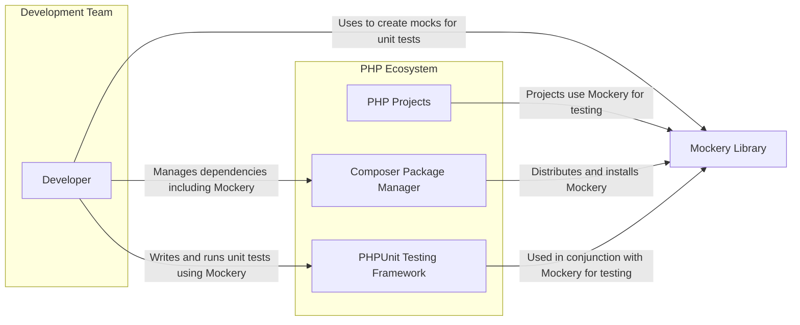
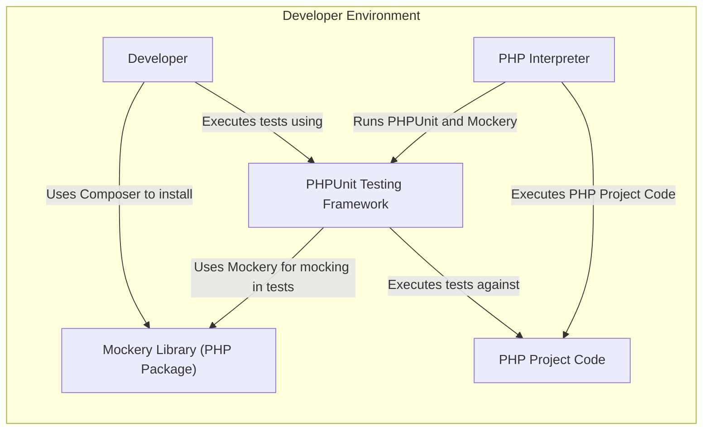
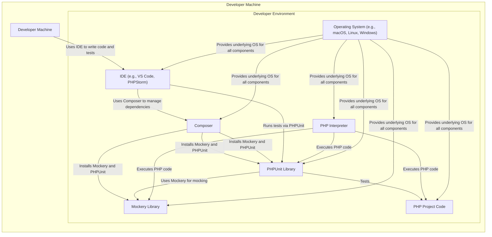

# BUSINESS POSTURE

This project, Mockery, is a mocking framework for PHP. It aims to simplify unit testing in PHP by allowing developers to easily create mock objects for dependencies, leading to more isolated and effective tests.

Business Priorities and Goals:
- Improve software quality: By facilitating unit testing, Mockery helps developers write more robust and reliable code.
- Increase development efficiency: Mockery simplifies the process of creating mocks, saving developers time and effort in writing tests.
- Reduce bugs and regressions: Thorough unit testing, enabled by tools like Mockery, helps catch bugs early in the development cycle, reducing the risk of regressions in later stages.
- Enhance code maintainability: Well-tested code is generally easier to maintain and refactor over time.

Business Risks:
- Dependency on open-source project: The project relies on an external open-source library. Risks include project abandonment, security vulnerabilities in the library, or lack of timely updates.
- Incorrect usage leading to false positives/negatives in tests: If Mockery is not used correctly, tests might not accurately reflect the behavior of the system, leading to false confidence or missed issues.
- Compatibility issues with PHP versions or other libraries:  Changes in PHP or other libraries might break compatibility with Mockery, requiring updates and potentially disrupting development workflows.
- Security vulnerabilities in generated mocks (unlikely but theoretically possible): Although Mockery primarily generates test code, there's a theoretical risk of vulnerabilities if the generated mocks interact with the application in unexpected ways or if the mocking framework itself has vulnerabilities.

# SECURITY POSTURE

Existing Security Controls:
- security control: Usage of GitHub for source code management and collaboration. (Implemented in: GitHub repository)
- security control: Issue tracking and pull request reviews on GitHub. (Implemented in: GitHub repository)
- security control: Automated testing via GitHub Actions. (Implemented in: `.github/workflows` directory in the repository)
- security control: Static analysis and linting as part of the development process (potentially, based on common PHP development practices, but not explicitly stated in the input). (Potentially implemented via developer tooling and CI pipelines)

Accepted Risks:
- accepted risk: Reliance on community contributions for security patches and updates.
- accepted risk: Potential vulnerabilities in dependencies (although Mockery itself has minimal dependencies).
- accepted risk: Risk of developer misconfiguration or misuse leading to security issues in applications using Mockery (indirect risk).

Recommended Security Controls:
- security control: Implement dependency scanning in CI/CD pipeline to detect known vulnerabilities in dependencies.
- security control: Regularly review and update dependencies to patch known vulnerabilities.
- security control: Encourage secure coding practices among developers using Mockery, especially when integrating mocks with real systems.
- security control: Consider code signing releases to ensure integrity and authenticity of distributed packages.

Security Requirements:
- Authentication: Not directly applicable to Mockery itself as it's a development tool and not a user-facing application. Authentication is relevant for accessing the GitHub repository and related development infrastructure.
- Authorization: Authorization is relevant for controlling access to the GitHub repository and related development infrastructure. For Mockery itself, authorization is not a primary concern.
- Input Validation: Input validation is relevant in the context of code generation. Mockery needs to correctly parse and process PHP code to generate mocks. Incorrect input handling could potentially lead to unexpected behavior or errors during mock generation.
- Cryptography: Cryptography is not a core requirement for Mockery. However, if Mockery were to handle sensitive data (which it generally doesn't), cryptographic measures would be necessary. For now, it's not a high priority.

# DESIGN

## C4 CONTEXT



Context Diagram Elements:

- Element:
    - Name: Developer
    - Type: Person
    - Description: Software developers who write and maintain PHP applications and unit tests.
    - Responsibilities: Develop PHP applications, write unit tests, use Mockery to create mocks, manage project dependencies.
    - Security controls: Code reviews, secure coding practices, access control to development environments.

- Element:
    - Name: Mockery Library
    - Type: Software System
    - Description: A PHP mocking framework that allows developers to create mock objects for dependencies in their unit tests.
    - Responsibilities: Generate mock objects based on PHP interfaces and classes, provide API for defining mock behavior and expectations.
    - Security controls: Input validation during mock generation, automated testing of the library itself, dependency scanning.

- Element:
    - Name: PHP Projects
    - Type: Software System
    - Description: PHP applications that are being developed and tested.
    - Responsibilities: Implement business logic, interact with dependencies, utilize unit tests for quality assurance.
    - Security controls: Secure coding practices, input validation, authorization, authentication, vulnerability scanning.

- Element:
    - Name: Composer Package Manager
    - Type: Software System
    - Description: A dependency manager for PHP that is used to install and manage libraries like Mockery.
    - Responsibilities: Resolve and install PHP package dependencies, manage package versions, distribute packages.
    - Security controls: Package integrity checks, secure distribution channels, vulnerability scanning of packages.

- Element:
    - Name: PHPUnit Testing Framework
    - Type: Software System
    - Description: A popular unit testing framework for PHP, often used in conjunction with Mockery.
    - Responsibilities: Provide a framework for writing and running unit tests, execute test suites, report test results.
    - Security controls: Secure test execution environment, isolation of tests, reporting of test failures.

## C4 CONTAINER



Container Diagram Elements:

- Element:
    - Name: Mockery Library (PHP Package)
    - Type: Library
    - Description: The Mockery PHP library, distributed as a Composer package, providing mocking functionalities.
    - Responsibilities: Mock object generation, API for defining mock behavior, integration with PHPUnit.
    - Security controls: Input validation during mock generation, automated testing, dependency scanning.

- Element:
    - Name: PHP Interpreter
    - Type: Runtime Environment
    - Description: The PHP runtime environment used to execute PHP code, including Mockery and unit tests.
    - Responsibilities: Execute PHP code, provide runtime environment for PHP applications and libraries.
    - Security controls: Security updates and patching of the PHP interpreter, secure configuration.

- Element:
    - Name: PHPUnit Testing Framework
    - Type: Library
    - Description: The PHPUnit testing framework used to run unit tests that utilize Mockery.
    - Responsibilities: Test execution, test reporting, integration with Mockery for mocking.
    - Security controls: Secure test execution environment, isolation of tests.

- Element:
    - Name: PHP Project Code
    - Type: Application Code
    - Description: The PHP application code being developed and tested, which uses Mockery for unit testing.
    - Responsibilities: Implement business logic, interact with dependencies, be subject to unit tests.
    - Security controls: Secure coding practices, input validation, authorization, authentication, vulnerability scanning.

- Element:
    - Name: Developer
    - Type: Person
    - Description: Software developers who use Mockery in their development environment.
    - Responsibilities: Write code, write tests, use Mockery, run tests.
    - Security controls: Secure development environment, access control, secure coding practices.

## DEPLOYMENT

Mockery is primarily a development-time dependency and is not typically deployed as a standalone application. It's used within developer environments and CI/CD pipelines during the software development lifecycle.

Deployment Architecture: Developer Local Environment



Deployment Diagram Elements (Developer Local Environment):

- Element:
    - Name: Developer Machine
    - Type: Infrastructure
    - Description: The local computer used by a developer for software development.
    - Responsibilities: Host the developer environment, run IDE, PHP interpreter, Composer, and project code.
    - Security controls: Operating system security controls, endpoint security software, physical security of the machine.

- Element:
    - Name: Operating System (e.g., macOS, Linux, Windows)
    - Type: Software
    - Description: The operating system running on the developer machine.
    - Responsibilities: Provide core system functionalities, manage resources, host the developer environment.
    - Security controls: OS security updates, firewall, user access control.

- Element:
    - Name: PHP Interpreter
    - Type: Software
    - Description: The PHP runtime environment installed on the developer machine.
    - Responsibilities: Execute PHP code, provide runtime environment for PHP applications and libraries.
    - Security controls: Security updates and patching of the PHP interpreter, secure configuration.

- Element:
    - Name: Composer
    - Type: Software
    - Description: The PHP dependency manager installed on the developer machine.
    - Responsibilities: Manage PHP package dependencies, install and update libraries like Mockery and PHPUnit.
    - Security controls: Secure download and installation of packages, integrity checks.

- Element:
    - Name: Mockery Library
    - Type: Software
    - Description: The Mockery PHP library installed in the developer environment.
    - Responsibilities: Provide mocking functionalities for unit testing.
    - Security controls: As per library design and development process.

- Element:
    - Name: PHPUnit Library
    - Type: Software
    - Description: The PHPUnit testing framework installed in the developer environment.
    - Responsibilities: Provide unit testing framework, execute tests.
    - Security controls: Secure test execution environment.

- Element:
    - Name: PHP Project Code
    - Type: Software
    - Description: The PHP project code being developed on the developer machine.
    - Responsibilities: Implement application logic, be tested using unit tests and Mockery.
    - Security controls: Secure coding practices, source code management.

- Element:
    - Name: IDE (e.g., VS Code, PHPStorm)
    - Type: Software
    - Description: Integrated Development Environment used by the developer.
    - Responsibilities: Code editing, debugging, test execution, integration with Composer and other tools.
    - Security controls: IDE security updates, plugin security, secure configuration.

## BUILD

```mermaid
flowchart LR
    subgraph "Developer"
        Developer["Developer"]
    end

    subgraph "GitHub"
        GitHubRepo["GitHub Repository"]
        GitHubActions["GitHub Actions CI"]
    end

    subgraph "Package Registry (e.g., Packagist)"
        Packagist["Packagist"]
    end

    Developer -->|Code Commit| GitHubRepo
    GitHubRepo -->|Triggers CI Workflow| GitHubActions
    GitHubActions -->|Builds, Tests, Lints, Scans| BuildArtifacts["Build Artifacts (e.g., Phar, Composer Package)"]
    BuildArtifacts -->|Publish to| Packagist
    Packagist -->|Available for download by users| Users["PHP Developers"]
    GitHubActions -->|Dependency Scanning| GitHubActions
    GitHubActions -->|SAST Scanning| GitHubActions
    GitHubActions -->|Unit Tests| GitHubActions
```

Build Process Description:

1. Developer commits code changes to the GitHub Repository.
2. GitHub Actions CI pipeline is triggered automatically on code commits (and potentially pull requests, tags, etc.).
3. The CI pipeline performs the following steps:
    - Build: Packages the Mockery library (likely into a Composer package).
    - Tests: Executes unit tests to ensure code quality and functionality.
    - Lints: Runs code linters and static analysis tools to check for code style and potential issues.
    - Scans: Performs dependency scanning to identify known vulnerabilities in dependencies. Potentially includes SAST scanning for source code vulnerabilities.
4. Build Artifacts (e.g., Composer package) are created.
5. The build artifacts are published to Packagist, the primary PHP package registry.
6. PHP developers can then download and use Mockery via Composer, pulling it from Packagist.

Build Diagram Elements:

- Element:
    - Name: Developer
    - Type: Person
    - Description: Developers who contribute code to the Mockery project.
    - Responsibilities: Write code, commit code changes, create pull requests.
    - Security controls: Secure development environment, code review process, access control to the repository.

- Element:
    - Name: GitHub Repository
    - Type: Code Repository
    - Description: The GitHub repository hosting the Mockery source code.
    - Responsibilities: Source code version control, collaboration platform, trigger CI/CD pipelines.
    - Security controls: Access control, branch protection, audit logs, vulnerability scanning of GitHub platform.

- Element:
    - Name: GitHub Actions CI
    - Type: CI/CD System
    - Description: GitHub's built-in CI/CD service used to automate the build, test, and release process for Mockery.
    - Responsibilities: Automated build, test execution, static analysis, dependency scanning, artifact publishing.
    - Security controls: Secure CI/CD pipeline configuration, secrets management, access control to CI/CD workflows, build environment security.

- Element:
    - Name: Build Artifacts (e.g., Phar, Composer Package)
    - Type: Software Artifact
    - Description: The packaged and built versions of the Mockery library, ready for distribution.
    - Responsibilities: Distributable format of the Mockery library.
    - Security controls: Code signing (potentially), integrity checks during build process.

- Element:
    - Name: Packagist
    - Type: Package Registry
    - Description: The primary public package registry for PHP Composer packages, used to distribute Mockery.
    - Responsibilities: Host and distribute PHP packages, provide package download and installation services.
    - Security controls: Package integrity checks, malware scanning (Packagist's own security measures), secure distribution channels (HTTPS).

- Element:
    - Name: Users (PHP Developers)
    - Type: Person
    - Description: PHP developers who use Mockery in their projects.
    - Responsibilities: Download and install Mockery via Composer, use Mockery in their unit tests.
    - Security controls: Composer's package integrity checks, secure download channels.

# RISK ASSESSMENT

Critical Business Processes Protected:
- Software Development Lifecycle: Mockery supports unit testing, which is a critical part of the software development lifecycle, contributing to software quality and reducing bugs.
- Open-Source Software Distribution: The build and release process ensures that Mockery is built, tested, and distributed reliably to the PHP developer community.

Data We Are Trying to Protect and Sensitivity:
- Source Code: The source code of Mockery itself is publicly available on GitHub. Integrity and availability are important to ensure developers can rely on the library. Confidentiality is less of a concern as it's open source.
- Build Artifacts (Composer Package): The integrity and authenticity of the distributed Composer package are crucial. Developers need to trust that the package they download from Packagist is genuine and hasn't been tampered with.
- Test Code: Test code within the Mockery repository is also public. Integrity and availability are important for maintaining the quality of the library.

Data Sensitivity:
- Publicly available source code and test code: Low confidentiality sensitivity.
- Build artifacts: High integrity and authenticity sensitivity.

# QUESTIONS & ASSUMPTIONS

Questions:
- Are there any specific security scanning tools used in the GitHub Actions CI pipeline (e.g., SAST, DAST, dependency scanning)?
- Is code signing used for releases to ensure package integrity?
- What is the process for handling security vulnerabilities reported in Mockery or its dependencies?
- Are there any specific security guidelines or secure coding practices followed during the development of Mockery?

Assumptions:
- The project aims to follow standard secure software development practices, including testing and code review.
- GitHub Actions CI is used for automated build, test, and potentially security checks.
- Packagist is used as the primary distribution channel for the Composer package.
- Developers using Mockery are responsible for the security of their own applications and how they use Mockery within them.
- The primary security concerns for Mockery are related to supply chain security (ensuring the integrity of the distributed package) and the security of the development process itself.