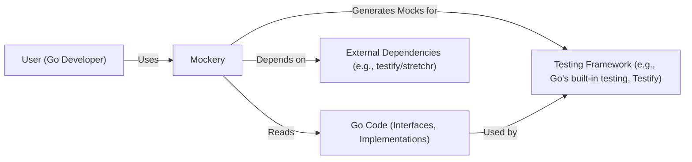
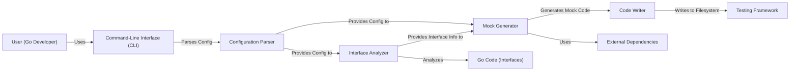
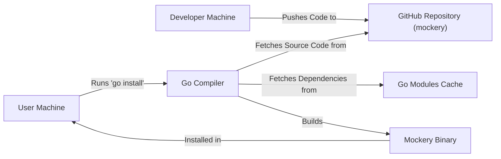
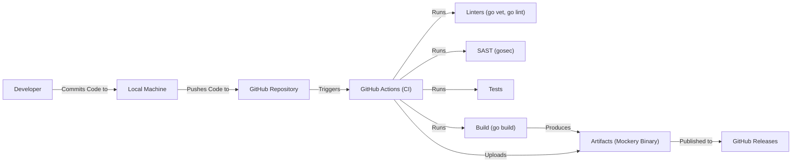

Okay, let's create a design document for the `mockery` project.

# BUSINESS POSTURE

Business Priorities and Goals:

*   Provide a robust and reliable mocking tool for Go developers.
*   Simplify the process of creating and managing mocks for testing.
*   Improve developer productivity by reducing the boilerplate code needed for mocking.
*   Maintain a high level of code quality and test coverage for the `mockery` project itself.
*   Foster a strong community around the project, encouraging contributions and feedback.
*   Ensure compatibility with a wide range of Go versions and testing frameworks.
*   Provide clear and comprehensive documentation.

Business Risks:

*   Inability to generate mocks for complex interfaces could limit adoption.
*   Bugs or performance issues in `mockery` could disrupt development workflows.
*   Lack of community engagement could lead to stagnation of the project.
*   Compatibility issues with new Go releases or testing frameworks could break existing user setups.
*   Security vulnerabilities in generated mocks or the `mockery` codebase itself could expose users to risks. This is particularly important as `mockery` deals with code generation, which can be a sensitive area.
*   Inadequate documentation could hinder adoption and usage.

# SECURITY POSTURE

Existing Security Controls:

*   security control: Code Reviews: All changes to the codebase undergo code review. (Implicit in the GitHub workflow).
*   security control: Testing: The project has a comprehensive suite of tests to ensure functionality and prevent regressions. (Visible in the repository's test files and CI configuration).
*   security control: Static Analysis: The project likely uses `go vet` and `go lint` as part of its build process, although this isn't explicitly stated. (Common practice in Go projects).
*   security control: Dependency Management: Go modules are used to manage dependencies, providing some level of control over the supply chain. (go.mod and go.sum files).
*   security control: Continuous Integration: GitHub Actions are used to automate testing and building on every push and pull request. (Visible in the .github/workflows directory).

Accepted Risks:

*   accepted risk: The project relies on external dependencies, which could introduce vulnerabilities. While Go modules mitigate this, it's not entirely eliminated.
*   accepted risk: The project generates code, which inherently carries a risk of introducing vulnerabilities if not handled carefully.
*   accepted risk: The project may not have dedicated security expertise, relying on community contributions and best practices.

Recommended Security Controls:

*   security control: Implement a Security Policy: Create a `SECURITY.md` file outlining vulnerability reporting procedures.
*   security control: Static Application Security Testing (SAST): Integrate a SAST tool like `gosec` into the CI pipeline to automatically scan for potential security vulnerabilities.
*   security control: Software Composition Analysis (SCA): Use a tool like `dependabot` or `snyk` to identify and track vulnerabilities in dependencies.
*   security control: Fuzz Testing: Introduce fuzz testing to identify edge cases and potential vulnerabilities that might be missed by traditional unit tests.
*   security control: CodeQL: Integrate CodeQL to scan for vulnerabilities.

Security Requirements:

*   Authentication: Not directly applicable to `mockery` as it's a command-line tool.
*   Authorization: Not directly applicable to `mockery` as it's a command-line tool.
*   Input Validation:
    *   `mockery` must validate user-provided inputs (e.g., interface names, file paths, configuration options) to prevent injection attacks or unexpected behavior.
    *   The tool should handle invalid or malicious input gracefully, providing informative error messages without crashing or exposing sensitive information.
*   Cryptography: Not directly applicable, unless `mockery` is used to generate mocks for cryptographic interfaces. In that case, the generated mocks should not weaken the security of the cryptographic operations.
*   Output Encoding: `mockery` generates Go code. This code must be properly formatted and escaped to prevent code injection vulnerabilities. The generated code should adhere to Go's security best practices.

# DESIGN

## C4 CONTEXT

C4 Context Element List:

*   Element:
    *   Name: User (Go Developer)
    *   Type: Person
    *   Description: A software developer writing Go code and tests.
    *   Responsibilities: Uses `mockery` to generate mocks for testing.
    *   Security controls: Not directly applicable.

*   Element:
    *   Name: Mockery
    *   Type: Software System
    *   Description: The `mockery` command-line tool.
    *   Responsibilities: Generates mock implementations of Go interfaces.
    *   Security controls: Input validation, secure code generation, dependency management, SAST, SCA, Fuzz Testing.

*   Element:
    *   Name: Go Code (Interfaces, Implementations)
    *   Type: Software System
    *   Description: The user's Go code, including interfaces to be mocked and their implementations.
    *   Responsibilities: Defines the interfaces that `mockery` will generate mocks for.
    *   Security controls: Relies on the security of the Go language and the developer's coding practices.

*   Element:
    *   Name: Testing Framework (e.g., Go's built-in testing, Testify)
    *   Type: Software System
    *   Description: The testing framework used by the developer to write and run tests.
    *   Responsibilities: Executes tests using the mocks generated by `mockery`.
    *   Security controls: Relies on the security of the testing framework itself.

*   Element:
    *   Name: External Dependencies (e.g., testify/stretchr)
    *   Type: Software System
    *   Description: External libraries used by `mockery`.
    *   Responsibilities: Provide functionalities used by `mockery`.
    *   Security controls: SCA, dependency management.

## C4 CONTAINER

C4 Container Element List:

*   Element:
    *   Name: User (Go Developer)
    *   Type: Person
    *   Description: A software developer writing Go code and tests.
    *   Responsibilities: Uses `mockery` to generate mocks for testing.
    *   Security controls: Not directly applicable.

*   Element:
    *   Name: Command-Line Interface (CLI)
    *   Type: Container
    *   Description: The entry point for the `mockery` tool.
    *   Responsibilities: Parses command-line arguments and flags.
    *   Security controls: Input validation.

*   Element:
    *   Name: Configuration Parser
    *   Type: Container
    *   Description: Parses configuration files (if any) and merges them with command-line arguments.
    *   Responsibilities: Provides a unified configuration object.
    *   Security controls: Input validation, secure parsing of configuration files.

*   Element:
    *   Name: Interface Analyzer
    *   Type: Container
    *   Description: Analyzes the Go source code to identify interfaces to be mocked.
    *   Responsibilities: Extracts information about interfaces (methods, parameters, return types).
    *   Security controls: Secure parsing of Go code.

*   Element:
    *   Name: Mock Generator
    *   Type: Container
    *   Description: Generates the mock code based on the interface information.
    *   Responsibilities: Creates the mock implementation of the interface.
    *   Security controls: Secure code generation, adherence to Go's security best practices.

*   Element:
    *   Name: Code Writer
    *   Type: Container
    *   Description: Writes the generated mock code to a file.
    *   Responsibilities: Saves the mock code to the specified output location.
    *   Security controls: Secure file handling, proper permissions.

*   Element:
    *   Name: Go Code (Interfaces)
    *   Type: Software System
    *   Description: The user's Go code containing interfaces.
    *   Responsibilities: Provides interfaces for mocking.
    *   Security controls: Relies on the security of the Go language.

*   Element:
    *   Name: Testing Framework
    *   Type: Software System
    *   Description: Framework for running tests (e.g., Go testing).
    *   Responsibilities: Executes tests with generated mocks.
    *   Security controls: Relies on the security of the testing framework.

*   Element:
    *   Name: External Dependencies
    *   Type: Software System
    *   Description: External libraries used by `mockery`.
    *   Responsibilities: Provide functionalities to `mockery`.
    *   Security controls: SCA, dependency management.

## DEPLOYMENT

Possible Deployment Solutions:

1.  Manual Installation: Users download a pre-built binary from the GitHub releases page and place it in their system's PATH.
2.  `go install`: Users run `go install github.com/mockery/mockery/v2@latest` to build and install `mockery` from source.
3.  Package Managers: `mockery` could be packaged for various package managers (e.g., Homebrew, apt, yum).

Chosen Solution (go install):

Deployment Element List:

*   Element:
    *   Name: Developer Machine
    *   Type: Infrastructure Node
    *   Description: The machine where `mockery` developers write and commit code.
    *   Responsibilities: Development and maintenance of `mockery`.
    *   Security controls: Standard development security practices.

*   Element:
    *   Name: GitHub Repository (mockery)
    *   Type: Infrastructure Node
    *   Description: The Git repository hosting the `mockery` source code.
    *   Responsibilities: Source code version control.
    *   Security controls: Access controls, branch protection rules.

*   Element:
    *   Name: Go Modules Cache
    *   Type: Infrastructure Node
    *   Description: Cache for Go modules.
    *   Responsibilities: Stores downloaded dependencies.
    *   Security controls: Relies on the security of the Go module proxy.

*   Element:
    *   Name: User Machine
    *   Type: Infrastructure Node
    *   Description: The machine where a user installs and uses `mockery`.
    *   Responsibilities: Running `mockery` to generate mocks.
    *   Security controls: Standard user machine security practices.

*   Element:
    *   Name: Go Compiler
    *   Type: Software
    *   Description: The Go compiler.
    *   Responsibilities: Compiles the `mockery` source code into an executable binary.
    *   Security controls: Relies on the security of the Go compiler.

*   Element:
    *   Name: Mockery Binary
    *   Type: Software
    *   Description: The compiled `mockery` executable.
    *   Responsibilities: Generating mocks.
    *   Security controls: Result of the build process security controls.

## BUILD

Build Process Description:

1.  A developer commits code to their local machine.
2.  The code is pushed to the `mockery` repository on GitHub.
3.  GitHub Actions is triggered by the push (or pull request).
4.  The CI workflow defined in `.github/workflows` is executed.
5.  Linters (`go vet`, `go lint`, and potentially others) are run to check for code style and potential errors.
6.  A SAST tool (`gosec`, as recommended) is run to scan for security vulnerabilities.
7.  Unit tests and integration tests are executed.
8.  If all checks and tests pass, the `go build` command is used to compile the `mockery` code into an executable binary.
9.  The resulting binary (and potentially other artifacts) are uploaded to GitHub Releases.

Build Security Controls:

*   security control: Linters: Ensure code quality and consistency.
*   security control: SAST: Detect potential security vulnerabilities in the code.
*   security control: Tests: Verify functionality and prevent regressions.
*   security control: Build Automation: Ensure a consistent and repeatable build process.
*   security control: Artifact Signing (Recommended): Sign the released binaries to ensure their integrity and authenticity.

# RISK ASSESSMENT

Critical Business Processes:

*   Mock Generation: The core functionality of generating mock implementations of Go interfaces. This process must be reliable, accurate, and secure.
*   Continuous Integration and Delivery: The automated build and release process ensures that new versions of `mockery` are delivered quickly and reliably.

Data:

*   Source Code (User's Go Code):
    *   Sensitivity: Varies depending on the user's code. Can range from non-sensitive (open-source projects) to highly sensitive (proprietary code).
    *   Protection: `mockery` should not store or transmit the user's source code. It only needs to read it locally for analysis.
*   Generated Mock Code:
    *   Sensitivity: Generally low, as it's derived from the user's code and intended for testing. However, it could indirectly expose information about the structure of the user's code.
    *   Protection: The generated code should be secure and not introduce any vulnerabilities.
*   Configuration Data:
    *   Sensitivity: Low. Contains settings for `mockery`.
    *   Protection: Should be validated to prevent injection attacks.

# QUESTIONS & ASSUMPTIONS

Questions:

*   Are there any specific compliance requirements (e.g., GDPR, HIPAA) that `mockery` needs to consider? (Assumption: No specific compliance requirements beyond general best practices.)
*   What is the expected level of support for different Go versions and testing frameworks? (Assumption: Support the latest stable Go versions and popular testing frameworks like the built-in `testing` package and `testify`.)
*   What is the project's risk tolerance regarding potential vulnerabilities in generated mocks? (Assumption: Low risk tolerance. Generated mocks should be as secure as possible.)
*   Is there a plan for handling user-reported security vulnerabilities? (Assumption: There will be a process for reporting and addressing vulnerabilities, ideally documented in a `SECURITY.md` file.)

Assumptions:

*   BUSINESS POSTURE: The primary goal is to provide a reliable and useful mocking tool for the Go community.
*   SECURITY POSTURE: The project follows common Go development best practices, including code reviews and testing.
*   DESIGN: The design is based on the information available in the GitHub repository and common patterns for command-line tools. The tool operates locally and does not transmit data over a network.