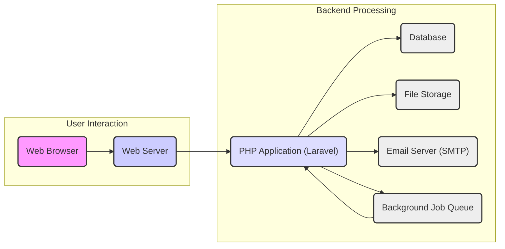
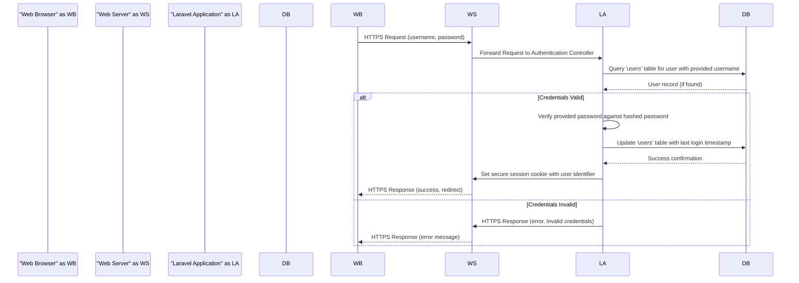
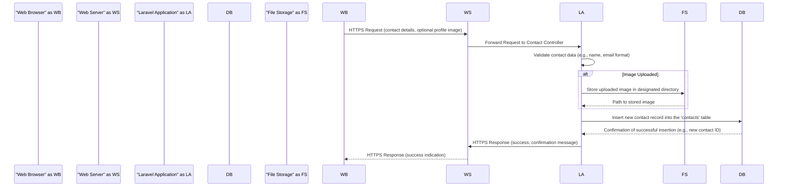

## Project Design Document: Monica - Personal Relationship Management

**Version:** 1.1
**Date:** October 26, 2023
**Author:** AI Software Architect

### 1. Project Overview

Monica is an open-source, self-hosted web application meticulously designed to empower individuals in managing their personal relationships effectively. It provides a comprehensive suite of features for tracking interactions, remembering significant dates, managing notes and tasks, and storing other pertinent details about contacts. The core objective of Monica is to offer a centralized, user-friendly, and privacy-respecting platform for nurturing and maintaining meaningful personal connections. This document details the system architecture and key components of Monica, serving as a foundation for subsequent threat modeling exercises.

### 2. Goals and Objectives

*   To deliver an intuitive and efficient user interface for seamless management of personal relationships.
*   To enable users to meticulously record and track various forms of interactions with their contacts (e.g., calls, emails, meetings, gifts).
*   To provide robust mechanisms for recalling and managing important dates and events associated with contacts (e.g., birthdays, anniversaries).
*   To facilitate the creation and management of tasks specifically related to individual contacts, ensuring timely follow-up and engagement.
*   To establish a secure and private environment for the storage and management of sensitive personal information, prioritizing user data protection.
*   To ensure the application is readily deployable across various environments and easily maintainable over time.

### 3. Target Audience

*   Individuals who are proactive in managing and strengthening their personal relationships.
*   Users who prioritize the privacy and control of their personal data and prefer self-hosted solutions.
*   Technically proficient individuals who are comfortable with the process of self-hosting web applications and managing their infrastructure.

### 4. System Architecture

Monica adopts a well-established three-tier web application architecture, promoting modularity and separation of concerns:

*   **Presentation Tier (Frontend):**  This layer encompasses the user interface elements that facilitate user interaction with the application. It is primarily implemented using a combination of HTML for structure, CSS for styling, and JavaScript for dynamic behavior and user interface enhancements.
*   **Application Tier (Backend):**  Serving as the core logic engine of the application, this tier is responsible for processing user requests, executing business logic, manipulating data, and orchestrating interactions with the data tier. The backend is built upon the robust PHP Laravel framework, leveraging its features for routing, controllers, and service management.
*   **Data Tier:**  This layer is dedicated to the persistent storage of application data. It typically utilizes a relational database management system (RDBMS) to ensure data integrity and efficient retrieval.

### 5. Component Descriptions

*   **Web Browser:** The client-side application employed by users to access and interact with the Monica application. It interprets HTML, CSS, and JavaScript to render the user interface.
*   **Web Server (e.g., Nginx, Apache):**  Acts as an intermediary, receiving incoming HTTP requests from user web browsers and routing them to the appropriate application server for processing. It also efficiently serves static assets, such as HTML files, stylesheets, JavaScript files, and images.
*   **PHP Application (Laravel Framework):** The heart of the application's logic, structured using the Model-View-Controller (MVC) pattern:
    *   **Controllers:** Responsible for handling specific user requests received from the web server. They interpret the request, interact with models and services to perform actions, and determine the appropriate response to send back to the user.
    *   **Models:** Represent the data structures within the application and provide an interface for interacting with the underlying database. They encapsulate data access logic and enforce data integrity rules.
    *   **Views:** Generate the HTML markup that is ultimately rendered in the user's web browser. They present data retrieved from the models in a user-friendly format.
    *   **Routes:** Define the mapping between specific URLs (Uniform Resource Locators) and the corresponding controller actions that should handle requests to those URLs.
    *   **Middleware:**  Provides a mechanism to intercept and process HTTP requests before they reach the controllers. This is commonly used for tasks such as authentication, authorization, logging, and request modification.
    *   **Services:** Encapsulate reusable business logic and functionalities that are not directly tied to specific models or controllers. They promote code organization and maintainability.
    *   **Providers:**  Bootstrap the Laravel application and register essential services and components during the application's initialization process.
    *   **Artisan Console:** A powerful command-line interface provided by Laravel, offering a suite of tools for performing administrative tasks such as database migrations, queue management, code generation, and testing.
*   **Database (e.g., MySQL, PostgreSQL):**  The persistent storage mechanism for all application data. It stores critical information including user account details, contact information, interaction logs, task lists, and user-specific settings.
*   **File Storage:**  A designated location for storing files uploaded by users, such as profile pictures for contacts or attachments related to interactions. This can be implemented using local server storage or a dedicated cloud storage service like Amazon S3 or Google Cloud Storage.
*   **Email Server (SMTP):**  Used for sending outbound emails from the application. This includes transactional emails such as password reset requests, notifications for upcoming events or tasks, and potentially other communication features.
*   **Background Job Queue (e.g., Redis, Database Queues):**  A system for managing asynchronous tasks that do not need to be executed immediately within the context of a user request. This is used for tasks like sending emails, processing large data imports, or performing other resource-intensive operations without blocking the user interface.
*   **Cache (e.g., Redis, Memcached):**  An in-memory data store used to temporarily store frequently accessed data. This significantly improves application performance by reducing the need to repeatedly query the database for the same information.

### 6. Data Flow Diagrams

**Detailed Data Flow - User Login:**

**Detailed Data Flow - Creating a New Contact:**

### 7. Security Considerations

*   **Authentication and Authorization:**
    *   **Threat:** Unauthorized access to user accounts and data.
    *   **Mitigation:** Implement strong password hashing algorithms (e.g., bcrypt). Enforce strong password policies. Utilize secure session management with HTTP-only and secure flags on cookies. Consider implementing multi-factor authentication (MFA).
*   **Input Validation:**
    *   **Threat:** Injection attacks (SQL injection, XSS), data corruption.
    *   **Mitigation:** Implement robust server-side validation for all user inputs. Sanitize user-provided data before displaying it to prevent XSS. Utilize parameterized queries or prepared statements to prevent SQL injection.
*   **Data Protection:**
    *   **Threat:** Exposure of sensitive data at rest and in transit.
    *   **Mitigation:** Encrypt sensitive data at rest in the database (e.g., using database encryption features or application-level encryption). Enforce HTTPS to encrypt all communication between the client and the server. Securely handle file uploads and storage to prevent unauthorized access.
*   **Cross-Site Request Forgery (CSRF) Protection:**
    *   **Threat:** Unauthorized actions performed on behalf of an authenticated user.
    *   **Mitigation:** Implement CSRF protection mechanisms, such as synchronizer tokens, for all state-changing requests. Laravel provides built-in CSRF protection.
*   **HTTPS:**
    *   **Threat:** Man-in-the-middle attacks, eavesdropping on sensitive data.
    *   **Mitigation:** Enforce HTTPS by configuring the web server to redirect HTTP traffic to HTTPS. Use valid SSL/TLS certificates. Implement HTTP Strict Transport Security (HSTS) headers.
*   **Dependency Management:**
    *   **Threat:** Vulnerabilities in third-party libraries and packages.
    *   **Mitigation:** Regularly update all dependencies (PHP packages, JavaScript libraries) to their latest stable versions to patch known security vulnerabilities. Utilize dependency scanning tools to identify potential vulnerabilities.
*   **Error Handling and Logging:**
    *   **Threat:** Information disclosure through verbose error messages, difficulty in identifying and responding to security incidents.
    *   **Mitigation:** Implement proper error handling to avoid exposing sensitive information in error messages. Maintain comprehensive and secure logs for auditing, security monitoring, and incident response.
*   **Rate Limiting:**
    *   **Threat:** Brute-force attacks on login forms and other sensitive endpoints.
    *   **Mitigation:** Implement rate limiting for login attempts, password reset requests, and other sensitive actions to prevent automated attacks.
*   **Database Security:**
    *   **Threat:** Unauthorized access to the database, data breaches.
    *   **Mitigation:** Follow database security best practices, such as using strong passwords for database users, restricting database access to only necessary applications and users, and regularly patching the database server.
*   **File Storage Security:**
    *   **Threat:** Unauthorized access to uploaded files, potential for malicious file uploads.
    *   **Mitigation:** Ensure proper permissions are set on the file storage directory to prevent unauthorized access. Validate file types and sizes upon upload. Consider using a dedicated storage service with built-in security features.
*   **Email Security:**
    *   **Threat:** Email spoofing, phishing attacks.
    *   **Mitigation:** Use secure SMTP connections (TLS/SSL). Implement SPF, DKIM, and DMARC records to verify the authenticity of outgoing emails.
*   **Regular Security Audits and Penetration Testing:**
    *   **Threat:** Undiscovered vulnerabilities in the application.
    *   **Mitigation:** Conduct regular security assessments, including code reviews and penetration testing, to proactively identify and address potential security weaknesses.

### 8. Deployment Architecture

Monica, being a self-hosted application, offers flexibility in deployment. Common deployment architectures include:

*   **Single Server Deployment (Monolithic):** All components, including the web server, application server (PHP-FPM), and database, are installed and run on a single physical or virtual server. This is a simpler setup suitable for smaller deployments or personal use.
*   **Containerized Deployment (e.g., Docker):** Components are packaged into isolated containers using Docker. This approach enhances portability, scalability, and simplifies deployment management. Docker Compose is often used to orchestrate multiple containers for the web server, application, and database.
*   **Platform as a Service (PaaS):** Deploying Monica to a PaaS provider like Heroku, DigitalOcean App Platform, or AWS Elastic Beanstalk abstracts away much of the infrastructure management. The PaaS provider handles server provisioning, scaling, and maintenance.
*   **Cloud Infrastructure (IaaS):** Deploying Monica on cloud infrastructure like AWS EC2, Google Compute Engine, or Azure Virtual Machines provides maximum control over the environment. This requires more manual configuration and management but offers greater flexibility.

Key deployment considerations include:

*   **Operating System Hardening:** Secure the underlying operating system by applying security patches, disabling unnecessary services, and configuring firewalls.
*   **Firewall Configuration:** Configure firewalls to restrict network access to only essential ports (e.g., 80 for HTTP, 443 for HTTPS, and potentially SSH).
*   **Regular Backups:** Implement a comprehensive backup strategy for the database, file storage, and application code to ensure data recovery in case of failures.
*   **Monitoring and Logging:** Set up monitoring tools to track application performance and health. Centralized logging helps in identifying and troubleshooting issues.

### 9. Technology Stack

*   **Programming Language:** PHP (version 8.0 or higher recommended)
*   **Framework:** Laravel (latest stable version recommended)
*   **Frontend Technologies:** HTML5, CSS3, JavaScript (potentially with frameworks like Vue.js or React, though Monica primarily uses vanilla JavaScript)
*   **Database:**  MySQL or PostgreSQL (community preference leans towards MySQL)
*   **Web Server:** Nginx or Apache (Nginx is generally preferred for performance)
*   **Caching:** Redis or Memcached
*   **Background Jobs:** Laravel Queues (configurable with database, Redis, or other queue drivers)
*   **Email:** SMTP (integration with mail providers like SendGrid or Mailgun is common)
*   **Package Management:** Composer (for PHP dependencies), npm or yarn (for frontend dependencies, if applicable)

### 10. Future Considerations

*   **Enhanced User Interface/User Experience (UI/UX):** Continuous improvement of the user interface for better usability and accessibility.
*   **Two-Factor Authentication (2FA):** Implementing 2FA using TOTP or other methods to enhance account security.
*   **Public API for Integrations:** Developing a well-documented API to allow integration with other applications and services.
*   **Native Mobile Applications (iOS and Android):** Creating dedicated mobile apps for a more seamless mobile experience.
*   **Advanced Search and Filtering:** Implementing more sophisticated search capabilities across contacts, interactions, and notes.
*   **Data Import/Export Enhancements:** Providing more flexible and comprehensive options for importing and exporting data in various formats.
*   **Relationship Mapping and Visualization:** Features to visualize the connections and relationships between contacts.
*   **Calendar Integration:**  Direct integration with popular calendar applications for managing events and reminders.
*   **Contact Groups and Segmentation:**  Allowing users to organize contacts into groups for better management and targeted actions.
