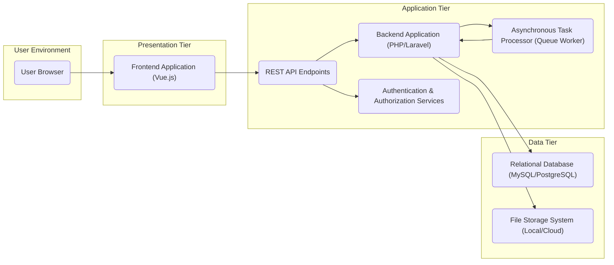
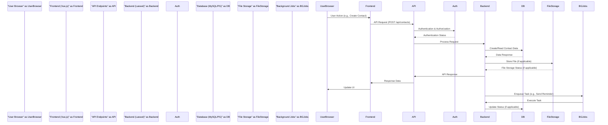

## Project Design Document: Monica - Personal Relationship Management (Improved)

**1. Introduction**

This document provides an enhanced and detailed design overview of the Monica personal relationship management application, based on the publicly available information from the GitHub repository: https://github.com/monicahq/monica. This document aims to provide a clear and comprehensive articulation of the system's architecture, components, data flow, and key technologies. It serves as a robust foundation for subsequent threat modeling exercises and further development discussions.

**2. Goals and Objectives**

The overarching goals of Monica are to empower users with a comprehensive and privacy-focused platform for effectively managing their personal relationships. Key objectives include:

*   **Comprehensive Contact Management:**  Facilitating the storage, organization, and retrieval of detailed information about individuals, including personal details, contact information, and associated metadata.
*   **Detailed Interaction Tracking:**  Enabling users to log, categorize, and analyze interactions with their contacts across various channels (e.g., phone calls, emails, meetings, social media).
*   **Proactive Reminders and Task Management:**  Providing tools for setting, managing, and receiving reminders and tasks specifically linked to individual contacts, fostering stronger relationship management.
*   **Personalized Notes and Journaling:**  Offering a secure space for recording personal notes, reflections, and contextual information related to contacts, enriching the user's understanding of their relationships.
*   **Robust Personal Data Privacy and Security:**  Prioritizing the security and privacy of user data through secure design principles and self-hosting capabilities.
*   **Flexible Self-Hosting Capability:**  Empowering users with the option to host the application on their own infrastructure, granting them greater control over their data.

**3. High-Level Architecture**

Monica employs a well-defined three-tier architectural pattern, promoting modularity and scalability:

*   **Presentation Tier (User Interface):**  The entry point for user interaction, responsible for rendering the application's interface and handling user input.
*   **Application Tier (Business Logic):**  The core of the application, encompassing the business rules, data processing, and API endpoints that drive the system's functionality.
*   **Data Tier (Persistent Storage):**  The repository for all application data, ensuring its persistence and availability.

**4. Detailed Component Descriptions**

*   **Frontend Application (Vue.js):**
    *   Primary responsibility is to present the user interface and manage user interactions within the browser.
    *   Developed using the reactive JavaScript framework Vue.js, enabling dynamic and responsive user experiences.
    *   Communicates with the Backend Application via standard HTTP requests to the defined REST API Endpoints.
    *   Implements client-side input validation to enhance usability and reduce unnecessary server load.
    *   Manages user sessions and authentication tokens, typically utilizing browser cookies or local storage mechanisms.

*   **Backend Application (PHP/Laravel):**
    *   Houses the core business logic and data manipulation routines of the application.
    *   Built upon the robust and feature-rich PHP Laravel framework, providing structure and efficiency.
    *   Exposes a set of well-defined RESTful API Endpoints for the Frontend Application to interact with.
    *   Enforces server-side data validation and sanitization to ensure data integrity and security.
    *   Interacts with the Data Tier through an Object-Relational Mapper (ORM), simplifying database operations.
    *   Comprises specific modules for:
        *   Contact Management: Handling CRUD (Create, Read, Update, Delete) operations for contact records.
        *   Interaction Management:  Managing the logging, categorization, and retrieval of interaction details.
        *   Reminder and Task Management:  Implementing the scheduling, management, and notification of reminders and tasks.
        *   Notes and Journaling:  Providing functionality for storing, retrieving, and organizing textual notes and journal entries.
        *   Settings Management:  Allowing users to configure application preferences and personal settings.

*   **REST API Endpoints:**
    *   Serve as the communication interface between the Frontend and Backend Applications.
    *   Adhere to RESTful architectural principles, utilizing standard HTTP methods (GET, POST, PUT, DELETE).
    *   Require proper authentication and authorization to protect sensitive resources and operations.
    *   Examples of key endpoints include:
        *   `"/api/contacts"`:  For managing contact resources (listing, creating, updating, deleting).
        *   `"/api/interactions"`: For managing interaction logs associated with contacts.
        *   `"/api/reminders"`: For managing reminder schedules and statuses.
        *   `"/api/auth/login"`:  For user authentication and session initiation.

*   **Authentication & Authorization Services:**
    *   Crucial for verifying the identity of users and controlling their access to application resources.
    *   Likely implements session-based authentication using secure cookies or token-based authentication mechanisms such as JWT (JSON Web Tokens).
    *   Manages user registration, login, logout, and password reset functionalities.
    *   Enforces authorization rules to ensure users can only access and modify data they are permitted to.

*   **Asynchronous Task Processor (Queue Worker):**
    *   Designed to handle time-consuming or non-critical tasks in the background, improving application responsiveness.
    *   Utilizes a queue system (e.g., Redis, database queue) to manage and process tasks asynchronously.
    *   Common tasks handled by the queue worker include:
        *   Sending email notifications (e.g., reminder notifications).
        *   Processing large data imports or exports.
        *   Performing scheduled maintenance tasks.

*   **Relational Database (MySQL/PostgreSQL):**
    *   The primary persistent storage mechanism for the application's structured data.
    *   Likely utilizes a relational database management system (RDBMS) such as MySQL or PostgreSQL, chosen for their reliability and features.
    *   Data is organized into tables representing entities like users, contacts, interactions, and reminders, with defined relationships between them.
    *   The Backend Application interacts with the database through the ORM, abstracting away low-level database operations.

*   **File Storage System (Local/Cloud):**
    *   Responsible for storing user-uploaded files, such as profile pictures, document attachments to interactions, or other media.
    *   Can be configured to use the local file system of the server or leverage cloud-based object storage services (e.g., AWS S3, Google Cloud Storage, Azure Blob Storage) for scalability and durability.

**5. Data Flow (Detailed)**

A common user interaction, such as creating a new contact, follows this detailed data flow:

1. The **User** interacts with the **Frontend Application** (e.g., fills out a "create contact" form and clicks "Save").
2. The **Frontend Application** sends an HTTP POST request to the appropriate **REST API Endpoint** on the **Backend Application** (e.g., `"/api/contacts"`), including the contact data in the request body (typically JSON format).
3. The **REST API Endpoint** receives the request and passes it to the **Authentication & Authorization Services** for verification.
4. The **Authentication & Authorization Services** validates the user's session or token to ensure they are authenticated and authorized to perform this action.
5. Upon successful authentication and authorization, the **Backend Application** processes the request. This involves:
    *   Validating and sanitizing the incoming contact data to prevent malicious input or data inconsistencies.
    *   Utilizing the ORM to interact with the **Relational Database**.
    *   Creating a new record in the "contacts" table with the provided data.
6. If file uploads are involved (e.g., a profile picture), the **Backend Application** interacts with the **File Storage System** to store the uploaded file.
7. The **Relational Database** confirms the successful creation of the contact record.
8. The **Backend Application** sends an HTTP response back to the **Frontend Application**, typically including a success status code and potentially the newly created contact data.
9. The **Frontend Application** receives the response and updates the user interface to reflect the successful creation of the contact.

For asynchronous tasks:

1. An event within the **Backend Application** triggers the need for an asynchronous task (e.g., a reminder is due).
2. The **Backend Application** enqueues a job onto the **Asynchronous Task Processor (Queue Worker)**, specifying the task to be performed (e.g., "send reminder email") and any necessary data.
3. A worker process managed by the **Asynchronous Task Processor** picks up the job from the queue.
4. The worker process executes the task, potentially interacting with the **Relational Database** to retrieve data or update statuses, and potentially interacting with external services (e.g., an email service).

**6. Technology Stack (Detailed)**

*   **Core Programming Languages:** PHP (Backend), JavaScript (Frontend)
*   **Frontend Framework:** Vue.js (for building interactive user interfaces)
*   **Backend Framework:** Laravel (for rapid and structured PHP application development)
*   **Database System:** Choice of MySQL or PostgreSQL (for reliable and scalable data storage)
*   **Web Server:** Typically Apache or Nginx (for serving the application)
*   **Queue System (for Asynchronous Tasks):**  Common options include Redis or database queues provided by Laravel
*   **Operating System (Server):**  Likely a Linux distribution (e.g., Ubuntu, CentOS) for server deployments
*   **Cloud Provider (Optional, for Hosted Deployments):** AWS, Google Cloud Platform, Azure (for infrastructure and services)
*   **Containerization (Optional):** Docker (for packaging and deploying the application in containers)

**7. Security Considerations (Enhanced)**

This section expands on the preliminary security considerations, providing more specific examples and categorizations relevant to each component:

*   **Authentication Security:**
    *   **Threats:** Brute-force attacks, credential stuffing, dictionary attacks.
    *   **Mitigations:** Strong password policies, rate limiting login attempts, account lockout mechanisms, consideration of multi-factor authentication (MFA).
*   **Authorization Security:**
    *   **Threats:** Privilege escalation, unauthorized access to resources.
    *   **Mitigations:**  Role-Based Access Control (RBAC) with clearly defined roles and permissions, principle of least privilege, thorough testing of authorization rules.
*   **Data Protection (At Rest and In Transit):**
    *   **Threats:** Data breaches, eavesdropping, man-in-the-middle attacks.
    *   **Mitigations:** Encryption of sensitive data in the database (e.g., using database encryption features or application-level encryption), mandatory use of HTTPS for all communication, secure storage and handling of API keys and secrets (e.g., using environment variables or dedicated secret management tools).
*   **Input Validation and Sanitization:**
    *   **Threats:** SQL injection, Cross-Site Scripting (XSS), command injection.
    *   **Mitigations:**  Comprehensive server-side validation of all user inputs, sanitization of potentially dangerous characters, using parameterized queries or ORM features to prevent SQL injection, encoding output to prevent XSS.
*   **Cross-Site Request Forgery (CSRF) Protection:**
    *   **Threats:** Unauthorized actions performed on behalf of a legitimate user.
    *   **Mitigations:** Implementation of CSRF tokens (e.g., using Laravel's built-in CSRF protection), proper handling of cookies and session management.
*   **Session Management Security:**
    *   **Threats:** Session hijacking, session fixation.
    *   **Mitigations:**  Using secure cookies with `HttpOnly` and `Secure` flags, implementing session timeouts, regenerating session IDs after login, protecting against session fixation attacks.
*   **File Upload Security:**
    *   **Threats:** Upload of malicious files (e.g., malware, scripts), path traversal vulnerabilities.
    *   **Mitigations:**  Strict validation of file types and sizes, renaming uploaded files to prevent execution, storing uploaded files outside the webroot, scanning uploaded files for malware.
*   **Dependency Management Security:**
    *   **Threats:** Exploiting known vulnerabilities in third-party libraries and dependencies.
    *   **Mitigations:** Regularly updating dependencies to the latest versions, using dependency scanning tools to identify and address vulnerabilities.
*   **Error Handling and Logging:**
    *   **Threats:** Information disclosure through verbose error messages.
    *   **Mitigations:**  Avoiding displaying sensitive information in error messages, implementing proper logging mechanisms for security auditing and incident response.
*   **Rate Limiting and Abuse Prevention:**
    *   **Threats:** Denial-of-service attacks, API abuse.
    *   **Mitigations:**  Implementing rate limiting on API endpoints to restrict the number of requests from a single source within a given timeframe.

**8. Deployment Architecture (Expanded)**

Monica's self-hosting nature allows for diverse deployment options, each with its own security considerations:

*   **Local Server Deployment:**
    *   **Description:** Running Monica directly on a personal computer or home server.
    *   **Considerations:** Security relies heavily on the user's local network security and server configuration. Requires manual setup and maintenance.
*   **Virtual Private Server (VPS) Deployment:**
    *   **Description:** Deploying Monica on a virtual server hosted by a third-party provider.
    *   **Considerations:** Shared responsibility model with the VPS provider for infrastructure security. Requires careful server hardening and configuration.
*   **Cloud Platform Deployment:**
    *   **Description:** Utilizing cloud services (e.g., AWS EC2, Google Compute Engine, Azure Virtual Machines) or container orchestration (e.g., Docker on Kubernetes).
    *   **Considerations:** Leverages the cloud provider's security infrastructure. Requires understanding and configuring cloud security services (e.g., security groups, firewalls). Containerization adds a layer of isolation but requires secure image management.

**9. Assumptions and Constraints**

*   This design document is based on the publicly available information from the Monica GitHub repository. Specific implementation details might vary.
*   The security considerations are high-level and will require further refinement during a dedicated threat modeling exercise.
*   The document assumes a standard web application deployment environment.

**10. Future Considerations**

*   **Enhanced Integrations:**  Exploring integrations with other productivity tools, calendar applications, and communication platforms.
*   **Mobile Applications:** Developing native mobile applications (iOS and Android) or a Progressive Web App (PWA) for enhanced accessibility.
*   **Advanced Analytics and Reporting:** Implementing features for visualizing relationship data and gaining insights.
*   **Collaboration Features (Optional):**  Potentially adding features for shared contact management or collaborative relationship tracking, depending on user needs and privacy considerations.

This improved design document provides a more detailed and comprehensive overview of the Monica application, strengthening its utility for threat modeling and future development efforts. The enhanced descriptions, diagrams, and security considerations offer a more robust understanding of the system's architecture and potential vulnerabilities.