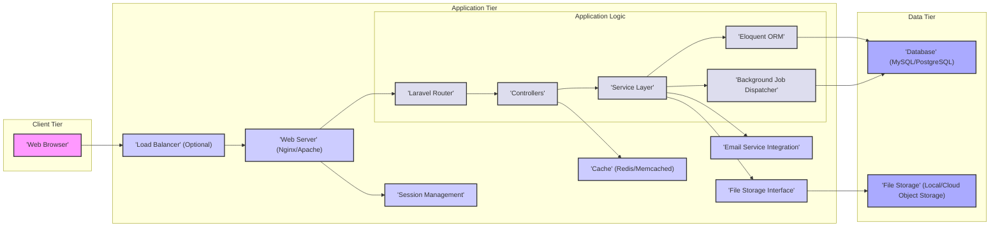
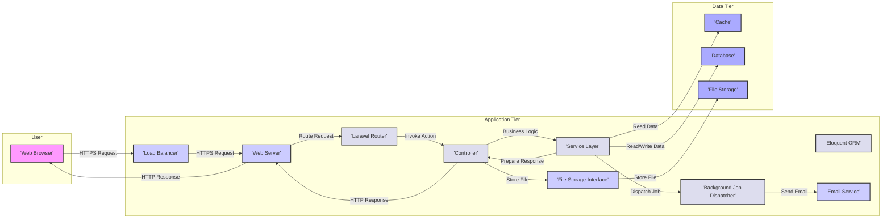

# Project Design Document: Monica - Personal Relationship Manager

**Version:** 1.1
**Date:** October 26, 2023
**Author:** AI Software Architect

## 1. Introduction

This document provides a detailed architectural design of the Monica personal relationship management (PRM) application. It outlines the key components, their interactions, data flow, and security considerations. This document serves as a foundation for subsequent threat modeling activities.

### 1.1. Purpose

The primary purpose of this document is to provide a comprehensive and unambiguous understanding of the Monica application's architecture to facilitate effective threat modeling. It aims to clearly define the system's boundaries, components, and interactions, enabling security professionals to identify potential vulnerabilities and design appropriate mitigations.

### 1.2. Scope

This document covers the core architectural components of the Monica application, including its web application, database, background processing, and key external integrations. It focuses on the logical and physical architecture relevant to security considerations, encompassing both the application itself and its typical deployment environment.

### 1.3. Audience

This document is intended for:

*   Security engineers and architects involved in threat modeling, security assessments, and penetration testing.
*   Development team members responsible for designing, building, and maintaining the application's codebase.
*   Operations team members responsible for deploying, managing, and monitoring the application's infrastructure.
*   Product owners and stakeholders who need a technical understanding of the system's architecture.

## 2. System Overview

Monica is a user-friendly, web-based application designed to empower individuals to manage and nurture their personal relationships effectively. It provides tools to track interactions, remember important details about contacts, set timely reminders, and generally foster stronger connections with the people they care about.

### 2.1. Key Features

*   **Comprehensive Contact Management:** Securely storing and organizing detailed information about individuals, including personal details, contact information, and relationship history.
*   **Detailed Activity Tracking:** Logging various interactions with contacts, such as phone calls, emails, meetings, social media engagements, and physical encounters, with associated notes and context.
*   **Intelligent Reminders:** Setting up proactive reminders for future interactions, birthdays, anniversaries, or specific tasks related to individual contacts, ensuring timely follow-up.
*   **Private Notes and Journaling:** Recording personal thoughts, observations, and key takeaways about contacts and interactions, fostering deeper understanding and recall.
*   **Actionable Tasks:** Creating, assigning (to oneself), and managing tasks related to specific contacts, ensuring important actions are not overlooked.
*   **Thoughtful Gift Ideas:**  Tracking potential gift ideas for contacts based on their preferences and past interactions, facilitating more personalized gifting.
*   **Flexible Data Import/Export:**  Importing contact data from various sources and exporting data in common formats for backup or migration purposes.
*   **Secure User Authentication and Authorization:** Robustly managing user accounts, ensuring only authorized users can access their data, with considerations for different permission levels.

## 3. Architectural Design

Monica adopts a well-established three-tier web application architecture, separating concerns into a presentation tier, an application tier, and a data tier. This separation enhances maintainability, scalability, and security.

### 3.1. Component Diagram

### 3.2. Component Descriptions

*   **Web Browser:** The primary interface for user interaction, responsible for rendering the application's user interface using HTML, CSS, and executing client-side JavaScript for dynamic behavior.
*   **Load Balancer (Optional):**  Distributes incoming user traffic across multiple instances of the Web Server, enhancing application availability, fault tolerance, and scalability under high load.
*   **Web Server (Nginx/Apache):**  Accepts incoming HTTP/HTTPS requests from users, serves static assets (images, CSS, JavaScript), and acts as a reverse proxy, forwarding dynamic requests to the PHP Application.
*   **Laravel Router:**  Part of the Laravel framework, responsible for mapping incoming HTTP requests to specific application controllers based on defined routes.
*   **Controllers:** Handle specific user requests, orchestrate the application's business logic, interact with the Service Layer, and return responses to the Web Server.
*   **Service Layer:** Encapsulates the core business logic of the application, providing a clear separation of concerns between the presentation layer (Controllers) and the data access layer.
*   **Eloquent ORM:** Laravel's Object-Relational Mapper, facilitating interaction with the Database by mapping database tables to PHP objects, simplifying data retrieval and manipulation.
*   **Background Job Dispatcher:** Manages the queuing and execution of asynchronous tasks, such as sending emails or processing large data imports, improving the responsiveness of the main application.
*   **Cache (Redis/Memcached):**  An in-memory data store used to cache frequently accessed data, reducing database load and improving application performance.
*   **Session Management:**  Handles user session creation, persistence, and validation, ensuring authenticated users can maintain their logged-in state securely.
*   **Email Service Integration:**  Handles the sending of transactional and notification emails to users, potentially integrating with third-party email providers (e.g., SendGrid, Mailgun).
*   **File Storage Interface:** Provides an abstraction layer for interacting with different file storage systems, allowing the application to store user-uploaded files on local storage or cloud object storage services.
*   **Database (MySQL/PostgreSQL):**  The persistent data store for the application, housing user accounts, contact information, interactions, notes, and other application data.
*   **File Storage (Local/Cloud Object Storage):** Stores user-uploaded files, such as profile pictures and document attachments. Cloud object storage (e.g., AWS S3, Azure Blob Storage) offers scalability and durability.

### 3.3. Data Flow

The following describes a typical user interaction flow for creating a new contact:

1. A user initiates the "create contact" action through their **Web Browser**.
2. The browser sends an HTTPS request to the **Load Balancer** (if configured) or directly to the **Web Server**.
3. The **Web Server** receives the request and forwards it to the **Laravel Router**.
4. The **Laravel Router** identifies the appropriate **Controller** to handle the request.
5. The **Controller** receives the request data, potentially interacts with the **Cache** to retrieve related information, and invokes methods in the **Service Layer** to perform the business logic for creating a new contact.
6. The **Service Layer** utilizes the **Eloquent ORM** to interact with the **Database**, inserting the new contact's information.
7. If the contact creation triggers any asynchronous tasks (e.g., sending a welcome email), the **Service Layer** dispatches a job to the **Background Job Dispatcher**.
8. The **Background Worker** processes the queued job, potentially using the **Email Service Integration** to send an email.
9. If the user uploads a profile picture, the **Controller** or **Service Layer** uses the **File Storage Interface** to store the file in the **File Storage**.
10. The **Controller** prepares an HTTP response (e.g., a success message or a redirect) and returns it to the **Web Server**.
11. The **Web Server** sends the response back to the user's **Web Browser**, updating the user interface.

## 4. Security Considerations

This section details critical security considerations for the Monica application, highlighting potential threats and necessary mitigation strategies.

### 4.1. Authentication and Authorization

*   **Secure Password Handling:** User passwords must be securely hashed using a strong, one-way hashing algorithm (e.g., bcrypt, Argon2) with unique salts to prevent password compromise in case of a data breach.
*   **Robust Session Management:** Implement secure session management practices, including using HTTP-only and secure cookies, setting appropriate session timeouts, and invalidating sessions upon logout or inactivity.
*   **Role-Based Access Control (RBAC):** Implement a granular RBAC system to control user access to specific features and data based on their assigned roles, ensuring users only have the necessary permissions.
*   **Multi-Factor Authentication (MFA):** Strongly consider implementing MFA to add an extra layer of security beyond passwords, protecting against unauthorized access even if credentials are compromised.
*   **Protection Against Brute-Force Attacks:** Implement measures to prevent brute-force attacks on login forms, such as rate limiting and account lockout policies.

### 4.2. Data Security

*   **Encryption at Rest:** Sensitive data stored in the database (e.g., personal details, notes) and file storage should be encrypted using industry-standard encryption algorithms.
*   **Encryption in Transit:** All communication between the client and the server must be encrypted using HTTPS to protect data from eavesdropping and man-in-the-middle attacks.
*   **Regular Data Backups:** Implement a robust backup strategy with regular backups of the database and file storage, stored securely and separately, to ensure data recovery in case of disaster.
*   **Input Validation and Sanitization:** Implement rigorous input validation and sanitization on all user-provided data to prevent injection attacks (e.g., SQL injection, Cross-Site Scripting).
*   **Protection of Personally Identifiable Information (PII):** Implement measures to protect PII in accordance with relevant privacy regulations (e.g., GDPR), including data minimization, anonymization, and secure handling.

### 4.3. Application Security

*   **Cross-Site Scripting (XSS) Prevention:** Implement robust output encoding and sanitization techniques to prevent the injection of malicious scripts into web pages.
*   **Cross-Site Request Forgery (CSRF) Prevention:** Utilize anti-CSRF tokens to protect against unauthorized actions performed on behalf of authenticated users.
*   **SQL Injection Prevention:** Employ parameterized queries or prepared statements when interacting with the database to prevent the execution of malicious SQL code.
*   **Security Misconfigurations:** Ensure secure configuration of all application components, including web servers, databases, and frameworks, following security best practices.
*   **Dependency Management:** Regularly audit and update application dependencies to patch known security vulnerabilities in third-party libraries.

### 4.4. Infrastructure Security

*   **Secure Server Configuration:** Harden server configurations by disabling unnecessary services, applying security patches promptly, and using strong passwords for system accounts.
*   **Network Security:** Implement network security measures such as firewalls, intrusion detection/prevention systems, and network segmentation to protect the application infrastructure.
*   **Access Control:** Restrict access to servers and databases to authorized personnel only, using strong authentication and authorization mechanisms.
*   **Web Application Firewall (WAF):** Consider deploying a WAF to filter malicious traffic and protect against common web attacks before they reach the application.

### 4.5. External Integrations

*   **Secure API Communication:** When integrating with external services, use secure communication protocols (e.g., HTTPS) and secure authentication mechanisms (e.g., OAuth 2.0, API keys).
*   **Data Validation for External Sources:**  Thoroughly validate data received from external integrations to prevent the introduction of malicious or malformed data into the application.
*   **Principle of Least Privilege for Integrations:** Grant external integrations only the necessary permissions required for their specific functionality.

## 5. Deployment Architecture

Monica can be deployed in various configurations, depending on scalability and availability requirements. Common deployment scenarios include:

*   **Single Server Deployment:** All components (web server, application, database) reside on a single server, suitable for development or small-scale deployments.
*   **Containerized Deployment (Docker/Kubernetes):**  Components are packaged into containers and orchestrated using platforms like Docker and Kubernetes, offering scalability, portability, and resilience.
*   **Cloud-Based Deployment:** Leveraging cloud platforms like AWS, Azure, or Google Cloud, utilizing managed services for databases, load balancing, and compute resources.

A typical production deployment might involve:

*   Multiple web server instances behind a **Load Balancer** for high availability and scalability.
*   A dedicated and potentially clustered **Database** server for performance and data redundancy.
*   A separate server or container for **Background Workers** to handle asynchronous tasks.
*   A dedicated **Cache** server (e.g., Redis cluster) for improved performance.
*   **Object Storage** (e.g., AWS S3) for scalable and durable storage of user-uploaded files.

## 6. Technologies Used

*   **Primary Programming Language:** PHP
*   **Web Application Framework:** Laravel (with specific version details for security patching)
*   **Database System:** MySQL or PostgreSQL (with specific version details)
*   **Web Server Software:** Nginx or Apache (with specific version details and configured modules)
*   **Caching Technology:** Redis or Memcached (with specific version details)
*   **Background Processing/Queue System:** Laravel Queue (utilizing database, Redis, or other drivers)
*   **Frontend Technologies:** HTML5, CSS3, JavaScript (potentially using a framework like Vue.js or similar, with specific version details)
*   **Operating System (for deployment):**  (e.g., Ubuntu, CentOS) with specific version details
*   **Containerization (Optional):** Docker
*   **Orchestration (Optional):** Kubernetes

## 7. Future Considerations

*   **API Development and Documentation:**  Developing a well-documented RESTful API to enable integrations with other applications and services, expanding the ecosystem around Monica.
*   **Native Mobile Applications (iOS and Android):** Creating dedicated mobile applications for enhanced user experience on mobile devices, potentially leveraging the API.
*   **Enhanced Security Features:** Implementing more advanced security measures such as Content Security Policy (CSP), Subresource Integrity (SRI), and regular security vulnerability scanning.
*   **Scalability and Performance Optimizations:** Continuously optimizing the architecture and codebase to handle a growing user base and increasing data volume, including database optimizations and caching strategies.
*   **Integration with Third-Party Services:** Exploring integrations with other relevant services, such as calendar applications, social media platforms, or communication tools, to enhance functionality.

This document provides a comprehensive and improved overview of the Monica application's architecture, serving as a more detailed and valuable resource for threat modeling, security analysis, and development planning. By thoroughly understanding the system's components, data flow, and security considerations, stakeholders can more effectively identify, assess, and mitigate potential risks, ensuring the security and reliability of the application.