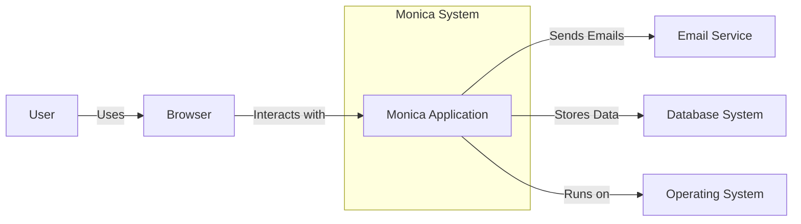
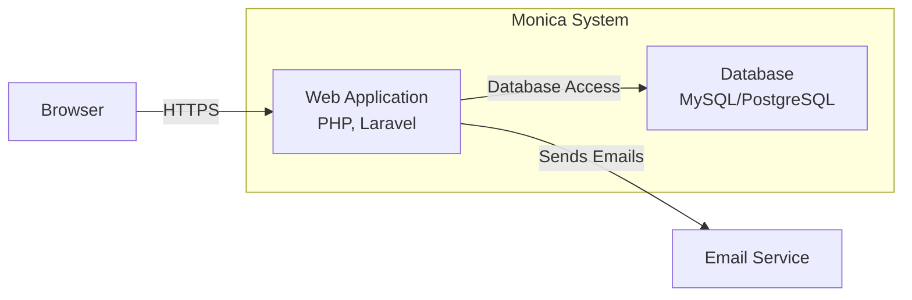
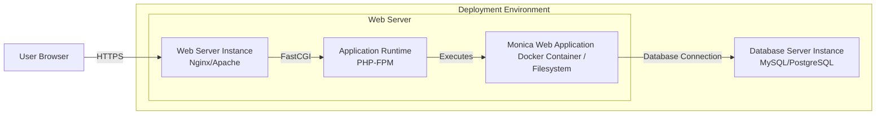
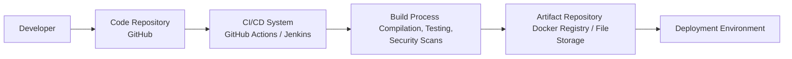

# BUSINESS POSTURE

- Business Priorities and Goals:
 - Monica aims to be a personal relationship management system, helping users organize and remember details about their friends, family, and social interactions.
 - The primary goal is to provide a user-friendly and feature-rich platform for individuals to manage their personal relationships effectively.
 - Another goal is to offer a self-hosted solution, giving users control over their data and privacy.
 - The project is open-source, fostering community contributions and transparency.

- Business Risks:
 - Data loss or corruption could severely impact user trust and the value proposition of the application.
 - Privacy breaches or unauthorized access to personal relationship data could lead to significant reputational damage and user abandonment.
 - Security vulnerabilities in the application could be exploited, leading to data compromise or service disruption.
 - Lack of adoption or user engagement could result in the project failing to achieve its goals.
 - Dependence on community contributions for maintenance and feature development introduces a risk of project stagnation if community support wanes.

# SECURITY POSTURE

- Existing Security Controls:
 - security control: HTTPS encryption for communication between users and the application. Implemented at web server level.
 - security control: Regular software updates for underlying operating system and server software. Implemented by system administrators.
 - security control: Database access control to restrict access to authorized users and the application. Implemented at database level.
 - security control: Input validation on the application side to prevent common web application vulnerabilities. Implemented in application code.
 - security control: Password hashing for user credentials. Implemented in application code.
 - security control: Session management to control user access after authentication. Implemented in application code.
 - accepted risk: Reliance on community contributions for security vulnerability identification and patching.
 - accepted risk: Potential vulnerabilities in third-party libraries and dependencies.

- Recommended Security Controls:
 - security control: Implement a Web Application Firewall (WAF) to protect against common web attacks.
 - security control: Conduct regular security audits and penetration testing to identify and remediate vulnerabilities.
 - security control: Implement automated security scanning tools (SAST/DAST) in the development pipeline.
 - security control: Implement Content Security Policy (CSP) to mitigate Cross-Site Scripting (XSS) attacks.
 - security control: Implement rate limiting to protect against brute-force attacks and denial-of-service attempts.
 - security control: Implement robust logging and monitoring for security incident detection and response.

- Security Requirements:
 - Authentication:
  - requirement: Secure user authentication mechanism to verify user identity.
  - requirement: Support for strong passwords and password complexity requirements.
  - requirement: Consider multi-factor authentication (MFA) for enhanced security.
  - requirement: Secure password reset and recovery process.
 - Authorization:
  - requirement: Role-based access control (RBAC) to manage user permissions and access to features and data.
  - requirement: Ensure proper authorization checks are performed before granting access to sensitive data or functionalities.
  - requirement: Principle of least privilege should be applied to user roles and permissions.
 - Input Validation:
  - requirement: Comprehensive input validation on all user inputs to prevent injection attacks (SQL injection, XSS, etc.).
  - requirement: Input sanitization and encoding to neutralize potentially harmful input.
  - requirement: Use of parameterized queries or ORM to prevent SQL injection vulnerabilities.
 - Cryptography:
  - requirement: Use strong encryption algorithms for sensitive data at rest and in transit.
  - requirement: Securely manage cryptographic keys and secrets.
  - requirement: Proper implementation of HTTPS for all communication.
  - requirement: Consider encryption of sensitive data in the database.

# DESIGN

## C4 CONTEXT

- Context Diagram Elements:
 - - Name: User
   - Type: Person
   - Description: Individuals who use Monica to manage their personal relationships.
   - Responsibilities: Manages personal relationship data using Monica, interacts with the application through a web browser.
   - Security controls: Strong password management, personal device security.
 - - Name: Browser
   - Type: Software System
   - Description: Web browser used by users to access and interact with the Monica application.
   - Responsibilities: Rendering the user interface, sending user requests to Monica, displaying responses.
   - Security controls: Browser security features (e.g., Content Security Policy enforcement, XSS protection), user-configured browser security settings.
 - - Name: Monica Application
   - Type: Software System
   - Description: The personal relationship management system itself, providing features for managing contacts, activities, reminders, and notes.
   - Responsibilities: Managing user accounts, storing and retrieving relationship data, handling user requests, sending email notifications.
   - Security controls: Authentication, authorization, input validation, session management, data encryption, logging, security monitoring.
 - - Name: Email Service
   - Type: Software System
   - Description: External email service (e.g., SMTP server) used by Monica to send email notifications to users.
   - Responsibilities: Sending emails on behalf of Monica.
   - Security controls: Secure SMTP configuration, TLS encryption for email transmission, sender authentication (e.g., SPF, DKIM, DMARC).
 - - Name: Operating System
   - Type: Software System
   - Description: The operating system (e.g., Linux, Windows) on which the Monica application server runs.
   - Responsibilities: Providing the runtime environment for Monica, managing system resources, providing basic security features.
   - Security controls: Operating system security hardening, access control, regular security updates, firewall.
 - - Name: Database System
   - Type: Software System
   - Description: Database system (e.g., MySQL, PostgreSQL) used by Monica to store application data.
   - Responsibilities: Storing and retrieving persistent data for Monica.
   - Security controls: Database access control, data encryption at rest, regular backups, database security hardening.

## C4 CONTAINER

- Container Diagram Elements:
 - - Name: Web Application
   - Type: Container
   - Description: The Monica web application built using PHP and Laravel framework. It handles user requests, business logic, and interacts with the database and email service.
   - Responsibilities: User authentication and authorization, handling user interface and API requests, implementing business logic for relationship management, generating email notifications, interacting with the database.
   - Security controls: Input validation, output encoding, session management, authentication and authorization mechanisms, secure coding practices, vulnerability scanning, logging and monitoring.
 - - Name: Database
   - Type: Container
   - Description: Relational database system (MySQL or PostgreSQL) used to store persistent data for Monica, including user accounts, contact information, activities, and notes.
   - Responsibilities: Persistent storage of application data, data retrieval and manipulation, data integrity and consistency.
   - Security controls: Database access control, data encryption at rest, regular backups, database security hardening, monitoring database activity.
 - - Name: Browser
   - Type: External Container
   - Description: User's web browser used to access the Monica web application.
   - Responsibilities: Rendering the user interface, executing client-side JavaScript, communicating with the web application via HTTPS.
   - Security controls: Browser security features, user-configured security settings, browser extensions for security.
 - - Name: Email Service
   - Type: External Container
   - Description: External email service used by the web application to send email notifications.
   - Responsibilities: Sending emails reliably and securely.
   - Security controls: Secure SMTP configuration, TLS encryption, sender authentication (SPF, DKIM, DMARC).

## DEPLOYMENT

- Deployment Diagram Elements:
 - - Name: Web Server Instance
   - Type: Infrastructure Node
   - Description: A server instance running a web server software like Nginx or Apache. It acts as a reverse proxy, handles HTTPS termination, and serves static content.
   - Responsibilities: Handling incoming HTTP/HTTPS requests, routing requests to the application runtime, serving static files, managing SSL/TLS certificates.
   - Security controls: Web server hardening, access control, firewall, TLS configuration, regular security updates.
 - - Name: Application Runtime
   - Type: Infrastructure Node
   - Description: PHP-FPM (FastCGI Process Manager) or similar runtime environment responsible for executing the PHP code of the Monica web application.
   - Responsibilities: Executing PHP code, managing application processes, handling requests from the web server.
   - Security controls: PHP runtime security configuration, process isolation, resource limits, regular security updates.
 - - Name: Monica Web Application
   - Type: Software Deployment Unit
   - Description: The deployed Monica web application, packaged as files on the filesystem or within a Docker container.
   - Responsibilities: Implementing the application logic, handling user requests, interacting with the database and email service.
   - Security controls: Application-level security controls (as described in Container section), secure deployment practices, regular updates.
 - - Name: Database Server Instance
   - Type: Infrastructure Node
   - Description: A server instance running the database system (MySQL or PostgreSQL).
   - Responsibilities: Hosting the database, managing data storage and retrieval, ensuring data integrity and availability.
   - Security controls: Database server hardening, access control, database firewall, data encryption at rest, regular backups, monitoring.
 - - Name: User Browser
   - Type: External Infrastructure Node
   - Description: User's computer or device running a web browser.
   - Responsibilities: Accessing the Monica application through the web browser.
   - Security controls: User device security, browser security features.

## BUILD

- Build Process Elements:
 - - Name: Developer
   - Type: Person
   - Description: Software developer contributing code to the Monica project.
   - Responsibilities: Writing code, committing changes to the code repository, performing local testing.
   - Security controls: Secure development environment, code review, secure coding practices, access control to code repository.
 - - Name: Code Repository
   - Type: Software System
   - Description: Version control system (GitHub) hosting the Monica source code.
   - Responsibilities: Storing and managing source code, tracking changes, facilitating collaboration.
   - Security controls: Access control, branch protection, audit logging, vulnerability scanning of dependencies.
 - - Name: CI/CD System
   - Type: Software System
   - Description: Continuous Integration/Continuous Deployment system (e.g., GitHub Actions, Jenkins) automating the build, test, and deployment process.
   - Responsibilities: Automating build process, running tests, performing security scans, creating build artifacts, deploying application.
   - Security controls: Secure CI/CD pipeline configuration, access control, secret management, build environment security, audit logging.
 - - Name: Build Process
   - Type: Process
   - Description: Automated build process including compilation, unit and integration tests, static analysis security testing (SAST), dependency scanning, and artifact creation.
   - Responsibilities: Compiling code, running tests, identifying vulnerabilities, creating deployable artifacts.
   - Security controls: SAST tools, dependency vulnerability scanning, code linters, secure build environment, artifact signing.
 - - Name: Artifact Repository
   - Type: Software System
   - Description: Repository for storing build artifacts (e.g., Docker Registry, file storage).
   - Responsibilities: Storing and managing build artifacts, providing access to artifacts for deployment.
   - Security controls: Access control, artifact integrity verification, vulnerability scanning of artifacts, secure storage.
 - - Name: Deployment Environment
   - Type: Environment
   - Description: Target environment where Monica application is deployed (e.g., staging, production).
   - Responsibilities: Running the Monica application, providing runtime environment.
   - Security controls: Deployment environment security controls (as described in Deployment section).

# RISK ASSESSMENT

- Critical Business Processes:
 - User authentication and session management: Ensuring only authorized users can access their data.
 - Data storage and retrieval: Maintaining the integrity, availability, and confidentiality of user relationship data.
 - Email notifications: Sending timely and reliable email notifications to users.
 - Application availability: Ensuring the application is accessible and functional for users.

- Data Sensitivity:
 - User personal information: Names, contact details, notes, activity logs, relationship details.
  - Sensitivity: High. This data is personal and private. Disclosure or compromise could lead to privacy violations, reputational damage, and potential harm to users.
 - User credentials (hashed passwords):
  - Sensitivity: High. Compromise could lead to unauthorized access to user accounts and data.
 - Application configuration and secrets: Database credentials, email service credentials, encryption keys.
  - Sensitivity: Critical. Compromise could lead to full system compromise, data breaches, and service disruption.

# QUESTIONS & ASSUMPTIONS

- Questions:
 - What is the target user base for Monica (technical expertise, security awareness)?
 - What are the specific compliance requirements (if any) for data privacy and security?
 - What is the organization's risk tolerance for data breaches and service disruptions?
 - Are there any specific security features or integrations that are prioritized?
 - What is the budget and resources available for security implementation and maintenance?

- Assumptions:
 - Monica is intended for individual users or small groups managing personal relationships.
 - Users are expected to have basic technical skills to self-host the application.
 - Data privacy and confidentiality are important considerations for users.
 - The application will be deployed in a standard web hosting environment or cloud infrastructure.
 - Security is a priority, but practical and cost-effective solutions are preferred.
 - The project is open-source and relies on community contributions for security improvements.