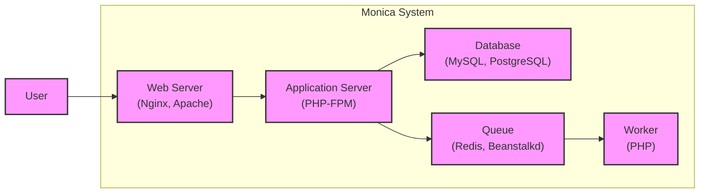
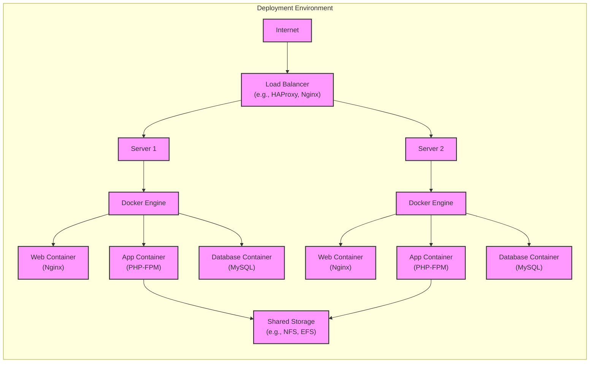
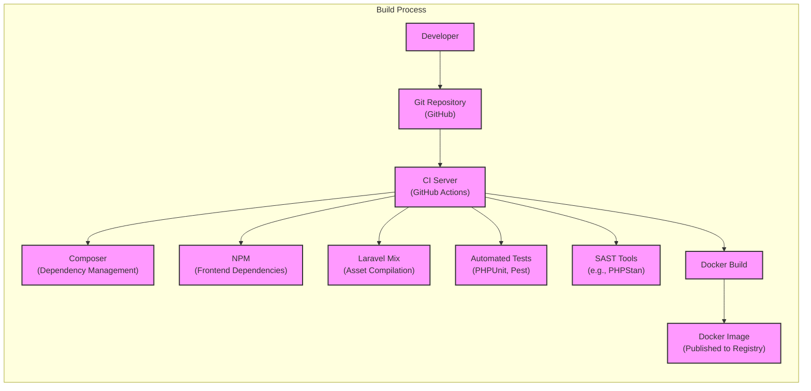

Okay, let's create a design document for the Monica Personal Relationship Management project, focusing on aspects relevant for threat modeling.

# BUSINESS POSTURE

Monica is a personal relationship management system.  It's designed to help users keep track of important details about their friends, family, and acquaintances.  The core value proposition is improved personal relationships through better organization and recall of important information.  The project appears to be targeted at individual users, likely with a focus on privacy and ease of use.  It's open-source, which suggests a community-driven development model and a potential reliance on volunteer contributions.  The business model is likely based on donations or potentially premium features in the future.

Business Priorities:

*   User Data Privacy:  Protecting the sensitive personal information stored within the application is paramount.
*   Data Integrity: Ensuring the accuracy and consistency of user data.
*   Availability:  Making the application accessible to users whenever they need it.
*   Ease of Use:  Providing a user-friendly experience that encourages adoption and continued use.
*   Community Engagement:  Fostering a healthy and active open-source community.

Business Risks:

*   Data Breach: Unauthorized access to user data could lead to significant reputational damage and potential legal consequences.  This is the most critical risk.
*   Data Loss:  Loss of user data due to technical failures or malicious attacks would severely impact user trust.
*   Service Disruption:  Downtime or performance issues could frustrate users and hinder adoption.
*   Abuse of Platform:  Malicious users could attempt to exploit the system for spam, phishing, or other harmful activities.
*   Lack of Funding/Sustainability:  The project's long-term viability depends on sufficient funding and community support.

# SECURITY POSTURE

Existing Security Controls (based on the GitHub repository):

*   security control: Authentication: User authentication via email/password (likely with hashing and salting, though this needs verification). Implemented in application code.
*   security control: Authorization: Role-based access control (RBAC) is mentioned, but details are limited. Implemented in application code.
*   security control: Input Validation: Laravel framework provides built-in input validation mechanisms. Implemented in application code.
*   security control: CSRF Protection: Laravel's built-in CSRF protection is likely used. Implemented in application code and framework.
*   security control: HTTPS: Deployment instructions recommend using HTTPS. Implemented in deployment environment.
*   security control: Database Security: Relies on secure configuration of the chosen database (MySQL, PostgreSQL, etc.). Implemented in deployment environment.
*   security control: Regular Updates: The project encourages users to keep the software updated. Implemented in deployment and maintenance process.
*   security control: Security Headers: Some security headers are set, but a comprehensive review is needed. Implemented in application code and web server configuration.

Accepted Risks:

*   accepted risk: Limited Security Expertise: The project relies heavily on community contributions, which may vary in security expertise.
*   accepted risk: Third-Party Dependencies: The project uses numerous third-party libraries, introducing potential supply chain risks.
*   accepted risk: Single Point of Failure: Depending on the deployment configuration, there might be single points of failure (e.g., the database server).

Recommended Security Controls:

*   Implement comprehensive security auditing and logging.
*   Conduct regular penetration testing and vulnerability scanning.
*   Implement a robust secrets management solution.
*   Enforce strong password policies.
*   Implement multi-factor authentication (MFA).
*   Implement Content Security Policy (CSP) to mitigate XSS attacks.
*   Implement Subresource Integrity (SRI) to protect against compromised third-party assets.
*   Implement a Web Application Firewall (WAF).

Security Requirements:

*   Authentication:
    *   Users must be uniquely identified and authenticated before accessing any personal data.
    *   Support for strong password policies (minimum length, complexity requirements).
    *   Protection against brute-force attacks (e.g., account lockout).
    *   Secure password reset mechanism.
    *   Consideration for multi-factor authentication (MFA).

*   Authorization:
    *   Access to data and functionality must be restricted based on user roles and permissions.
    *   Principle of least privilege should be enforced.
    *   Clear separation of duties between different user roles (if applicable).

*   Input Validation:
    *   All user-provided input must be validated on the server-side to prevent injection attacks (SQL injection, XSS, etc.).
    *   Use of whitelisting rather than blacklisting for input validation.
    *   Proper encoding of output to prevent XSS.

*   Cryptography:
    *   Sensitive data (e.g., passwords, API keys) must be stored securely using strong, industry-standard cryptographic algorithms.
    *   Use of HTTPS for all communication between the client and server.
    *   Proper key management practices.
    *   Consideration for data encryption at rest.

# DESIGN

## C4 CONTEXT

```mermaid
graph LR
    subgraph Monica System
        direction LR
        Monica["Monica"]
    end

    User["User"] --> Monica
    EmailServer["Email Server"] <-- Monica
    ThirdPartyAPIs["Third-Party APIs\n(Optional)"] <--> Monica
    Database["Database"] <--> Monica

    classDef elementClass fill:#f9f,stroke:#333,stroke-width:2px;
    class Monica,User,EmailServer,ThirdPartyAPIs,Database elementClass;
```

Context Diagram Element Description:

*   Element:
    *   Name: User
    *   Type: Person
    *   Description: A person who uses Monica to manage their personal relationships.
    *   Responsibilities:
        *   Creating and managing contacts.
        *   Adding and updating information about contacts.
        *   Viewing and interacting with contact data.
    *   Security controls:
        *   Authentication
        *   Authorization

*   Element:
    *   Name: Monica
    *   Type: Software System
    *   Description: The Monica Personal Relationship Management system.
    *   Responsibilities:
        *   Storing and managing user data.
        *   Providing a user interface for interacting with data.
        *   Sending email notifications.
        *   Integrating with optional third-party APIs.
    *   Security controls:
        *   Authentication
        *   Authorization
        *   Input Validation
        *   CSRF Protection
        *   Security Headers

*   Element:
    *   Name: Email Server
    *   Type: External System
    *   Description: An external email server used to send notifications.
    *   Responsibilities:
        *   Sending emails on behalf of Monica.
    *   Security controls:
        *   Secure communication (TLS)

*   Element:
    *   Name: Third-Party APIs (Optional)
    *   Type: External System
    *   Description: Optional third-party APIs that Monica might integrate with (e.g., for contact enrichment).
    *   Responsibilities:
        *   Providing specific functionality as per the API.
    *   Security controls:
        *   API Keys
        *   Secure communication (HTTPS)
        *   Rate Limiting

*   Element:
    *   Name: Database
    *   Type: External System
    *   Description: Database used to store Monica's data.
    *   Responsibilities:
        *   Storing all application data.
    *   Security controls:
        *   Database user with minimal privileges
        *   Connection encryption

## C4 CONTAINER



Container Diagram Element Description:

*   Element:
    *   Name: User
    *   Type: Person
    *   Description: A person who uses Monica to manage their personal relationships.
    *   Responsibilities:
        *   Creating and managing contacts.
        *   Adding and updating information about contacts.
        *   Viewing and interacting with contact data.
    *   Security controls:
        *   Authentication
        *   Authorization

*   Element:
    *   Name: Web Server
    *   Type: Container (Nginx, Apache)
    *   Description: Serves static content and proxies requests to the application server.
    *   Responsibilities:
        *   Serving static assets (CSS, JavaScript, images).
        *   Handling HTTPS termination.
        *   Forwarding requests to the application server.
    *   Security controls:
        *   HTTPS configuration
        *   Security Headers
        *   Web Application Firewall (WAF) - Recommended

*   Element:
    *   Name: Application Server
    *   Type: Container (PHP-FPM)
    *   Description: Executes the Monica application code.
    *   Responsibilities:
        *   Handling user requests.
        *   Processing business logic.
        *   Interacting with the database and queue.
    *   Security controls:
        *   Authentication
        *   Authorization
        *   Input Validation
        *   CSRF Protection

*   Element:
    *   Name: Database
    *   Type: Container (MySQL, PostgreSQL)
    *   Description: Stores the application data.
    *   Responsibilities:
        *   Storing and retrieving data.
        *   Ensuring data integrity.
    *   Security controls:
        *   Database user with minimal privileges
        *   Connection encryption
        *   Data encryption at rest - Recommended

*   Element:
    *   Name: Queue
    *   Type: Container (Redis, Beanstalkd)
    *   Description: Manages asynchronous tasks.
    *   Responsibilities:
        *   Storing and managing tasks to be executed in the background.
    *   Security controls:
        *   Authentication (if applicable)

*   Element:
    *   Name: Worker
    *   Type: Container (PHP)
    *   Description: Executes asynchronous tasks from the queue.
    *   Responsibilities:
        *   Processing background tasks (e.g., sending emails).
    *   Security controls:
        *   Input Validation (for data retrieved from the queue)

## DEPLOYMENT

Possible Deployment Solutions:

1.  Traditional VPS (Virtual Private Server):  Using a VPS like DigitalOcean, Linode, or AWS EC2.
2.  Containerized Deployment (Docker): Using Docker and Docker Compose for local development and potentially Docker Swarm or Kubernetes for production.
3.  Platform-as-a-Service (PaaS): Using a PaaS provider like Heroku or AWS Elastic Beanstalk.
4.  Serverless Deployment:  Less likely for this type of application, but theoretically possible with significant refactoring.

Chosen Solution (for detailed description): Containerized Deployment (Docker)

This is a common and recommended approach for deploying Laravel applications like Monica.



Deployment Diagram Element Description:

*   Element:
    *   Name: Internet
    *   Type: External
    *   Description: The public internet.
    *   Responsibilities: N/A
    *   Security controls: N/A

*   Element:
    *   Name: Load Balancer
    *   Type: Infrastructure (e.g., HAProxy, Nginx)
    *   Description: Distributes traffic across multiple servers.
    *   Responsibilities:
        *   Distributing incoming traffic.
        *   Health checks on servers.
    *   Security controls:
        *   SSL/TLS termination
        *   DDoS protection

*   Element:
    *   Name: Server 1, Server 2
    *   Type: Infrastructure (Virtual Machines)
    *   Description: Servers hosting the Docker Engine.
    *   Responsibilities:
        *   Running Docker containers.
    *   Security controls:
        *   Firewall
        *   SSH access control
        *   Regular security updates

*   Element:
    *   Name: Docker Engine (Docker1, Docker2)
    *   Type: Infrastructure (Container Runtime)
    *   Description: Runs and manages Docker containers.
    *   Responsibilities:
        *   Managing container lifecycle.
        *   Providing container isolation.
    *   Security controls:
        *   Docker security best practices

*   Element:
    *   Name: Web Container (Web1, Web2)
    *   Type: Container (Nginx)
    *   Description: Serves static content and proxies requests to the app container.
    *   Responsibilities:
        *   Serving static assets.
        *   Handling HTTPS termination.
        *   Forwarding requests to the app container.
    *   Security controls:
        *   HTTPS configuration
        *   Security Headers
        *   WAF - Recommended

*   Element:
    *   Name: App Container (App1, App2)
    *   Type: Container (PHP-FPM)
    *   Description: Executes the Monica application code.
    *   Responsibilities:
        *   Handling user requests.
        *   Processing business logic.
        *   Interacting with the database.
    *   Security controls:
        *   Authentication
        *   Authorization
        *   Input Validation
        *   CSRF Protection

*   Element:
    *   Name: Database Container (DB1, DB2)
    *   Type: Container (MySQL)
    *   Description: Stores the application data. Could be a managed database service instead of a container.
    *   Responsibilities:
        *   Storing and retrieving data.
        *   Ensuring data integrity.
    *   Security controls:
        *   Database user with minimal privileges
        *   Connection encryption
        *   Data encryption at rest - Recommended

*   Element:
    *   Name: Shared Storage
    *   Type: Infrastructure (e.g., NFS, EFS)
    *   Description: Shared storage for files that need to be accessed by multiple containers (e.g., uploaded files).
    *   Responsibilities:
        *   Providing persistent storage.
    *   Security controls:
        *   Access control lists (ACLs)

## BUILD

The Monica project uses a combination of tools for building and packaging the application. The primary build process is managed through Laravel's built-in features and Composer for dependency management. There is also a Dockerfile for containerized deployments.



Build Process Description:

1.  Developer commits code to the Git repository (GitHub).
2.  A CI server (GitHub Actions) is triggered by the commit.
3.  Composer installs PHP dependencies.
4.  NPM installs frontend dependencies.
5.  Laravel Mix compiles frontend assets (CSS, JavaScript).
6.  Automated tests (PHPUnit, Pest) are executed.
7.  SAST tools (e.g., PHPStan, psalm) are run to identify potential security vulnerabilities.
8.  Docker Build creates a Docker image.
9.  The Docker image is published to a container registry (e.g., Docker Hub, GitHub Container Registry).

Security Controls in Build Process:

*   Dependency Management: Composer and NPM are used to manage dependencies, allowing for auditing and updates.
*   Automated Tests: PHPUnit and Pest are used for unit and integration testing, helping to identify bugs early.
*   SAST Tools: PHPStan and other static analysis tools are used to detect potential security vulnerabilities in the code.
*   Docker Security: Dockerfiles should be reviewed for security best practices (e.g., using minimal base images, avoiding running as root).
*   Supply Chain Security: Regularly audit and update dependencies to mitigate vulnerabilities in third-party libraries. Tools like Dependabot (on GitHub) can help automate this.

# RISK ASSESSMENT

Critical Business Processes:

*   User Registration and Login: Ensuring only authorized users can access the system.
*   Contact Management: Creating, updating, and deleting contact information.
*   Data Backup and Restore: Protecting against data loss.
*   Communication (Email Notifications): Ensuring reliable and secure delivery of notifications.

Data Sensitivity:

*   Personal Information: Names, addresses, phone numbers, email addresses, dates of birth, notes, etc. - Highly Sensitive.
*   Relationship Information: Details about relationships between contacts - Highly Sensitive.
*   User Account Information: Usernames, passwords (hashed), email addresses - Highly Sensitive.
*   Activity Logs: Records of user actions within the application - Sensitive.

# QUESTIONS & ASSUMPTIONS

Questions:

*   What is the specific RBAC implementation in Monica?  Are there predefined roles, or can users create custom roles?
*   What are the specific password policies enforced?
*   Are there any plans for implementing MFA?
*   What is the process for handling security vulnerabilities reported by the community or discovered internally?
*   What is the backup and recovery strategy?
*   Are there any specific compliance requirements (e.g., GDPR, CCPA)?
*   Is there any rate limiting implemented to prevent abuse?
*   How are secrets (e.g., database credentials, API keys) managed?

Assumptions:

*   BUSINESS POSTURE: Assumes a focus on individual users and a community-driven development model. Assumes a relatively high risk tolerance due to the open-source nature and likely limited resources.
*   SECURITY POSTURE: Assumes basic security measures are in place due to the use of the Laravel framework. Assumes that security expertise within the development team may be variable.
*   DESIGN: Assumes a standard Laravel deployment architecture. Assumes that the database is properly secured, but this needs verification. Assumes that the CI/CD pipeline is configured securely, but this needs verification.