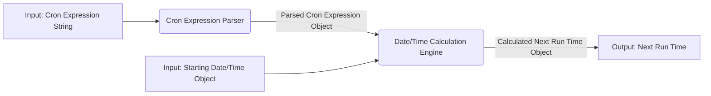
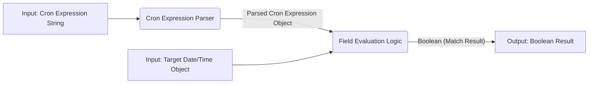
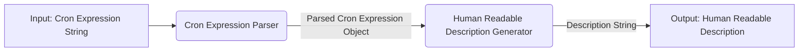
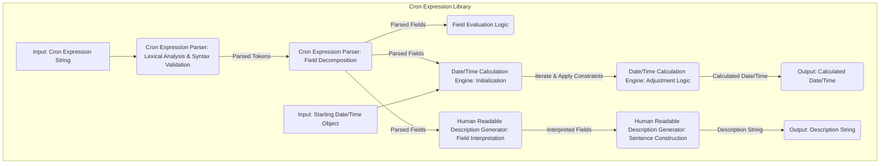
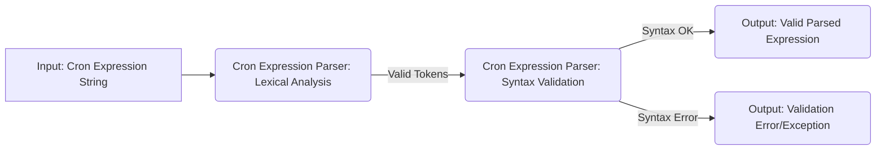

# Project Design Document: cron-expression Library

**Version:** 1.1
**Date:** October 26, 2023
**Author:** AI Software Architect

## 1. Introduction

This document provides an enhanced design overview of the `cron-expression` PHP library developed by Matt Dowling (available at [https://github.com/mtdowling/cron-expression](https://github.com/mtdowling/cron-expression)). This iteration aims to provide a more granular and detailed understanding of the library's architecture, components, data flow, and dependencies, specifically tailored for effective threat modeling. This information will be crucial for identifying potential security vulnerabilities and risks associated with its use in various contexts.

## 2. Goals and Objectives

The primary goal of the `cron-expression` library is to offer a dependable and efficient solution for:

*   **Parsing:** Interpreting cron expression strings according to standard and common variations.
*   **Calculation:** Determining future or past execution times based on a given cron expression and a reference date/time.
*   **Matching:** Verifying if a specific date/time aligns with the schedule defined by a cron expression.
*   **Description:** Generating human-readable explanations of cron expressions for improved understanding.

The library strives for:

*   **Accuracy:** Ensuring precise calculations of scheduled times.
*   **Performance:** Maintaining efficiency for typical scheduling scenarios.
*   **Simplicity:** Facilitating easy integration into PHP-based projects.
*   **Reliability:** Being well-tested and actively maintained to ensure stability.

## 3. System Architecture

The `cron-expression` library operates primarily as a logical unit within a PHP application. Its core functionality is self-contained, with interactions with external systems occurring solely through the consuming application based on the library's output.

### 3.1. Components

The library can be further dissected into the following detailed components:

*   **Cron Expression Parser:**
    *   **Input Handling:** Receives a cron expression string as input.
    *   **Lexical Analysis:** Breaks down the input string into tokens representing different parts of the cron expression (fields, separators, special characters).
    *   **Syntax Validation:** Enforces rules for valid cron expression syntax, including the number of fields and allowed values within each field.
    *   **Field Decomposition:** Separates the cron expression into its five or six constituent fields (minutes, hours, days of the month, months, days of the week, and optionally seconds).
    *   **Special Character Handling:** Interprets special characters like `*`, `/`, `-`, `,`, `?`, `L`, `W`, and `#`, applying specific logic for each.
    *   **Exception Handling:** Raises exceptions for syntactically incorrect or invalid cron expressions.

*   **Field Evaluation Logic:**
    *   **Field Type Specific Evaluators:** Contains distinct logic units for evaluating each type of cron field (minutes, hours, etc.).
    *   **Value Matching:** Determines if a given value (e.g., a specific minute) matches the specification within a field (e.g., `*`, `10`, `1-5`).
    *   **Range and Step Evaluation:** Handles ranges (e.g., `1-5`) and step values (e.g., `*/2`) within fields.
    *   **Special Character Logic:** Implements the specific rules for special characters like `L` (last), `W` (weekday), and `#` (nth day of the week in the month).
    *   **Conflict Resolution:** Manages potential conflicts between the "day of month" and "day of week" fields (e.g., when both are specified).

*   **Date/Time Calculation Engine:**
    *   **Initialization:** Takes a parsed cron expression and a starting date/time as input.
    *   **Iterative Adjustment:** Increments (for next run time) or decrements (for previous run time) the date/time components (year, month, day, hour, minute, second).
    *   **Field Constraint Application:**  Applies the constraints defined in the parsed cron expression to each date/time component.
    *   **Rollback/Forward Logic:** If an increment/decrement results in a date/time that doesn't match the cron expression, the engine adjusts the components until a match is found.
    *   **Loop Prevention:** Implements mechanisms to detect and prevent infinite loops caused by invalid or overly restrictive cron expressions (e.g., setting a maximum number of iterations).

*   **Human Readable Description Generator:**
    *   **Parsed Expression Input:** Receives the parsed representation of the cron expression.
    *   **Field Interpretation:** Translates the values and special characters in each field into human-understandable phrases.
    *   **Sentence Construction:** Combines the interpretations of individual fields into a coherent description of the schedule.
    *   **Localization (Potential):** While not explicitly detailed in the core library, this component could be extended to support different languages.

### 3.2. Data Flow

The typical data flow within the library for calculating the next run time is illustrated below:

For checking if a date matches the cron expression:

For generating a human-readable description:

## 4. Dependencies

The `cron-expression` library's dependencies are managed through Composer and are defined in its `composer.json` file:

*   **PHP:**  Requires a specific PHP version (or range of versions) as specified in the `require` section of `composer.json`. This dependency is fundamental.
*   **No direct external PHP library dependencies are explicitly listed.** This highlights the library's design as a self-contained unit, minimizing external dependencies.

It's important to note that while there are no direct external library dependencies, the library relies on core PHP functionalities and might be indirectly affected by the availability and security of enabled PHP extensions.

## 5. Security Considerations (Detailed for Threat Modeling)

This section expands on the initial security considerations, providing more specific examples and potential attack vectors for threat modeling.

*   **Input Validation Vulnerabilities:**
    *   **Cron Expression Injection Leading to Resource Exhaustion:** A maliciously crafted, overly complex cron expression (e.g., with extremely wide ranges or numerous comma-separated values) could cause the parser or calculation engine to consume excessive CPU and memory, leading to a denial-of-service (DoS).
    *   **Cron Expression Injection Leading to Unexpected Behavior:**  While less likely to be a direct security vulnerability in this library, if the cron expression is sourced from user input and used to trigger actions in another system, a carefully crafted expression could be used to bypass intended scheduling or trigger unintended actions.
    *   **Failure to Handle Edge Cases:**  Subtle variations in cron syntax or unusual combinations of special characters might not be handled correctly by the parser, potentially leading to incorrect scheduling or unexpected errors.

*   **Resource Exhaustion Vulnerabilities:**
    *   **Infinite Loop in Calculation Engine:** A poorly formed or malicious cron expression could cause the date/time calculation engine to enter an infinite loop while trying to find a matching time. This could lead to CPU exhaustion and application unresponsiveness. The loop prevention mechanism needs to be robust.
    *   **Memory Exhaustion During Parsing:**  Extremely long or complex cron expressions could potentially consume excessive memory during the parsing phase.

*   **Logic and Implementation Flaws:**
    *   **Incorrect Calculation of Next/Previous Run Time:** Bugs in the field evaluation logic or the date/time calculation engine could result in incorrect scheduling times. This might not be a direct security vulnerability but could have significant operational impact.
    *   **Vulnerabilities in Special Character Handling:** Incorrect implementation of the logic for special characters like `L`, `W`, and `#` could lead to unexpected behavior or incorrect scheduling.

*   **Dependency Related Risks:**
    *   **Vulnerabilities in PHP Interpreter:** As the library depends on PHP, any security vulnerabilities in the underlying PHP interpreter could potentially affect the library's security. Keeping PHP updated is crucial.
    *   **Risks from Implicit Dependencies (PHP Extensions):** While no direct library dependencies exist, vulnerabilities in enabled PHP extensions that the library implicitly relies on could pose a risk.

*   **Error Handling and Information Disclosure:**
    *   **Verbose Error Messages:** If the library's error handling exposes too much information about the internal workings or the nature of the invalid cron expression, it could aid attackers in crafting further exploits.
    *   **Unhandled Exceptions:**  Failure to properly handle exceptions within the library could lead to application crashes or unexpected behavior.

## 6. Deployment Considerations

The `cron-expression` library is typically integrated into PHP applications as a dependency. Deployment scenarios and their security implications include:

*   **Web Applications:**
    *   If cron expressions are derived from user input (e.g., allowing users to schedule tasks), robust input validation is critical to prevent cron expression injection attacks.
    *   The performance of the library is important in web applications to avoid delays in processing requests.

*   **Command-Line Tools:**
    *   If used in command-line tools, the source of the cron expression (e.g., configuration files, command-line arguments) needs to be considered for potential manipulation.

*   **Background Task Processors:**
    *   In background task processors, the reliability of the library is paramount to ensure tasks are executed at the correct times. Resource exhaustion vulnerabilities could impact the stability of the processor.

*   **Internal Systems:**
    *   Even in internal systems, vulnerabilities in the library could be exploited by malicious insiders or through compromised accounts.

## 7. Future Considerations (Potential Areas for Expansion and Security Implications)

*   **Enhanced Timezone Handling:** Implementing more sophisticated timezone support would increase the library's utility but introduces complexities related to handling different timezone rules and potential for miscalculations if not implemented correctly.
*   **More Granular Cron Syntax Support (e.g., Seconds):**  Adding support for cron expressions with seconds could increase the attack surface if the parsing and evaluation logic for the new field are not implemented securely.
*   **Integration with Scheduling Systems:**  If the library were to directly integrate with external scheduling systems, vulnerabilities in the integration layer could expose the application to risks.
*   **Improved Localization:** Expanding language support in the description generator requires careful management of translation data to prevent injection vulnerabilities if translations are sourced externally.

## 8. Diagrams

### 8.1. Detailed Core Components Flowchart

### 8.2. Cron Expression Validation Flow

This enhanced design document provides a more in-depth analysis of the `cron-expression` library, specifically focusing on aspects relevant to threat modeling. This detailed information will be valuable for identifying and mitigating potential security vulnerabilities.
