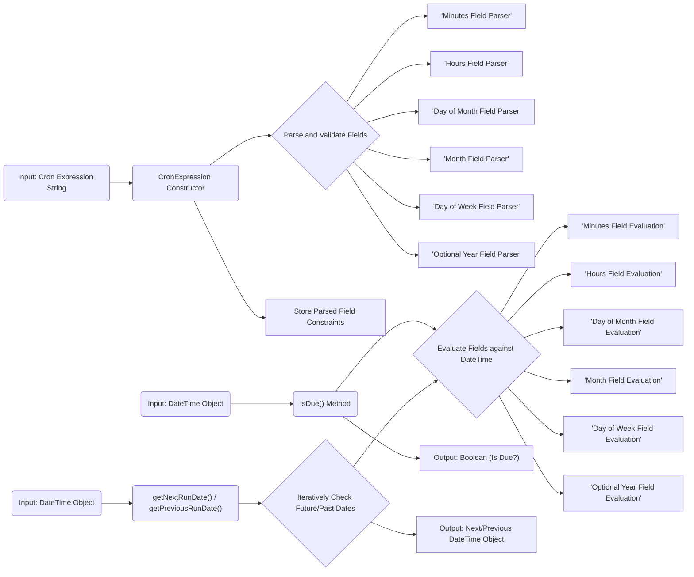

# Project Design Document: Cron Expression Parser

**Project URL:** https://github.com/mtdowling/cron-expression

**Document Version:** 1.1
**Date:** October 26, 2023
**Author:** AI Software Architect

## 1. Project Overview

This document outlines the design of the `cron-expression` PHP library, a tool designed for parsing and evaluating cron expressions. Cron expressions are string-based specifications defining schedules for recurring tasks, commonly employed in Unix-like operating systems and various scheduling systems. This library offers the capability to determine if a given date and time align with a cron expression's schedule and to calculate the subsequent or preceding execution time based on a provided cron expression. This document serves as a foundational artifact for future threat modeling endeavors.

## 2. Goals and Objectives

*   To develop a robust and accurate parser for standard cron expressions, adhering to common interpretations.
*   To provide a user-friendly and intuitive API for developers to check if a specific date and time match a given cron expression.
*   To enable the precise calculation of the next and previous run times based on a cron expression, given a reference date and time.
*   To maintain a high standard of code quality, emphasizing readability, maintainability, and comprehensive test coverage.
*   To ensure the library remains lightweight and performant, making it suitable for integration into a wide range of PHP projects without significant overhead.

## 3. Scope

This project encompasses the following functionalities:

*   Parsing standard 5 or 6 field cron expressions, representing minutes, hours, day of month, month, day of week, and an optional year.
*   Evaluating whether a specific date and time instance falls within the schedule defined by a provided cron expression.
*   Calculating the next scheduled occurrence based on a cron expression, starting from a specified date and time.
*   Calculating the previous scheduled occurrence based on a cron expression, starting from a specified date and time.
*   Handling a comprehensive range of cron expression syntax elements, including:
    *   Explicit single values (e.g., `"1"`, `"10"`).
    *   Contiguous ranges of values (e.g., `"1-5"`, `"10-20"`).
    *   Discrete lists of values (e.g., `"1,3,5"`).
    *   The wildcard character (`"*"`) representing all possible values.
    *   Interval or step values (e.g., `"*/5"`).
    *   Combinations of day of week and day of month specifications (e.g., `"15 * * * 5"`).
    *   Symbolic representations for months and weekdays (e.g., `"JAN"`, `"MON"`).
*   Generating clear and informative exceptions when encountering invalid or malformed cron expressions.

The project explicitly excludes:

*   The actual scheduling or execution of tasks. This library is solely concerned with parsing and evaluating the schedule definition.
*   Support for non-standard or extended cron expression syntaxes unless explicitly introduced in future iterations.
*   Direct integration with specific scheduling systems, job queues, or frameworks. The library provides the core logic but relies on external systems for orchestration.

## 4. Target Audience

*   PHP developers requiring the ability to interpret and work with cron expressions within their applications.
*   Developers of scheduling platforms or utilities that need robust cron expression parsing and evaluation capabilities.
*   System administrators and DevOps engineers who need to validate and understand cron expressions used in their infrastructure.

## 5. Functional Architecture

The library's primary function is to parse a cron expression string into a structured representation and subsequently evaluate this representation against a given date and time.

### 5.1. Core Components

*   **`CronExpression` Class:**
    *   The central class representing a compiled cron expression.
    *   The constructor accepts the cron expression string as input, initiating the parsing process.
    *   Responsible for orchestrating the parsing and validation of the provided cron expression.
    *   Internally stores the parsed components of the cron expression, such as the specifications for minutes, hours, and other fields.
    *   Provides the core public API methods:
        *   `isDue(\DateTimeInterface $dateTime)`: Determines if the provided date and time match the schedule defined by the cron expression.
        *   `getNextRunDate(\DateTimeInterface $currentTime = 'now', $allowCurrentDate = false)`: Calculates the next date and time at which the cron expression's schedule will be met.
        *   `getPreviousRunDate(\DateTimeInterface $currentTime = 'now', $allowCurrentDate = false)`: Calculates the preceding date and time at which the cron expression's schedule was met.
        *   Accessor methods to retrieve the individual parsed components of the cron expression (e.g., `getMinutes()`, `getHours()`).
*   **Field Parser Classes (e.g., `MinutesField`, `HoursField`, `DayOfMonthField`, `MonthField`, `DayOfWeekField`, `YearField`):**
    *   Dedicated classes responsible for parsing and validating individual fields within the cron expression string.
    *   Each class encapsulates the specific syntax rules and validation logic for its corresponding cron expression field.
    *   Implements logic to determine if a given integer value or symbolic representation is valid according to the field's constraints.
*   **Exception Classes (e.g., `InvalidArgumentException`):**
    *   Specialized exception classes used to signal errors encountered during the parsing or evaluation phases, such as an invalid cron expression format.

### 5.2. Data Flow

**Explanation of Data Flow:**

1. A cron expression string is provided as input to the `CronExpression` constructor.
2. The constructor initiates the parsing and validation process by delegating to the appropriate field parser classes.
3. Each field parser class is responsible for parsing its specific part of the cron expression string and validating its syntactic correctness and semantic validity.
4. The successfully parsed field constraints are stored within the `CronExpression` object for later evaluation.
5. When the `isDue()` method is invoked with a `DateTime` object:
    *   The method iterates through each parsed field constraint.
    *   Each field's evaluation logic determines if the corresponding component of the provided `DateTime` object satisfies the field's constraints.
    *   The method returns `true` only if all field evaluations return true, indicating that the `DateTime` falls within the cron schedule; otherwise, it returns `false`.
6. When `getNextRunDate()` or `getPreviousRunDate()` is called with a starting `DateTime` object:
    *   The method iteratively examines subsequent (for `getNextRunDate()`) or preceding (for `getPreviousRunDate()`) date and time instances.
    *   For each potential date and time, it utilizes the same evaluation logic as the `isDue()` method to check if it matches the cron expression's schedule.
    *   The method returns the first `DateTime` object encountered that satisfies the cron expression.

## 6. Non-Functional Requirements

*   **Performance:** The library must efficiently parse cron expressions and perform evaluations with minimal computational overhead. Parsing should be fast, and the calculation of next/previous run times should be optimized to avoid excessive iterations.
*   **Reliability:** The parsing and evaluation logic must be accurate and consistent, strictly adhering to the widely accepted interpretation of standard cron expression syntax. Edge cases and boundary conditions should be handled correctly.
*   **Security:** The library must be designed to be resilient against malicious or malformed input. Robust input validation is paramount to prevent potential vulnerabilities.
*   **Maintainability:** The codebase should be well-organized, clearly documented, and follow established coding standards to facilitate understanding and future modifications.
*   **Testability:** Comprehensive unit and integration tests are essential to ensure the correctness of the library's functionality across various scenarios and to prevent regressions.

## 7. Technology Stack

*   **Programming Language:** PHP
*   **Minimum PHP Version:** PHP 7.1 (or later, specify the actual minimum supported version)
*   **Testing Framework:** PHPUnit (or the specific testing framework used)

## 8. Security Considerations (Pre-Threat Modeling)

These initial security considerations will inform future, more detailed threat modeling activities:

*   **Input Validation Robustness:** The library must implement rigorous validation of the input cron expression string to prevent injection attacks or unexpected behavior arising from malformed expressions. Specific validation checks should include:
    *   Verifying the correct number of fields according to the expected cron expression format.
    *   Ensuring that each field contains only valid characters according to its type (e.g., digits, commas, hyphens, asterisks, forward slashes).
    *   Validating the numerical ranges and step values to prevent out-of-bounds errors or excessive resource consumption during evaluation.
    *   Strictly enforcing the correct usage of special characters (`,`, `-`, `/`, `*`) and their combinations.
    *   Implementing safeguards against excessively large ranges or step values that could lead to performance degradation or denial-of-service conditions.
*   **Regular Expression Vulnerabilities:** If regular expressions are employed for parsing, they must be carefully constructed and tested to avoid ReDoS (Regular expression Denial of Service) vulnerabilities, which can be exploited by providing specially crafted input strings.
*   **Exception Handling Security:** The library should handle invalid input gracefully by throwing informative exceptions without exposing sensitive internal information or system details that could be leveraged by attackers.
*   **Dependency Security:**  Regularly audit and update any external dependencies to address known security vulnerabilities in those libraries. Utilize dependency management tools to track and manage dependencies effectively.

## 9. Deployment Considerations

The `cron-expression` library is intended to be deployed as a dependency within PHP projects using a package manager such as Composer. No specific deployment environment prerequisites exist beyond a standard PHP runtime environment capable of executing the supported PHP version.

## 10. Future Enhancements (Out of Current Scope)

*   Extending support to encompass more advanced or non-standard cron syntax variations, such as the inclusion of a seconds field or other less common directives.
*   Implementing explicit time zone handling capabilities for cron expressions, allowing schedules to be defined and evaluated in specific time zones.
*   Providing more granular and detailed error reporting mechanisms to aid in debugging and troubleshooting cron expression issues.
*   Offering optional integration points with common logging frameworks to facilitate the tracking and auditing of cron expression parsing and evaluation activities.

This design document provides a detailed overview of the `cron-expression` library's architecture and intended functionality. It serves as a crucial foundation for subsequent threat modeling exercises aimed at identifying potential security vulnerabilities and designing appropriate mitigation strategies.