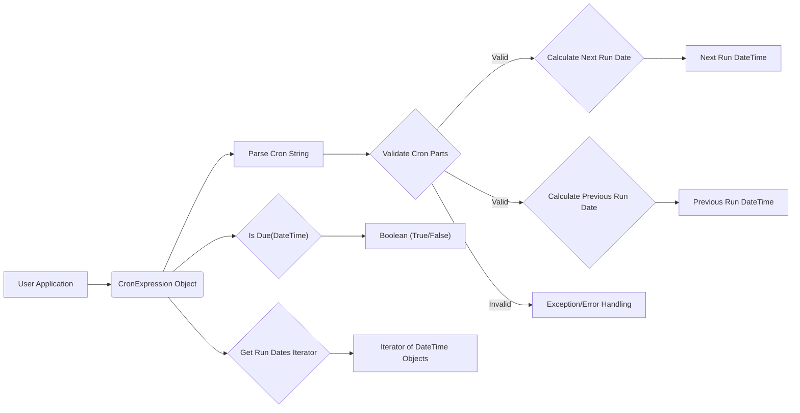
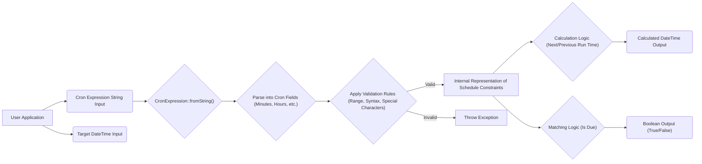

## Project Design Document: Cron Expression Parser

**Project Name:** Cron Expression Parser Library

**Project Repository:** https://github.com/mtdowling/cron-expression

**Document Version:** 1.1

**Date:** October 26, 2023

**Author:** AI Software Architect

### 1. Introduction

This document provides an enhanced design overview of the `cron-expression` PHP library. This library is designed to parse and evaluate cron expressions, enabling developers to determine future and past execution times based on these expressions. This detailed design will serve as a crucial input for subsequent threat modeling activities, providing a comprehensive understanding of the library's functionality and potential attack surfaces.

### 2. Goals and Objectives

*   Provide a highly accurate and reliable mechanism for parsing standard cron expressions as defined by common Unix-like systems.
*   Enable precise calculation of the next and previous execution times based on a given cron expression and a reference date and time.
*   Offer a clear, consistent, and developer-friendly API for interacting with cron expressions, minimizing the learning curve.
*   Maintain a lightweight core with minimal external dependencies to reduce the risk of introducing vulnerabilities and simplify integration.
*   Ensure seamless integration into a wide range of PHP projects, from simple scripts to complex applications.

### 3. Target Audience

This document is intended for a broad technical audience, including:

*   Security architects and engineers responsible for identifying and mitigating potential security risks.
*   Software developers who will integrate and utilize the `cron-expression` library in their applications.
*   Quality assurance and testing teams tasked with verifying the functionality and security of applications using this library.
*   DevOps and operations personnel responsible for deploying, configuring, and maintaining systems that rely on this library.

### 4. Functional Description

The `cron-expression` library provides core functionalities centered around processing cron expression strings:

*   **Parsing:** The library's primary function is to take a cron expression string as input and decompose it into its individual time components (minutes, hours, days of the month, months, days of the week). This involves recognizing and interpreting the various special characters and syntax elements within the cron expression.
    *   Example: Parsing `"*/5 * * * *"` would identify the minute component as "every 5 minutes".
*   **Validation:** Upon parsing, the library validates the syntax and the values within each component of the cron expression. This includes checking for:
    *   Correct number of fields.
    *   Valid ranges for each field (e.g., 0-59 for minutes, 1-12 for months).
    *   Correct usage of special characters (`*`, `/`, `-`, `,`, `L`, `W`, `#`).
    *   Consistency between day of the month and day of the week specifications.
*   **Next Run Time Calculation:** Given a cron expression and a starting date and time, the library can calculate the next date and time at which the cron expression will trigger. This involves iterating through time units and checking if they satisfy the constraints defined by the cron expression.
    *   Example: Given the expression `"0 9 * * *"` and a starting time of today at 10:00 AM, the library would calculate the next run time as tomorrow at 9:00 AM.
*   **Previous Run Time Calculation:**  Similar to the next run time calculation, the library can determine the previous date and time the cron expression triggered, relative to a given reference point.
*   **Date Matching:** The library allows checking if a specific date and time matches the schedule defined by the cron expression. This is useful for determining if a particular event should have occurred according to the cron schedule.
*   **Iteration of Run Times:** The library provides a mechanism to generate a sequence of future or past run times based on the cron expression, allowing developers to iterate through scheduled events.

The library adheres to the standard cron expression syntax, supporting:

*   **Specific Values:**  Listing individual values (e.g., `1,5,10` for specific minutes).
*   **Ranges:** Specifying a continuous range of values (e.g., `10-15` for hours 10 through 15).
*   **Steps:** Defining intervals within a range or across all possible values (e.g., `*/15` for every 15 minutes, `1-30/5` for every 5th day from the 1st to the 30th).
*   **Wildcards:** Representing all possible values for a field (`*`).
*   **Month and Day Names:** Using textual representations for months (e.g., `JAN`, `FEB`) and days of the week (e.g., `MON`, `TUE`).
*   **Special Characters:**
    *   `L`: Represents the last day of the month (in the day of the month field) or 7 for Sunday (in the day of the week field).
    *   `W`: Represents the nearest weekday to a given day of the month.
    *   `#`: Used in the day of the week field to specify the nth occurrence of a day within the month (e.g., `1#3` for the first Wednesday of the month).

### 5. Non-Functional Requirements

*   **Performance:** The library must efficiently parse and evaluate cron expressions to minimize processing time, especially in applications where frequent schedule calculations are required. The calculation logic should be optimized to avoid unnecessary iterations.
*   **Security:**
    *   **Robust Input Validation:** The library must implement rigorous input validation to prevent vulnerabilities arising from maliciously crafted cron expressions. This includes checks for syntax correctness, valid ranges, and prevention of injection attacks if cron expressions are derived from user input.
    *   **Denial of Service (DoS) Prevention:** The library should be designed to handle complex or potentially malicious cron expressions without consuming excessive resources (CPU, memory), which could lead to denial of service. Limits on the complexity of expressions might be necessary.
    *   **Error Handling:** The library should provide clear and informative error messages when encountering invalid cron expressions, aiding in debugging and preventing unexpected behavior.
*   **Reliability:** The library must consistently and accurately calculate run times according to the defined cron expression, ensuring that scheduled tasks are executed as expected. Thorough testing is crucial to guarantee reliability.
*   **Maintainability:** The codebase should be well-structured, documented with clear comments, and adhere to coding standards to facilitate future modifications, bug fixes, and enhancements.
*   **Usability:** The library's API should be intuitive and easy for developers to understand and use, minimizing the learning curve and promoting correct implementation.

### 6. Architecture Diagram

### 7. Data Flow Diagram

### 8. Security Considerations

This library, while seemingly simple, presents several potential security considerations:

*   **Cron Expression Injection:** If cron expressions are sourced from user input or external systems without proper sanitization, malicious actors could inject crafted expressions to trigger unintended actions or cause denial of service.
    *   **Mitigation:** Always validate and sanitize cron expressions before passing them to the library. Implement strict input validation rules based on the expected syntax and ranges.
*   **Denial of Service through Complex Expressions:**  Extremely complex cron expressions with numerous ranges, steps, or special characters could potentially consume excessive CPU time during parsing and calculation, leading to a denial of service.
    *   **Mitigation:** Implement safeguards to limit the complexity of allowed cron expressions. This could involve setting maximum lengths for the expression string or limits on the number of components or special characters. Consider timeouts for parsing and calculation operations.
*   **Integer Overflow/Underflow in Date Calculations:** When calculating future or past run times, especially over very long periods, there's a risk of integer overflow or underflow, leading to incorrect date calculations.
    *   **Mitigation:** Utilize data types that can handle large date ranges and implement checks to prevent overflow/underflow conditions. Leverage built-in date/time functions that handle these scenarios robustly.
*   **Time Zone Issues:** While the core library might be time zone agnostic, inconsistencies or vulnerabilities can arise if the application using the library doesn't handle time zones correctly, leading to misinterpretations of scheduled times.
    *   **Mitigation:** Clearly document how the library handles time zones (or lack thereof) and advise developers on best practices for time zone management in their applications.
*   **Regular Expression Vulnerabilities (ReDoS):** If regular expressions are used for parsing, poorly constructed expressions could be vulnerable to Regular Expression Denial of Service (ReDoS) attacks.
    *   **Mitigation:** Carefully review and test any regular expressions used for parsing to ensure they are efficient and not susceptible to ReDoS. Consider alternative parsing techniques if necessary.
*   **Error Handling Information Disclosure:**  Ensure that error messages do not reveal sensitive information about the system or the internal workings of the library.

### 9. Deployment Considerations

The security of applications utilizing the `cron-expression` library is also influenced by deployment practices:

*   **Secure Dependency Management:** Use a reputable package manager (like Composer) to include the library and ensure that the installed version is from a trusted source and free of known vulnerabilities. Regularly update dependencies to patch security flaws.
*   **Contextual Security:** The security requirements for the cron expressions depend heavily on the context in which they are used. If used for critical system tasks, stricter validation and security measures are necessary compared to less sensitive applications.
*   **Principle of Least Privilege:** The application using the library should operate with the minimum necessary permissions to prevent potential damage if a vulnerability is exploited.
*   **Monitoring and Logging:** Implement monitoring and logging to detect any unusual activity related to cron job scheduling, which could indicate a security breach or misconfiguration.

### 10. Dependencies

The core `cron-expression` library, as per the repository, is designed to be lightweight and has **no mandatory runtime dependencies**. This minimizes the attack surface and simplifies integration. However, development dependencies might exist for testing and development purposes (e.g., PHPUnit).

### 11. Threat Model Scope

The primary focus of the threat model for this library should encompass:

*   **Input Validation and Sanitization:** Threats related to processing untrusted cron expression strings.
*   **Denial of Service:** Potential for resource exhaustion through maliciously crafted or overly complex expressions.
*   **Accuracy of Calculations:** Risks associated with incorrect calculation of run times due to edge cases or vulnerabilities.
*   **Information Disclosure:**  Potential for error messages or other outputs to reveal sensitive information.
*   **Dependencies (Indirect):** While the library has no direct runtime dependencies, the security of the PHP environment and any extensions used indirectly could be relevant.

### 12. Future Considerations

*   **Standardization Updates:**  Monitor and adapt to any evolving standards or best practices related to cron expression syntax and security.
*   **Enhanced Time Zone Support:**  Consider adding more sophisticated time zone handling capabilities if there is sufficient demand and it aligns with the library's goals.
*   **Performance Benchmarking:**  Establish performance benchmarks and continuously monitor and optimize the library's performance.
*   **Security Audits:**  Conduct regular security audits and penetration testing to identify and address potential vulnerabilities.