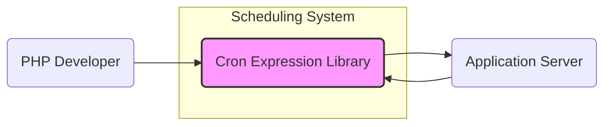
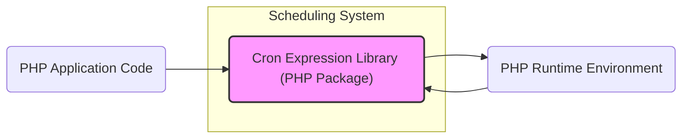
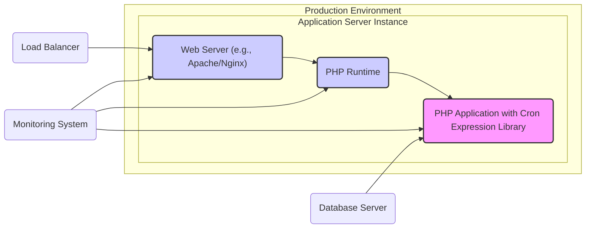

# BUSINESS POSTURE

This project is a PHP library for parsing and describing cron expressions. It enables developers to easily work with cron expressions in their PHP applications, allowing for task scheduling and automation.

Business Priorities and Goals:
- Provide a reliable and accurate cron expression parsing and evaluation library for PHP developers.
- Simplify the process of working with cron expressions in PHP applications.
- Offer a well-documented and easy-to-use library to enhance developer productivity.
- Ensure the library is performant and does not introduce significant overhead to applications using it.

Business Risks:
- Incorrect cron expression parsing could lead to tasks being executed at the wrong time or not at all, disrupting business processes that rely on scheduled tasks.
- Performance issues in the library could negatively impact the performance of applications using it, especially if cron expressions are evaluated frequently.
- Security vulnerabilities in the library could be exploited if an attacker can control the cron expression input, potentially leading to unexpected behavior or information disclosure in the applications using the library.
- Lack of maintenance and updates could lead to compatibility issues with newer PHP versions or unpatched security vulnerabilities.

# SECURITY POSTURE

Existing Security Controls:
- security control: Standard PHP security practices are assumed for the development and execution environment of applications using this library.
- security control: Code is hosted on GitHub, benefiting from GitHub's infrastructure security.

Accepted Risks:
- accepted risk: Dependency on a third-party library introduces a potential supply chain risk. Vulnerabilities in the library could affect applications using it.
- accepted risk: Security of applications using this library is the responsibility of the application developers. This library itself does not enforce security policies on its users.

Recommended Security Controls:
- security control: Implement dependency scanning in the build process to automatically check for known vulnerabilities in the library and its dependencies (if any).
- security control: Encourage users to perform input validation on cron expressions before passing them to the library to prevent unexpected behavior due to malformed input.
- security control: Establish a process for monitoring and updating the library to address any reported security vulnerabilities or compatibility issues.

Security Requirements:
- Authentication: Not directly applicable to this library as it is a passive component. Authentication is the responsibility of the applications using this library.
- Authorization: Not directly applicable to this library. Authorization is the responsibility of the applications using this library to control how and where cron expressions are used.
- Input Validation: The library should handle invalid cron expressions gracefully and predictably, preventing unexpected errors or crashes. It should validate the format of the input cron expression to avoid potential issues.
- Cryptography: Cryptography is not a core requirement for this library's functionality. However, if cron expressions are stored or transmitted, standard security practices for data at rest and in transit should be applied by the applications using this library.

# DESIGN

## C4 CONTEXT

Context Diagram Elements:

- Name: PHP Developer
  - Type: Person
  - Description: Software developers who use the Cron Expression Library to implement task scheduling in their PHP applications.
  - Responsibilities: Integrate the library into their applications, provide valid cron expressions, and handle scheduled task execution.
  - Security controls: Responsible for secure coding practices in their applications, including proper input validation and handling of scheduled tasks.

- Name: Cron Expression Library
  - Type: Software System
  - Description: A PHP library that parses and evaluates cron expressions, providing functionality to determine execution times and describe cron expressions.
  - Responsibilities: Accurately parse cron expressions, calculate next and previous run times, and provide human-readable descriptions of cron expressions.
  - Security controls: Input validation to handle malformed cron expressions, and adherence to secure coding practices during development.

- Name: Application Server
  - Type: Software System
  - Description: The server environment where PHP applications using the Cron Expression Library are deployed and executed.
  - Responsibilities: Execute PHP applications, run scheduled tasks based on cron expressions evaluated by the library, and provide the runtime environment for the library.
  - Security controls: Operating system and web server security configurations, PHP runtime security settings, and network security controls.

## C4 CONTAINER

Container Diagram Elements:

- Name: Cron Expression Library (PHP Package)
  - Type: Container - Library
  - Description: The PHP library itself, distributed as a package (e.g., via Composer). It contains the PHP code for parsing and evaluating cron expressions.
  - Responsibilities: Provide the core logic for working with cron expressions.
  - Security controls: Source code review, static analysis during development, and dependency scanning in the build process.

- Name: PHP Application Code
  - Type: Container - Application Code
  - Description: The PHP code of the application that utilizes the Cron Expression Library to implement task scheduling or cron expression related functionalities.
  - Responsibilities: Integrate the library, provide cron expressions as input, and handle the execution of scheduled tasks.
  - Security controls: Application-level input validation, authorization checks for task scheduling, and secure coding practices.

- Name: PHP Runtime Environment
  - Type: Container - Runtime Environment
  - Description: The PHP interpreter and associated environment (e.g., web server, CLI) where the PHP application and the library are executed.
  - Responsibilities: Execute PHP code, provide necessary resources for the application and library to run.
  - Security controls: PHP runtime configuration, web server security, operating system security, and resource limits.

## DEPLOYMENT

Deployment Scenario: Web Application Deployment

Deployment Diagram Elements:

- Name: Web Server (e.g., Apache/Nginx)
  - Type: Infrastructure - Web Server
  - Description: Handles HTTP requests and serves the PHP application.
  - Responsibilities: Web request processing, static content serving, reverse proxying, and load balancing.
  - Security controls: Web server configuration hardening, TLS/SSL configuration, access control, and DDoS protection.

- Name: PHP Runtime
  - Type: Infrastructure - Runtime Environment
  - Description: The PHP interpreter executing the application code and the Cron Expression Library.
  - Responsibilities: Execute PHP code, manage resources, and provide necessary PHP extensions.
  - Security controls: PHP runtime configuration hardening, disabling unnecessary extensions, and resource limits.

- Name: PHP Application with Cron Expression Library
  - Type: Software - Application
  - Description: The deployed PHP application that includes and uses the Cron Expression Library for task scheduling.
  - Responsibilities: Implement application logic, schedule tasks using the library, and interact with other services (e.g., database).
  - Security controls: Application-level security controls, input validation, authorization, session management, and secure data handling.

- Name: Load Balancer
  - Type: Infrastructure - Load Balancer
  - Description: Distributes incoming traffic across multiple application server instances for scalability and availability.
  - Responsibilities: Traffic distribution, health checks, and session persistence.
  - Security controls: Load balancer security configuration, DDoS protection, and TLS/SSL termination.

- Name: Database Server
  - Type: Infrastructure - Database
  - Description: Stores application data, potentially including scheduled task information or cron expressions (depending on application design).
  - Responsibilities: Data persistence, data retrieval, and data integrity.
  - Security controls: Database access control, encryption at rest and in transit, regular backups, and vulnerability management.

- Name: Monitoring System
  - Type: Infrastructure - Monitoring
  - Description: Monitors the health and performance of the application, web server, PHP runtime, and potentially the execution of scheduled tasks.
  - Responsibilities: Log aggregation, performance monitoring, alerting, and security monitoring.
  - Security controls: Secure access to monitoring data, secure configuration of monitoring agents, and alerting on security events.

## BUILD

```mermaid
flowchart LR
    A("Developer (Code Changes)") --> B("Version Control (GitHub)");
    B --> C("CI/CD Pipeline (GitHub Actions)");
    C --> D("Build Process (Composer, Tests, SAST)");
    D --> E("Artifacts (PHP Package)");
    E --> F("Package Repository (e.g., Packagist)");
    style A fill:#ccf,stroke:#333,stroke-width:2px
    style B fill:#ccf,stroke:#333,stroke-width:2px
    style C fill:#ccf,stroke:#333,stroke-width:2px
    style D fill:#ccf,stroke:#333,stroke-width:2px
    style E fill:#f9f,stroke:#333,stroke-width:2px
    style F fill:#ccf,stroke:#333,stroke-width:2px
```

Build Process Description:

- Developer (Code Changes): Developers write and modify the PHP code of the library.
  - Security controls: Developer workstations security, code review process.

- Version Control (GitHub): Code is committed and managed in a GitHub repository.
  - Security controls: Access control to the repository, branch protection, and audit logs.

- CI/CD Pipeline (GitHub Actions): Automated CI/CD pipeline triggered by code changes (e.g., push, pull request).
  - Security controls: Secure configuration of CI/CD workflows, secrets management, and access control to the CI/CD system.

- Build Process (Composer, Tests, SAST): The build process includes:
  - Dependency management using Composer.
  - Running unit tests to ensure code quality and functionality.
  - Static Application Security Testing (SAST) to identify potential security vulnerabilities in the code.
  - Security controls: Dependency scanning, SAST tools integration, and secure build environment.

- Artifacts (PHP Package): The build process produces a PHP package (e.g., a distributable ZIP or a package ready for Packagist).
  - Security controls: Artifact signing and integrity checks.

- Package Repository (e.g., Packagist): The built package is published to a package repository like Packagist for distribution to users.
  - Security controls: Package repository security, malware scanning, and package signing.

# RISK ASSESSMENT

Critical Business Process:
- Task Scheduling: The primary business process at risk is the reliable execution of scheduled tasks in applications that depend on this library. Incorrect or failed task scheduling can disrupt business operations, data processing, and automated workflows.

Data Sensitivity:
- Cron Expressions: Cron expressions themselves are generally not considered highly sensitive data. However, they can reveal information about scheduled processes and potentially system configurations.
- Application Logic related to Scheduled Tasks: The application code that uses this library and handles the execution of scheduled tasks might process sensitive data. The security of this data depends on the overall application security, not directly on the library itself.

# QUESTIONS & ASSUMPTIONS

BUSINESS POSTURE:
- Assumption: The library is intended for use in business applications where reliable task scheduling is important.
- Question: What is the expected scale and performance requirements for applications using this library?

SECURITY POSTURE:
- Assumption: Users of this library are expected to implement their own application-level security controls.
- Question: Are there any specific compliance requirements (e.g., GDPR, PCI DSS) that applications using this library might need to adhere to?

DESIGN:
- Assumption: The library will be primarily used in standard PHP environments (web servers, CLI applications).
- Question: Are there any specific deployment environments or architectures that the library needs to be compatible with (e.g., serverless environments, containerized deployments)?