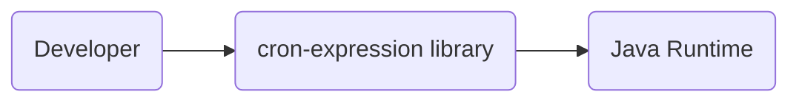
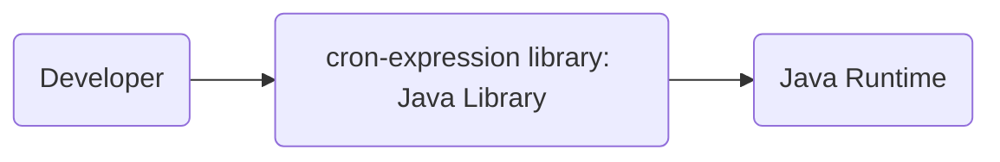
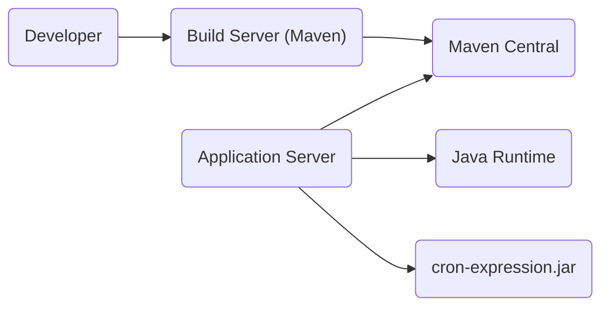
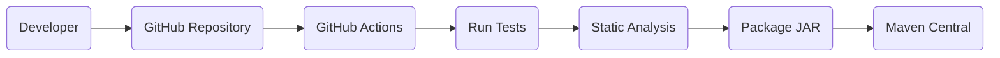

Okay, let's create a design document for the `cron-expression` project.

# BUSINESS POSTURE

Business Priorities and Goals:

*   Provide a reliable and accurate library for parsing and working with cron expressions.
*   Offer a simple and easy-to-use API for developers.
*   Ensure the library is well-tested and maintainable.
*   Support various cron expression formats and extensions.
*   Minimize external dependencies to reduce potential conflicts and security risks.

Most Important Business Risks:

*   Incorrect cron expression parsing leading to unexpected task scheduling.
*   Vulnerabilities in the library that could be exploited to cause denial of service or other security issues.
*   Lack of support for specific cron expression features required by users.
*   Difficulty in maintaining and updating the library due to complex code or lack of documentation.

# SECURITY POSTURE

Existing Security Controls:

*   security control: Input validation: The library validates cron expression syntax to prevent invalid or malicious input. Implemented in `CronExpression.java`.
*   security control: Unit testing: Extensive unit tests are used to ensure the correctness of the parsing and matching logic. Implemented in `CronExpressionTest.java`.
*   security control: Fuzz testing: Input is randomly mutated to find unexpected behavior. Implemented in `CronExpressionTest.java`.
*   security control: Static analysis: Code is checked for common errors and potential security issues. Implemented in build process.
*   security control: Dependency management: Limited external dependencies to minimize the attack surface. Implemented in `pom.xml`.

Accepted Risks:

*   accepted risk: The library does not currently support all possible cron expression extensions and variations.
*   accepted risk: The library assumes that the system time is correctly configured.

Recommended Security Controls:

*   security control: Regularly update dependencies to address known vulnerabilities.
*   security control: Consider adding more comprehensive security checks, such as regular expression denial-of-service (ReDoS) protection, if applicable.

Security Requirements:

*   Authentication: Not applicable, as this is a library, not a service.
*   Authorization: Not applicable, as this is a library, not a service.
*   Input Validation:
    *   The library must validate the syntax of cron expressions according to the supported format.
    *   The library should handle invalid or malformed cron expressions gracefully, without crashing or throwing unexpected exceptions.
    *   The library should reject excessively long or complex cron expressions that could lead to performance issues or denial-of-service.
*   Cryptography: Not applicable, as this library does not handle sensitive data or cryptographic operations.

# DESIGN

## C4 CONTEXT

Element Description:

*   Element:
    *   Name: Developer
    *   Type: Person
    *   Description: A software developer who integrates the cron-expression library into their Java application.
    *   Responsibilities: Uses the library to parse cron expressions and determine the next execution time of a scheduled task.
    *   Security controls: Not applicable.

*   Element:
    *   Name: cron-expression library
    *   Type: Software System
    *   Description: A Java library for parsing and working with cron expressions.
    *   Responsibilities: Provides methods for parsing cron expressions, determining the next execution time, and validating cron expression syntax.
    *   Security controls: Input validation, unit testing, static analysis, dependency management.

*   Element:
    *   Name: Java Runtime
    *   Type: Software System
    *   Description: The Java Runtime Environment (JRE) that executes the library's code.
    *   Responsibilities: Provides the necessary runtime environment for the library to function.
    *   Security controls: Relies on the security controls of the underlying JRE and operating system.

## C4 CONTAINER

Element Description:

*   Element:
    *   Name: Developer
    *   Type: Person
    *   Description: A software developer who integrates the cron-expression library into their Java application.
    *   Responsibilities: Uses the library to parse cron expressions and determine the next execution time of a scheduled task.
    *   Security controls: Not applicable.

*   Element:
    *   Name: cron-expression library
    *   Type: Java Library
    *   Description: A Java library for parsing and working with cron expressions.
    *   Responsibilities: Provides methods for parsing cron expressions, determining the next execution time, and validating cron expression syntax.
    *   Security controls: Input validation, unit testing, static analysis, dependency management.

*   Element:
    *   Name: Java Runtime
    *   Type: Software System
    *   Description: The Java Runtime Environment (JRE) that executes the library's code.
    *   Responsibilities: Provides the necessary runtime environment for the library to function.
    *   Security controls: Relies on the security controls of the underlying JRE and operating system.

## DEPLOYMENT

Possible deployment solutions:

1.  Direct inclusion as a JAR file in a Java project.
2.  Deployment as a dependency via a build management tool like Maven or Gradle.
3.  Inclusion within a containerized application (e.g., Docker).

Chosen deployment solution (most common): Deployment as a dependency via Maven.

Element Description:

*   Element:
    *   Name: Developer
    *   Type: Person
    *   Description: Develops application that uses cron-expression.
    *   Responsibilities: Writes code, configures build system.
    *   Security controls: Secure coding practices.

*   Element:
    *   Name: Build Server (Maven)
    *   Type: Software System
    *   Description: Server that builds the application, including fetching dependencies.
    *   Responsibilities: Compiling code, resolving dependencies, packaging application.
    *   Security controls: Access controls, dependency vulnerability scanning.

*   Element:
    *   Name: Maven Central
    *   Type: Software System
    *   Description: Public repository for Java libraries.
    *   Responsibilities: Hosting and serving library artifacts.
    *   Security controls: Repository security measures, checksum verification.

*   Element:
    *   Name: Application Server
    *   Type: Software System
    *   Description: Server that runs the Java application.
    *   Responsibilities: Providing runtime environment for the application.
    *   Security controls: Server hardening, access controls, network security.

*   Element:
    *   Name: Java Runtime
    *   Type: Software System
    *   Description: The Java Runtime Environment.
    *   Responsibilities: Executing Java bytecode.
    *   Security controls: JRE security updates, sandboxing.

*   Element:
    *   Name: cron-expression.jar
    *   Type: Software Component
    *   Description: The packaged cron-expression library.
    *   Responsibilities: Providing cron expression parsing functionality.
    *   Security controls: Code signing (optional).

## BUILD

Build Process Description:

1.  Developer commits code to the GitHub repository.
2.  GitHub Actions, the CI/CD system, is triggered.
3.  The build server checks out the code.
4.  Unit tests and fuzz tests are executed.
5.  Static analysis tools (e.g., linters, SpotBugs) are run to identify potential code quality and security issues.
6.  If all tests and checks pass, the library is packaged into a JAR file.
7.  The JAR file is deployed to Maven Central.

Security Controls in Build Process:

*   security control: Automated testing: Unit tests and fuzz tests are run automatically on every build.
*   security control: Static analysis: Static analysis tools are used to identify potential vulnerabilities.
*   security control: Dependency management: Maven manages dependencies and can be configured to check for known vulnerabilities.
*   security control: Build automation: GitHub Actions provides a consistent and reproducible build process.
*   security control: Access control: Access to the GitHub repository and build system is restricted.

# RISK ASSESSMENT

Critical Business Processes:

*   Accurate scheduling of tasks based on cron expressions.

Data Protection:

*   Data Sensitivity: The library itself does not handle sensitive data. However, incorrect cron expression parsing could lead to tasks being executed at unintended times, potentially impacting data integrity or availability indirectly. The library does not store or transmit any data.

# QUESTIONS & ASSUMPTIONS

Questions:

*   Are there any specific compliance requirements (e.g., industry regulations) that the library needs to adhere to?
*   Are there any plans to support additional cron expression features or extensions in the future?
*   What is the expected usage pattern of the library (e.g., frequency of use, complexity of cron expressions)?

Assumptions:

*   BUSINESS POSTURE: The primary goal is to provide a reliable and accurate cron expression parsing library.
*   SECURITY POSTURE: The library is used in environments where the system time is correctly configured.
*   DESIGN: The library is primarily used within Java applications.
*   DESIGN: Developers will use a dependency management tool like Maven or Gradle to include the library in their projects.
*   DESIGN: The library will be deployed to Maven Central.