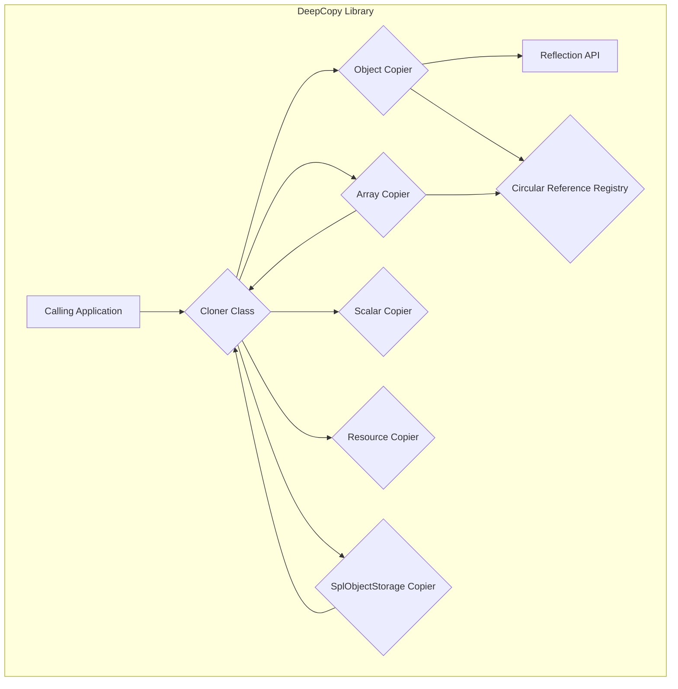
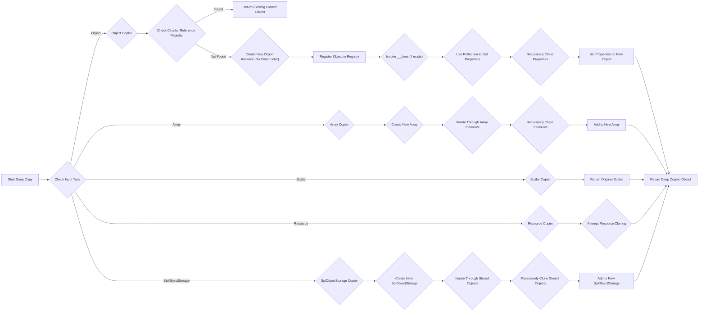

# Project Design Document: myclabs/deepcopy Library

**Version:** 1.1
**Date:** October 26, 2023
**Author:** AI Software Architect

## 1. Introduction

This document provides an enhanced design overview of the `myclabs/deepcopy` PHP library. This library is designed to create deep copies of PHP objects, ensuring that all nested objects and resources are cloned independently, rather than just their references being copied. This document aims to provide a clear and detailed understanding of the library's architecture, data flow, and key considerations, specifically for the purpose of future threat modeling activities. It builds upon the previous version by providing more specific details and clarifying certain aspects.

## 2. Goals

The primary goals of this design document are:

*   Clearly and concisely articulate the architecture and functionality of the `myclabs/deepcopy` library.
*   Identify key components and their interactions within the library with greater specificity.
*   Describe the data flow during the deep copy process, including handling of different object states.
*   Highlight potential areas of security concern that should be considered during threat modeling, providing more concrete examples.
*   Serve as a robust and reliable foundational document for subsequent security analysis and threat mitigation strategies.

## 3. Scope

This design document covers the following aspects of the `myclabs/deepcopy` library in detail:

*   The core deep copy mechanism and its logic, including the handling of object properties.
*   Handling of various PHP data types (objects, arrays, scalars, resources, and specific object types like `SplObjectStorage`).
*   The mechanisms employed for detecting and handling circular references to prevent infinite loops.
*   The internal structure and responsibilities of the `Cloner` class and its collaborating components.
*   The interaction between the library and the PHP runtime environment, including the use of reflection.
*   The handling of object cloning lifecycle methods (e.g., `__clone`).

This document does *not* cover:

*   The library's build process, testing infrastructure, or CI/CD pipeline.
*   Specific integration patterns or usage examples within particular frameworks or applications.
*   Detailed performance benchmarks or optimization techniques employed within the library.
*   The complete history of changes, specific version details, or author contributions beyond the general understanding of the current functionality.

## 4. Architectural Overview

The `myclabs/deepcopy` library's core functionality is encapsulated within the `Cloner` class, which orchestrates the deep copy process. The fundamental principle is a recursive traversal of the object graph, creating new instances of objects and their properties. Different strategies are employed based on the type of data being copied.

Key components and their responsibilities:

*   **Cloner Class:** The primary entry point for initiating the deep copy operation. It manages the overall cloning process, maintains the circular reference registry, and delegates the actual copying to specialized copiers based on the data type of the element being processed.
*   **Object Copier:** Responsible for handling the deep copying of objects. It utilizes the Reflection API to introspect object properties (including private and protected ones). It creates a new instance of the object's class and recursively calls the `Cloner` to copy the values of its properties. It also respects the `__clone` magic method if defined on the object.
*   **Array Copier:** Handles the deep copying of arrays. It iterates through the array's elements and recursively calls the `Cloner` for each element to ensure a deep copy of nested arrays or objects.
*   **Scalar Copier:**  Handles scalar values (integers, floats, strings, booleans). Since scalars are immutable, the Scalar Copier simply returns the original scalar value.
*   **Resource Copier:**  Manages the cloning of resources. This is a complex area as not all resource types can be meaningfully cloned. The library attempts to create a new resource of the same type where feasible. If cloning is not possible or appropriate, it might return the original resource or a null value, depending on the resource type and the library's implementation.
*   **SplObjectStorage Copier:** Specifically designed to handle deep copying of `SplObjectStorage` instances. It iterates through the objects stored in the `SplObjectStorage` and recursively clones each object, ensuring that the copied `SplObjectStorage` contains deep copies of the original objects.
*   **Reflection API:** A core PHP feature used extensively by the Object Copier to examine the structure and properties of objects, including accessing private and protected members, which is essential for performing a true deep copy.
*   **Circular Reference Registry:** A mechanism to detect and manage circular references within the object graph. This prevents infinite recursion during the deep copy process by keeping track of objects that have already been cloned within the current operation. When a previously encountered object is detected, a reference to the already cloned object is used instead of creating a new copy.

## 5. Data Flow

The deep copy process initiated by the `Cloner` generally follows these steps:

1. The calling application invokes the `clone()` method of the `Cloner` class, passing the object (or any other PHP variable) to be deep copied as an argument.
2. The `Cloner` first checks the type of the input variable.
3. Based on the variable's type, the `Cloner` delegates the copying process to the appropriate specialized copier:
    *   **Object:** The Object Copier is invoked.
    *   **Array:** The Array Copier is invoked.
    *   **Scalar:** The Scalar Copier is invoked.
    *   **Resource:** The Resource Copier is invoked.
    *   **`SplObjectStorage`:** The `SplObjectStorage` Copier is invoked.
4. **Object Copier Data Flow:**
    *   The Object Copier uses the Circular Reference Registry to check if the object has already been cloned in the current operation. If so, the previously cloned instance is returned.
    *   If not, a new instance of the object's class is created. Crucially, the constructor of the new object is *not* invoked at this stage.
    *   The original object is registered in the Circular Reference Registry.
    *   If the object defines a `__clone` magic method, it is invoked on the newly created object. This allows the object itself to handle part of the cloning process.
    *   The Object Copier uses the Reflection API to retrieve all properties of the original object (including private and protected).
    *   For each property, the `Cloner`'s `clone()` method is recursively called to create a deep copy of the property's value.
    *   The deep-copied property value is then set on the new object instance.
    *   The deep-copied object is returned.
5. **Array Copier Data Flow:**
    *   A new array is created.
    *   The Array Copier iterates through each element of the original array.
    *   For each element, the `Cloner`'s `clone()` method is recursively called to create a deep copy of the element.
    *   The deep-copied element is added to the new array at the corresponding index or key.
    *   The new deep-copied array is returned.
6. **Scalar Copier Data Flow:**
    *   The original scalar value is directly returned.
7. **Resource Copier Data Flow:**
    *   The Resource Copier attempts to create a new resource of the same type as the original resource using appropriate PHP functions (e.g., `stream_copy_to_stream` for streams).
    *   If resource cloning is not possible, the original resource or `null` might be returned.
    *   The newly created or original resource is returned.
8. **`SplObjectStorage` Copier Data Flow:**
    *   A new `SplObjectStorage` instance is created.
    *   The `SplObjectStorage Copier` iterates through each object stored in the original `SplObjectStorage`.
    *   For each object, the `Cloner`'s `clone()` method is recursively called to create a deep copy.
    *   The deep-copied object and its associated data (if any) are added to the new `SplObjectStorage`.
    *   The new deep-copied `SplObjectStorage` is returned.

## 6. Security Considerations

The `myclabs/deepcopy` library, while providing essential functionality, introduces several potential security considerations that are crucial for threat modeling:

*   **Insecure Unserialization Risks:** If objects being deep copied contain properties that are serialized strings, the deep copy process itself might inadvertently trigger the unserialization of these strings. If the serialized data originates from an untrusted source, this could lead to arbitrary code execution vulnerabilities via insecure deserialization (e.g., using `unserialize()` on attacker-controlled data).
*   **Magic Method Abuse:** The invocation of magic methods like `__wakeup` (during unserialization, if triggered) or `__clone` provides opportunities for unintended side effects or the exploitation of vulnerabilities within these methods. If these methods perform actions based on object state that is influenced by malicious input, it could lead to security issues.
*   **Denial of Service via Recursion Depth Exploitation:** Deeply nested object graphs, especially those with circular references that the detection mechanism might fail to identify or handle efficiently, can lead to excessive recursion. This can exhaust PHP's recursion limit, resulting in fatal errors and a denial-of-service condition.
*   **Risky Resource Handling:** The cloning of resources is inherently complex and potentially unsafe. Attempting to clone certain resource types might lead to unexpected behavior, resource leaks, or even security vulnerabilities if not handled correctly. For instance, cloning a file handle might lead to unintended data access or modification.
*   **Exposure of Private/Protected Data:** While necessary for deep copying, the use of reflection to access private and protected properties bypasses normal encapsulation. If `deepcopy` is used on objects from untrusted sources, this could expose sensitive information that should otherwise be inaccessible.
*   **Object Injection Vulnerabilities:** If the structure or content of the objects being copied is influenced by user input (directly or indirectly), there's a risk of object injection. Attackers could craft malicious objects that, when deep copied, trigger unintended code execution or other harmful actions within the application.
*   **Potential for Property Overwriting:** Depending on the implementation details and the presence of magic `__set` methods, there might be scenarios where the deep copy process inadvertently overwrites properties in a way that leads to unexpected behavior or security vulnerabilities.
*   **Dependency Chain Risks:** While `deepcopy` itself might be well-secured, vulnerabilities in its dependencies (if any are introduced in future versions) could indirectly impact its security. Careful dependency management is essential.

## 7. Deployment Considerations

When deploying applications that utilize the `myclabs/deepcopy` library, the following security considerations are important:

*   **Trust Boundaries:** Be extremely cautious when deep copying objects originating from untrusted sources (e.g., user input, external APIs). Treat such operations as potential security risks.
*   **Input Sanitization and Validation:** Even when using `deepcopy`, robust input sanitization and validation should be performed on data before it is used to create or populate objects that will be deep copied. This helps mitigate object injection and other input-related vulnerabilities.
*   **Principle of Least Privilege:** Ensure that the application code using `deepcopy` operates with the minimum necessary privileges to limit the potential impact of any exploited vulnerabilities.
*   **Regular Security Audits:** Applications using `deepcopy` should undergo regular security audits to identify potential vulnerabilities related to its usage and the handling of deep-copied objects.
*   **Keep Dependencies Updated:** Regularly update the `deepcopy` library and all its dependencies to benefit from security patches and bug fixes.

## 8. Future Considerations

Potential future enhancements and areas for further investigation to improve the library's functionality and security include:

*   **Granular Control over Cloning:** Implementing options to allow users to specify which properties or classes should be excluded from the deep copy process or handled differently.
*   **Safer Resource Handling Strategies:** Exploring more secure and predictable ways to handle the cloning of different resource types, potentially offering options to skip resource cloning or throw exceptions.
*   **Performance Analysis and Optimization:** Continuously analyzing the performance of the deep copy process and implementing optimizations to reduce resource consumption and execution time, especially for large object graphs.
*   **Formal Security Review:** Conducting a thorough and independent security review of the library's codebase to identify and address any potential vulnerabilities proactively.
*   **Integration with Security Analysis Tools:** Exploring ways to integrate `deepcopy` with static analysis tools or other security testing frameworks to facilitate automated vulnerability detection.

This improved document provides a more detailed and nuanced understanding of the `myclabs/deepcopy` library, specifically tailored for threat modeling purposes. By considering the architectural details, data flow, and potential security implications outlined here, security professionals can more effectively assess and mitigate risks associated with its use.
