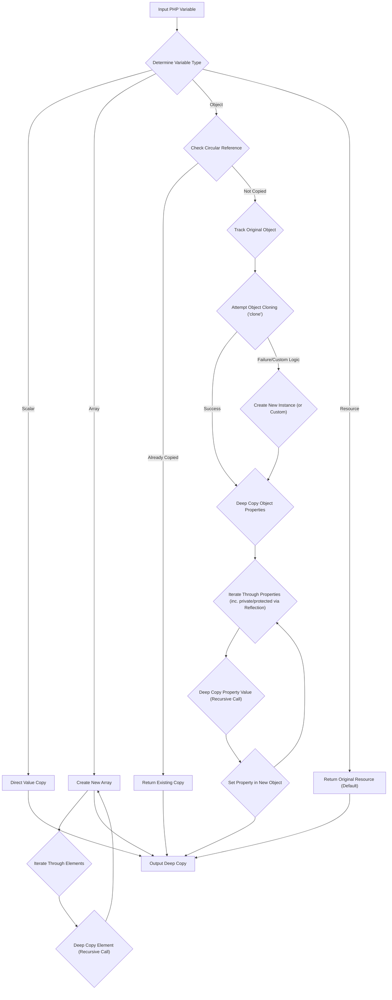
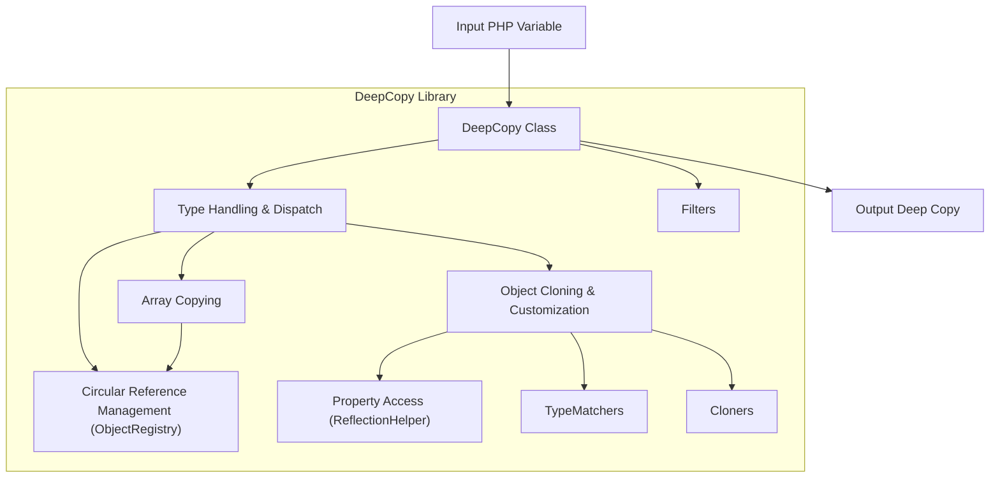
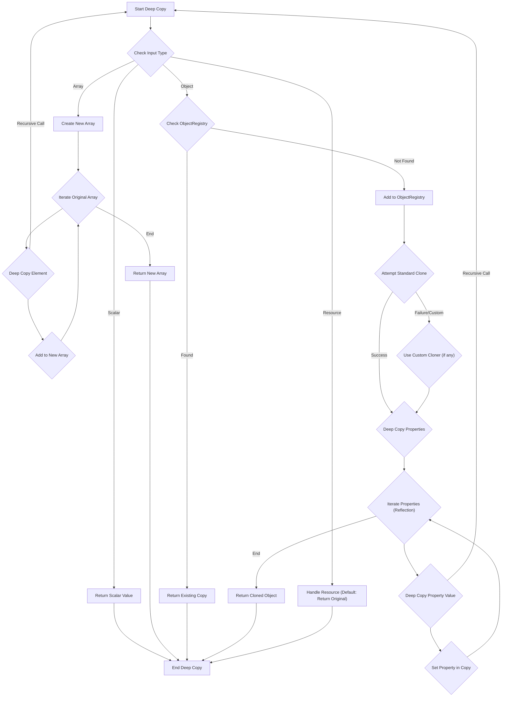

# Project Design Document: myclabs/deepcopy Library

**Version:** 1.1
**Date:** October 26, 2023
**Author:** AI Software Architect

## 1. Project Overview

This document details the design of the `myclabs/deepcopy` PHP library, which facilitates the creation of deep copies of PHP variables, including complex objects and arrays. A deep copy ensures that all nested elements are duplicated, resulting in a completely independent copy of the original data structure. This document serves as a foundational resource for understanding the library's internal workings and is specifically intended for use during threat modeling exercises.

## 2. Goals

* To provide a significantly enhanced and more detailed description of the `deepcopy` library's architecture and functionality compared to the previous version.
* To more clearly identify the interactions between key components within the library.
* To provide a more granular explanation of the data flow and processing logic involved in creating deep copies, highlighting potential areas of interest for security analysis.
* To serve as a robust and comprehensive basis for identifying potential security vulnerabilities and attack vectors during subsequent threat modeling activities.

## 3. Target Audience

* Security engineers responsible for performing threat modeling and security assessments.
* Developers who are actively contributing to or maintaining the `deepcopy` library.
* Software architects who are considering integrating the `deepcopy` library into larger, more complex systems.

## 4. Scope

This document comprehensively covers the core functionality of the `myclabs/deepcopy` library, with a strong emphasis on the process of creating deep copies of PHP variables. The scope includes:

* The primary entry point and methods for initiating deep copy operations.
* The detailed mechanisms for handling various PHP data types (scalars, arrays, objects, and resources).
* In-depth strategies for managing object properties, including different visibility levels (public, protected, private) and static properties.
* The sophisticated techniques employed for detecting and resolving circular references within data structures.
* The library's utilization of PHP's built-in cloning mechanisms (`__clone` magic method) and its handling of custom cloning logic.
* The extension points and mechanisms for customizing the deep copy process for specific object types.

This document explicitly excludes:

* Detailed performance benchmarks and optimization strategies implemented within the library.
* Low-level implementation specifics of internal data structures and algorithms (unless directly relevant to security).
* The library's testing framework, test cases, and related methodologies.
* Instructions for deploying or installing the library within a PHP environment.

## 5. Functional Description

The `deepcopy` library enables the creation of independent copies of PHP variables. This is essential when modifications to a copy must not affect the original data. The library achieves this by recursively traversing the input variable and instantiating new copies of objects and arrays, populating them with duplicated property values.

The central component is the `DeepCopy` class. The deep copy process unfolds as follows:

* **Input Reception:** The library accepts a PHP variable (scalar, array, object, or resource) as input.
* **Initial Type Determination:** The library begins by identifying the specific type of the input variable.
* **Scalar Handling:** If the input is a scalar type (integer, float, string, boolean, or null), a direct copy of the value is created and returned.
* **Array Processing:** For array inputs, a new array is instantiated. The library then iterates through each element of the original array, recursively invoking the deep copy function for every element.
* **Object Handling - Core Logic:**  The handling of objects is the most intricate:
    * **Circular Reference Check:** Before proceeding, the library checks if the object has already been copied in the current deep copy operation to prevent infinite recursion.
    * **Object Cloning Attempt:** The library attempts to clone the object using the `clone` keyword. This triggers the object's `__clone()` magic method if it is defined.
    * **Custom Cloning Logic:** If the object implements specific interfaces or if custom type mappers are registered, these are invoked to handle the cloning process.
    * **Property Iteration:** Following cloning (or if cloning is not applicable or customized), the library iterates through all properties of the object, including public, protected, and private properties, as well as static properties.
    * **Reflection for Access:**  The Reflection API is employed to access protected and private properties, as direct access is restricted.
    * **Recursive Property Copying:** For each property, the deep copy function is called recursively to generate independent copies of the property values.
    * **Property Value Assignment:** The copied property values are then assigned to the corresponding properties of the newly cloned or instantiated object.
* **Resource Handling:** For resources, the default behavior is to return the original resource, as deep copying resources is generally not feasible or meaningful. However, custom handlers can be registered to manage specific resource types.
* **Output Generation:** The library returns a new PHP variable that represents a complete deep copy of the original input. Modifications to this copy will not affect the original, and vice versa.

### 5.1. Key Components

* **`DeepCopy` Class:** The primary class and the entry point for initiating deep copy operations. It encapsulates the core logic for handling different data types and orchestrating the copying process.
* **`TypeMatcherInterface` (and Implementations):** Defines an interface for classes that determine if a specific rule should be applied to a given object. Implementations allow for customizing the deep copy behavior based on object type or other criteria.
* **`FilterInterface` (and Implementations):** Defines an interface for classes that can filter properties during the deep copy process, allowing for the exclusion of certain properties from being copied.
* **`ClonerInterface` (and Implementations):** Defines an interface for classes responsible for cloning objects. Different implementations can handle specific object types or apply custom cloning logic.
* **`ReflectionHelper` (Internal):** An internal utility class that simplifies the use of the Reflection API for accessing object properties.
* **`ObjectRegistry` (Internal):**  A mechanism (often using `SplObjectStorage` or a similar structure) to keep track of already copied objects and their corresponding copies to handle circular references.

### 5.2. Data Flow

### 5.3. Handling Circular References (Detailed)

The library employs a robust mechanism to detect and manage circular references, preventing infinite recursion. This involves:

* **Object Registry:**  The `ObjectRegistry` (or a similar structure like `SplObjectStorage`) maintains a mapping between original objects and their corresponding deep copies within the current execution scope of the `DeepCopy` operation.
* **Pre-Copy Check:** Before attempting to clone or copy an object, the library checks if the object already exists in the `ObjectRegistry`.
* **Returning Existing Copies:** If the object is found in the registry, it means a copy has already been created, and a reference to this existing copy is returned, breaking the circular dependency.
* **Registration Before Recursion:**  Crucially, the original object is registered in the `ObjectRegistry` *before* its properties are recursively processed. This ensures that if a circular reference is encountered during property copying, the existing copy will be found.

### 5.4. Object Cloning and Customization

The library provides several ways to customize the object cloning process:

* **`__clone()` Magic Method:** If an object defines the `__clone()` magic method, this method is automatically invoked by PHP's `clone` operator. The library respects this method, allowing objects to implement their own custom cloning logic.
* **`TypeMatcherInterface` and Custom Cloners:** Developers can implement the `TypeMatcherInterface` to define rules that specify which `ClonerInterface` implementation should be used for specific object types. This allows for highly tailored cloning behavior.
* **`FilterInterface`:**  Filters can be used to selectively exclude properties from being copied, providing another layer of customization during the object copying process.

## 6. Non-Functional Requirements (Security Focus)

These non-functional requirements have significant security implications for the `deepcopy` library:

* **Data Integrity and Fidelity:** The deep copy process must accurately replicate the structure and values of the original data without introducing unintended alterations, omissions, or data corruption. Any deviation could have security consequences if the copy is used for critical operations.
* **Resource Management and Resilience:** The library must handle arbitrarily large and deeply nested object graphs gracefully, preventing excessive memory consumption, stack overflow errors due to uncontrolled recursion, or other resource exhaustion issues that could lead to denial-of-service. Robust circular reference detection is paramount here.
* **Protection Against Malicious Input:** The library should be designed to resist exploitation via maliciously crafted input data. This includes objects designed to trigger excessive recursion, consume excessive resources, or bypass intended security mechanisms within the copied objects.
* **Security of Reflected Properties:** When using reflection to access private and protected properties, the library must not inadvertently expose sensitive information or allow for unintended modification of these properties in the copied object.
* **Predictable and Secure Handling of `__clone()`:** The library's interaction with custom `__clone()` methods must be carefully considered. Maliciously implemented `__clone()` methods could introduce vulnerabilities if they are not handled securely.

## 7. Architecture Diagram

## 8. Data Flow Diagram (Granular)

## 9. Technology Stack

* **Primary Language:** PHP
* **Core Language Features Utilized:** Object cloning (`clone`), Reflection API, potentially SPL data structures (`SplObjectStorage`).
* **Potential Dependencies:** None explicitly required for core functionality, but extension points might rely on user-provided classes.

## 10. Deployment Considerations

The `deepcopy` library is typically integrated into PHP projects as a dependency managed by Composer. Its functionality is accessed by instantiating the `DeepCopy` class and invoking its `copy()` method. No specific deployment steps beyond standard PHP application deployment are required.

## 11. Security Considerations (Detailed)

This section expands on the preliminary security considerations, providing more specific examples and potential attack scenarios:

* **Recursive Depth Exploitation (Resource Exhaustion):**  A malicious actor could provide an object graph with extreme nesting depth, potentially exceeding PHP's memory limits or call stack size, leading to a denial-of-service. This is especially relevant if circular reference detection has weaknesses.
* **Circular Reference Handling Bypass:** If the circular reference detection mechanism has flaws, a carefully crafted object graph with circular references could cause infinite loops, leading to resource exhaustion and potentially crashing the application.
* **`__clone()` Method Abuse:** An object's `__clone()` method could be intentionally designed to perform malicious actions when the object is cloned (e.g., deleting files, making unauthorized API calls). The `deepcopy` library, by invoking this method, could inadvertently trigger these actions.
* **Reflection Vulnerabilities:** While necessary, the use of reflection to access private and protected properties could be exploited if the library processes untrusted input that influences which properties are accessed. This could potentially lead to the disclosure of sensitive information or the modification of internal object state in unintended ways.
* **Type Confusion Attacks:** Providing objects with unexpected structures or types could potentially expose vulnerabilities in the deep copy logic if it does not handle all edge cases robustly. This might lead to errors, unexpected behavior, or even security breaches.
* **Unintended Data Exposure through Custom Cloners/Filters:**  If custom `ClonerInterface` or `FilterInterface` implementations are not carefully designed, they could inadvertently expose sensitive data or introduce vulnerabilities during the deep copy process.
* **Serialization/Unserialization Issues (Indirect):** Although `deepcopy` doesn't directly serialize/unserialize, if the objects being copied contain properties that were originally created through unserialization of untrusted data, existing unserialize vulnerabilities within those objects could be inadvertently "activated" or propagated during the deep copy.

## 12. Assumptions and Constraints

* The library is assumed to be operating within a standard, properly configured PHP environment.
* Input PHP variables are expected to adhere to standard PHP data type conventions and not contain intentionally malicious code within their properties (beyond what the `__clone()` method might introduce).
* The primary goal is to create a semantically equivalent and independent copy of the data structure. Performance is a secondary consideration for security analysis but might be a concern in other contexts.
* Custom `ClonerInterface` and `FilterInterface` implementations are assumed to be developed with security best practices in mind.

This improved design document provides a more detailed and nuanced understanding of the `myclabs/deepcopy` library, offering a stronger foundation for identifying and mitigating potential security risks during the threat modeling process. The added granularity and specific examples aim to facilitate a more thorough security analysis.
