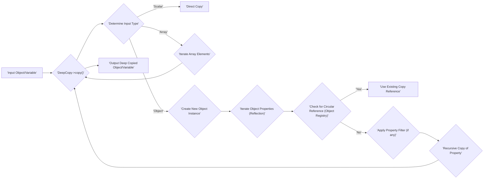

# Project Design Document: myclabs/deepcopy

**Version:** 1.1
**Date:** October 26, 2023
**Author:** AI Software Architect

## 1. Introduction

This document provides a detailed design overview of the `myclabs/deepcopy` PHP library. This document serves as a foundation for understanding the library's architecture, functionality, and potential security considerations, making it suitable for subsequent threat modeling activities.

### 1.1. Purpose

The primary purpose of this document is to clearly and comprehensively describe the design of the `myclabs/deepcopy` library. This document will be used as input for a threat modeling exercise to identify potential security vulnerabilities and risks associated with the library's functionality. This includes understanding how the library handles different data types and object structures, which is crucial for identifying potential attack vectors.

### 1.2. Scope

This document covers the core functionality of the `myclabs/deepcopy` library, focusing on the process of creating deep copies of PHP objects. It includes:

*   A high-level overview of the library's purpose and functionality.
*   A detailed description of the deep copy process, including handling of different data types and object structures.
*   A data flow diagram illustrating the key steps involved in the deep copy operation.
*   Identification of key components and their interactions within the library.
*   Detailed consideration of potential security aspects relevant to threat modeling, including potential attack scenarios.

### 1.3. Target Audience

This document is intended for:

*   Security engineers and architects performing threat modeling and security assessments.
*   Developers who need a detailed understanding of the library's design for maintenance, debugging, or extension.
*   Anyone involved in the security assessment, auditing, or maintenance of projects utilizing this library.

## 2. Overview

The `myclabs/deepcopy` library is a PHP library designed to create deep copies of PHP objects. A deep copy ensures that all properties of an object, including nested objects and arrays, are recursively copied, creating a completely independent copy of the original object. This contrasts with a shallow copy, where nested objects and arrays are referenced, not copied, leading to potential side effects when modifying the copy.

The library aims to provide a robust and reliable way to duplicate complex object structures without unintended side effects caused by shared references. It achieves this by traversing the object graph and creating new instances for each object encountered.

## 3. Functional Description

The core functionality of the `myclabs/deepcopy` library revolves around the `DeepCopy` class and its primary `copy()` method. The process can be broken down into the following steps:

*   **Input Reception:** The `copy()` method receives a PHP variable (typically an object, but can also be an array or scalar) as input. This is the starting point of the deep copy operation.
*   **Initial Type Determination:** The library first determines the type of the input variable to apply the appropriate copying strategy.
    *   **Scalar Type Handling (int, float, string, bool, null):** For scalar values, a direct copy is performed, as these types are immutable.
    *   **Array Handling:** If the input is an array, the library iterates through each element of the array. For each element, the deep copy mechanism is recursively invoked. A new array is constructed with the deep copies of the original array's elements.
    *   **Object Handling:** This is the most intricate part of the process.
        *   **Object Instance Creation:** A new instance of the same class as the original object is created. This often involves using the `clone` keyword or reflection to instantiate the object without invoking the constructor.
        *   **Property Iteration and Access:** The library iterates through all properties of the original object, including private, protected, and public properties. This typically involves using PHP's Reflection API to access non-public properties.
        *   **Recursive Property Copying:** For each property of the original object, the deep copy mechanism is recursively called. This ensures that if a property is itself an object or an array, it will also be deep copied.
        *   **Circular Reference Detection and Resolution:** To prevent infinite recursion in cases of circular references (e.g., object A has a property referencing object B, and object B has a property referencing object A), the library maintains a registry of already copied objects. When an object is encountered that has already been copied, a reference to the previously created copy is used instead of creating a new instance.
*   **Cloner Strategy Application:** The library employs a strategy pattern using "cloners" to handle different object types or specific copying requirements.
    *   **Default Cloner:**  A general-purpose cloner handles standard objects by creating a new instance and recursively copying properties.
    *   **Specialized Cloners:**  The library allows for the registration of custom cloners for specific classes. This is useful for handling resources, closures, or objects with specific cloning needs. For example, a cloner might be registered to avoid cloning certain resource types or to handle immutable objects.
*   **Filter Mechanism Implementation:** The library provides a mechanism to filter which properties are copied. This allows developers to exclude certain properties from the deep copy process based on specific criteria. Filters can be applied based on property name, visibility, or other attributes.
*   **Output Generation:** The `copy()` method returns a new variable (object, array, or scalar) that represents the deep copy of the original input.

## 4. Data Flow Diagram

## 5. Key Components

*   **`DeepCopy` Class:** The central class responsible for orchestrating the deep copy process. It manages the cloners, filters, and the object registry for circular reference detection.
*   **`copy()` Method:** The primary entry point for initiating a deep copy operation. It accepts the input variable and returns its deep copy.
*   **Cloner Interface/Implementations:** Defines the contract for cloners and provides concrete implementations for different object types or cloning strategies.
    *   **Default Cloner:** Handles the standard deep copy process for most objects.
    *   **Custom Cloners:** Allow developers to define specific cloning logic for particular classes.
*   **Filter Interface/Implementations:** Defines the contract for filters and provides implementations for various filtering criteria (e.g., by property name, visibility).
*   **Object Registry:** An internal data structure (likely a `SplObjectStorage` or similar) used to track already copied objects to handle circular references efficiently. This prevents infinite recursion and ensures that circular dependencies are preserved in the copied object graph.
*   **Reflection API Usage:** PHP's Reflection API (`ReflectionClass`, `ReflectionProperty`, etc.) is extensively used to inspect object structures, access private and protected properties, and instantiate objects without invoking constructors when necessary.

## 6. Security Considerations (For Threat Modeling)

When considering the security of the `myclabs/deepcopy` library, the following aspects are crucial for threat modeling and identifying potential vulnerabilities:

*   **Resource Exhaustion (Denial of Service):**
    *   **Deeply Nested Objects:**  Maliciously crafted or unintentionally complex object graphs with extreme nesting levels could lead to excessive recursion, potentially causing stack overflow errors and crashing the application.
    *   **Circular References Exploitation:** While the library aims to handle circular references, vulnerabilities in the object registry or the logic for detecting and resolving them could be exploited to create infinite loops, consuming excessive CPU and memory resources. An attacker might craft an input object with a complex web of circular dependencies to trigger this.
    *   **Large Object Payloads:** Attempting to deep copy extremely large objects or arrays could lead to excessive memory consumption, potentially causing the application to run out of memory and crash.
*   **Object Injection Vulnerabilities (Indirect):** While `deepcopy` doesn't directly use `unserialize`, if custom cloners are implemented incorrectly and involve deserialization of untrusted data, it could indirectly introduce object injection vulnerabilities. Care must be taken when implementing custom cloners that handle external data sources.
*   **Information Disclosure:**
    *   **Unintended Copying of Sensitive Data:** If filters are not properly configured or if there are vulnerabilities in the filter logic, sensitive data within objects (e.g., passwords, API keys) might be unintentionally copied, potentially exposing it in unexpected parts of the application.
    *   **Exposure Through Custom Cloners:**  Custom cloners might inadvertently expose sensitive information if they are not implemented securely and handle object properties in a way that leaks data.
*   **Circumvention of Security Measures:** If security mechanisms rely on object immutability or identity, a deep copy could be used to circumvent these measures by creating a new, independent object that bypasses the intended security checks.
*   **Abuse of Reflection Capabilities:** While necessary for deep copying, the use of reflection to access private and protected properties could be a point of vulnerability if not handled carefully. Bugs in the reflection logic or how the accessed data is processed could potentially lead to unexpected behavior or security flaws.
*   **Vulnerabilities in Custom Cloners:**  The extensibility of the library through custom cloners introduces potential risks. Vulnerabilities in developer-implemented custom cloners could introduce various security flaws, including code execution if they handle untrusted data improperly.
*   **Dependency Chain Risks:** Although `deepcopy` has minimal direct dependencies, vulnerabilities in the broader dependency chain of the application using `deepcopy` could be indirectly exploitable if the copied objects interact with vulnerable components.

## 7. Dependencies

The `myclabs/deepcopy` library primarily relies on core PHP functionalities:

*   **PHP Object-Oriented Features:**  Fundamental language features for working with objects and classes.
*   **Reflection API (`ReflectionClass`, `ReflectionProperty`, etc.):**  Crucial for inspecting object structures and accessing non-public properties.
*   **SPL (Standard PHP Library):** May utilize SPL data structures like `SplObjectStorage` for efficient object tracking in circular reference handling.
*   **Array and Variable Handling Functions:** Core PHP functions for manipulating arrays and variables during the copying process.

It generally avoids external library dependencies beyond the standard PHP installation to minimize the attack surface and potential dependency conflicts.

## 8. Deployment

The `myclabs/deepcopy` library is typically deployed as a dependency within a PHP project using a package manager like Composer. Developers add the library as a requirement in their project's `composer.json` file. Once installed, the `DeepCopy` class can be instantiated and used within the application code to perform deep copy operations on PHP variables.

## 9. Future Considerations

While not directly relevant to the current design for threat modeling, potential future enhancements or changes to the library could include:

*   **Performance Enhancements:**  Exploring more optimized algorithms or techniques for deep copying, particularly for very large or deeply nested object graphs. This could involve techniques like lazy copying or copy-on-write strategies for specific scenarios.
*   **More Granular Control Over Copying Behavior:** Providing more fine-grained control over which properties of specific classes are copied or ignored, potentially through more expressive configuration options or annotations.
*   **Improved Handling of Specific Resource Types:**  Enhanced mechanisms for handling different types of resources (e.g., file handles, database connections) during the deep copy process, potentially allowing for cloning or safe handling of these resources.
*   **Integration with Advanced Type Hinting and Static Analysis:** Leveraging PHP's type hinting features to provide better static analysis capabilities and potentially catch errors or inconsistencies in custom cloners or filters.

This document provides a detailed and improved design overview of the `myclabs/deepcopy` library, offering a solid foundation for conducting thorough threat modeling activities. By understanding the library's inner workings and potential security considerations, security professionals can effectively identify and mitigate risks associated with its use in PHP applications.