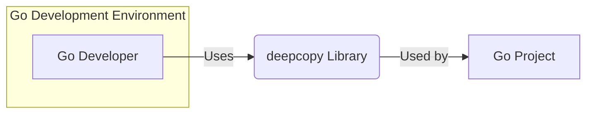
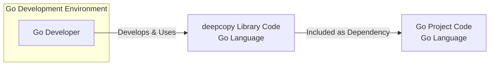

# BUSINESS POSTURE

This project is a Go library called `deepcopy` that provides functionality for performing deep copies of Go data structures. The primary business priority for a library like this is to ensure data integrity and prevent unintended side effects when copying complex objects. Developers use deep copy to create independent copies of data, ensuring modifications to the copy do not affect the original data.

The main business goal is to provide a reliable and efficient deep copy mechanism for Go developers, improving the robustness and predictability of Go applications.

The most important business risks associated with this project are:

- Risk of incorrect deep copy implementation: If the library fails to correctly deep copy objects, it can lead to data corruption or unexpected behavior in applications relying on it. This can result in functional bugs, data loss, or security vulnerabilities in downstream applications.
- Risk of performance bottlenecks: Inefficient deep copy implementation can introduce performance overhead, especially when dealing with large or complex data structures. This can negatively impact the performance of applications using the library.
- Risk of security vulnerabilities in the library itself: Although less likely for a pure utility library, vulnerabilities in the deep copy logic could potentially be exploited if the library is used to copy security-sensitive data structures.

# SECURITY POSTURE

## Existing Security Controls

This is a library project, and based on the repository, there are no explicitly stated security controls documented. We can assume standard GitHub practices are in place for repository access control.

## Accepted Risks

Currently, there are no explicitly documented accepted security risks for this project.  For a library of this nature, the implicit accepted risks are typically related to the general security posture of open-source software, such as reliance on community contributions and the inherent risks of using external dependencies.

## Recommended Security Controls

To enhance the security posture of the `deepcopy` library, the following security controls are recommended:

- security control: Implement Static Application Security Testing (SAST) during the build process to automatically identify potential code-level vulnerabilities.
- security control: Integrate dependency scanning to identify and manage known vulnerabilities in external dependencies, although this library appears to have no external dependencies.
- security control: Establish a process for security vulnerability reporting and patching. This includes defining a security policy and communication channels for reporting vulnerabilities.
- security control: Conduct regular code reviews, focusing on security aspects and best practices, in addition to functional correctness.
- security control: Implement comprehensive unit and integration tests, including test cases specifically designed to cover edge cases and potential security-relevant scenarios, such as copying objects containing pointers or sensitive data.

## Security Requirements

The following security requirements are important for the `deepcopy` library:

- Authentication: Not applicable for a library. Authentication is relevant for systems that manage access to the library's repository (e.g., GitHub).
- Authorization: Not applicable for a library. Authorization is relevant for systems that manage access to the library's repository (e.g., GitHub).
- Input Validation: While the library itself doesn't directly handle external user input, it processes Go data structures provided by the calling application. The library should be robust in handling various types of Go objects and avoid panics or unexpected behavior when encountering unusual or maliciously crafted objects. Input validation in the context of this library means ensuring the deep copy logic correctly handles all valid Go data structures without crashing or corrupting data.
- Cryptography: Cryptography is not a core requirement for the `deepcopy` library itself. However, if the library is used in applications that handle sensitive data and require deep copying of cryptographic keys or sensitive information, it's crucial to ensure the deep copy process does not inadvertently expose or mishandle this sensitive data. The library should not introduce any cryptographic vulnerabilities.

# DESIGN

## C4 CONTEXT



### Context Diagram Elements

- Name: Go Developer
  - Type: Person
  - Description: Software developers who use the `deepcopy` library in their Go projects.
  - Responsibilities:  Utilize the `deepcopy` library to implement deep copy functionality in their Go applications.
  - Security controls:  Developers are responsible for using the library correctly and securely within their applications. Security controls related to developer workstations and development practices are relevant but outside the scope of the library itself.

- Name: deepcopy Library
  - Type: Software System
  - Description: A Go library providing functions to perform deep copies of Go data structures.
  - Responsibilities:  Accurately and efficiently perform deep copies of Go objects, ensuring data integrity and preventing unintended side effects.
  - Security controls:
    - security control: Code reviews to ensure secure coding practices.
    - security control: Static Application Security Testing (SAST) to identify potential vulnerabilities.
    - security control: Unit and integration testing to verify correct functionality and robustness.

- Name: Go Project
  - Type: Software System
  - Description:  Go applications or libraries that depend on and utilize the `deepcopy` library.
  - Responsibilities:  Applications that require deep copy functionality for their internal data management and processing.
  - Security controls:  Security controls for Go Projects are application-specific and depend on the nature of the project. They include standard application security practices such as input validation, authorization, secure data handling, and vulnerability management. The `deepcopy` library is a component within these projects, and its secure usage is part of the overall application security.

## C4 CONTAINER

For this library project, the container diagram is essentially an extension of the context diagram, as the library itself is the primary "container".



### Container Diagram Elements

- Name: Go Developer
  - Type: Person
  - Description: Software developers who develop and use the `deepcopy` library.
  - Responsibilities: Develop, maintain, and use the `deepcopy` library.
  - Security controls:  Developer workstations security, secure coding practices, code review process.

- Name: deepcopy Library Code
  - Type: Library
  - Description: The Go source code of the `deepcopy` library, written in the Go programming language.
  - Responsibilities:  Implements the deep copy algorithms and provides the API for users.
  - Security controls:
    - security control: Source code repository access control (e.g., GitHub permissions).
    - security control: Code reviews for security and correctness.
    - security control: Static Application Security Testing (SAST) integrated into the build process.
    - security control: Unit and integration tests.

- Name: Go Project Code
  - Type: Application/Library
  - Description: Go applications or libraries that include the `deepcopy` library as a dependency.
  - Responsibilities:  Utilize the `deepcopy` library to perform deep copies within their own codebase.
  - Security controls: Application-specific security controls, including dependency management and vulnerability scanning of dependencies.

## DEPLOYMENT

The `deepcopy` library itself is not deployed as a standalone service. It is distributed as a Go module and is included as a dependency within other Go projects. Therefore, the deployment context is the deployment environment of the Go applications that use this library.

Let's consider a typical deployment scenario for a Go application that uses `deepcopy`: a cloud-based microservice deployed on Kubernetes.

```mermaid
flowchart LR
    subgraph "Kubernetes Cluster"
        subgraph "Nodes"
            D["Node 1"]
            E["Node 2"]
        end
        subgraph "Pods"
            F["Go Application Pod 1" <br> deepcopy Library Included] -- Node 1
            G["Go Application Pod 2" <br> deepcopy Library Included] -- Node 2
        end
        H["Load Balancer"]
    end
    I["External User"]

    I --> H --> F & G
```

### Deployment Diagram Elements

- Name: Kubernetes Cluster
  - Type: Infrastructure Environment
  - Description: A Kubernetes cluster providing the runtime environment for the Go application.
  - Responsibilities:  Orchestration, scaling, and management of the Go application instances.
  - Security controls:
    - security control: Kubernetes Role-Based Access Control (RBAC) for cluster access.
    - security control: Network policies to control traffic within the cluster.
    - security control: Container image security scanning.
    - security control: Regular security updates and patching of the Kubernetes cluster.

- Name: Nodes (Node 1, Node 2)
  - Type: Infrastructure (Compute Instance)
  - Description: Worker nodes within the Kubernetes cluster, providing compute resources.
  - Responsibilities:  Running containerized applications (Pods).
  - Security controls:
    - security control: Operating system hardening and security patching.
    - security control: Host-based intrusion detection systems (HIDS).
    - security control: Access controls to the nodes.

- Name: Pods (Go Application Pod 1, Go Application Pod 2)
  - Type: Container
  - Description: Instances of the Go application, packaged as containers, including the `deepcopy` library.
  - Responsibilities:  Running the Go application logic and providing services to users.
  - Security controls:
    - security control: Container image built from a secure base image.
    - security control: Least privilege principle for container runtime.
    - security control: Application-level security controls (input validation, authorization, etc.).

- Name: Load Balancer
  - Type: Network Component
  - Description: Distributes incoming traffic to the Go application pods.
  - Responsibilities:  Load balancing, traffic routing, and potentially TLS termination.
  - Security controls:
    - security control: TLS/SSL encryption for traffic.
    - security control: Web Application Firewall (WAF) for protection against common web attacks.
    - security control: Access control lists (ACLs) to restrict access.

- Name: External User
  - Type: Person/System
  - Description: Users or external systems that interact with the Go application.
  - Responsibilities:  Using the Go application's services.
  - Security controls: Authentication and authorization mechanisms implemented by the Go application.

## BUILD

The build process for the `deepcopy` library typically involves standard Go build tools and potentially CI/CD pipelines for automation and security checks.

```mermaid
flowchart LR
    A["Go Developer"] --> B{Code Changes <br> (Git Commit)}
    B --> C["GitHub Repository"]
    C --> D["GitHub Actions <br> (CI Pipeline)"]
    D --> E["Build Process <br> (go build, go test)"]
    E --> F{Security Checks <br> (SAST, Linters)}
    F -- Pass --> G["Build Artifacts <br> (Go Module)"]
    F -- Fail --> H["Build Failure Notification"]
    G --> I["Go Module Registry <br> (e.g., pkg.go.dev)"]
```

### Build Diagram Elements

- Name: Go Developer
  - Type: Person
  - Description:  Developer making changes to the `deepcopy` library code.
  - Responsibilities:  Writing code, running local builds and tests, committing changes.
  - Security controls: Secure development workstation, code review before committing.

- Name: Code Changes (Git Commit)
  - Type: Code
  - Description:  Changes to the source code committed to the Git repository.
  - Responsibilities:  Representing the code modifications.
  - Security controls: Code review of changes.

- Name: GitHub Repository
  - Type: Code Repository
  - Description:  The GitHub repository hosting the `deepcopy` library source code.
  - Responsibilities:  Version control, code storage, and triggering CI/CD pipelines.
  - Security controls: Access control to the repository (GitHub permissions), branch protection.

- Name: GitHub Actions (CI Pipeline)
  - Type: CI/CD System
  - Description:  GitHub Actions workflow configured to automate the build, test, and security checks.
  - Responsibilities:  Automating the build process, running tests, and performing security scans.
  - Security controls: Secure configuration of CI/CD pipelines, access control to CI/CD configurations.

- Name: Build Process (go build, go test)
  - Type: Build Tooling
  - Description:  Standard Go build tools used to compile the library and run unit tests.
  - Responsibilities:  Compiling Go code, executing tests.
  - Security controls:  Using trusted build tools and environments.

- Name: Security Checks (SAST, Linters)
  - Type: Security Tooling
  - Description:  Static Application Security Testing (SAST) tools and linters used to analyze the code for potential vulnerabilities and code quality issues.
  - Responsibilities:  Identifying potential security flaws and code quality issues.
  - Security controls:  Regularly updated security tools and rulesets.

- Name: Build Artifacts (Go Module)
  - Type: Software Artifact
  - Description:  The compiled Go module of the `deepcopy` library, ready for distribution.
  - Responsibilities:  Distributable package of the library.
  - Security controls:  Signing of artifacts (if applicable), secure storage of artifacts.

- Name: Build Failure Notification
  - Type: Notification
  - Description:  Notifications sent to developers in case of build failures or security check failures.
  - Responsibilities:  Alerting developers to issues in the build process.
  - Security controls:  Secure notification channels.

- Name: Go Module Registry (e.g., pkg.go.dev)
  - Type: Package Registry
  - Description:  Public Go module registry where the `deepcopy` library is published for consumption by other Go projects.
  - Responsibilities:  Distribution of the library to Go developers.
  - Security controls:  Registry security controls, potential signing and verification of modules.

# RISK ASSESSMENT

## Critical Business Processes

The critical business processes that rely on the `deepcopy` library are those within Go applications that use it for data management and manipulation. These processes depend on the library's ability to create accurate and independent copies of data structures. Incorrect deep copies can lead to data corruption, logical errors, and potentially security vulnerabilities in these applications.

Examples of critical business processes could include:

- Data replication and backup processes.
- Session management and state handling in web applications.
- Data transformation and processing pipelines.
- Security-sensitive operations that require isolation of data.

## Data Sensitivity

The sensitivity of the data being protected depends entirely on the applications that use the `deepcopy` library. The library itself is data-agnostic. If an application uses `deepcopy` to copy sensitive data, such as user credentials, personal information, or financial data, then that data becomes the data being protected in the context of using this library.

The sensitivity level can range from low (publicly available data) to high (highly confidential or regulated data), depending on the application's purpose and the data it handles. It is the responsibility of the applications using `deepcopy` to ensure they handle sensitive data appropriately, including when using deep copy operations.

# QUESTIONS & ASSUMPTIONS

## Questions

- What types of applications are intended to use this `deepcopy` library most frequently? Understanding the typical use cases will help prioritize security considerations.
- Are there any specific performance requirements for deep copy operations in the intended use cases? Performance considerations can sometimes influence design and security choices.
- Are there any known security vulnerabilities or concerns related to deep copy operations in Go in general that should be considered for this library?
- What is the expected level of security assurance required for applications using this library? Is it for general-purpose use, or are there scenarios involving high-security environments?

## Assumptions

- BUSINESS POSTURE: It is assumed that the primary business goal is to provide a reliable and performant deep copy library for general Go development use. Data integrity and correctness are paramount.
- SECURITY POSTURE: It is assumed that while explicit security measures are not currently in place, there is a desire to improve the security posture of the library through recommended security controls. The library is intended for use in a variety of applications, some of which may handle sensitive data.
- DESIGN: It is assumed that the current design is relatively simple, focused on providing core deep copy functionality. The library is intended to be used as a dependency in other Go projects and is not deployed as a standalone service. The build process is assumed to be based on standard Go tooling and can be enhanced with CI/CD and security checks.