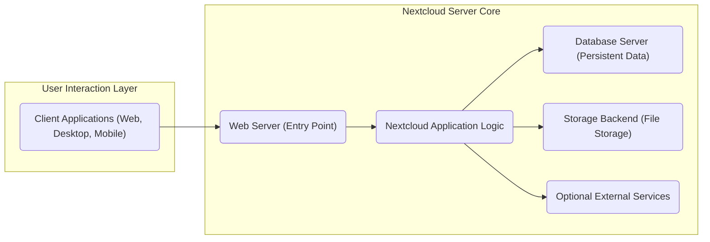
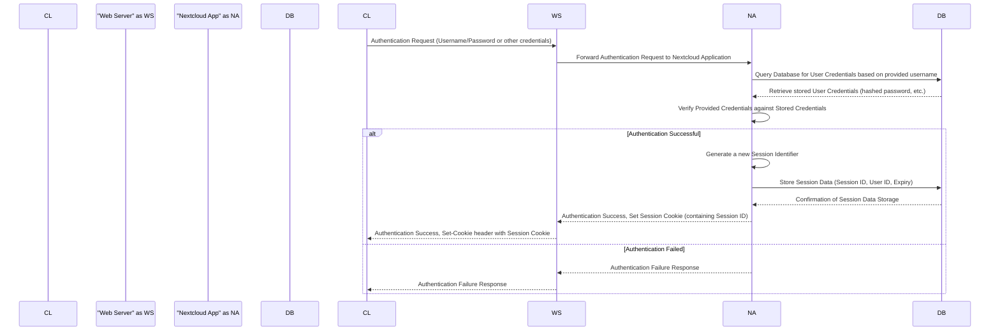
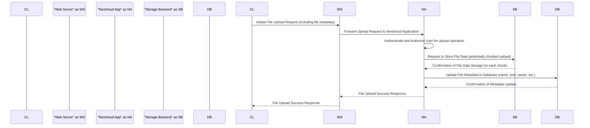
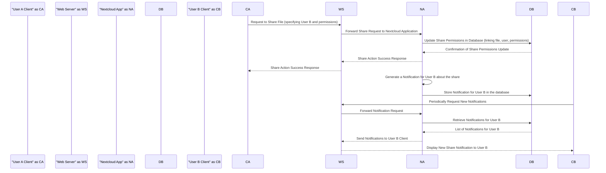

# Project Design Document: Nextcloud Server

**Version:** 1.1
**Date:** October 26, 2023
**Author:** AI Software Architecture Expert

## 1. Introduction

This document provides an enhanced and more detailed architectural design of the Nextcloud Server project. Building upon the previous version, it offers a deeper understanding of the system's components, their interactions, and the flow of data. This refined document is intended to serve as a robust foundation for subsequent threat modeling activities, facilitating a more granular and comprehensive security assessment of the Nextcloud platform. The design continues to focus on the core server components and their interactions, with added clarity and detail.

## 2. Goals and Objectives

The primary goal of the Nextcloud Server project remains to provide a self-hosted platform for file storage, collaboration, and communication, empowering users with control over their data. Key objectives include:

*   Providing secure and reliable file storage and sharing capabilities with granular access controls.
*   Enabling seamless collaboration on documents and projects with features like versioning and commenting.
*   Offering a versatile platform for a wide array of productivity and communication applications through its app ecosystem.
*   Empowering users to maintain complete ownership and control over their personal and organizational data.
*   Providing a highly extensible architecture through a well-defined application ecosystem and APIs.
*   Supporting diverse deployment models, ranging from personal on-premises setups to large-scale cloud deployments.

## 3. High-Level Architecture

The Nextcloud Server employs a modular architecture, centered around a robust core framework that supports a wide range of extensible applications. The key components are:

*   "Client Applications (Web, Desktop, Mobile)"
*   "Web Server (Entry Point)"
*   "Nextcloud Application Logic"
*   "Database Server (Persistent Data)"
*   "Storage Backend (File Storage)"
*   "Optional External Services"

## 4. Detailed Component Breakdown

This section provides a more in-depth description of each component within the Nextcloud Server architecture, highlighting key functionalities and technologies.

### 4.1. Web Server (Entry Point)

*   **Description:**  The initial point of contact for all client requests, typically implemented using Apache HTTP Server or Nginx.
*   **Responsibilities:**
    *   Receiving and appropriately routing incoming HTTP/HTTPS requests.
    *   Serving static content, including HTML, CSS, JavaScript files, and images.
    *   Managing TLS/SSL termination to ensure secure communication through encryption.
    *   Forwarding dynamic requests to the Nextcloud Application Logic for processing.
    *   Implementing fundamental security measures such as rate limiting and enforcing security-related HTTP headers (e.g., HSTS, CSP, X-Frame-Options).
*   **Key Technologies:** Apache HTTP Server, Nginx, TLS/SSL libraries (e.g., OpenSSL).

### 4.2. Nextcloud Application Logic

*   **Description:** The central component housing the core application logic of Nextcloud, primarily developed in PHP.
*   **Responsibilities:**
    *   Managing user authentication (verifying user identities) and authorization (controlling access to resources).
    *   Orchestrating file storage operations, including uploading, downloading, sharing, and versioning.
    *   Executing the business logic for various integrated Nextcloud applications (e.g., Calendar, Contacts, Talk, Office).
    *   Interacting with the Database Server to persist and retrieve application data and metadata.
    *   Interfacing with the Storage Backend to perform physical file system operations.
    *   Providing a comprehensive set of APIs for client applications and facilitating external integrations.
    *   Managing background jobs and scheduled tasks essential for system maintenance and functionality.
*   **Key Technologies:** PHP, Object-Relational Mapping (ORM) framework (Doctrine), various PHP libraries and frameworks (e.g., Symfony components).
*   **Sub-components:**
    *   **Core API:** Provides fundamental functionalities and interfaces for internal components and external applications.
    *   **App Framework:** Enables the development, installation, and management of Nextcloud applications, fostering extensibility.
    *   **User Management Subsystem:** Handles user account creation, modification, group management, and permission assignments.
    *   **File Management Subsystem:** Manages the file system abstraction, including storage, retrieval, and manipulation of files and directories.
    *   **Share Management Subsystem:** Controls the creation, modification, and enforcement of file and folder sharing permissions with users and groups, including public links.
    *   **Activity Stream Subsystem:** Tracks user actions and system events, providing an audit trail and user activity overview.
    *   **Notifications Subsystem:** Manages and delivers real-time and digest notifications to users regarding relevant events.

### 4.3. Database Server (Persistent Data)

*   **Description:**  Responsible for storing persistent data critical for the Nextcloud application's operation, including user credentials, file metadata, sharing configurations, application settings, and more.
*   **Responsibilities:**
    *   Storing and efficiently retrieving structured data based on application requests.
    *   Ensuring data integrity and consistency through transactional management and constraints.
    *   Providing transactional support to maintain data accuracy during complex operations.
    *   Managing database schemas, including creation, updates, and migrations.
    *   Implementing access control mechanisms to secure database access.
*   **Key Technologies:** MySQL/MariaDB, PostgreSQL, SQLite, database management tools.

### 4.4. Storage Backend (File Storage)

*   **Description:**  The system dedicated to the physical storage of user files and data.
*   **Responsibilities:**
    *   Storing and retrieving file data efficiently and reliably.
    *   Managing low-level file system operations, such as creating, reading, updating, and deleting files.
    *   Potentially implementing features like encryption at rest (server-side encryption) to protect data confidentiality.
*   **Types:**
    *   **Local Storage:** Files stored directly on the server's local file system.
    *   **Object Storage Integration:** Utilizing object storage services like Amazon S3, OpenStack Swift, providing scalability and durability.
    *   **External Storage Mounts:** Integrating with external storage systems via protocols like SMB/CIFS, WebDAV, FTP, allowing access to existing data sources.
    *   **Encryption Options:** Supporting various encryption methods, including server-side and client-side encryption.

### 4.5. Optional External Services

*   **Description:**  A range of optional external services that Nextcloud can integrate with to extend its functionality and capabilities.
*   **Examples:**
    *   **Collabora Online/OnlyOffice:** Providing collaborative online document editing capabilities.
    *   **LDAP/Active Directory Server:**  Enabling integration with external user directories for centralized authentication and authorization.
    *   **SMTP Server:** Facilitating the sending of email notifications and system communications.
    *   **Redis/Memcached:** Implementing caching mechanisms to improve performance by reducing database load.
    *   **External OAuth 2.0 Providers:** Supporting federated login, allowing users to authenticate using their existing accounts with other providers.
    *   **Talk Signaling Server (e.g., Spreed):** For enabling real-time communication features within Nextcloud Talk.

### 4.6. Client Applications (Web, Desktop, Mobile)

*   **Description:** Applications that users interact with to access and utilize Nextcloud functionalities across various platforms.
*   **Types:**
    *   **Web Client:** Accessed through a web browser, offering a comprehensive user interface for all Nextcloud features.
    *   **Desktop Client (Sync Client):** Native applications for Windows, macOS, and Linux, primarily focused on seamless file synchronization between local devices and the Nextcloud server.
    *   **Mobile Clients:** Native applications for Android and iOS, providing access to files, collaboration features, and other functionalities on mobile devices.
*   **Communication:** Communicate with the Web Server via secure HTTP/HTTPS, utilizing RESTful APIs for data exchange and command execution.

## 5. Data Flow Diagrams

This section provides enhanced illustrations of key data flows within the Nextcloud Server system, offering more detail on the steps involved.

### 5.1. User Authentication Flow

### 5.2. File Upload Process

### 5.3. File Sharing Workflow

## 6. Security Considerations (More Detailed)

This section expands upon the initial security considerations, providing more specific examples and highlighting key areas for threat modeling.

*   **Authentication and Authorization:**
    *   Strong password policies and enforcement.
    *   Multi-factor authentication (MFA) support.
    *   Secure handling of authentication tokens and session cookies (e.g., HttpOnly, Secure flags).
    *   Role-based access control (RBAC) for managing permissions.
    *   Protection against brute-force attacks and account lockout mechanisms.
*   **Session Management:**
    *   Secure generation and storage of session identifiers.
    *   Session timeout mechanisms and idle session termination.
    *   Protection against session fixation and session hijacking attacks.
*   **Data Encryption:**
    *   Encryption of data in transit using TLS/SSL with strong cipher suites.
    *   Encryption of data at rest, with options for server-side and client-side encryption.
    *   Secure key management practices.
*   **Input Validation and Output Encoding:**
    *   Thorough validation of all user inputs to prevent injection attacks (e.g., SQL injection, cross-site scripting).
    *   Proper encoding of output data to prevent cross-site scripting (XSS) vulnerabilities.
*   **Access Control:**
    *   Granular control over file and folder permissions.
    *   Secure sharing mechanisms with appropriate link expiration and password protection options.
*   **Secure Communication:**
    *   Enforcement of HTTPS for all communication between clients and the server.
    *   Configuration of secure HTTP headers (e.g., HSTS, CSP, X-Frame-Options).
*   **Third-Party App Security:**
    *   Security audits and code reviews for community applications.
    *   Mechanisms for managing and controlling permissions granted to third-party apps.
*   **Dependency Management:**
    *   Regularly updating dependencies to patch known vulnerabilities.
    *   Using dependency scanning tools to identify potential security issues.
*   **Regular Security Updates and Patching:**
    *   Importance of promptly applying security patches released by the Nextcloud team.
*   **Rate Limiting and Denial-of-Service (DoS) Protection:**
    *   Implementing rate limiting to prevent brute-force attacks and excessive resource consumption.
    *   Protection against various denial-of-service attacks.
*   **Logging and Auditing:**
    *   Comprehensive logging of security-related events for monitoring and incident response.

## 7. Deployment Model

Nextcloud Server's flexibility allows for deployment in various environments, each with its own security implications:

*   **On-Premises:**  Offers maximum control over data and infrastructure security but requires the organization to manage all aspects of security.
*   **Cloud-Based (IaaS):**  Deployed on cloud infrastructure, sharing security responsibilities with the cloud provider (e.g., physical security, network infrastructure). Requires careful configuration of virtual machines and network settings.
*   **Cloud-Based (PaaS/Managed Hosting):** Utilizing managed Nextcloud hosting providers simplifies deployment and management, with the provider handling many security aspects. It's crucial to understand the provider's security practices.

The chosen deployment model significantly influences the division of security responsibilities and the specific security measures that need to be implemented.

## 8. Assumptions and Dependencies

*   The underlying operating system and hardware infrastructure are assumed to be securely configured and maintained.
*   The Web Server is assumed to be configured with best security practices, including appropriate security headers and modules.
*   The Database Server is assumed to be configured with strong passwords, proper access controls, and regular security updates.
*   The Storage Backend is assumed to provide reliable and secure storage, potentially with encryption at rest.
*   Optional external services are assumed to be securely configured and maintained according to their respective best practices.

## 9. Out of Scope

This document remains focused on the core Nextcloud Server architecture and its primary components. The following areas are explicitly considered out of scope:

*   Detailed design specifications of individual Nextcloud applications (e.g., specific features of Calendar, Contacts, Talk).
*   In-depth implementation details of the client applications (web, desktop, mobile).
*   Detailed design of the underlying network infrastructure on which Nextcloud is deployed.
*   Specific deployment configurations and procedures for various environments.
*   Low-level code implementation details and specific algorithms used within the application.
*   Detailed security hardening configurations and specific firewall rules (these will be a key focus of the subsequent threat modeling process).

This improved document provides a more comprehensive and detailed understanding of the Nextcloud Server architecture, enhancing its value as a foundation for thorough and effective threat modeling. The next phase will involve a systematic analysis of potential threats and vulnerabilities within each component and their interactions, leveraging the insights provided here.