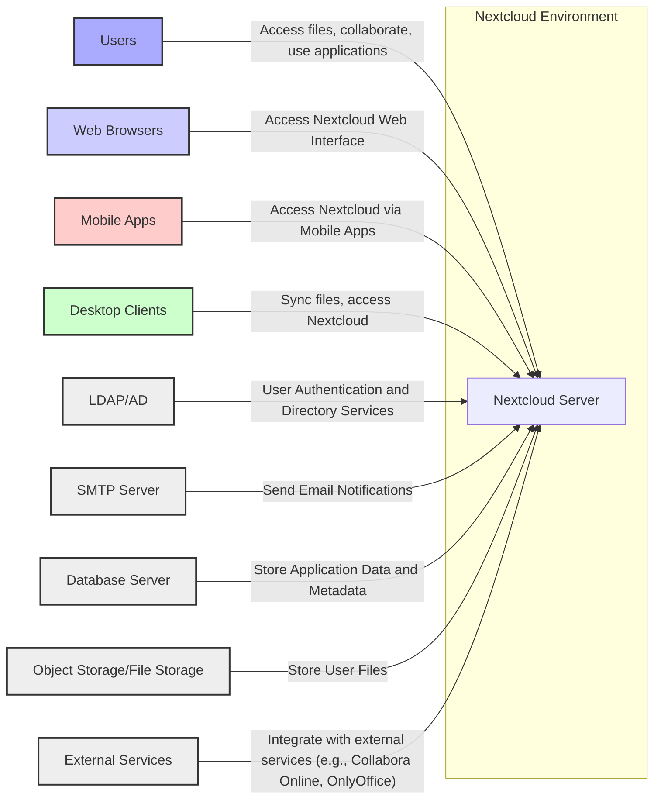

# BUSINESS POSTURE

- Business Priorities and Goals:
  - Provide a secure and reliable platform for file storage, sharing, and collaboration.
  - Enable users to maintain control over their data and ensure data privacy.
  - Offer a comprehensive suite of productivity applications beyond file storage, such as calendar, contacts, and office suite integration.
  - Support a wide range of deployment options, from personal use to large enterprise deployments.
  - Foster an open and extensible platform through its open-source nature and app ecosystem.
  - Build a strong community and ecosystem around the platform.

- Business Risks:
  - Data breaches and data loss due to security vulnerabilities in the platform or its extensions.
  - Reputational damage and loss of user trust due to security incidents.
  - Compliance violations with data privacy regulations (e.g., GDPR, CCPA) if data is not handled securely.
  - Service disruptions and downtime impacting user productivity and data accessibility.
  - Difficulty in attracting and retaining users if the platform is perceived as insecure or unreliable.
  - Competition from other file storage and collaboration platforms, both open-source and proprietary.
  - Risks associated with maintaining a large and complex open-source project, including community management and contribution quality.

# SECURITY POSTURE

- Existing Security Controls:
  - security control: Regular security audits and penetration testing (location: Nextcloud security advisories and blog posts).
  - security control: Secure coding practices and code reviews (location: Development guidelines and community contributions).
  - security control: Input validation and output encoding to prevent common web vulnerabilities (location: Codebase and security documentation).
  - security control: Protection against Cross-Site Scripting (XSS) attacks (location: Codebase and security documentation).
  - security control: Protection against Cross-Site Request Forgery (CSRF) attacks (location: Codebase and security documentation).
  - security control: Strong password hashing and secure session management (location: Codebase and security documentation).
  - security control: Encryption of data at rest and in transit (location: Server-side encryption and HTTPS configuration documentation).
  - security control: Two-Factor Authentication (2FA) support (location: User documentation and authentication settings).
  - security control: Brute-force protection and rate limiting (location: Security hardening documentation and server configuration).
  - security control: App store review process with security checks for community apps (location: App store guidelines and processes).
  - security control: Security vulnerability reporting and disclosure program (location: Nextcloud security policy and website).
  - security control: Regular security updates and patches (location: Release notes and update channels).

- Accepted Risks:
  - accepted risk: Potential vulnerabilities in third-party apps available in the app store, despite review processes.
  - accepted risk: Security misconfigurations by users during deployment and setup.
  - accepted risk: Social engineering attacks targeting users to gain access to accounts or data.
  - accepted risk: Zero-day vulnerabilities that may exist before patches are available.
  - accepted risk: Complexity of the platform may lead to overlooked security issues.

- Recommended Security Controls:
  - security control: Implement automated security scanning (SAST/DAST) in the development pipeline.
  - security control: Enhance security monitoring and logging capabilities for incident detection and response.
  - security control: Improve security awareness training for users and administrators.
  - security control: Formalize and document the Secure Software Development Lifecycle (SSDLC) process.
  - security control: Implement dependency scanning and management to address vulnerabilities in third-party libraries.
  - security control: Introduce security champions within development teams to promote security best practices.
  - security control: Conduct regular threat modeling exercises for new features and components.

- Security Requirements:
  - Authentication:
    - Requirement: Secure authentication mechanisms to verify user identity.
    - Requirement: Support for strong passwords and password policies.
    - Requirement: Multi-factor authentication (MFA) options.
    - Requirement: Protection against brute-force attacks on authentication endpoints.
    - Requirement: Secure session management to prevent session hijacking.

  - Authorization:
    - Requirement: Role-based access control (RBAC) to manage user permissions.
    - Requirement: Fine-grained access control to files and folders based on user roles and groups.
    - Requirement: Secure sharing mechanisms with configurable permissions and expiration dates.
    - Requirement: Audit logging of authorization decisions and access attempts.

  - Input Validation:
    - Requirement: Comprehensive input validation for all user-supplied data to prevent injection attacks.
    - Requirement: Validation on both client-side and server-side to ensure data integrity.
    - Requirement: Use of parameterized queries or ORM frameworks to prevent SQL injection.
    - Requirement: Encoding of output data to prevent cross-site scripting (XSS) vulnerabilities.

  - Cryptography:
    - Requirement: Encryption of data at rest using strong encryption algorithms.
    - Requirement: Encryption of data in transit using TLS/HTTPS.
    - Requirement: Secure key management practices for encryption keys.
    - Requirement: Use of cryptographic libraries and APIs securely to avoid common pitfalls.
    - Requirement: Hashing of sensitive data like passwords using strong hashing algorithms.

# DESIGN

## C4 CONTEXT



- Context Diagram Elements:
  - - Name: Users
    - Type: Person
    - Description: Individuals who use Nextcloud to store, share, and collaborate on files, and utilize various applications offered by the platform.
    - Responsibilities: Access and manage their files, collaborate with other users, utilize Nextcloud applications for productivity.
    - Security controls: Strong passwords, multi-factor authentication, account security settings.

  - - Name: Web Browsers
    - Type: Browser
    - Description: Web browsers used by users to access the Nextcloud web interface.
    - Responsibilities: Render the Nextcloud web application, interact with the Nextcloud server via HTTP/HTTPS.
    - Security controls: Browser security features, HTTPS connection to Nextcloud server.

  - - Name: Mobile Apps
    - Type: Mobile Application
    - Description: Nextcloud mobile applications for iOS and Android platforms, providing access to files and other features on mobile devices.
    - Responsibilities: Provide mobile access to Nextcloud features, sync files, capture media, and interact with the Nextcloud server via APIs.
    - Security controls: App security features, secure storage of credentials, HTTPS communication.

  - - Name: Desktop Clients
    - Type: Desktop Application
    - Description: Nextcloud desktop clients for Windows, macOS, and Linux, enabling file synchronization between desktops and the Nextcloud server.
    - Responsibilities: Synchronize files between local file systems and the Nextcloud server, provide desktop notifications, and interact with the Nextcloud server via APIs.
    - Security controls: Secure storage of credentials, encrypted file synchronization, HTTPS communication.

  - - Name: LDAP/AD
    - Type: Database
    - Description: Lightweight Directory Access Protocol (LDAP) or Active Directory (AD) server used for user authentication and directory services in enterprise environments.
    - Responsibilities: Authenticate users, provide user and group information to Nextcloud for authorization.
    - Security controls: Secure LDAP/AD configuration, access controls to directory information, secure communication protocols.

  - - Name: SMTP Server
    - Type: Email Server
    - Description: Simple Mail Transfer Protocol (SMTP) server used by Nextcloud to send email notifications to users.
    - Responsibilities: Relay email notifications for file sharing, activity updates, and other events.
    - Security controls: Secure SMTP configuration, authentication for sending emails, TLS encryption for email transmission.

  - - Name: Database Server
    - Type: Database
    - Description: Database server (e.g., MySQL, PostgreSQL, MariaDB, SQLite) used by Nextcloud to store application data, metadata, user profiles, and configuration information.
    - Responsibilities: Persist application data, provide data access to the Nextcloud server.
    - Security controls: Database access controls, encryption at rest, regular backups, database hardening.

  - - Name: Object Storage/File Storage
    - Type: Database
    - Description: Storage system used to store user files. This can be local file system, network storage (NAS), or object storage services (e.g., AWS S3, OpenStack Swift).
    - Responsibilities: Store user files securely and reliably, provide file access to the Nextcloud server.
    - Security controls: Storage access controls, encryption at rest, data redundancy and backups, physical security of storage infrastructure.

  - - Name: External Services
    - Type: External System
    - Description: External services and applications that integrate with Nextcloud to provide additional functionalities, such as online office suites (Collabora Online, OnlyOffice), video conferencing, and other integrations.
    - Responsibilities: Extend Nextcloud functionality, provide specialized services, interact with Nextcloud server via APIs and protocols.
    - Security controls: Secure API integrations, authentication and authorization mechanisms for external service access, data exchange security.

  - - Name: Nextcloud Server
    - Type: Software System
    - Description: The core Nextcloud server application, providing file storage, sharing, collaboration, and application platform functionalities.
    - Responsibilities: Manage user accounts, authenticate users, authorize access, handle file storage and sharing, run applications, provide APIs for clients and integrations, manage security controls.
    - Security controls: Authentication, authorization, input validation, cryptography, session management, access controls, security updates, logging and monitoring.

## C4 CONTAINER

```mermaid
flowchart LR
    subgraph "Nextcloud Server"
        A["Web Server"]:::container -- "Handles HTTP requests, reverse proxy, TLS termination"
        B["PHP Application"]:::container -- "Core Nextcloud application logic, API endpoints, business logic"
        C["Database"]:::container -- "Stores application data and metadata"
        D["File Storage"]:::container -- "Stores user files"
        E["Background Jobs Processor"]:::container -- "Handles asynchronous tasks, cron jobs, background processing"
        F["App Store"]:::container -- "Manages and distributes Nextcloud Apps"
    end
    G["Web Browser"]:::container -- "User interface for Nextcloud" --> A
    H["Mobile App"]:::container -- "Mobile client for Nextcloud" --> B
    I["Desktop Client"]:::container -- "Desktop sync client" --> B
    J["LDAP/AD Server"]:::container -- "User directory and authentication" --> B
    K["SMTP Server"]:::container -- "Email notifications" --> B
    L["External Services"]:::container -- "Third-party integrations" --> B

    A -- "PHP-FPM/FastCGI" --> B
    B -- "SQL" --> C
    B -- "File System/Object Storage APIs" --> D
    B -- "Message Queue (e.g., Redis, RabbitMQ)" --> E
    B -- "HTTP APIs" --> F

    classDef container fill:#cce,stroke:#333,stroke-width:2px
```

- Container Diagram Elements:
  - - Name: Web Server
    - Type: Container
    - Description: Web server (e.g., Apache, Nginx) responsible for handling HTTP/HTTPS requests, serving static content, acting as a reverse proxy, and managing TLS termination.
    - Responsibilities: Handle incoming web requests, route requests to the PHP application, serve static files, manage TLS encryption, implement web server security configurations.
    - Security controls: TLS configuration, web server hardening, access controls, rate limiting, web application firewall (WAF).

  - - Name: PHP Application
    - Type: Container
    - Description: The core Nextcloud application written in PHP, containing the application logic, API endpoints, business logic, and handling user requests.
    - Responsibilities: Implement Nextcloud features, manage user authentication and authorization, handle file operations, interact with the database and file storage, process user requests, generate web pages and API responses.
    - Security controls: Input validation, output encoding, secure session management, authorization checks, secure coding practices, vulnerability scanning.

  - - Name: Database
    - Type: Container
    - Description: Database system (e.g., MySQL, PostgreSQL, MariaDB, SQLite) used to store application data, metadata, user profiles, and configuration.
    - Responsibilities: Persist application data, provide data access to the PHP application, ensure data integrity and availability.
    - Security controls: Database access controls, encryption at rest, regular backups, database hardening, monitoring and auditing.

  - - Name: File Storage
    - Type: Container
    - Description: Storage system for user files, which can be a local file system, network storage, or object storage service.
    - Responsibilities: Store user files securely and reliably, provide file access to the PHP application.
    - Security controls: Storage access controls, encryption at rest, data redundancy and backups, physical security of storage infrastructure.

  - - Name: Background Jobs Processor
    - Type: Container
    - Description: Component responsible for processing asynchronous tasks, scheduled jobs (cron jobs), and background operations, such as file scanning, notifications, and maintenance tasks.
    - Responsibilities: Execute background tasks, manage job queues, improve application responsiveness by offloading tasks from the main request processing.
    - Security controls: Secure job scheduling, access controls to job processing, monitoring of background job execution.

  - - Name: App Store
    - Type: Container
    - Description: Component for managing and distributing Nextcloud applications (apps), allowing users to extend Nextcloud functionality.
    - Responsibilities: Provide a platform for discovering and installing Nextcloud apps, manage app updates, enforce app security policies.
    - Security controls: App review process, security scanning of apps, access controls to app installation, sandboxing of apps (if applicable).

  - - Name: Web Browser
    - Type: Container
    - Description: User's web browser accessing the Nextcloud web interface.
    - Responsibilities: Render the Nextcloud web application, interact with the Web Server.
    - Security controls: Browser security features, HTTPS connection.

  - - Name: Mobile App
    - Type: Container
    - Description: Nextcloud mobile application.
    - Responsibilities: Mobile client functionality, interacts with PHP Application via APIs.
    - Security controls: App security features, secure API communication.

  - - Name: Desktop Client
    - Type: Container
    - Description: Nextcloud desktop synchronization client.
    - Responsibilities: Desktop sync functionality, interacts with PHP Application via APIs.
    - Security controls: Client security features, secure API communication.

  - - Name: LDAP/AD Server
    - Type: Container
    - Description: LDAP or Active Directory server.
    - Responsibilities: User directory and authentication services for PHP Application.
    - Security controls: Secure LDAP/AD configuration.

  - - Name: SMTP Server
    - Type: Container
    - Description: SMTP server for email notifications.
    - Responsibilities: Email delivery for PHP Application.
    - Security controls: Secure SMTP configuration.

  - - Name: External Services
    - Type: Container
    - Description: External services integrated with Nextcloud.
    - Responsibilities: Extend Nextcloud functionality, interacts with PHP Application via APIs.
    - Security controls: Secure API integrations.

## DEPLOYMENT

- Deployment Options:
  - On-premises deployment on physical servers or virtual machines.
  - Deployment in private cloud environments.
  - Deployment in public cloud environments (e.g., AWS, Azure, GCP).
  - Containerized deployment using Docker and Kubernetes.
  - Deployment using pre-packaged appliances or cloud images.

- Detailed Deployment (Example: Docker Containerized Deployment on Kubernetes):

```mermaid
flowchart LR
    subgraph "Kubernetes Cluster"
        subgraph "Nodes"
            subgraph "Node 1"
                A["Pod: nextcloud-web"]:::pod -- "Web Server, PHP Application"
            end
            subgraph "Node 2"
                B["Pod: nextcloud-db"]:::pod -- "Database Server"
                C["Pod: nextcloud-redis"]:::pod -- "Redis (for caching/background jobs)"
            end
            subgraph "Node 3"
                D["Pod: nextcloud-background"]:::pod -- "Background Jobs Processor"
                E["Persistent Volume Claim"]:::pvc -- "Persistent Storage for Files and Database"
            end
        end
        F["Load Balancer"]:::lb -- "External Access Point"
        F -- "HTTP/HTTPS" --> A
        A -- "TCP" --> B
        A -- "TCP" --> C
        A -- "TCP" --> D
        A -- "Persistent Volume" --> E
        B -- "Persistent Volume" --> E
        D -- "Persistent Volume" --> E
    end
    G["User"]:::user -- "Access Nextcloud" --> F

    classDef pod fill:#cef,stroke:#333,stroke-width:2px
    classDef pvc fill:#fec,stroke:#333,stroke-width:2px
    classDef lb fill:#cfa,stroke:#333,stroke-width:2px
    classDef user fill:#aaf,stroke:#333,stroke-width:2px
```

- Deployment Diagram Elements:
  - - Name: Kubernetes Cluster
    - Type: Infrastructure
    - Description: Kubernetes cluster providing container orchestration and management.
    - Responsibilities: Manage container deployment, scaling, and networking, provide high availability and resilience.
    - Security controls: Kubernetes RBAC, network policies, pod security policies, security audits, container image scanning.

  - - Name: Nodes (Node 1, Node 2, Node 3)
    - Type: Infrastructure
    - Description: Worker nodes in the Kubernetes cluster, providing compute resources for running containers.
    - Responsibilities: Execute containers, provide compute and storage resources.
    - Security controls: Operating system hardening, security updates, access controls, monitoring.

  - - Name: Pod: nextcloud-web
    - Type: Container
    - Description: Kubernetes pod containing containers for the Web Server and PHP Application.
    - Responsibilities: Serve web requests, run the Nextcloud application logic.
    - Security controls: Container security context, resource limits, network policies.

  - - Name: Pod: nextcloud-db
    - Type: Container
    - Description: Kubernetes pod containing the Database Server container.
    - Responsibilities: Store application data.
    - Security controls: Container security context, resource limits, network policies, database access controls.

  - - Name: Pod: nextcloud-redis
    - Type: Container
    - Description: Kubernetes pod containing Redis for caching and background job queuing.
    - Responsibilities: Caching, message queuing for background jobs.
    - Security controls: Container security context, resource limits, network policies, Redis access controls.

  - - Name: Pod: nextcloud-background
    - Type: Container
    - Description: Kubernetes pod containing the Background Jobs Processor container.
    - Responsibilities: Process background tasks.
    - Security controls: Container security context, resource limits, network policies.

  - - Name: Persistent Volume Claim
    - Type: Storage
    - Description: Kubernetes Persistent Volume Claim for persistent storage of files and database data.
    - Responsibilities: Provide persistent storage for application data and files across pod restarts and deployments.
    - Security controls: Storage access controls, encryption at rest (depending on underlying storage provider), backups.

  - - Name: Load Balancer
    - Type: Network Device
    - Description: Load balancer providing external access to the Nextcloud service.
    - Responsibilities: Distribute traffic to the web pods, provide a single entry point for users.
    - Security controls: TLS termination, DDoS protection, access controls, security monitoring.

  - - Name: User
    - Type: Person
    - Description: End user accessing Nextcloud.
    - Responsibilities: Use Nextcloud services.
    - Security controls: User authentication, strong passwords, MFA.

## BUILD

```mermaid
flowchart LR
    A["Developer"] -- "Code Changes, Commit, Push" --> B["Version Control System (GitHub)"]
    B -- "Webhook Trigger" --> C["CI/CD System (GitHub Actions)"]
    subgraph "CI/CD System (GitHub Actions)"
        D["Checkout Code"]
        E["Dependency Management"]
        F["Static Analysis Security Testing (SAST)"]
        G["Unit Tests"]
        H["Build Artifacts (Docker Images, Packages)"]
        I["Container Scanning"]
        J["Publish Artifacts (Container Registry, Package Repository)"]
    end
    C --> D
    D --> E
    E --> F
    F --> G
    G --> H
    H --> I
    I --> J
    J -- "Deployment Trigger" --> K["Deployment Environment"]

    style A fill:#aaf,stroke:#333,stroke-width:2px
    style K fill:#eee,stroke:#333,stroke-width:2px
```



- Build Process Description:
  - Developer writes code, commits changes, and pushes them to the Version Control System (e.g., GitHub).
  - A webhook in the Version Control System triggers the CI/CD system (e.g., GitHub Actions) upon code changes.
  - The CI/CD pipeline starts automatically:
    - Checkout Code: The latest code changes are checked out from the repository.
    - Dependency Management: Project dependencies are resolved and managed securely.
    - Static Analysis Security Testing (SAST): SAST tools scan the codebase for potential security vulnerabilities.
    - Unit Tests: Automated unit tests are executed to ensure code quality and functionality.
    - Build Artifacts: Build artifacts are created, such as Docker images, packages, or compiled code.
    - Container Scanning: Container images are scanned for vulnerabilities using container scanning tools.
    - Publish Artifacts: Build artifacts are published to artifact repositories, such as container registries (e.g., Docker Hub, GitHub Container Registry) or package repositories.
  - Upon successful build and publish, a deployment trigger can be initiated to deploy the new artifacts to the Deployment Environment.

- Build Process Security Controls:
  - security control: Secure Version Control System (GitHub) with access controls and audit logging.
  - security control: Automated CI/CD pipeline to ensure consistent and repeatable builds.
  - security control: Static Analysis Security Testing (SAST) to identify code vulnerabilities early in the development cycle.
  - security control: Dependency scanning to detect vulnerabilities in third-party libraries and dependencies.
  - security control: Container scanning to identify vulnerabilities in container images before deployment.
  - security control: Secure artifact repositories with access controls and vulnerability scanning.
  - security control: Code signing and artifact verification to ensure integrity and authenticity of build artifacts.
  - security control: Principle of least privilege for CI/CD system access and credentials.
  - security control: Audit logging of CI/CD pipeline activities.

# RISK ASSESSMENT

- Critical Business Processes:
  - Secure Storage and Retrieval of User Data: Ensuring data integrity, confidentiality, and availability.
  - User Authentication and Authorization: Verifying user identity and controlling access to resources.
  - File Sharing and Collaboration: Enabling secure and controlled sharing of files between users.
  - Application Functionality: Ensuring the availability and reliability of core Nextcloud applications and features.
  - Data Privacy and Compliance: Protecting user data in accordance with privacy regulations.

- Data Sensitivity:
  - User Files: Highly sensitive. Can contain personal information, confidential documents, intellectual property, and other sensitive data. Confidentiality, integrity, and availability are critical.
  - User Credentials (Passwords, API Keys): Highly sensitive. Confidentiality and integrity are paramount.
  - User Personal Information (Profiles, Contact Details): Sensitive. Confidentiality and integrity are important for privacy and compliance.
  - Application Configuration and Metadata: Moderately sensitive. Integrity and availability are important for system operation.
  - Audit Logs: Moderately sensitive. Integrity and availability are important for security monitoring and incident response.

# QUESTIONS & ASSUMPTIONS

- Questions:
  - What is the target deployment environment (on-premises, cloud, hybrid)?
  - What are the specific compliance requirements (GDPR, HIPAA, etc.)?
  - What is the organization's risk appetite and security maturity level?
  - Are there specific performance or scalability requirements?
  - What is the process for managing and updating third-party apps in the Nextcloud ecosystem?
  - What are the incident response procedures in case of a security breach?
  - What is the budget and timeline for implementing security enhancements?

- Assumptions:
  - BUSINESS POSTURE:
    - Security and data privacy are high priorities for Nextcloud users and the project.
    - The project aims to provide a secure and reliable platform for a wide range of users and organizations.
    - Open-source nature and community collaboration are important aspects of the project.

  - SECURITY POSTURE:
    - Basic security controls are already in place, but there is room for improvement in areas like automated security testing, security monitoring, and formalizing SSDLC.
    - Third-party apps pose a potential security risk.
    - User security awareness and secure configuration are important factors in overall security.

  - DESIGN:
    - A containerized deployment on Kubernetes is a relevant and modern deployment option.
    - The build process includes standard security checks like SAST and container scanning.
    - The design is modular and scalable, allowing for future growth and feature additions.