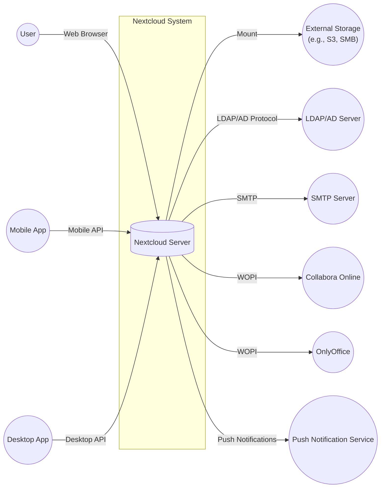
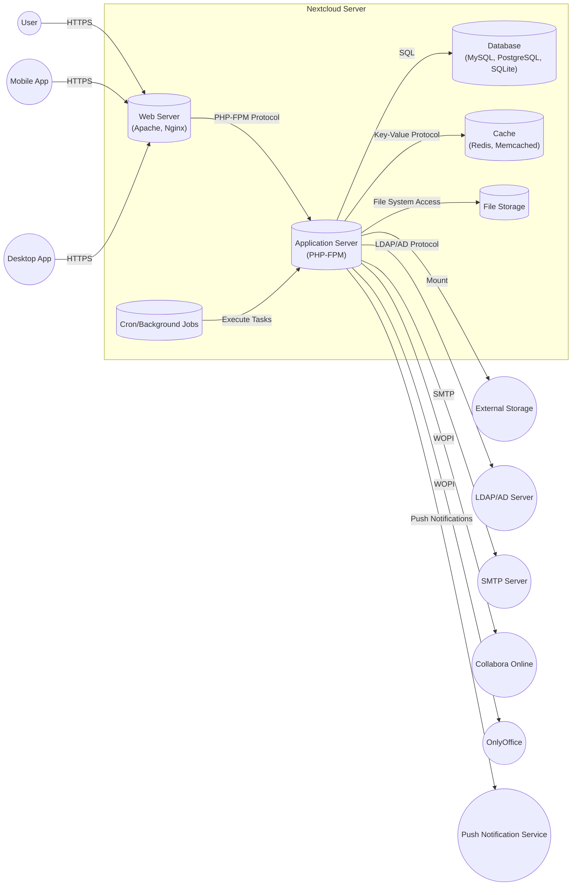
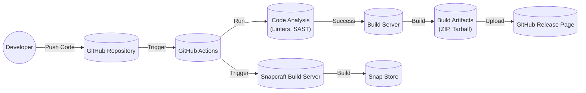

Okay, let's create a design document for the Nextcloud Server project, keeping in mind its purpose and potential security considerations.

# BUSINESS POSTURE

Nextcloud Server is an open-source, self-hosted file sync and share platform.  It aims to provide a privacy-focused alternative to commercial cloud storage services like Dropbox, Google Drive, and Microsoft OneDrive.

Priorities:

*   Data Privacy:  Giving users full control over their data is the core principle.
*   Security: Protecting user data from unauthorized access, modification, and deletion.
*   Extensibility:  Allowing users to add functionality through apps and integrations.
*   Usability:  Providing a user-friendly experience across various devices and platforms.
*   Open Source:  Maintaining a transparent and community-driven development process.
*   Scalability: Supporting deployments ranging from small home servers to large enterprise environments.

Goals:

*   Provide a secure and private alternative to commercial cloud storage.
*   Enable collaboration and file sharing among users.
*   Offer a platform for building and integrating various applications.
*   Empower users to control their data and infrastructure.

Business Risks:

*   Data Breaches:  Unauthorized access to user data could severely damage Nextcloud's reputation and lead to legal consequences.
*   Data Loss:  Loss of user data due to hardware failure, software bugs, or malicious attacks would be catastrophic.
*   Service Downtime:  Unavailability of the service would disrupt user workflows and erode trust.
*   Vulnerabilities in Third-Party Apps:  The extensibility model introduces a risk of vulnerabilities in apps developed by third parties.
*   Compliance Violations:  Failure to comply with relevant data privacy regulations (e.g., GDPR, CCPA) could lead to significant penalties.
*   Supply Chain Attacks: Compromise of the Nextcloud build process or dependencies could lead to widespread security issues.

# SECURITY POSTURE

Existing Security Controls (based on the GitHub repository and general knowledge of Nextcloud):

*   security control: Authentication: User authentication via username/password, with support for two-factor authentication (2FA) and external authentication providers (LDAP, SAML, etc.). Implemented in Nextcloud core and various authentication apps.
*   security control: Authorization: Role-based access control (RBAC) and granular file/folder permissions. Implemented in Nextcloud core and sharing mechanisms.
*   security control: Encryption: Server-side encryption at rest (optional, configurable by the administrator). End-to-end encryption (optional, via a separate app). Transport Layer Security (TLS) for communication between client and server. Described in Nextcloud documentation and implemented in various components.
*   security control: Input Validation: Validation of user inputs to prevent common web vulnerabilities like cross-site scripting (XSS) and SQL injection. Implemented throughout the codebase.
*   security control: Regular Security Audits: Nextcloud claims to undergo regular security audits and penetration testing. Information available on the Nextcloud website.
*   security control: Security Advisories: Public disclosure of security vulnerabilities and corresponding fixes. Available on the Nextcloud website.
*   security control: Brute-Force Protection: Mechanisms to mitigate brute-force login attempts. Implemented in Nextcloud core.
*   security control: File Integrity Checking: Mechanisms to detect unauthorized modification of files. Implemented in Nextcloud core.
*   security control: App Sandboxing: Limited sandboxing of Nextcloud apps to restrict their access to system resources. Implemented in the app framework.

Accepted Risks:

*   accepted risk: Reliance on Third-Party Apps: While Nextcloud provides an app framework, the security of individual apps is largely the responsibility of their developers.
*   accepted risk: Server-Side Encryption Configuration: Server-side encryption is optional and requires proper configuration by the administrator. Misconfiguration could leave data vulnerable.
*   accepted risk: User Responsibility for Client Security: Nextcloud cannot fully control the security of client devices accessing the server.

Recommended Security Controls:

*   Implement a robust Content Security Policy (CSP) to mitigate XSS attacks.
*   Implement Subresource Integrity (SRI) to ensure that loaded JavaScript files haven't been tampered with.
*   Provide detailed security hardening guides for administrators.
*   Offer more granular control over app permissions.
*   Implement a bug bounty program to incentivize security researchers.

Security Requirements:

*   Authentication:
    *   Support for strong password policies.
    *   Mandatory 2FA option for administrators.
    *   Integration with existing identity providers (e.g., Keycloak).
    *   Session management with secure session timeouts.

*   Authorization:
    *   Fine-grained access control lists (ACLs) for files and folders.
    *   Ability to define custom user roles and permissions.
    *   Audit logging of all authorization decisions.

*   Input Validation:
    *   Strict validation of all user-supplied data, including filenames, URLs, and form inputs.
    *   Use of output encoding to prevent XSS.
    *   Parameterized queries to prevent SQL injection.

*   Cryptography:
    *   Use of strong, industry-standard cryptographic algorithms.
    *   Secure key management practices.
    *   Regular review and update of cryptographic libraries.
    *   Support for Hardware Security Modules (HSMs).

# DESIGN

## C4 CONTEXT



Element Descriptions:

*   Element:
    *   Name: User
    *   Type: Person
    *   Description: A person who interacts with Nextcloud to store, share, and manage files.
    *   Responsibilities: Accessing files, sharing files, managing their account.
    *   Security controls: Strong password, 2FA, session management.

*   Element:
    *   Name: Mobile App
    *   Type: Mobile Application
    *   Description: Official or third-party Nextcloud mobile app.
    *   Responsibilities: Accessing files, syncing files, offline access.
    *   Security controls: Secure communication (TLS), data encryption on the device (if enabled).

*   Element:
    *   Name: Desktop App
    *   Type: Desktop Application
    *   Description: Official or third-party Nextcloud desktop synchronization client.
    *   Responsibilities: Synchronizing files between the desktop and the server.
    *   Security controls: Secure communication (TLS), data encryption on the device (if enabled).

*   Element:
    *   Name: Nextcloud Server
    *   Type: Software System
    *   Description: The core Nextcloud server application.
    *   Responsibilities: Handling user requests, managing files, enforcing security policies.
    *   Security controls: Authentication, authorization, encryption, input validation, auditing.

*   Element:
    *   Name: External Storage
    *   Type: External System
    *   Description: Optional external storage backend (e.g., Amazon S3, SMB share).
    *   Responsibilities: Storing files.
    *   Security controls: Dependent on the specific storage provider. Nextcloud should use secure protocols to access external storage.

*   Element:
    *   Name: LDAP/AD Server
    *   Type: External System
    *   Description: Optional LDAP or Active Directory server for user authentication and management.
    *   Responsibilities: Authenticating users, providing user information.
    *   Security controls: Secure communication (LDAPS), strong password policies.

*   Element:
    *   Name: SMTP Server
    *   Type: External System
    *   Description: Server for sending email notifications.
    *   Responsibilities: Sending emails.
    *   Security controls: Secure communication (TLS), authentication.

*   Element:
    *   Name: Collabora Online
    *   Type: External System
    *   Description: Optional online office suite integration.
    *   Responsibilities: Providing online document editing capabilities.
    *   Security controls: Secure communication (TLS), WOPI protocol security.

*   Element:
    *   Name: OnlyOffice
    *   Type: External System
    *   Description: Optional online office suite integration.
    *   Responsibilities: Providing online document editing capabilities.
    *   Security controls: Secure communication (TLS), WOPI protocol security.

*   Element:
    *   Name: Notification Service
    *   Type: External System
    *   Description: Service for sending push notifications to mobile devices.
    *   Responsibilities: Delivering push notifications.
    *   Security controls: Secure communication, authentication.

## C4 CONTAINER



Element Descriptions:

*   Element:
    *   Name: Web Server
    *   Type: Web Server
    *   Description: Handles incoming HTTP requests (Apache or Nginx).
    *   Responsibilities: Serving static content, routing requests to the application server, TLS termination.
    *   Security controls: TLS configuration, HTTP security headers (CSP, HSTS, etc.), access controls.

*   Element:
    *   Name: Application Server
    *   Type: Application Server
    *   Description: Executes the Nextcloud PHP code (PHP-FPM).
    *   Responsibilities: Handling application logic, interacting with the database and other components.
    *   Security controls: Input validation, output encoding, secure coding practices.

*   Element:
    *   Name: Database
    *   Type: Database
    *   Description: Stores user data, metadata, and configuration (MySQL, PostgreSQL, or SQLite).
    *   Responsibilities: Data persistence, data integrity.
    *   Security controls: Database user authentication, access controls, encryption at rest (if configured).

*   Element:
    *   Name: Cache
    *   Type: Cache
    *   Description: Caches frequently accessed data to improve performance (Redis or Memcached).
    *   Responsibilities: Storing cached data.
    *   Security controls: Authentication (if configured).

*   Element:
    *   Name: File Storage
    *   Type: File System
    *   Description: Stores the actual user files.
    *   Responsibilities: File storage, file access.
    *   Security controls: File system permissions, encryption at rest (if configured).

*   Element:
    *   Name: Cron/Background Jobs
    *   Type: Process
    *   Description: Executes scheduled tasks (e.g., file cleanup, background synchronization).
    *   Responsibilities: Running background tasks.
    *   Security controls: Secure execution environment, limited privileges.

## DEPLOYMENT

Possible Deployment Solutions:

1.  Bare Metal/Virtual Machine:  Traditional deployment on a dedicated server or virtual machine.
2.  Docker Container:  Deployment using Docker containers.
3.  Kubernetes:  Deployment using Kubernetes for orchestration.
4.  Snap Package:  Deployment using the Snap package format.
5.  Cloudron: Deployment using Cloudron platform.

Chosen Solution (for detailed description): Docker Container

```mermaid
graph LR
    subgraph Docker Host
        subgraph Nextcloud Container
            WebServer[("Web Server\n(Apache, Nginx)")]
            AppServer[("Application Server\n(PHP-FPM)")]
        end
        subgraph Database Container
            Database[("Database\n(MySQL, PostgreSQL)")]
        end
        subgraph Redis Container
            Cache[("Cache\n(Redis)")]
        end
        Filesystem[(("File Storage\n(Docker Volume)"))]
    end
    Internet(("Internet"))

    Internet -- HTTPS --> WebServer
    WebServer -- PHP-FPM Protocol --> AppServer
    AppServer -- SQL --> Database
    AppServer -- Key-Value Protocol --> Cache
    AppServer -- File System Access --> Filesystem
```

Element Descriptions:

*   Element:
    *   Name: Docker Host
    *   Type: Server
    *   Description: The physical or virtual machine running the Docker engine.
    *   Responsibilities: Hosting Docker containers.
    *   Security controls: Operating system security, Docker daemon security, firewall.

*   Element:
    *   Name: Nextcloud Container
    *   Type: Docker Container
    *   Description: Container running the Nextcloud web server and application server.
    *   Responsibilities: Serving the Nextcloud application.
    *   Security controls: Container isolation, minimal base image, regular image updates.

*   Element:
    *   Name: Database Container
    *   Type: Docker Container
    *   Description: Container running the database server.
    *   Responsibilities: Storing Nextcloud data.
    *   Security controls: Container isolation, database user authentication, access controls.

*   Element:
    *   Name: Redis Container
    *   Type: Docker Container
    *   Description: Container running the Redis cache.
    *   Responsibilities: Providing caching functionality.
    *   Security controls: Container isolation, Redis authentication (if configured).

*   Element:
    *   Name: File Storage (Docker Volume)
    *   Type: Docker Volume
    *   Description: Persistent storage for user files.
    *   Responsibilities: Storing user files.
    *   Security controls: Docker volume permissions.

## BUILD

Nextcloud uses a combination of GitHub Actions and manual processes for building and releasing the software.



Build Process Description:

1.  Developers push code changes to the GitHub repository.
2.  GitHub Actions are triggered by push events or pull requests.
3.  Code analysis tools (linters, static analysis security testing (SAST) tools) are run to identify potential code quality and security issues.
4.  If the code analysis passes, the build server builds the Nextcloud software, creating release artifacts (ZIP, tarball).
5.  The build artifacts are uploaded to the GitHub release page.
6.  A separate process, potentially using Snapcraft, builds the Snap package and publishes it to the Snap Store.

Security Controls:

*   security control: Code Analysis: Use of linters and SAST tools to identify vulnerabilities before deployment.
*   security control: Build Automation: Automated build process using GitHub Actions to ensure consistency and reduce manual errors.
*   security control: Dependency Management:  Use of dependency management tools (e.g., Composer for PHP) to track and update dependencies.  (Needs more robust scanning for vulnerabilities).
*   security control: Signed Releases:  Release artifacts should be digitally signed to ensure their integrity. (Needs verification if this is consistently done).

# RISK ASSESSMENT

Critical Business Processes:

*   File Storage and Retrieval:  The core function of Nextcloud.
*   User Authentication and Authorization:  Ensuring only authorized users can access data.
*   File Sharing and Collaboration:  Enabling users to share files securely.
*   Data Backup and Recovery:  Protecting against data loss.

Data Sensitivity:

*   User Files:  Highly sensitive, potentially containing personal or confidential information.  Requires strong confidentiality, integrity, and availability protection.
*   User Metadata:  (e.g., filenames, folder structures, sharing information) - Sensitive, could reveal information about user activities. Requires confidentiality and integrity protection.
*   Configuration Data:  (e.g., database credentials, encryption keys) - Highly sensitive, requires strong confidentiality and integrity protection.
*   Authentication Data: (e.g., passwords, 2FA secrets) - Extremely sensitive, requires the highest level of confidentiality and integrity protection.

# QUESTIONS & ASSUMPTIONS

Questions:

*   What is the specific threat model used by the Nextcloud security team?
*   What are the details of the regular security audits and penetration testing?
*   What is the process for handling security vulnerabilities reported by external researchers?
*   What are the specific cryptographic algorithms and key management practices used?
*   What are the plans for improving app sandboxing and security?
*   What is the process for ensuring the security of third-party apps?
*   How are dependencies scanned for vulnerabilities?
*   Are release artifacts consistently digitally signed?
*   What is the incident response plan for data breaches or other security incidents?

Assumptions:

*   BUSINESS POSTURE: Assumes a moderate risk appetite, balancing security with usability and features.
*   SECURITY POSTURE: Assumes that the documented security controls are implemented correctly and effectively. Assumes that administrators will follow security best practices.
*   DESIGN: Assumes a standard deployment model (e.g., Docker or bare metal). Assumes that external services (e.g., LDAP, SMTP) are configured securely.