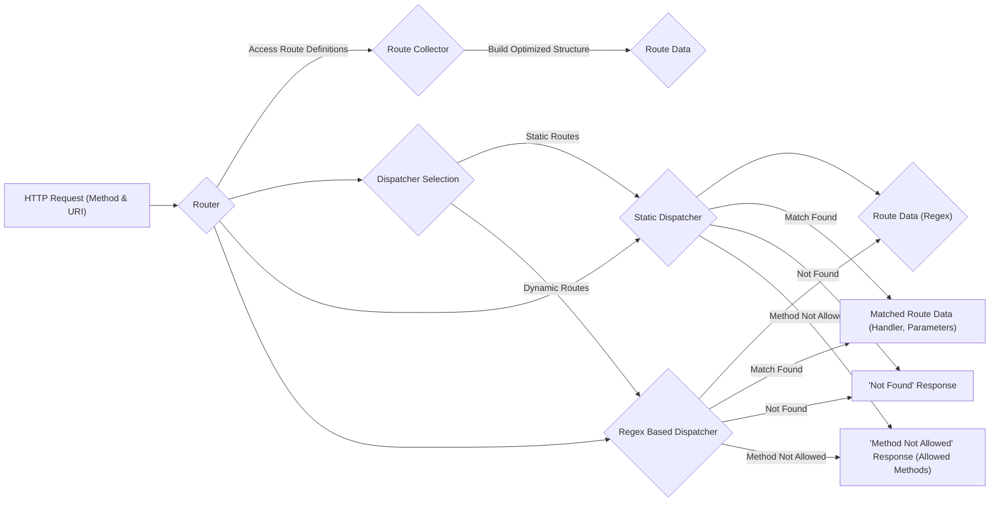

## Project Design Document: FastRoute (Improved)

**1. Introduction**

This document provides an enhanced and more detailed design overview of the FastRoute PHP library (https://github.com/nikic/FastRoute). The primary purpose remains to clearly articulate the architecture, components, and data flow of FastRoute to facilitate effective threat modeling. This document serves as a comprehensive reference point for security analysis, vulnerability identification, and understanding the library's internal workings.

**2. Project Overview**

FastRoute is a high-performance PHP library specifically designed for efficient route matching in web applications. It receives an HTTP request method and URI as input and determines the corresponding registered route, if one exists. The library prioritizes speed and offers a flexible syntax for defining routes, including support for placeholders, optional segments, and static routes.

**3. Goals**

* Provide a clear, comprehensive, and more detailed description of FastRoute's architecture and internal mechanisms.
* Identify and elaborate on the key components and their interactions with greater specificity.
* Illustrate the data flow within the library with enhanced clarity.
* Serve as a robust foundation for subsequent threat modeling activities, enabling more precise identification of potential vulnerabilities.
* Provide sufficient detail for developers integrating or extending FastRoute.

**4. Target Audience**

This document is intended for a broader audience, including:

* Security engineers and analysts performing in-depth threat modeling and security audits.
* Developers actively working with, integrating, or extending the FastRoute library.
* System architects designing applications that utilize FastRoute.
* Anyone seeking a thorough and detailed understanding of FastRoute's internal workings and potential security implications.

**5. System Architecture**

FastRoute's architecture comprises the following key components, with more detailed explanations:

* **Router:** The central orchestrator responsible for managing the collection of defined routes and initiating the route matching process. It acts as the entry point for route resolution.
* **Route Collector:**  A component used to efficiently gather and store route definitions. It provides methods for adding routes with their associated HTTP methods, URI patterns, and handlers.
* **Route Definition:** The process and structure used to define individual routes. This involves specifying:
    * The allowed HTTP method(s) (e.g., GET, POST, PUT, DELETE).
    * The URI pattern, which can include:
        * Static segments (e.g., `/users`).
        * Placeholder segments (e.g., `/users/{id}`).
        * Optional segments (e.g., `/articles[/page/{page}]`).
    * The associated handler (e.g., a function, method, or string identifier).
* **Dispatcher:** The core component responsible for the actual route matching logic. FastRoute employs different dispatching strategies optimized for performance based on the types of routes defined:
    * **Static Dispatcher:** Used when all defined routes are static (no placeholders or optional segments). This offers the fastest matching performance.
    * **Regex Based Dispatcher:** Used when routes contain placeholders or optional segments. This dispatcher compiles the route patterns into regular expressions for matching.
    * **Group Count Based Dispatcher:** An optimization used for regex-based dispatching, grouping routes based on the number of dynamic parameters to improve matching efficiency.
* **Route Data:** The internal, optimized representation of the defined routes, built by the Route Collector and used by the Dispatcher. This data structure is designed for efficient lookup and matching. The structure varies depending on the chosen dispatcher strategy.
* **Input:** The incoming HTTP request method and URI that are provided to the Router for matching against the defined routes.
* **Output:** The result of the route matching process, which can be one of the following distinct outcomes:
    * **Found:** A successful match, including the resolved route handler and an associative array of extracted parameters from the URI placeholders.
    * **Not Found:** Indicates that no defined route matches the provided URI.
    * **Method Not Allowed:** Signifies that a route exists for the given URI, but not for the specific HTTP method used in the request. The output may include a list of allowed HTTP methods for that URI.

**6. Data Flow (Enhanced)**

The following diagram provides a more detailed illustration of the data flow within FastRoute:

Detailed steps in the enhanced data flow:

* **Input Reception:** The Router receives the HTTP request method and URI.
* **Route Definition Access:** The Router interacts with the Route Collector to access the defined routes.
* **Route Data Compilation:** The Route Collector compiles the route definitions into an optimized Route Data structure, the specific structure depending on whether static or dynamic routes are present.
* **Dispatcher Selection:** The Router determines the appropriate Dispatcher to use based on the nature of the defined routes (static or dynamic).
* **Dispatching (Static):** If only static routes are defined, the Static Dispatcher performs a direct lookup for the matching URI and method.
* **Dispatching (Regex):** If dynamic routes are present, the Regex Based Dispatcher uses pre-compiled regular expressions to match the URI against the defined patterns.
* **Matching Logic:** The chosen Dispatcher executes the matching logic against the Route Data.
* **Successful Match:** If a match is found, the Dispatcher returns the associated route handler and an array of extracted parameters (if any).
* **Not Found:** If no route matches the provided URI, the Dispatcher returns a "not found" indication.
* **Method Not Allowed:** If a route exists for the given URI but not for the provided HTTP method, the Dispatcher returns a "method not allowed" indication, potentially including a list of the allowed methods for that URI.

**7. Security Considerations (Detailed)**

This section provides a more detailed analysis of potential security considerations:

* **Route Definition Security:**
    * **Excessive Route Complexity:** Defining an extremely large number of complex route patterns (especially those with many optional segments or deeply nested structures) can lead to increased memory consumption and potentially slow down the route compilation process, potentially leading to denial-of-service.
    * **Regular Expression Denial of Service (ReDoS):** If custom regular expressions are used (though FastRoute's default syntax avoids this directly), carefully crafted input URIs could cause the regex matching engine to consume excessive resources, leading to a denial-of-service.
    * **Route Overlapping and Precedence:**  Careless definition of overlapping routes without a clear precedence mechanism could lead to unexpected behavior and potentially expose unintended functionality.
* **Dispatcher Security:**
    * **Performance Under Load (Regex Dispatcher):** The performance of the Regex Based Dispatcher is crucial. Inefficient regular expressions or a large number of dynamic routes could lead to performance degradation under heavy load, potentially exploitable for denial-of-service.
    * **Side-Channel Attacks (Timing Attacks):** While less likely in typical web application scenarios, subtle differences in the execution time of the Dispatcher for different routes could theoretically be exploited to infer information about the application's routing structure.
* **Input Validation and Handling:**
    * **URI Manipulation and Canonicalization:** Ensure that the web server performs proper URI canonicalization before passing it to FastRoute. Inconsistent handling of encoded characters or path traversal sequences could lead to bypasses.
    * **HTTP Method Spoofing:** While primarily a web server concern, ensure that FastRoute correctly handles different HTTP methods and that the application logic associated with each route is appropriately protected against method spoofing attempts.
* **Error Handling and Information Disclosure:**
    * **Verbose Error Messages:** Ensure that error messages generated by FastRoute (e.g., during route compilation or dispatching) do not reveal sensitive information about the application's internal structure, file paths, or configuration.
    * **Exception Handling:** Implement robust exception handling around the route matching process to prevent unexpected errors from being exposed to users.
* **Dependency Security:**
    * While FastRoute has minimal external dependencies, it's crucial to stay updated with the latest versions of PHP to benefit from security patches and improvements in the underlying runtime environment.
* **Code Injection through Handlers:** If route handlers are dynamically generated or loaded based on user input (which is generally discouraged), this could introduce code injection vulnerabilities. Ensure that route handlers are securely managed and defined.

**8. Dependencies**

FastRoute has minimal external dependencies and primarily relies on core PHP language features. This reduces the attack surface associated with third-party libraries.

**9. Deployment Considerations**

The security of FastRoute is also influenced by its deployment context:

* **Web Server Security:** The web server (e.g., Nginx, Apache) is the first line of defense. Proper configuration, including handling of static files, request limits, and security headers, is crucial.
* **PHP Configuration:** Security-related PHP settings (e.g., `open_basedir`, `disable_functions`, `expose_php`) can impact the overall security posture.
* **Framework Integration:** When integrated into a framework, the framework's security features (e.g., CSRF protection, input sanitization) complement FastRoute's functionality. Ensure proper integration and understanding of the framework's security mechanisms.
* **HTTPS:** Using HTTPS is essential to protect the confidentiality and integrity of data transmitted between the client and the server, including the URI used for route matching.

**10. Future Considerations**

Potential future enhancements or changes to FastRoute that could introduce new security considerations:

* **More Complex Matching Logic:** Introducing more sophisticated matching algorithms or features (e.g., constraint-based matching) could introduce new attack vectors if not carefully designed and implemented.
* **Caching Mechanisms:** Implementing caching of route matching results could introduce cache poisoning vulnerabilities if the cache is not properly managed and secured.
* **Integration with Middleware Systems:** Direct integration with middleware systems could introduce vulnerabilities if the middleware pipeline is not secured or if there are vulnerabilities in the middleware components themselves.

**11. Conclusion**

This improved design document provides a more detailed and comprehensive overview of the FastRoute library, with a stronger focus on architectural details and potential security considerations. This enhanced information will be invaluable for conducting more thorough and effective threat modeling, identifying potential vulnerabilities, and ensuring the secure integration of FastRoute into web applications. Continuous security analysis and adherence to secure development practices are essential for maintaining the security of applications utilizing FastRoute.