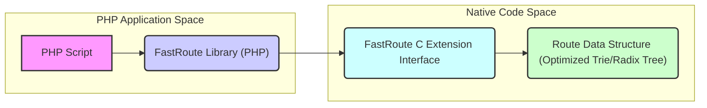
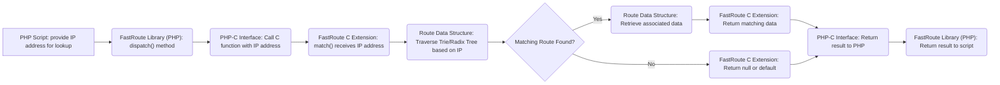

# Project Design Document: Fastroute IP Routing Library

**Project Name:** Fastroute

**Project Repository:** https://github.com/nikic/fastroute

**Document Version:** 1.1

**Date:** October 26, 2023

**Author:** Gemini (AI Language Model)

## 1. Introduction

This document provides a detailed architectural design of the Fastroute project, a PHP library designed for efficient IP routing table lookups. This document aims to provide a comprehensive understanding of the system's components, data flow, and key considerations for security threat modeling. This revised version incorporates improvements for clarity and detail.

## 2. Goals

*   Clearly define the architecture and components of the Fastroute library with greater detail.
*   Outline the data flow within the library for adding and matching routes, providing more specific steps.
*   Identify key areas and components relevant for security threat modeling, including concrete examples of potential threats.
*   Provide a robust basis for understanding the system's functionality and potential vulnerabilities.

## 3. Scope

This document covers the core functionality of the Fastroute library as described in the provided GitHub repository. Specifically, it focuses on:

*   The PHP API for defining and matching routes, including key classes and methods.
*   The underlying data structures used for storing routes, with more detail on likely implementations.
*   The process of adding and matching IP addresses against defined routes, breaking down the steps involved.

This document does not cover:

*   Specific low-level implementation details within the C extension's source code.
*   Performance benchmarking or optimization strategies.
*   External dependencies or integrations beyond the core library itself, unless directly relevant to the core functionality.

## 4. System Overview

Fastroute is a PHP library that provides a mechanism for efficiently matching IP addresses against a set of defined IP ranges (routes). It leverages a compiled C extension for performance-critical operations related to route storage and matching, enabling fast lookups.

### 4.1. Architectural Diagram

### 4.2. Component Descriptions

*   **PHP Script:** This represents the user's PHP code that utilizes the Fastroute library. It interacts with the library's public API to define IP routes (ranges and associated data) and perform lookups for matching routes based on a given IP address.
*   **FastRoute Library (PHP):** This is the PHP portion of the library, acting as the primary interface for users. Key responsibilities include:
    *   Providing classes and methods for route definition (e.g., a `RouteCollector` or similar).
    *   Offering an API to add IP ranges (potentially using CIDR notation or explicit start/end IPs) and associate them with arbitrary data.
    *   Implementing the `dispatch()` or similar method that takes an IP address as input.
    *   Marshalling data between the PHP script and the C extension.
    *   Potentially handling high-level logic like caching of lookup results (though not explicitly mentioned in the repository).
*   **FastRoute C Extension Interface:** This represents the boundary and communication layer between the PHP library and the compiled C extension. It likely involves:
    *   PHP's internal API for defining and registering C functions accessible from PHP.
    *   Data serialization and deserialization to pass IP addresses, prefixes, and route data between PHP and C.
*   **Route Data Structure (Optimized Trie/Radix Tree):** This is the core of the performance. The C extension manages an in-memory data structure, likely an optimized Trie or Radix Tree specifically designed for efficient IP prefix matching. Key characteristics include:
    *   Storing IP prefixes efficiently, allowing for quick traversal based on the bits of an IP address.
    *   Organizing routes in a hierarchical manner, enabling fast lookups by narrowing down the search space.
    *   Potentially using techniques like path compression to reduce memory usage.
    *   Storing the data associated with each route at the appropriate node in the tree.

## 5. Data Flow

The primary data flows within the Fastroute library are for adding routes and matching IP addresses.

### 5.1. Adding Routes

*   **PHP Script initiates route addition:** The user's PHP code calls a method (e.g., `addRoute()`) in the FastRoute PHP library, providing the IP range (e.g., in CIDR notation or as a start and end IP) and the associated data for that route.
*   **PHP Library processes the request:** The PHP library's `addRoute()` method likely performs some initial validation of the input data.
*   **PHP-C Interface call:** The PHP library then calls a corresponding function in the compiled C extension, passing the IP range and associated data. This involves marshaling the data into a format suitable for the C extension.
*   **C Extension receives route data:** The C extension's `add_route()` function (or similar) receives the IP range and associated data from PHP.
*   **Insert into Trie/Radix Tree:** The C extension then takes the IP range and inserts it into the internal route data structure (Trie/Radix Tree). This involves:
    *   Parsing the IP range into its network prefix and mask.
    *   Traversing the tree based on the bits of the IP prefix.
    *   Creating new nodes in the tree if necessary.
*   **Store associated data:**  The associated data is stored at the appropriate node in the Trie/Radix Tree, corresponding to the inserted IP range.

### 5.2. Matching IP Addresses

*   **PHP Script initiates IP lookup:** The user's PHP code calls a method (e.g., `dispatch()`) in the FastRoute PHP library, providing the IP address to be looked up.
*   **PHP Library prepares for lookup:** The PHP library's `dispatch()` method might perform some initial validation of the IP address format.
*   **PHP-C Interface call:** The PHP library calls a corresponding function in the compiled C extension, passing the IP address.
*   **C Extension receives IP address:** The C extension's `match()` function (or similar) receives the IP address to be matched.
*   **Traverse Trie/Radix Tree:** The C extension uses the provided IP address to traverse the internal route data structure (Trie/Radix Tree). This involves examining the bits of the IP address and following the corresponding branches in the tree.
*   **Matching route found?**: During the traversal, the C extension checks if a node representing a matching IP prefix is encountered. The most specific matching prefix is typically the desired result.
*   **Retrieve associated data (if found):** If a matching route is found, the C extension retrieves the data associated with that route from the corresponding node in the tree.
*   **Return matching data:** The C extension returns the matching route data back to the PHP library.
*   **Return null or default (if not found):** If no matching route is found after traversing the tree, the C extension returns a null value or a predefined default value.
*   **PHP-C Interface returns result:** The result (either the matching data or null/default) is passed back to the PHP library through the PHP-C interface.
*   **PHP Library returns result to script:** The PHP library's `dispatch()` method returns the result to the user's PHP code.

## 6. Security Considerations for Threat Modeling

This section outlines key areas and components that should be considered during a security threat modeling exercise, providing more specific examples of potential threats.

### 6.1. Input Validation

*   **IP Address Format Exploits:**  Insufficient validation of IP address formats (both IPv4 and IPv6) could allow attackers to inject malformed strings that cause parsing errors or unexpected behavior in the C extension, potentially leading to crashes or vulnerabilities. *Example: Providing an IP address with non-numeric characters or an invalid number of octets.*
*   **IP Range Format Vulnerabilities:**  Improper validation of IP range formats (e.g., CIDR notation with invalid prefix lengths, overlapping or contradictory ranges) could lead to errors during insertion into the route data structure, potentially corrupting the tree or causing unexpected matching behavior. *Example: Using a CIDR prefix length greater than the maximum for the IP version.*
*   **Associated Data Injection:** While the core library might not directly process the associated data, insufficient limitations on the size or type of this data could be exploited by attackers to inject large amounts of data, leading to memory exhaustion or other resource consumption issues. *Example: Associating a very large string with a route.*

### 6.2. C Extension Security

*   **Buffer Overflows in Route Handling:**  If the C extension doesn't properly handle the size of IP addresses or prefixes during insertion or lookup, buffer overflows could occur, potentially allowing attackers to overwrite memory and execute arbitrary code. *Example: Handling extremely long IPv6 addresses without proper bounds checking.*
*   **Integer Overflows in Prefix Calculations:**  Calculations involving IP prefixes and masks in the C extension must be carefully implemented to prevent integer overflows, which could lead to incorrect route matching or memory corruption. *Example: Shifting bits beyond the size of an integer type.*
*   **Denial of Service through Resource Exhaustion:**  An attacker might craft specific IP ranges or lookup patterns that cause excessive memory allocation or CPU usage within the C extension, leading to a denial of service. *Example: Adding a very large number of highly specific, non-overlapping routes.*
*   **Memory Leaks:**  If the C extension doesn't properly manage memory allocation and deallocation, memory leaks could occur over time, eventually leading to application crashes. *Example: Failing to free memory allocated for temporary data structures during route insertion or lookup.*
*   **Type Confusion:**  If the C extension doesn't strictly enforce data types when interacting with PHP, type confusion vulnerabilities could arise, potentially leading to unexpected behavior or security issues. *Example: Passing a non-string value when a string is expected for route data.*

### 6.3. Route Data Structure Integrity

*   **Data Corruption through Malicious Input:**  Carefully crafted sequences of route additions or deletions could potentially corrupt the internal route data structure, leading to incorrect lookups or crashes. *Example: Adding and then deleting a large number of overlapping routes in a specific order.*
*   **Race Conditions in Concurrent Access:** If the library is used in a multi-threaded environment and the C extension doesn't implement proper locking mechanisms, race conditions could occur during concurrent access to the route data structure, potentially leading to data corruption or inconsistent state.

### 6.4. Deployment Environment

*   **Insufficient Permissions:** If the PHP process or the C extension runs with excessive privileges, a successful attack could have a greater impact on the system.
*   **Lack of Resource Limits:** Without appropriate resource limits (e.g., memory limits for the PHP process), an attacker could exploit vulnerabilities to consume excessive resources and cause a denial of service.
*   **Exposure of Sensitive Route Data:** Depending on how the associated data is handled by the application, there might be a risk of exposing sensitive routing information if access controls are not properly implemented.

## 7. Deployment Considerations

*   Ensure the compiled C extension is compatible with the PHP version and operating system where the application will be deployed.
*   Deploy the C extension in a location where the PHP interpreter can find it (e.g., the PHP extension directory).
*   Configure the PHP environment to enable the Fastroute C extension.
*   Consider the resource requirements of the library, especially memory usage for storing a large number of routes.
*   Implement appropriate security measures at the application level, such as input sanitization and access controls, to protect the data associated with the routes.
*   Monitor the application for unexpected behavior or resource consumption that might indicate a security issue.

## 8. Future Enhancements (Potential Areas for Future Security Review)

*   **Route Prioritization Mechanisms:** If future versions introduce mechanisms for prioritizing routes (e.g., based on specificity or administrative weight), the logic for selecting the best matching route will become more complex and require careful security review to prevent bypasses or unintended behavior.
*   **Dynamic Route Updates and Synchronization:** If the library is extended to support dynamic updates to the routing table (adding, modifying, or deleting routes while the application is running), robust locking and synchronization mechanisms will be crucial to prevent race conditions and data corruption. Security considerations will include ensuring that only authorized processes can modify the routing table.
*   **Integration with External Route Data Sources:** If the library integrates with external data sources (e.g., databases or network configuration files) to load route information, the security of these integrations will need to be thoroughly assessed. This includes verifying the integrity and authenticity of the external data and preventing injection attacks.
*   **Support for Route Expiration:** If routes can be configured to expire after a certain time, the mechanism for managing and removing expired routes will need to be secure to prevent stale or incorrect routing information from being used.

## 9. Conclusion

This improved design document provides a more detailed and comprehensive understanding of the Fastroute IP routing library's architecture, data flow, and security considerations. By elaborating on potential threats and vulnerabilities, this document serves as a stronger foundation for conducting thorough threat modeling and developing secure applications that utilize this library. Continuous security review and testing are recommended as the project evolves.
