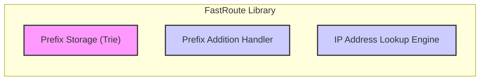
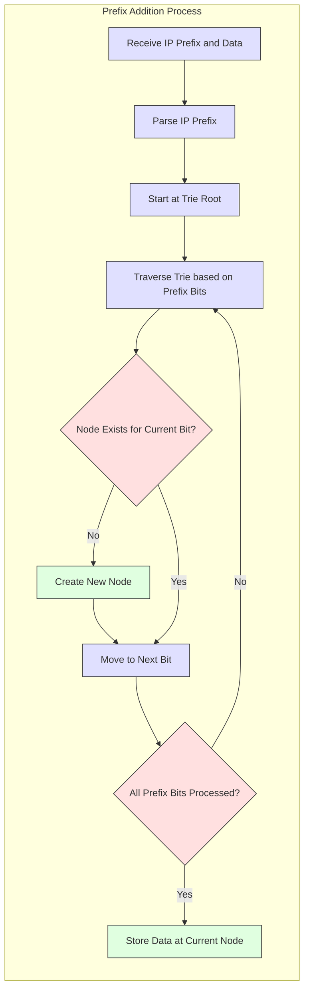
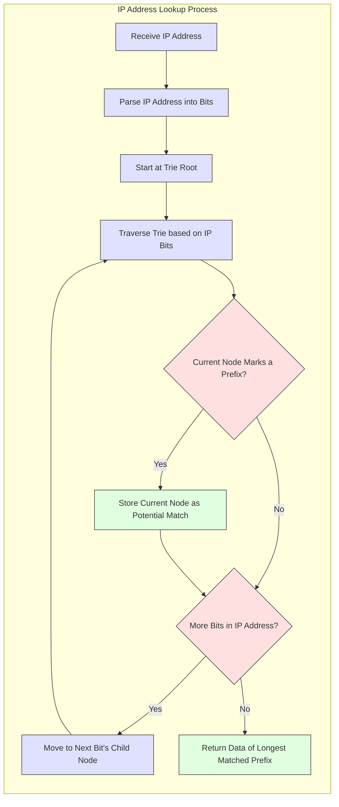
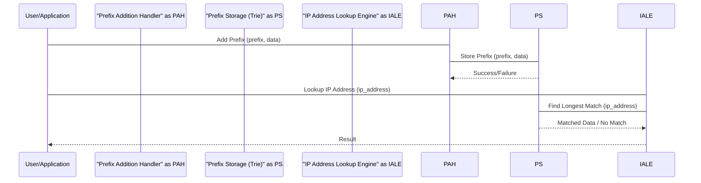

# Project Design Document: FastRoute Library

**Version:** 1.1
**Date:** October 26, 2023
**Author:** AI Software Architect

## 1. Introduction

This document provides a detailed design overview of the `fastroute` library, a PHP library for fast IP routing based on longest-prefix match. This document is intended to serve as a foundation for subsequent threat modeling activities. It outlines the key components, data flow, and architectural considerations of the library. This revision aims to provide more granular detail and clarity compared to the initial version.

## 2. Project Overview

The `fastroute` library offers an efficient method for matching IP addresses against a defined set of network prefixes. Its primary purpose is to enable high-performance routing lookups, a critical function in network infrastructure and applications requiring IP address classification and routing decisions. The library's core strength lies in its utilization of a Trie (prefix tree) data structure, which facilitates rapid prefix storage and lookup operations.

## 3. Goals

*   Provide a clear and comprehensive description of the `fastroute` library's architecture and functionality, with enhanced detail.
*   Identify key components and their interactions, elaborating on their internal workings.
*   Describe the data flow within the library in a more granular manner.
*   Highlight potential areas of security concern with specific examples for future threat modeling.

## 4. Scope

This design document focuses on the core functionality of the `fastroute` library related to IP prefix storage and lookup mechanisms. It encompasses:

*   The internal architecture of the library, including the Trie structure.
*   The detailed process of adding and matching IP prefixes within the Trie.
*   The specific data structures employed for storing prefixes and associated data.

This document explicitly excludes:

*   Specific use cases or integrations of the library within larger systems or applications.
*   Detailed performance benchmarking, optimization strategies, or low-level implementation details.
*   The intricacies of the PHP language beyond their direct impact on the library's architectural design.

## 5. System Architecture

The `fastroute` library can be conceptually divided into the following key components, each with a distinct responsibility:

*   **Prefix Storage (Trie):** The central component responsible for the efficient storage and organization of IP prefixes.
*   **Prefix Addition Handler:**  The component that manages the process of incorporating new IP prefixes into the Trie.
*   **IP Address Lookup Engine:** The core component responsible for performing the longest-prefix match against the stored prefixes.

## 6. Component Details

### 6.1. Prefix Storage (Trie)

*   **Description:** At the heart of `fastroute` is a Trie (prefix tree) data structure. Each node in the Trie represents a bit position within an IP address. Paths from the root node to any given node represent specific IP prefixes.
*   **Functionality:**
    *   Stores IP prefixes in a hierarchical, bit-oriented structure, enabling efficient prefix matching.
    *   Facilitates the lookup of the longest matching prefix for a given IP address by traversing the Trie.
    *   Each node can store associated data relevant to the prefix it represents (e.g., next-hop information, routing flags).
*   **Data Structures:**
    *   **Trie Nodes:** Each node typically contains:
        *   Pointers to child nodes:  Usually two pointers, representing the next bit being '0' or '1'.
        *   A flag or marker indicating if the path to this node represents a complete prefix.
        *   Storage for associated data if the node marks the end of a prefix.
    *   **Root Node:** The entry point for all prefix lookups and the ancestor of all stored prefixes.
*   **Inputs:** IP prefixes to be stored, along with their associated data.
*   **Outputs:** The dynamically built and maintained Trie structure.

### 6.2. Prefix Addition Handler

*   **Description:** This component manages the process of adding new IP prefixes and their associated data into the `Prefix Storage (Trie)`.
*   **Functionality:**
    *   Receives an IP prefix (e.g., "192.168.1.0/24") and its corresponding data as input.
    *   Parses the IP prefix to extract the network address and prefix length.
    *   Traverses the Trie, creating new nodes as needed along the path dictated by the bits of the IP prefix.
    *   Marks the final node corresponding to the prefix as a valid prefix endpoint and stores the associated data at that node.
*   **Inputs:**
    *   IP prefix string (e.g., "2001:db8::/32" for IPv6).
    *   Associated data to be stored with the prefix.
*   **Outputs:**
    *   Confirmation of successful prefix addition.
    *   Potential error messages if the prefix is invalid or if there are issues adding it to the Trie.

### 6.3. IP Address Lookup Engine

*   **Description:** This is the core component responsible for matching a given IP address against the stored prefixes within the Trie to find the longest matching prefix.
*   **Functionality:**
    *   Receives an IP address as input for lookup (e.g., "192.168.1.15").
    *   Parses the IP address into its constituent bits.
    *   Starts the traversal from the root of the `Prefix Storage (Trie)`.
    *   Traverses the Trie based on the bits of the input IP address. At each node, it follows the child pointer corresponding to the current bit of the IP address.
    *   Keeps track of the deepest node encountered so far that represents a valid prefix. This ensures the longest-prefix match.
    *   Returns the data associated with the longest matching prefix found during the traversal.
*   **Inputs:** IP address to be looked up.
*   **Outputs:**
    *   The data associated with the longest matching prefix.
    *   An indication (e.g., null or a specific error code) if no matching prefix is found.

## 7. Data Flow

The primary data flow within the `fastroute` library centers around two core operations: the addition of new prefixes and the lookup of IP addresses against the stored prefixes.

*   **Prefix Addition Flow:**
    *   An IP prefix and its associated data are provided as input to the `Prefix Addition Handler`.
    *   The `Prefix Addition Handler` parses the provided IP prefix.
    *   Starting from the root of the `Prefix Storage (Trie)`, the handler traverses the Trie according to the bits of the prefix.
    *   If a necessary node does not exist during traversal, a new node is created.
    *   Once the traversal for all bits of the prefix is complete, the associated data is stored at the final node, marking the end of the prefix.

*   **IP Address Lookup Flow:**
    *   An IP address to be looked up is provided as input to the `IP Address Lookup Engine`.
    *   The `IP Address Lookup Engine` parses the input IP address into its individual bits.
    *   The lookup process begins at the root of the `Prefix Storage (Trie)`.
    *   The engine traverses the Trie, following the path dictated by the bits of the input IP address.
    *   During traversal, the engine keeps track of the deepest node encountered that represents a valid prefix.
    *   The data associated with this longest matching prefix is returned as the result of the lookup operation.

## 8. Security Considerations

This section outlines potential security considerations relevant to the design of the `fastroute` library, providing a basis for future threat modeling activities:

*   **Input Validation Vulnerabilities:**
    *   **Malformed IP Prefixes/Addresses:** Lack of robust validation for input IP prefixes and addresses could lead to errors, unexpected behavior, or even crashes. Attackers might provide specially crafted strings to exploit parsing logic.
    *   **Prefix Length Issues:**  Invalid prefix lengths (e.g., greater than 32 for IPv4 or 128 for IPv6) could cause issues during Trie construction or lookup.
*   **Memory Management Risks:**
    *   **Trie Explosion:**  Adding a large number of very specific prefixes could lead to an excessively large Trie, consuming significant memory and potentially leading to denial-of-service (DoS).
    *   **Memory Leaks:**  Bugs in the prefix addition or deletion logic could result in memory leaks, gradually exhausting resources.
*   **Data Integrity Concerns:**
    *   **Unauthorized Modification:**  If the Trie structure is exposed or modifiable without proper authorization, attackers could manipulate routing information, leading to traffic misdirection or interception.
*   **Denial of Service (DoS) Attacks:**
    *   **Lookup Floods:**  Bombarding the library with a high volume of lookup requests, especially for non-existent prefixes, could strain resources and impact performance.
    *   **Prefix Insertion Floods:**  Attempting to add a massive number of prefixes rapidly could overwhelm the system.
*   **ReDoS (Regular Expression Denial of Service):** If regular expressions are used for input validation, poorly crafted expressions could be exploited to cause excessive processing time.

These considerations will be further analyzed and expanded upon during the dedicated threat modeling phase.

## 9. Assumptions and Constraints

*   The library is assumed to operate within environments where IP addresses and prefixes adhere to standard IPv4 and IPv6 formats.
*   The design focuses primarily on the core routing logic and does not encompass external dependencies, network interactions, or persistence mechanisms.
*   The performance characteristics of the Trie data structure are assumed to be suitable for the intended high-performance routing lookup scenarios.
*   Error handling within the library is assumed to be implemented to prevent crashes and provide informative feedback.

## 10. Future Considerations

*   Implementation of mechanisms for dynamically updating or deleting prefixes from the Trie to accommodate changes in network configurations.
*   Explicit support for both IPv4 and IPv6 addresses within a single Trie structure or through separate Tries.
*   Integration capabilities with external data sources or databases for retrieving and managing prefix information.
*   Consideration of thread safety if the library is intended for use in multi-threaded environments.
*   Development of monitoring and logging capabilities to track Trie size, lookup performance, and potential errors.

This revised document provides a more detailed and comprehensive understanding of the `fastroute` library's architecture and functionality, offering a stronger foundation for subsequent threat modeling efforts.