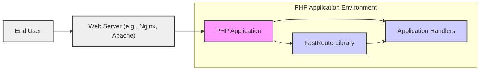
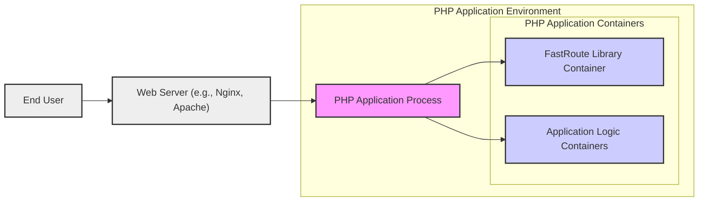
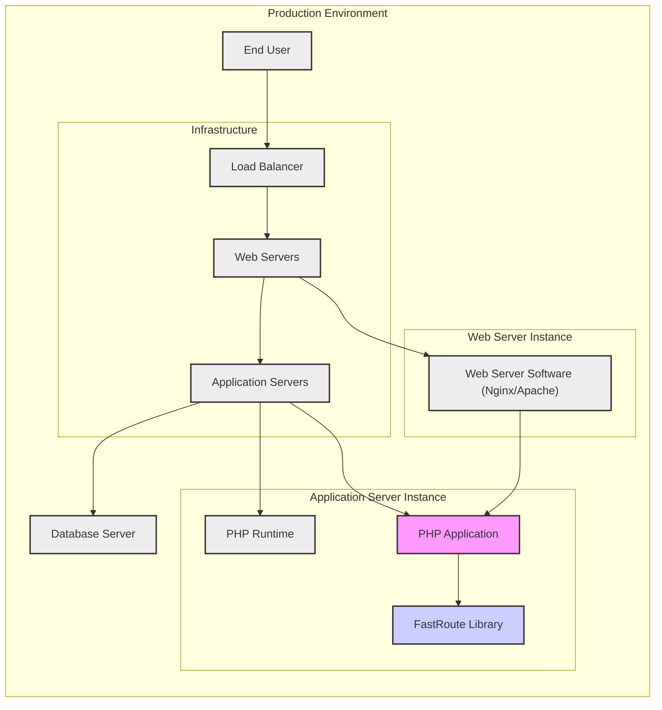

# BUSINESS POSTURE

This project, the `nikic/fastroute` library, aims to provide a high-performance request router for PHP applications.

- Business Priorities and Goals:
  - Improve the performance of PHP applications by providing a fast and efficient mechanism for routing HTTP requests to the appropriate handlers.
  - Reduce application latency and improve responsiveness, leading to a better user experience.
  - Simplify the development of routing logic in PHP applications, making it easier to maintain and extend.
  - Enable developers to build more complex and scalable web applications with PHP.

- Most Important Business Risks:
  - Performance degradation due to inefficient routing logic, negatively impacting user experience and potentially leading to service disruptions.
  - Security vulnerabilities in the routing component that could be exploited to bypass security controls, gain unauthorized access, or cause application instability.
  - Downtime or service unavailability if the routing component fails or encounters errors.
  - Integration issues with existing PHP applications or frameworks, leading to development delays or compatibility problems.

# SECURITY POSTURE

- Existing Security Controls:
  - security control: Code is hosted on GitHub, which provides basic platform security and version control. Location: github.com
  - security control: The project is open source, allowing for community review and scrutiny, which can help identify potential security vulnerabilities. Location: github.com/nikic/fastroute
  - security control: Usage of widely adopted PHP language and ecosystem, benefiting from general PHP security best practices and community knowledge. Location: PHP ecosystem

- Accepted Risks:
  - accepted risk: Reliance on the security of the underlying PHP runtime environment and web server infrastructure.
  - accepted risk: Potential for undiscovered vulnerabilities within the `fastroute` library itself, which could be exploited before patches are available.
  - accepted risk: Security misconfigurations or improper usage of the library by developers integrating it into their applications.

- Recommended Security Controls:
  - security control: Implement automated static analysis security testing (SAST) to identify potential code-level vulnerabilities in the library.
  - security control: Establish a process for security vulnerability reporting and patching for the library.
  - security control: Encourage and facilitate community security audits and penetration testing of the library.
  - security control: Provide clear documentation and examples on secure usage of the library, including input validation and handling of routing parameters.

- Security Requirements:
  - Authentication:
    - The `fastroute` library itself does not handle authentication.
    - Security requirement: Applications using `fastroute` must implement their own authentication mechanisms to verify user identity before processing requests.
    - Security requirement: Routing decisions might be influenced by authentication status, directing unauthenticated users to login pages or restricted areas.
  - Authorization:
    - The `fastroute` library is responsible for routing requests to specific handlers based on defined routes.
    - Security requirement: Applications must implement authorization checks within the request handlers to ensure that users are permitted to access the requested resources or functionalities.
    - Security requirement: Route definitions should be designed to align with the application's authorization model, preventing unauthorized access to sensitive endpoints.
  - Input Validation:
    - `fastroute` parses the request URI path to match routes.
    - Security requirement: `fastroute` must be robust against malformed or malicious URI paths to prevent unexpected behavior or vulnerabilities.
    - Security requirement: Applications should perform input validation on parameters extracted from the route (e.g., route parameters) within the request handlers to prevent injection attacks and other input-related vulnerabilities.
  - Cryptography:
    - `fastroute` itself does not directly implement cryptography.
    - Security requirement: Applications using `fastroute` should utilize HTTPS to encrypt communication between clients and the server, protecting sensitive data in transit.
    - Security requirement: If sensitive data is included in route parameters or query strings, applications must ensure it is appropriately protected, potentially through encryption or other security measures implemented at the application level.

# DESIGN

## C4 CONTEXT

- Context Diagram Elements:
  - - Name: "End User"
    - Type: Person
    - Description: Individuals accessing the PHP application through a web browser or other client.
    - Responsibilities: Initiating HTTP requests to access application functionalities.
    - Security controls: Client-side security controls (browser security, user authentication if applicable).
  - - Name: "Web Server (e.g., Nginx, Apache)"
    - Type: Software System
    - Description: Web server responsible for receiving HTTP requests from end users and forwarding them to the PHP application.
    - Responsibilities: Handling HTTP requests, serving static content, reverse proxying requests to the PHP application.
    - Security controls: security control: Web server access controls, TLS/SSL configuration, DDoS protection, web application firewall (WAF).
  - - Name: "PHP Application"
    - Type: Software System
    - Description: The overall PHP application that utilizes the `fastroute` library for request routing and contains application-specific logic.
    - Responsibilities: Implementing application functionalities, handling business logic, interacting with databases and other services.
    - Security controls: security control: Application-level authentication and authorization, input validation, output encoding, secure session management, protection against common web vulnerabilities (OWASP Top 10).
  - - Name: "FastRoute Library"
    - Type: Software System
    - Description: The `nikic/fastroute` library, a PHP component responsible for efficiently routing HTTP requests to the appropriate application handlers within the PHP application.
    - Responsibilities: Parsing request URIs, matching routes against defined patterns, dispatching requests to registered handlers.
    - Security controls: security control: Input validation on URI paths, protection against route injection vulnerabilities.
  - - Name: "Application Handlers"
    - Type: Software System
    - Description: PHP functions or classes within the PHP application that implement the business logic for specific routes and handle incoming requests.
    - Responsibilities: Processing requests, implementing business logic, interacting with data storage, generating responses.
    - Security controls: security control: Authorization checks, input validation, output encoding, secure data handling, protection against application-specific vulnerabilities.

## C4 CONTAINER

- Container Diagram Elements:
  - - Name: "End User"
    - Type: Person
    - Description: Individuals accessing the PHP application through a web browser or other client.
    - Responsibilities: Initiating HTTP requests to access application functionalities.
    - Security controls: Client-side security controls (browser security, user authentication if applicable).
  - - Name: "Web Server (e.g., Nginx, Apache)"
    - Type: Container
    - Description: Web server software responsible for receiving HTTP requests and forwarding them to the PHP application process.
    - Responsibilities: Handling HTTP requests, serving static content, reverse proxying requests to the PHP application process.
    - Security controls: security control: Web server access controls, TLS/SSL configuration, DDoS protection, web application firewall (WAF).
  - - Name: "PHP Application Process"
    - Type: Container
    - Description: The PHP interpreter process executing the PHP application code, including the `fastroute` library and application logic.
    - Responsibilities: Running the PHP application, processing requests, managing application state.
    - Security controls: security control: Operating system level security controls, PHP runtime security configurations, resource limits.
  - - Name: "FastRoute Library Container"
    - Type: Container
    - Description: Represents the `nikic/fastroute` library as a component within the PHP application process, responsible for request routing.
    - Responsibilities: Parsing request URIs, matching routes, dispatching requests to application logic containers.
    - Security controls: security control: Input validation on URI paths, protection against route injection vulnerabilities.
  - - Name: "Application Logic Containers"
    - Type: Container
    - Description: Represents the application-specific code components (handlers, controllers, services) within the PHP application process that implement business logic.
    - Responsibilities: Handling requests for specific routes, implementing business logic, interacting with data storage, generating responses.
    - Security controls: security control: Authorization checks, input validation, output encoding, secure data handling, protection against application-specific vulnerabilities.

## DEPLOYMENT

- Deployment Diagram Elements:
  - - Name: "End User"
    - Type: Person
    - Description: Individuals accessing the PHP application.
    - Responsibilities: Accessing the application via web browsers or other clients.
    - Security controls: Client-side security controls.
  - - Name: "Load Balancer"
    - Type: Infrastructure
    - Description: Distributes incoming traffic across multiple web servers for scalability and availability.
    - Responsibilities: Traffic distribution, health checks, SSL termination.
    - Security controls: security control: DDoS protection, rate limiting, SSL/TLS configuration.
  - - Name: "Web Servers"
    - Type: Infrastructure
    - Description: Servers running web server software (e.g., Nginx, Apache) to handle HTTP requests and serve static content.
    - Responsibilities: Handling HTTP requests, serving static files, reverse proxying to application servers.
    - Security controls: security control: Web server hardening, access controls, web application firewall (WAF), intrusion detection/prevention systems (IDS/IPS).
  - - Name: "Web Server Software (Nginx/Apache)"
    - Type: Software
    - Description: Specific web server software running on the web servers.
    - Responsibilities: Handling HTTP protocol, request routing, security features.
    - Security controls: security control: Web server security configurations, module security, regular security updates.
  - - Name: "Application Servers"
    - Type: Infrastructure
    - Description: Servers running the PHP application runtime and code.
    - Responsibilities: Executing PHP application code, processing requests, interacting with databases and other services.
    - Security controls: security control: Operating system hardening, access controls, intrusion detection/prevention systems (IDS/IPS), application firewalls.
  - - Name: "PHP Runtime"
    - Type: Software
    - Description: PHP interpreter environment.
    - Responsibilities: Executing PHP code, managing resources, providing PHP functionalities.
    - Security controls: security control: PHP security configurations, disabled functions, regular security updates.
  - - Name: "PHP Application"
    - Type: Software
    - Description: The deployed PHP application code, including the `fastroute` library.
    - Responsibilities: Implementing application logic, handling requests, utilizing `fastroute` for routing.
    - Security controls: security control: Application-level security controls (authentication, authorization, input validation, etc.), secure coding practices.
  - - Name: "FastRoute Library"
    - Type: Software
    - Description: Deployed `nikic/fastroute` library within the PHP application.
    - Responsibilities: Request routing within the application.
    - Security controls: security control: As per library design, input validation on URI paths.
  - - Name: "Database Server"
    - Type: Infrastructure
    - Description: Database server storing application data.
    - Responsibilities: Data storage, data retrieval, data persistence.
    - Security controls: security control: Database access controls, encryption at rest and in transit, database hardening, regular backups.

## BUILD

```mermaid
flowchart LR
    A["Developer"] --> B["Code Repository (GitHub)"];
    B --> C["CI/CD Pipeline (GitHub Actions, Jenkins, etc.)"];
    C --> D["Build Process (Composer, PHPUnit, SAST)"];
    D --> E["Build Artifacts (Packagist Package)"];
    E --> F["Deployment Environment"];
    style A fill:#eee,stroke:#333,stroke-width:2px
    style B fill:#eee,stroke:#333,stroke-width:2px
    style C fill:#eee,stroke:#333,stroke-width:2px
    style D fill:#eee,stroke:#333,stroke-width:2px
    style E fill:#eee,stroke:#333,stroke-width:2px
    style F fill:#eee,stroke:#333,stroke-width:2px
```

- Build Process Description:
  - The build process for the `fastroute` library typically starts with a developer committing code changes to a code repository, such as GitHub.
  - A CI/CD pipeline, like GitHub Actions or Jenkins, is triggered upon code changes.
  - The build process involves:
    - Dependency management using Composer to install any required PHP packages (though `fastroute` has none).
    - Running unit tests with PHPUnit to ensure code functionality and prevent regressions.
    - Performing static analysis security testing (SAST) to identify potential vulnerabilities in the code.
    - Code linting and style checks to maintain code quality and consistency.
  - Upon successful build and tests, build artifacts are created, typically a packaged version of the library suitable for distribution via Packagist (PHP package repository).
  - The build artifacts are then published to a package repository or made available for deployment into target environments.

- Build Process Security Controls:
  - security control: Code repository access controls (e.g., branch protection, code review requirements) to ensure code integrity. Location: GitHub
  - security control: CI/CD pipeline security (e.g., secure pipeline configuration, secrets management) to prevent unauthorized modifications and access. Location: CI/CD system (GitHub Actions, Jenkins)
  - security control: Automated static analysis security testing (SAST) integrated into the build process to identify vulnerabilities early in the development lifecycle. Location: CI/CD Pipeline, SAST tools
  - security control: Dependency scanning (if applicable, though `fastroute` has no dependencies) to detect vulnerable dependencies. Location: CI/CD Pipeline, Dependency scanning tools
  - security control: Code signing of build artifacts to ensure integrity and authenticity. Location: Build process, signing tools
  - security control: Secure storage and access controls for build artifacts in the package repository. Location: Packagist or private package repository

# RISK ASSESSMENT

- Critical Business Processes:
  - Routing HTTP requests to the correct application logic is a critical process for any web application using `fastroute`. If routing fails or is compromised, the application may become unavailable, function incorrectly, or be vulnerable to security exploits.
  - Application availability and performance are directly dependent on the efficiency and reliability of the routing mechanism.

- Data to Protect and Sensitivity:
  - Request paths and parameters: These can contain sensitive information depending on the application. For example, URLs might include session IDs, API keys, or personal data. While `fastroute` itself only processes the path, applications using it must be mindful of the sensitivity of data within the URL.
  - Application code: The `fastroute` library and the application code it routes to are valuable assets. Protecting the integrity and confidentiality of this code is important to prevent unauthorized modifications and intellectual property theft.
  - Configuration data: Route definitions and application configurations can contain sensitive information and should be protected from unauthorized access.

# QUESTIONS & ASSUMPTIONS

- Questions:
  - What specific types of input validation are performed by `fastroute` on URI paths?
  - Are there any known common security pitfalls when using `fastroute` in PHP applications?
  - What are the performance implications of enabling different routing features or security checks within `fastroute`?
  - Are there any recommended security configurations or best practices for deploying applications using `fastroute`?

- Assumptions:
  - It is assumed that applications using `fastroute` will be deployed in a standard web server environment (e.g., Nginx/Apache with PHP-FPM).
  - It is assumed that developers using `fastroute` are responsible for implementing application-level security controls such as authentication, authorization, and input validation in their request handlers.
  - It is assumed that the primary security concern for `fastroute` is related to preventing vulnerabilities in the routing logic itself, such as route injection or denial-of-service attacks through malformed URIs.
  - It is assumed that the build and deployment process for applications using `fastroute` will follow standard software development best practices, including version control, automated testing, and secure deployment procedures.