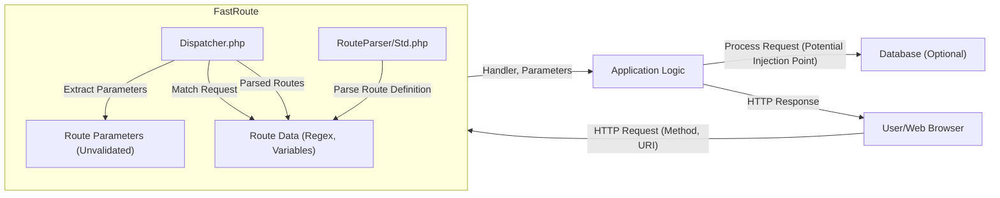

## Deep Security Analysis of FastRoute

### 1. Objective, Scope, and Methodology

**Objective:** To conduct a thorough security analysis of the FastRoute library (https://github.com/nikic/fastroute), focusing on its key components, identifying potential vulnerabilities, and providing actionable mitigation strategies.  The analysis aims to identify weaknesses in the library's design and implementation that could be exploited by attackers to compromise applications using FastRoute.

**Scope:**

*   **Core routing logic:**  `Dispatcher.php`, `RouteParser/Std.php`, and related files responsible for parsing routes, matching requests, and extracting parameters.
*   **Regular expression handling:**  Analysis of how regular expressions are used for route matching and potential ReDoS vulnerabilities.
*   **Parameter handling:**  How route parameters are extracted, validated (or lack thereof), and passed to the application.
*   **Error handling:** How the library handles invalid routes or unexpected input.
*   **Data flow:** Tracing the flow of data from request input to route matching and parameter extraction.
*   **Dependencies:** FastRoute has minimal dependencies, but we'll consider any security implications of those.

**Methodology:**

1.  **Code Review:**  Manual inspection of the FastRoute source code on GitHub, focusing on the areas identified in the scope.
2.  **Architecture Inference:**  Based on the code and documentation, infer the library's architecture, components, and data flow. This is already partially done in the provided C4 diagrams, but we'll refine it as needed.
3.  **Threat Modeling:**  Identify potential threats based on the library's functionality and the accepted risks outlined in the security design review.
4.  **Vulnerability Analysis:**  Identify potential vulnerabilities based on the code review, threat modeling, and known attack vectors against routing libraries.
5.  **Mitigation Recommendations:**  Propose specific, actionable mitigation strategies to address the identified vulnerabilities.  These recommendations will be tailored to FastRoute and its intended use.

### 2. Security Implications of Key Components

*   **`src/Dispatcher.php`:** This is the core of the routing logic.  It takes the HTTP method and URI, compares them against the defined routes, and dispatches to the appropriate handler.

    *   **Security Implications:**
        *   **Incorrect Route Matching:** Bugs in the matching logic could lead to requests being routed to the wrong handlers, potentially bypassing security checks or exposing unintended functionality.  This is a critical area for testing.
        *   **ReDoS (Regular Expression Denial of Service):**  The dispatcher uses regular expressions extensively.  Poorly crafted regular expressions (especially those with nested quantifiers) can be vulnerable to ReDoS attacks, where a carefully crafted input string causes the regular expression engine to consume excessive CPU resources, leading to a denial of service.
        *   **Parameter Extraction:**  The dispatcher extracts route parameters.  If these parameters are not properly validated or sanitized by the *application* (as per the accepted risks), this could lead to various injection attacks (e.g., SQL injection, XSS, command injection) *within the application code*.  FastRoute itself doesn't handle this, but it's a critical point in the data flow.

*   **`src/RouteParser/Std.php`:** This component parses route definitions (e.g., `/user/{id:\d+}`) into regular expressions and variable names.

    *   **Security Implications:**
        *   **Incorrect Parsing:**  Errors in parsing route definitions could lead to unexpected behavior and potential vulnerabilities.  For example, a bug might allow an attacker to define a route that overrides a legitimate route, hijacking requests.
        *   **ReDoS (in Route Definition):** While less likely than ReDoS in the dispatcher, overly complex user-provided route definitions (if allowed) could also potentially lead to ReDoS vulnerabilities during the parsing stage.  This is more of a concern if the application allows users to define routes dynamically.
        *   **Injection into Route Definitions:** If route definitions are constructed from user input without proper sanitization, it might be possible to inject malicious regular expression syntax, leading to unexpected behavior or ReDoS.

*   **Data Flow (Request Handling):**

    1.  **Input:** The web server receives an HTTP request (method and URI).
    2.  **FastRoute:** The request is passed to FastRoute's `dispatch()` method.
    3.  **Route Matching:** `Dispatcher.php` uses the parsed route data (from `RouteParser/Std.php`) to match the request URI against defined routes using regular expressions.
    4.  **Parameter Extraction:** If a route matches, `Dispatcher.php` extracts route parameters based on the regular expression capture groups.
    5.  **Handler Invocation:**  FastRoute returns the associated handler and the extracted parameters to the application.
    6.  **Application Logic:** The *application* uses the handler and parameters to process the request.  This is where vulnerabilities like SQL injection, XSS, etc., are most likely to occur if the application doesn't properly handle the parameters.

    *   **Security Implications:** The most critical point is the handoff of extracted parameters to the application.  FastRoute does *not* sanitize or validate these parameters beyond what's defined in the route itself (e.g., `\d+` for an integer ID).  This is explicitly stated as an accepted risk, but it's crucial for developers using FastRoute to understand this responsibility.

### 3. Architecture, Components, and Data Flow (Refined)

The provided C4 diagrams are a good starting point.  Here's a refined view focusing on the security-relevant aspects of FastRoute:



**Key Points:**

*   **Route Data:**  The `RouteData` is a critical internal structure that holds the parsed regular expressions and variable names.  Its integrity is essential for correct routing.
*   **Unvalidated Parameters:**  The `Parameters` passed to the application are *unvalidated* from FastRoute's perspective.  This is the primary area of concern.
*   **Application Responsibility:**  The `Application Logic` component bears the full responsibility for validating and sanitizing the parameters before using them in any potentially dangerous operations (database queries, command execution, output rendering, etc.).

### 4. Identified Threats and Vulnerabilities

Based on the analysis, here are the key threats and potential vulnerabilities:

*   **Threat:**  **Denial of Service (DoS) via ReDoS.**
    *   **Vulnerability:**  Complex or poorly crafted regular expressions in `Dispatcher.php` or `RouteParser/Std.php` could be exploited with crafted input strings to cause excessive CPU consumption.
    *   **Impact:**  The application becomes unresponsive, affecting all users.
    *   **Likelihood:** Medium to High (depending on the complexity of the routes used).

*   **Threat:**  **Bypassing Security Controls / Unauthorized Access.**
    *   **Vulnerability:**  Bugs in the route matching logic (`Dispatcher.php`) could cause requests to be routed to the wrong handlers, bypassing authentication or authorization checks implemented by the application.
    *   **Impact:**  Attackers could gain access to restricted resources or functionality.
    *   **Likelihood:** Low to Medium (assuming reasonable testing of the application's routing logic).

*   **Threat:**  **Injection Attacks (SQLi, XSS, Command Injection, etc.).**
    *   **Vulnerability:**  FastRoute does *not* validate or sanitize route parameters.  If the *application* using FastRoute fails to properly handle these parameters, it becomes vulnerable to various injection attacks.  This is an *indirect* vulnerability, as it's the application's responsibility, but it's a direct consequence of FastRoute's design.
    *   **Impact:**  Data breaches, data corruption, arbitrary code execution, website defacement, etc.
    *   **Likelihood:** High (if the application doesn't implement proper input validation and output encoding).

*   **Threat:**  **Route Hijacking.**
    *   **Vulnerability:** If the application allows users to define routes dynamically, and if those definitions are not properly sanitized, an attacker could inject a malicious route definition that overrides a legitimate route, redirecting traffic to a malicious handler.
    *   **Impact:**  Attackers could intercept sensitive data or redirect users to phishing sites.
    *   **Likelihood:** Low (unless the application allows dynamic route definition without proper security measures).

### 5. Mitigation Strategies

Here are specific, actionable mitigation strategies tailored to FastRoute:

*   **Mitigation for ReDoS:**

    *   **Careful Regular Expression Review:**  Thoroughly review all regular expressions used in `Dispatcher.php` and `RouteParser/Std.php`.  Avoid nested quantifiers (e.g., `(a+)+`) whenever possible.  Use online tools (like regex101.com) to test regular expressions for potential ReDoS vulnerabilities.  Specifically, look for patterns identified as vulnerable by ReDoS checkers.
    *   **Regular Expression Timeout:** Implement a timeout mechanism for regular expression matching.  PHP's `preg_*` functions don't have a built-in timeout, but you can use techniques like `pcntl_alarm` (on POSIX systems) or a separate process to enforce a timeout.  This would limit the impact of a ReDoS attack.  This could be implemented as a configurable option within FastRoute.
    *   **Input Length Limits:**  Impose reasonable limits on the length of the request URI.  This can help mitigate some ReDoS attacks, as very long input strings are often required to trigger the vulnerability.  This could be a configuration option in FastRoute or handled by the web server.
    *   **Static Analysis:** Use static analysis tools that can detect potentially vulnerable regular expressions. Many SAST tools include ReDoS checks.

*   **Mitigation for Incorrect Route Matching:**

    *   **Extensive Testing:**  Implement a comprehensive test suite that covers a wide variety of routing scenarios, including edge cases and potentially malicious input.  The existing tests in the `test` directory are a good start, but they should be expanded to include security-focused tests.
    *   **Fuzzing:** Consider using fuzzing techniques to generate random or semi-random input to test the routing logic and identify unexpected behavior.

*   **Mitigation for Injection Attacks (Application-Level):**

    *   **Strict Input Validation:**  The *application* using FastRoute *must* implement strict input validation for all route parameters.  Validate data types, formats, and lengths.  Use whitelisting (allowing only known-good values) whenever possible.
    *   **Parameterized Queries:**  If route parameters are used in database queries, *always* use parameterized queries (prepared statements) to prevent SQL injection.  Never concatenate user input directly into SQL queries.
    *   **Output Encoding:**  If route parameters are used in output (e.g., HTML, JavaScript), *always* use appropriate output encoding to prevent XSS.  Use context-specific encoding functions (e.g., `htmlspecialchars` for HTML).
    *   **Framework Security Features:**  Leverage the security features of any web framework being used (e.g., input validation, output encoding, CSRF protection).

*   **Mitigation for Route Hijacking (If Dynamic Routes are Allowed):**

    *   **Strict Input Sanitization:**  If the application allows users to define routes dynamically, *strictly* sanitize the input to prevent the injection of malicious regular expression syntax.  Consider using a whitelist of allowed characters and patterns.
    *   **Sandboxing:**  If possible, execute user-provided route definitions in a sandboxed environment to limit their potential impact.
    *   **Regular Expression Validation:** Before accepting a user-defined route, validate the resulting regular expression for potential ReDoS vulnerabilities using the techniques described above.

*   **FastRoute-Specific Enhancements:**

    *   **Custom Validation Callbacks:**  FastRoute could be enhanced to allow developers to specify custom validation callbacks for route parameters.  This would make it easier to enforce strict input validation *within* the routing layer, rather than relying solely on the application code.  This would address the "Recommended Security Controls" in the original review.  Example:

        ```php
        $r->addRoute('GET', '/user/{id:\d+}', function ($id) {
            // ...
        }, ['id' => function($id) { return is_numeric($id) && $id > 0; }]);
        ```

    *   **Route-Specific Middleware:**  Adding support for route-specific middleware would allow developers to easily implement security checks (e.g., authentication, authorization) for specific routes or groups of routes.  This is another "Recommended Security Control."

        ```php
        $r->addRoute('GET', '/admin', function () {
            // ...
        }, ['middleware' => [AuthMiddleware::class]]);
        ```
    * **Documentation Updates:** The documentation should be updated to clearly state the security responsibilities of developers using the library. It should emphasize the need for input validation and sanitization of route parameters, and provide examples of how to do this correctly. It should also warn about the potential for ReDoS and provide guidance on writing safe regular expressions.

By implementing these mitigation strategies, the security posture of applications using FastRoute can be significantly improved. The most critical point is to recognize that FastRoute itself does *not* handle input validation or sanitization of route parameters, and the application using it *must* take full responsibility for this. The suggested enhancements to FastRoute (custom validation callbacks and middleware) would make it easier for developers to implement these security measures correctly.