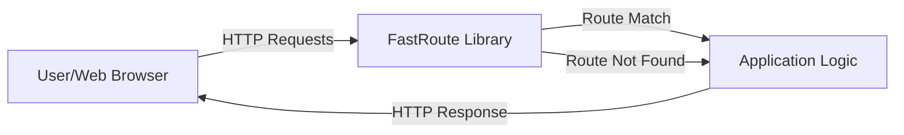
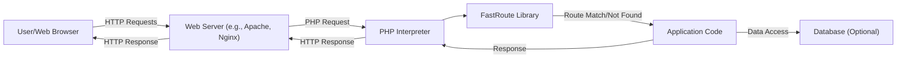
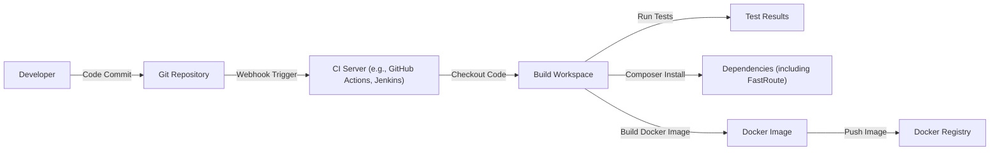

# BUSINESS POSTURE

Business Priorities and Goals:

*   Provide a fast and efficient routing library for PHP applications.
*   Offer a simple and intuitive API for developers to define routes.
*   Maintain high performance and minimal overhead.
*   Ensure compatibility with various PHP versions and frameworks.
*   Provide good documentation and support for users.

Business Risks:

*   Vulnerabilities in the routing logic could lead to unauthorized access or denial-of-service attacks.
*   Performance bottlenecks could impact the overall application performance.
*   Lack of compatibility with popular frameworks could limit adoption.
*   Inadequate documentation or support could lead to developer frustration.
*   Bugs or errors in the library could disrupt application functionality.

# SECURITY POSTURE

Existing Security Controls:

*   security control: Regular expression based route matching (implemented in `src/Dispatcher.php` and `src/RouteParser/Std.php`).
*   security control: Route parameter validation (partially implemented, type validation can be added by users).
*   security control: Tests covering different routing scenarios (present in the `test` directory).

Accepted Risks:

*   accepted risk: The library itself does not handle authentication or authorization. It is the responsibility of the application using the library to implement these security measures.
*   accepted risk: The library does not provide built-in protection against common web vulnerabilities like XSS or CSRF. It is assumed that the application using the library will handle these concerns.
*   accepted risk: The library does not perform any input sanitization. It is assumed that the application will sanitize user input before passing it to the router.

Recommended Security Controls:

*   security control: Implement stricter input validation for route parameters to prevent potential injection attacks.
*   security control: Provide options for users to define custom validation rules for route parameters.
*   security control: Add security-focused tests to identify potential vulnerabilities.
*   security control: Consider adding support for route-specific middleware to allow developers to easily implement security checks.

Security Requirements:

*   Authentication: Not directly handled by the library. The application using FastRoute is responsible for authentication.
*   Authorization: Not directly handled by the library. The application using FastRoute is responsible for authorization.
*   Input Validation:
    *   Route parameters should be validated against expected data types and formats.
    *   Regular expressions used for route matching should be carefully reviewed to prevent ReDoS (Regular Expression Denial of Service) vulnerabilities.
*   Cryptography: Not applicable to the core functionality of the routing library.

# DESIGN

## C4 CONTEXT

Element Description:

*   Element:
    *   Name: User/Web Browser
    *   Type: External Entity
    *   Description: Represents the user or a web browser making HTTP requests to the application.
    *   Responsibilities: Initiates HTTP requests. Receives and processes HTTP responses.
    *   Security controls: None (handled by the application).

*   Element:
    *   Name: FastRoute Library
    *   Type: Software System
    *   Description: The FastRoute library responsible for matching incoming HTTP requests to defined routes.
    *   Responsibilities: Parses incoming request URI. Matches the URI against defined routes. Extracts route parameters. Returns route information or a "not found" indication.
    *   Security controls: Regular expression based route matching. Route parameter validation (partial).

*   Element:
    *   Name: Application Logic
    *   Type: Software System
    *   Description: The application code that uses the FastRoute library.
    *   Responsibilities: Defines routes using the FastRoute API. Handles requests based on matched routes. Implements business logic.
    *   Security controls: Authentication, Authorization, Input validation, Output encoding (responsibility of the application).

## C4 CONTAINER

Element Description:

*   Element:
    *   Name: User/Web Browser
    *   Type: External Entity
    *   Description: Represents the user or a web browser making HTTP requests.
    *   Responsibilities: Initiates HTTP requests. Receives and processes HTTP responses.
    *   Security controls: None (handled by the application).

*   Element:
    *   Name: Web Server (e.g., Apache, Nginx)
    *   Type: Container
    *   Description: The web server that receives incoming HTTP requests.
    *   Responsibilities: Receives HTTP requests. Forwards requests to the PHP interpreter. Serves static content (optional).
    *   Security controls: Web server configuration (e.g., TLS, access control).

*   Element:
    *   Name: PHP Interpreter
    *   Type: Container
    *   Description: The PHP interpreter that executes the application code.
    *   Responsibilities: Executes PHP code. Handles requests and responses.
    *   Security controls: PHP configuration (e.g., disable dangerous functions).

*   Element:
    *   Name: FastRoute Library
    *   Type: Container
    *   Description: The FastRoute library.
    *   Responsibilities: Parses request URI. Matches URI against routes. Extracts parameters.
    *   Security controls: Regular expression based route matching. Route parameter validation (partial).

*   Element:
    *   Name: Application Code
    *   Type: Container
    *   Description: The application code that uses FastRoute.
    *   Responsibilities: Defines routes. Handles requests. Implements business logic.
    *   Security controls: Authentication, Authorization, Input validation, Output encoding.

*   Element:
    *   Name: Database (Optional)
    *   Type: Container
    *   Description: An optional database used by the application.
    *   Responsibilities: Stores and retrieves data.
    *   Security controls: Database security configuration (e.g., access control, encryption).

## DEPLOYMENT

Possible Deployment Solutions:

1.  Traditional LAMP/LEMP stack: PHP application deployed on a server with Apache/Nginx, MySQL, and PHP.
2.  Containerized deployment: PHP application packaged into a Docker container and deployed using Docker Compose, Kubernetes, or other container orchestration platforms.
3.  Serverless deployment: PHP application deployed as a serverless function using platforms like AWS Lambda, Azure Functions, or Google Cloud Functions.

Chosen Deployment Solution (Containerized Deployment with Docker Compose):

```mermaid
graph LR
    Developer["Developer"] --> Git["Git Repository"]
    Git -- "Code Push" --> CI_CD["CI/CD Pipeline"]
    CI_CD -- "Build & Push" --> DockerRegistry["Docker Registry"]
    DockerRegistry -- "Pull Image" --> Server["Deployment Server"]
    Server --> DockerCompose["Docker Compose"]
    DockerCompose --> WebContainer["Web Server Container (Nginx)"]
    DockerCompose --> PHPContainer["PHP-FPM Container"]
    WebContainer -- "Proxy Requests" --> PHPContainer
    PHPContainer -- "Application Code" --> AppCode["Application Code (including FastRoute)"]

```

Element Description:

*   Element:
    *   Name: Developer
    *   Type: External Entity
    *   Description: The developer writing and deploying the code.
    *   Responsibilities: Writes code. Commits and pushes code to the repository.
    *   Security controls: Code review, secure coding practices.

*   Element:
    *   Name: Git Repository
    *   Type: Infrastructure Node
    *   Description: The repository storing the application code (e.g., GitHub, GitLab).
    *   Responsibilities: Stores code. Version control.
    *   Security controls: Access control, branch protection rules.

*   Element:
    *   Name: CI/CD Pipeline
    *   Type: Infrastructure Node
    *   Description: The CI/CD pipeline responsible for building and deploying the application.
    *   Responsibilities: Automates build, test, and deployment processes.
    *   Security controls: Secure configuration, access control.

*   Element:
    *   Name: Docker Registry
    *   Type: Infrastructure Node
    *   Description: The registry storing the Docker images.
    *   Responsibilities: Stores and serves Docker images.
    *   Security controls: Access control, image scanning.

*   Element:
    *   Name: Deployment Server
    *   Type: Infrastructure Node
    *   Description: The server where the application is deployed.
    *   Responsibilities: Hosts the Docker containers.
    *   Security controls: Server hardening, firewall, intrusion detection.

*   Element:
    *   Name: Docker Compose
    *   Type: Infrastructure Node
    *   Description: The tool used to define and manage the multi-container application.
    *   Responsibilities: Orchestrates the containers.
    *   Security controls: Secure configuration.

*   Element:
    *   Name: Web Server Container (Nginx)
    *   Type: Container Instance
    *   Description: The container running the Nginx web server.
    *   Responsibilities: Receives HTTP requests. Proxies requests to the PHP-FPM container.
    *   Security controls: Nginx configuration (e.g., TLS, access control).

*   Element:
    *   Name: PHP-FPM Container
    *   Type: Container Instance
    *   Description: The container running the PHP-FPM process.
    *   Responsibilities: Executes the PHP application code.
    *   Security controls: PHP configuration (e.g., disable dangerous functions).

*   Element:
    *   Name: Application Code (including FastRoute)
    *   Type: Component Instance
    *   Description: The application code, including the FastRoute library.
    *   Responsibilities: Handles requests, implements business logic, uses FastRoute for routing.
    *   Security controls: Authentication, Authorization, Input validation, Output encoding (application responsibility). Regular expression based route matching, Route parameter validation (partial) (FastRoute responsibility).

## BUILD

Build Process Description:

1.  Developer commits code to the Git repository.
2.  A webhook triggers the CI server (e.g., GitHub Actions, Jenkins).
3.  The CI server checks out the code into a build workspace.
4.  Tests are executed (unit tests, integration tests, etc.).
5.  Dependencies are installed using Composer (including FastRoute).
6.  A Docker image is built, containing the application code and its dependencies.
7.  The Docker image is pushed to a Docker registry.

Security Controls in Build Process:

*   security control: Code review before merging to the main branch.
*   security control: Automated testing (unit tests, integration tests) to identify bugs and vulnerabilities.
*   security control: Dependency management using Composer to ensure that the correct versions of libraries are used.
*   security control: Static analysis security testing (SAST) can be integrated into the CI pipeline to scan for potential vulnerabilities.
*   security control: Software Composition Analysis (SCA) can be used to identify known vulnerabilities in dependencies.
*   security control: Container image scanning to identify vulnerabilities in the base image and installed packages.
*   security control: Secure configuration of the CI server and build environment.

# RISK ASSESSMENT

Critical Business Processes:

*   The primary business process is the routing of incoming HTTP requests to the correct application logic. Any disruption to this process would prevent the application from functioning correctly.

Data to Protect and Sensitivity:

*   FastRoute itself does not handle sensitive data directly. However, the application using FastRoute might handle sensitive data, such as:
    *   User authentication credentials (e.g., usernames, passwords, tokens). Sensitivity: High.
    *   Personal data (e.g., names, addresses, email addresses). Sensitivity: High.
    *   Financial data (e.g., credit card numbers, bank account details). Sensitivity: High.
    *   Application-specific data (e.g., internal data, proprietary information). Sensitivity: Varies depending on the application.

# QUESTIONS & ASSUMPTIONS

Questions:

*   Are there any specific regulatory requirements or compliance standards that the application must adhere to (e.g., GDPR, PCI DSS)?
*   What is the expected traffic volume and performance requirements for the application?
*   Are there any existing security policies or guidelines that should be followed?
*   What is the threat model for the application? What are the potential attackers and their motivations?
*   What level of logging and monitoring is required for the application?

Assumptions:

*   BUSINESS POSTURE: The primary goal is to provide a fast and reliable routing library. Security is important, but performance should not be significantly impacted.
*   SECURITY POSTURE: The application using FastRoute is responsible for implementing most security controls, including authentication, authorization, and input validation.
*   DESIGN: The application will be deployed using a containerized approach (e.g., Docker). The CI/CD pipeline will include automated testing and security checks.