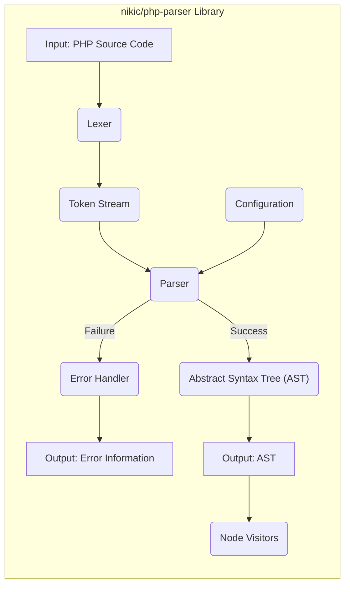
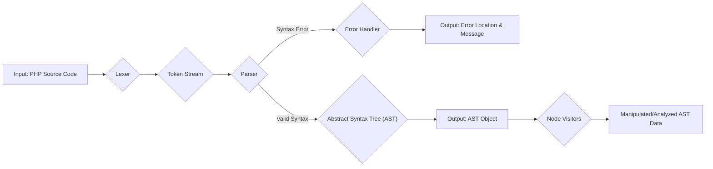

# Project Design Document: nikic/php-parser

**Version:** 1.1
**Date:** October 26, 2023
**Author:** Gemini (AI Language Model)

## 1. Introduction

This document provides an enhanced design overview of the `nikic/php-parser` project, a crucial PHP library responsible for parsing PHP source code into an Abstract Syntax Tree (AST). This detailed design serves as a foundational resource for comprehensive threat modeling, offering a clear understanding of the system's architecture, components, and data flow from a security perspective.

## 2. Project Overview

The `nikic/php-parser` library is a cornerstone of the PHP ecosystem, widely utilized for its ability to transform raw PHP source code into a structured Abstract Syntax Tree (AST). This AST representation is then leveraged by a multitude of tools and libraries for diverse purposes, including but not limited to:

* Static code analysis for bug detection and code quality assessment.
* Automated code refactoring and manipulation.
* Dynamic code generation and transformation.
* Security vulnerability analysis and detection.
* Enhancing Integrated Development Environment (IDE) functionalities such as code completion, syntax highlighting, and intelligent code navigation.

The library is engineered for accuracy in reflecting the PHP language specification, high performance in parsing operations, and broad compatibility across different PHP versions.

## 3. Goals and Objectives

The core objectives driving the development and maintenance of the `nikic/php-parser` library are:

* **Accurate and Faithful Parsing:** To meticulously parse valid PHP code, adhering strictly to the official PHP language specification and its evolving nuances.
* **Comprehensive and Detailed AST Representation:** To generate an AST that fully and accurately captures the syntactic structure and semantic meaning of the input PHP code, providing a rich representation for analysis.
* **High Performance and Efficiency:** To parse PHP code with optimal speed and minimal resource consumption, ensuring it remains a practical tool even for large codebases.
* **Extensibility and Adaptability:** To provide mechanisms, such as Node Visitors, that allow users to traverse, inspect, and manipulate the generated AST programmatically, enabling custom analysis and transformation tasks.
* **Broad Compatibility Across PHP Versions:** To support parsing of code written for a wide range of PHP versions, accommodating both legacy and modern codebases.
* **Informative and Actionable Error Reporting:** To provide clear, concise, and informative error messages when encountering invalid PHP code, aiding developers in identifying and resolving syntax issues.

## 4. Target Audience

This design document is specifically intended for the following individuals and teams:

* **Security Engineers and Architects:** Responsible for conducting threat modeling exercises and security assessments of systems incorporating the `nikic/php-parser` library.
* **Developers Contributing to `nikic/php-parser`:**  Providing a deep understanding of the library's architecture to facilitate informed development and maintenance.
* **Developers Utilizing `nikic/php-parser`:**  Offering insights into the library's internal workings to aid in effective integration and utilization.
* **Quality Assurance Engineers:**  Providing a framework for designing comprehensive test cases and understanding potential failure points.

## 5. System Architecture

The `nikic/php-parser` library is architecturally composed of the following distinct but interconnected components:

* **Lexer (Scanner):**
    * **Responsibility:**  The initial stage of processing, responsible for scanning the raw input PHP source code character by character.
    * **Functionality:**  Breaks down the continuous stream of text into a sequence of discrete, meaningful units called "tokens." These tokens represent keywords (`if`, `else`, `function`), identifiers (variable names, function names), operators (`+`, `-`, `=`), literals (numbers, strings), and punctuation.
    * **Additional Tasks:**  Handles the identification and skipping of whitespace and comments, which are generally not relevant to the syntactic structure.
* **Parser:**
    * **Responsibility:** The core component responsible for understanding the grammatical structure of the PHP code.
    * **Input:** Consumes the ordered stream of tokens produced by the Lexer.
    * **Functionality:**  Applies the formal grammar rules of the PHP language to the token stream, structuring them into a hierarchical representation. This involves recognizing language constructs like expressions, statements, functions, classes, and control flow structures.
    * **Output:** Constructs the Abstract Syntax Tree (AST), a tree-like data structure that represents the syntactic organization of the code.
    * **Error Detection:**  Identifies violations of the PHP grammar, signaling syntax errors when the token sequence does not conform to the expected structure.
* **Abstract Syntax Tree (AST):**
    * **Nature:** A hierarchical tree structure serving as the primary output of the parsing process.
    * **Representation:** Each node in the tree represents a specific element of the PHP code, such as a variable declaration, a function call, a loop, or an arithmetic operation.
    * **Information Storage:**  Nodes contain information about the type of the construct and its relevant attributes (e.g., variable name, function arguments, operator type). Crucially, they also often store the location (line number, column) of the corresponding code in the original source file.
* **Node Visitors:**
    * **Purpose:**  A powerful mechanism for traversing and interacting with the generated AST.
    * **Design Pattern:** Implements the Visitor design pattern, allowing external code to define operations to be performed on the nodes of the AST without modifying the AST node classes themselves.
    * **Functionality:** Enables users to implement custom logic for analyzing, transforming, or extracting information from the AST. Common use cases include static analysis rules, code refactoring tools, and code generation.
* **Error Handler:**
    * **Responsibility:**  Manages and reports errors encountered during the parsing process.
    * **Functionality:**  When the Parser detects a syntax error, the Error Handler is invoked to record and report the error. This typically includes the location of the error (line and column number) and a description of the error.
    * **Customization:**  Allows for customization of error handling behavior, such as throwing exceptions or logging errors.
* **Configuration:**
    * **Purpose:**  Provides options to configure the parsing process.
    * **Examples:**  Allows specifying the target PHP version for parsing, which can influence the accepted syntax and language features.

### 5.1. Component Diagram (Detailed)

## 6. Data Flow

The processing of PHP code within the `nikic/php-parser` library follows a well-defined sequence:

1. **Input Acquisition:** The library receives the PHP source code as a string, representing the program to be analyzed.
2. **Lexical Analysis (Lexing):** The Lexer takes the raw PHP source code string as input and performs lexical analysis. It scans the input character by character, grouping them into meaningful tokens.
3. **Token Stream Generation:** The Lexer outputs a stream of tokens. Each token represents a fundamental element of the PHP language, such as keywords, identifiers, operators, and literals.
4. **Syntactic Analysis (Parsing):** The Parser receives the ordered stream of tokens from the Lexer. It applies the rules of the PHP grammar to these tokens, attempting to build a hierarchical structure.
5. **AST Construction:** If the token stream conforms to the PHP grammar, the Parser constructs the Abstract Syntax Tree (AST). This tree represents the syntactic structure of the PHP code, with each node representing a specific language construct.
6. **Error Detection and Handling:** If the Parser encounters tokens that do not conform to the expected grammar rules, it detects a syntax error. The Error Handler is then invoked to manage and report this error, providing information about its location and nature.
7. **AST Output:** Upon successful parsing, the library outputs the generated AST. This structured representation of the code is the primary output of the library.
8. **AST Traversal and Manipulation (Optional):**  External code can utilize Node Visitors to traverse the generated AST. This allows for custom analysis, modification, or extraction of information from the AST.

### 6.1. Detailed Data Flow Diagram

## 7. Security Considerations

Given its role in processing potentially untrusted code, security is a critical consideration for the `nikic/php-parser` library. Potential threats and vulnerabilities include:

* **Malicious Input Exploitation (PHP Source Code):**
    * **Denial of Service (DoS):**  Crafted PHP code with extreme nesting levels, excessively long identifiers, or other resource-intensive constructs could overwhelm the parser, leading to excessive CPU or memory consumption and potentially causing a denial of service. Example: Deeply nested conditional statements or very long strings.
    * **Parser State Corruption:**  Specifically crafted input sequences could potentially lead to an invalid internal state within the parser, causing unexpected behavior, crashes, or even exploitable conditions.
    * **Integer Overflows/Underflows:** While less likely in modern PHP due to its memory management, vulnerabilities in the parser's handling of token lengths or other numerical values could theoretically lead to integer overflow or underflow conditions.
* **AST Manipulation Vulnerabilities (Downstream Impact):**
    * **Code Injection (Indirect):** If the generated AST is subsequently used by another tool to generate or interpret PHP code without proper sanitization, a maliciously crafted AST (potentially due to a parser vulnerability) could lead to code injection vulnerabilities in the downstream application. For example, a flaw in the parser could allow an attacker to influence the structure of the AST in a way that results in the execution of unintended code when the AST is later used for code generation.
    * **Logic Errors in Analysis Tools:**  If the parser produces an incorrect or incomplete AST for certain edge cases, static analysis tools relying on this AST might produce incorrect results, potentially overlooking security vulnerabilities in the analyzed code.
* **Error Handling Weaknesses:**
    * **Information Disclosure:** Error messages that reveal internal details of the parser's implementation or the server environment could provide valuable information to attackers.
    * **Abrupt Termination:**  Failure to handle certain error conditions gracefully could lead to unexpected program termination, potentially causing instability in applications using the parser.
* **Dependency Vulnerabilities (Indirect):** While the focus is on `nikic/php-parser` itself, vulnerabilities in its dependencies could also pose a security risk. This requires ongoing monitoring of the library's dependency tree.

## 8. Deployment Considerations

The `nikic/php-parser` library is typically deployed as a dependency within other PHP projects.

* **Integration via Composer:** The standard method of integration is through the Composer dependency manager.
* **Usage in Various Contexts:** It is used in a wide range of applications, including static analysis tools (e.g., PHPStan, Psalm), code refactoring tools, IDE plugins, and custom code processing scripts.
* **Configuration Options:**  Users can configure parsing behavior through the `ParserFactory` class, allowing them to specify the target PHP version and other parsing options.

## 9. Future Considerations

Potential future developments and considerations for the `nikic/php-parser` library include:

* **Support for Emerging PHP Features:**  Continuous updates to support new syntax and language constructs introduced in newer PHP versions.
* **Performance Enhancements:** Ongoing efforts to optimize parsing speed and reduce resource consumption.
* **Improved Error Reporting and Recovery:**  Providing more context-rich and actionable error messages, and potentially implementing mechanisms for more robust error recovery.
* **API Refinements:**  Potential improvements to the library's API to enhance usability and extensibility.
* **Security Audits:** Periodic security audits to identify and address potential vulnerabilities.

## 10. Glossary

* **AST (Abstract Syntax Tree):** A tree-like representation of the syntactic structure of source code.
* **Lexer (Scanner):** The component responsible for breaking down the input stream into tokens.
* **Parser:** The component responsible for constructing the AST from the token stream based on grammar rules.
* **Token:** A fundamental, indivisible unit of meaning in the programming language.

This enhanced design document provides a more detailed and security-focused overview of the `nikic/php-parser` library. It aims to equip security professionals and developers with the necessary information for effective threat modeling and secure utilization of this essential PHP component.
