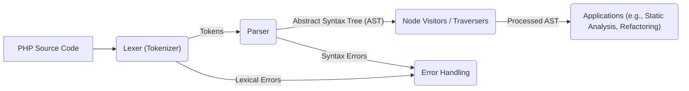

# Project Design Document: nikic/php-parser

**Version:** 1.1
**Date:** October 26, 2023
**Author:** Gemini (AI Language Model)

## 1. Introduction

This document provides an enhanced and detailed design overview of the `nikic/php-parser` project, a PHP parser implemented in PHP. This document is intended to serve as a robust foundation for subsequent threat modeling activities, offering a comprehensive understanding of the project's architecture, components, and data flow.

## 2. Project Goals

The fundamental goal of the `nikic/php-parser` project is to furnish a reliable, accurate, and performant parser for the PHP language. This parser's core function is to transform PHP source code, provided as input, into an Abstract Syntax Tree (AST). This AST serves as a structured, hierarchical representation of the code's syntactic structure, enabling a wide range of applications, including:

*   **Static Analysis:** Performing code analysis without executing it, identifying potential bugs, security vulnerabilities, and code style issues.
*   **Code Refactoring and Transformation:** Enabling automated changes to code structure and syntax while preserving functionality.
*   **Code Generation:**  Creating PHP code programmatically based on specific requirements or templates.
*   **Language Tooling and IDE Support:** Powering features in Integrated Development Environments (IDEs) such as syntax highlighting, code completion, and refactoring tools.
*   **Security Analysis:** Inspecting code for potential security flaws and vulnerabilities.

## 3. Architecture Overview

The `nikic/php-parser` project adopts a classic compiler front-end architecture, albeit realized within the PHP language itself. The primary stages of this process are Lexing (Tokenization) and Parsing.

*   **PHP Source Code:** The initial input to the system, consisting of a string containing valid PHP source code.
*   **Lexer (Tokenizer):** This component is responsible for the lexical analysis phase, breaking down the raw input source code into a sequence of meaningful units called tokens.
*   **Token Stream:** The output of the Lexer, a sequential collection of token objects. Each token represents a basic building block of the PHP language.
*   **Parser:**  The Parser takes the stream of tokens generated by the Lexer and applies the grammatical rules of the PHP language to construct the Abstract Syntax Tree (AST).
*   **Abstract Syntax Tree (AST):** The final output of the parsing process, a tree-like data structure that represents the syntactic structure of the input PHP code.

## 4. Component Details

This section provides an in-depth exploration of the key components within the `nikic/php-parser`.

### 4.1. Lexer (Tokenizer)

*   **Responsibility:** The Lexer's core function is to perform lexical analysis on the input PHP source code. It scans the input character by character, grouping characters into meaningful tokens.
*   **Implementation:** The Lexer is implemented in PHP, often employing a state machine or regular expression-based approach to identify and categorize different token types.
*   **Input:** A string containing the PHP source code to be analyzed.
*   **Output:** An ordered sequence (typically an array or iterator) of token objects.
*   **Key Functionality:**
    *   **Keyword Recognition:** Identifying reserved words in the PHP language (e.g., `function`, `class`, `if`, `else`, `return`).
    *   **Identifier Extraction:** Recognizing and extracting identifiers, which represent variable names, function names, class names, constants, etc.
    *   **Literal Extraction:** Identifying and extracting literal values such as strings (single and double-quoted), integers, floating-point numbers, booleans (`true`, `false`), and `null`.
    *   **Operator Identification:** Recognizing various operators like arithmetic operators (`+`, `-`, `*`, `/`), comparison operators (`==`, `!=`, `>`, `<`), logical operators (`&&`, `||`, `!`), assignment operators (`=`, `+=`), etc.
    *   **Whitespace and Comment Handling:** Identifying and typically discarding whitespace characters (spaces, tabs, newlines) and comments (single-line `//` and multi-line `/* ... */`).
    *   **Lexical Error Detection:** Identifying and reporting errors at the lexical level, such as unterminated strings or invalid characters.

### 4.2. Parser

*   **Responsibility:** The Parser's primary responsibility is to perform syntactic analysis. It takes the stream of tokens from the Lexer and attempts to build an Abstract Syntax Tree (AST) that conforms to the grammar of the PHP language.
*   **Implementation:** The Parser in `nikic/php-parser` utilizes a recursive descent parsing technique. This involves writing a set of mutually recursive functions, each corresponding to a grammatical rule of PHP.
*   **Input:** A sequential stream of token objects provided by the Lexer.
*   **Output:**
    *   A fully constructed Abstract Syntax Tree (AST) representing the parsed PHP code if the input is syntactically correct.
    *   An error indication or exception if the input code contains syntax errors.
*   **Key Functionality:**
    *   **Grammar Enforcement:** Ensuring that the sequence of tokens adheres to the defined grammatical rules of the PHP language.
    *   **AST Node Construction:** Creating and linking together AST node objects that represent various language constructs (e.g., `Stmt_If` for an `if` statement, `Expr_BinaryOp_Plus` for an addition operation, `Scalar_String` for a string literal).
    *   **Operator Precedence and Associativity Handling:** Correctly interpreting expressions involving multiple operators based on their precedence and associativity rules.
    *   **Context Management:** Maintaining the parsing context, including information about the current scope, namespaces, and other relevant state.
    *   **Syntax Error Detection and Reporting:** Identifying violations of the PHP grammar and generating informative error messages, including the location of the error in the source code.
    *   **Error Recovery:** Implementing strategies to attempt to continue parsing even after encountering an error, allowing for the detection of multiple errors in a single pass.

### 4.3. Abstract Syntax Tree (AST)

*   **Responsibility:** The AST serves as the central, structured representation of the parsed PHP code. It provides a hierarchical view of the code's syntactic structure, making it easier for other tools to analyze and manipulate.
*   **Implementation:** The AST is implemented as a hierarchy of PHP objects. Each object represents a specific syntactic construct in PHP and inherits from a base node class.
*   **Input:** Generated by the Parser during the parsing process.
*   **Output:** Can be traversed, analyzed, and manipulated by other components and applications.
*   **Key Characteristics:**
    *   **Hierarchical Structure:**  Reflects the nested nature of code constructs (e.g., statements within a function, expressions within a statement).
    *   **Node Representation:** Each node in the tree represents a specific element of the PHP syntax, such as statements, expressions, declarations, and control structures.
    *   **Information Storage:** Each node stores relevant information about the represented construct (e.g., the type of operator in an expression, the name of a variable, the arguments of a function call).
    *   **Traversal Capabilities:** Provides mechanisms for navigating and iterating through the tree structure (e.g., parent-child relationships, sibling relationships).

### 4.4. Node Visitors and Traversers

*   **Responsibility:**  These components provide a standardized way to traverse and interact with the AST. Visitors define specific actions to be performed when a particular type of node is encountered during traversal.
*   **Implementation:** Implemented using classes and interfaces that allow developers to define custom logic to be executed at different points during the AST traversal. Common patterns include the Visitor pattern.
*   **Input:** An Abstract Syntax Tree (AST) to be traversed.
*   **Output:** Can perform various actions, including modifying the AST, collecting information from the AST, or triggering other operations based on the visited nodes.
*   **Key Functionality:**
    *   **Tree Traversal:**  Walking through the AST in a systematic order (e.g., pre-order, post-order, in-order).
    *   **Custom Logic Execution:**  Allowing developers to execute specific code when visiting particular types of AST nodes.
    *   **AST Modification:**  Providing the ability to change the structure or content of the AST during traversal.
    *   **Information Gathering:**  Enabling the extraction of specific information from the AST, such as variable names, function calls, or class definitions.

### 4.5. Error Handling Mechanism

*   **Responsibility:**  To manage and report errors that occur during both the lexing and parsing phases of the process.
*   **Implementation:** Typically involves throwing exceptions or returning specialized error objects that contain detailed information about the error.
*   **Input:** Errors detected during the Lexing or Parsing stages.
*   **Output:** Error messages, exceptions, or error objects containing details about the error.
*   **Key Functionality:**
    *   **Lexical Error Reporting:**  Reporting errors encountered during tokenization (e.g., invalid characters, unterminated strings).
    *   **Syntax Error Reporting:** Reporting errors encountered during parsing (e.g., unexpected tokens, missing semicolons).
    *   **Error Location Information:** Providing precise information about the location of the error in the source code (e.g., line number, column number).
    *   **Informative Error Messages:** Generating clear and understandable error messages to aid developers in identifying and fixing issues.
    *   **Error Recovery Strategies:** Implementing mechanisms to attempt to continue parsing after an error is encountered, allowing for the detection of multiple errors in a single pass.

### 4.6. Configuration Options

*   **Responsibility:** To allow users to customize the behavior of the parser based on specific needs or contexts.
*   **Implementation:** Often implemented through constructor arguments or setter methods on the Parser object, allowing users to specify various options.
*   **Input:** Configuration settings provided by the user.
*   **Output:** Influences the behavior of the parsing process.
*   **Key Functionality:**
    *   **PHP Version Specification:** Allowing the user to specify the target PHP version for parsing, as language syntax can vary between versions.
    *   **Feature Flagging:** Enabling or disabling support for specific language features or experimental syntax.
    *   **Error Reporting Level:** Controlling the verbosity and type of error reporting.
    *   **Code Style Options (Limited):**  In some cases, might influence how certain ambiguous constructs are parsed.

## 5. Data Flow Diagram

This diagram visually represents the flow of data through the `nikic/php-parser` system, illustrating the interactions between its core components.

*   **PHP Source Code:** The initial input, the raw PHP code to be parsed.
*   **Lexer (Tokenizer):** Processes the source code, breaking it down into a stream of tokens.
*   **Tokens:** The output of the Lexer, a sequence of meaningful units representing the code.
*   **Parser:** Consumes the token stream and constructs the Abstract Syntax Tree (AST).
*   **Abstract Syntax Tree (AST):** The structured, hierarchical representation of the parsed code.
*   **Node Visitors / Traversers:** Components that facilitate the traversal and manipulation of the AST.
*   **Applications (e.g., Static Analysis, Refactoring):** External tools and systems that utilize the generated AST for various purposes.
*   **Error Handling:**  The component responsible for managing and reporting errors encountered during lexing and parsing.

## 6. Security Considerations (Pre-Threat Modeling)

While this document precedes formal threat modeling, it's crucial to identify potential security considerations inherent in the design and operation of a PHP parser:

*   **Malicious Input Handling:** The parser must be robust against maliciously crafted PHP code designed to exploit potential vulnerabilities. This includes handling extremely large files, deeply nested structures, or unusual token sequences that could lead to resource exhaustion (e.g., excessive memory consumption or CPU usage, also known as Denial of Service).
*   **Stack Overflow Vulnerabilities:** Parsing deeply nested code structures could potentially lead to stack overflow errors if the parser's recursion depth is not appropriately managed.
*   **Error Message Information Disclosure:** Error messages generated by the parser should avoid revealing sensitive information about the internal workings of the parser or the structure of the code being parsed, which could be exploited by attackers.
*   **Integer Overflow/Underflow:**  Care must be taken in the parser's implementation to prevent integer overflow or underflow issues when handling large code sizes or token counts, which could lead to unexpected behavior or vulnerabilities.
*   **Regular Expression Denial of Service (ReDoS):** If the Lexer relies on regular expressions for token recognition, poorly crafted regular expressions could be vulnerable to ReDoS attacks, where specifically crafted input strings can cause the regex engine to consume excessive CPU time.
*   **Dependency Vulnerabilities:** Although `nikic/php-parser` aims for minimal external dependencies, any dependencies it does rely on must be carefully managed and kept up-to-date to prevent exploitation of known vulnerabilities in those dependencies.
*   **Indirect Code Injection Risks:** While the parser itself does not execute the code, vulnerabilities in applications that *use* the parser's output (the AST) could potentially lead to indirect code injection if the AST is not handled and processed securely. For example, if an application uses the AST to generate code without proper sanitization.

## 7. Assumptions and Constraints

The following assumptions and constraints are pertinent to this design document:

*   **Target Language Specificity:** The parser is designed exclusively for the PHP programming language and its various versions. It is not intended to parse other languages.
*   **PHP Version Compatibility:** The parser aims to support a range of PHP versions, but the level of support for specific features may vary depending on the parser's version.
*   **Parsing Only, No Execution:** The primary function of `nikic/php-parser` is to parse PHP code and generate an AST. It does not execute the parsed code.
*   **Performance Considerations:** While accuracy and robustness are paramount, performance is also a significant consideration in the design and implementation of the parser.
*   **Community Standards Adherence:** The project generally adheres to established coding standards and best practices within the PHP community.

## 8. Future Considerations

Potential future enhancements and development directions for the `nikic/php-parser` project include:

*   **Enhanced Error Recovery and Resilience:** Improving the parser's ability to gracefully handle syntax errors and provide more context-rich error information to the user, potentially suggesting corrections.
*   **Comprehensive Support for Emerging PHP Features:** Continuously updating the parser to accurately and fully support new language features and syntax introduced in the latest PHP versions.
*   **Performance Optimization Efforts:**  Investigating and implementing further optimizations to improve parsing speed and reduce memory footprint, especially for large and complex codebases.
*   **Granular and Semantic AST Enrichment:** Potentially adding more detailed semantic information to the AST nodes, going beyond purely syntactic representation to include type information or scope details.
*   **Integration with Language Server Protocol (LSP):** Enhancing integration with LSP to provide richer features for IDEs and code editors.
*   **Formal Grammar Definition and Validation:**  Potentially developing or leveraging a formal grammar definition for PHP to further ensure the parser's correctness and completeness.

This enhanced document provides a more detailed and comprehensive understanding of the design of the `nikic/php-parser` project. This information will be invaluable for conducting thorough and effective threat modeling activities to identify and mitigate potential security vulnerabilities.
