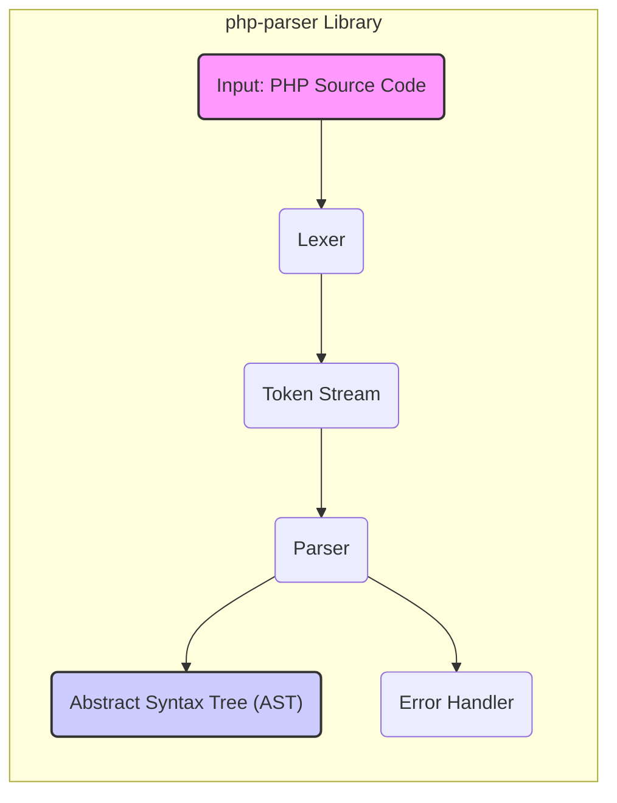
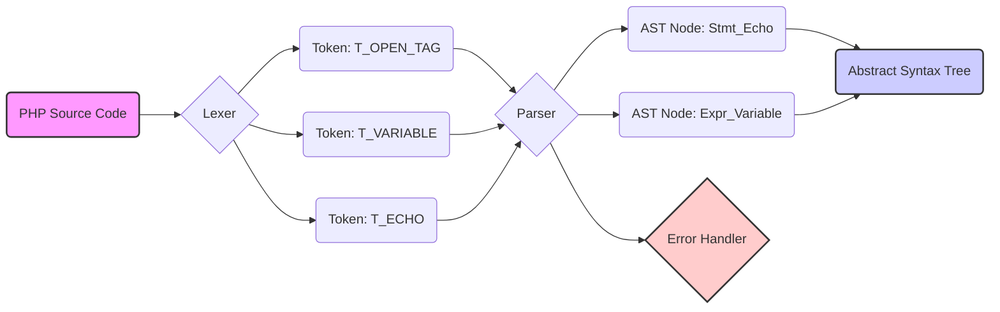

# Project Design Document: php-parser

**Version:** 1.1
**Date:** October 26, 2023
**Author:** AI Software Architect

## 1. Introduction

This document provides an enhanced design overview of the `php-parser` project, a PHP library dedicated to parsing PHP source code into an Abstract Syntax Tree (AST). This detailed design serves as a crucial foundation for subsequent threat modeling exercises, offering a clear and comprehensive understanding of the system's architecture, constituent components, and the flow of data within it.

## 2. Goals and Scope

The primary objective of the `php-parser` library is to furnish a reliable and precise mechanism for the programmatic analysis of PHP code. The scope of this design document encompasses the fundamental functionality of the library: the parsing of PHP code and the generation of the corresponding AST. It details the essential components involved in this process and the movement of data between them.

## 3. Target Audience

This document is intended for a diverse audience:

* Security engineers and architects tasked with threat modeling the `php-parser` library or systems that integrate it.
* Developers actively contributing to or maintaining the `php-parser` library.
* Individuals seeking an in-depth understanding of the library's internal operations.

## 4. System Overview

The `php-parser` library accepts PHP source code as input and produces an Abstract Syntax Tree (AST) as its output. This AST provides a hierarchical representation of the PHP code's structure, facilitating programmatic analysis and manipulation by other tools and applications.

The core parsing process involves two key stages: lexical analysis (tokenization) and syntactic analysis (parsing). The library is intentionally designed for flexibility and extensibility, accommodating various parser implementations and AST node structures.

## 5. Architectural Design

The `php-parser` library employs a modular design, with distinct components responsible for specific stages of the parsing workflow.

### 5.1. Key Components

* **Lexer (or Scanner):**
    * Executes the initial lexical analysis of the input PHP source code.
    * Decomposes the raw text into a sequential stream of tokens. Each token represents a fundamental unit of the PHP language (e.g., keywords, identifiers, operators, literals).
    * Manages character encoding and performs basic syntax recognition at the token level.
    * Implemented in PHP.
* **Parser:**
    * Performs the syntactic analysis of the token stream received from the Lexer.
    * Constructs the Abstract Syntax Tree (AST) by applying the grammatical rules of the PHP language to the sequence of tokens.
    * Embodies the formal grammar of the PHP language.
    * Can have different implementations, potentially employing various parsing techniques.
    * Implemented in PHP.
* **Abstract Syntax Tree (AST) Nodes:**
    * Represents the parsed PHP code in a hierarchical, tree-like structure.
    * Each node within the tree corresponds to a specific construct within the PHP language (e.g., a function call, a variable assignment, a loop structure).
    * Defined by a structured hierarchy of PHP classes, each representing a different type of language construct.
    * Provides methods for navigating and manipulating the AST programmatically.
* **Error Handler:**
    * Manages and reports errors encountered during both the lexical and syntactic analysis phases.
    * Provides mechanisms for reporting errors, typically including information such as the line number and a descriptive error message.
    * Can be customized to implement different error handling strategies.
    * Implemented in PHP.
* **Configuration Options:**
    * Enables the customization of the parsing process.
    * Allows control over aspects such as the level of error reporting, the specific PHP language version to be parsed against, and the enabling/disabling of certain language features.
    * Typically configured through PHP code or configuration arrays.

### 5.2. Component Diagram (Mermaid)

## 6. Data Flow

The parsing of PHP code involves a well-defined sequence of data transformations as it moves between the components.

### 6.1. Detailed Parsing Process

1. **Input Stage:** The process commences with PHP source code provided as a string.
2. **Lexical Analysis Phase:** The Lexer receives the input source code and systematically breaks it down into a stream of individual tokens. Each token represents a semantically meaningful unit of the language, such as `T_VARIABLE` (for variables), `T_FUNCTION` (for function declarations), or `T_STRING` (for string literals).
3. **Syntactic Analysis Phase:** The Parser receives the ordered stream of tokens generated by the Lexer. It analyzes this sequence of tokens according to the predefined grammatical rules of the PHP language.
4. **AST Construction Phase:** Based on the successful parsing of the token stream, the Parser constructs the Abstract Syntax Tree (AST). Each distinct language construct identified in the PHP code is represented by a corresponding node within the AST. The relationships between these nodes reflect the hierarchical structure of the code.
5. **Output Stage:** The fully constructed AST is the final output of the parsing process. This AST can then be utilized by other tools for various purposes, including static analysis, code generation, or automated code transformations.
6. **Error Handling Mechanism:** If the Lexer or Parser encounters any deviations from the expected syntax or identifies invalid code constructs, the Error Handler is invoked. The Error Handler manages these issues, typically by recording and reporting the location and nature of the error.

### 6.2. Data Flow Diagram (Mermaid)

## 7. Security Considerations (For Threat Modeling)

This section highlights key security considerations that warrant further investigation during the threat modeling process. These points represent potential areas of vulnerability or risk.

* **Malicious PHP Code Injection Vulnerabilities:**
    * If `php-parser` is employed to process PHP code originating from untrusted sources, vulnerabilities within the Lexer or Parser could be exploited. Attackers might craft malicious input designed to trigger unexpected behavior, cause crashes, or potentially achieve remote code execution within the context where the parser is operating.
    * Specific areas of concern include the handling of edge cases in the PHP syntax, processing of syntactically ambiguous code, or the parsing of exceptionally large or deeply nested code structures.
* **Denial of Service (DoS) Potential:**
    * Maliciously crafted PHP code could be designed to consume excessive computational resources (CPU, memory) during the parsing process, leading to a denial of service.
    * Examples include code with extremely deep nesting levels, excessively long lines without line breaks, or other constructs that impose significant strain on the parsing algorithms.
* **Integer Overflow/Underflow Risks:**
    * If the Lexer or Parser performs calculations on input sizes, offsets, or other numerical values without adequate bounds checking, integer overflows or underflows could occur. These can potentially lead to memory corruption or other forms of unexpected and potentially exploitable behavior.
* **Memory Exhaustion Vulnerabilities:**
    * Processing exceptionally large or highly complex PHP files could lead to excessive memory allocation during the construction of the AST, potentially resulting in memory exhaustion errors and program termination.
* **Error Handling Exploitation:**
    * If the error handling mechanisms within `php-parser` are not robust or are overly verbose in their output, attackers might be able to trigger specific error conditions to gain insights into the internal workings of the parser or potentially bypass security checks in systems utilizing the library.
* **Dependency Chain Risks:**
    * While `php-parser` aims for minimal external dependencies, it's crucial to continuously monitor the security of any dependencies (direct or indirect). Vulnerabilities in these dependencies could indirectly impact the security posture of `php-parser` itself. Regularly auditing the `composer.json` and its resolved dependencies is essential.

## 8. Deployment Considerations

The `php-parser` library is typically integrated as a dependency within other PHP applications and tools. It is not designed to be deployed as a standalone application. Consequently, the security context of `php-parser` is largely inherited from the application in which it is embedded.

* **Common Use Cases:**
    * Development of static analysis tools for code quality and security auditing.
    * Implementation of code refactoring and transformation tools.
    * Integration within Integrated Development Environments (IDEs) and code editors for features like syntax highlighting and code completion.
    * Building security analysis tools for identifying potential vulnerabilities in PHP code.
    * Development of code transformation tools for tasks like code modernization or optimization.

## 9. Dependencies

The `php-parser` library strives to minimize its reliance on external dependencies, primarily leveraging standard PHP language features. However, it is imperative to consult the `composer.json` file for the specific version of the library being used to identify any direct dependencies.

* **Dependency Verification:**
    * **Crucially, examine the `require` and `require-dev` sections of the `composer.json` file.** This will provide an authoritative list of both runtime and development dependencies.
    * Be aware of transitive dependencies – dependencies of the direct dependencies. Tools like `composer depends --tree` can help visualize the full dependency tree.

## 10. Future Considerations

* **Enhanced Performance:** Ongoing efforts to optimize the parsing process, particularly for handling very large PHP codebases more efficiently.
* **Comprehensive PHP Feature Support:** Continuous updates to ensure the parser accurately supports all new language features introduced in subsequent PHP versions.
* **Improved Extensibility Mechanisms:** Further development of the library's extensibility to facilitate the creation of custom language extensions or support for specific PHP dialects.

## 11. Conclusion

This enhanced design document provides a detailed and up-to-date overview of the `php-parser` library, thoroughly describing its architecture, constituent components, and the flow of data during the parsing process. This information is essential for conducting effective threat modeling activities aimed at identifying and mitigating potential security vulnerabilities. A strong understanding of the library's internal workings empowers security professionals to accurately assess the risks associated with its use and implement appropriate security measures.