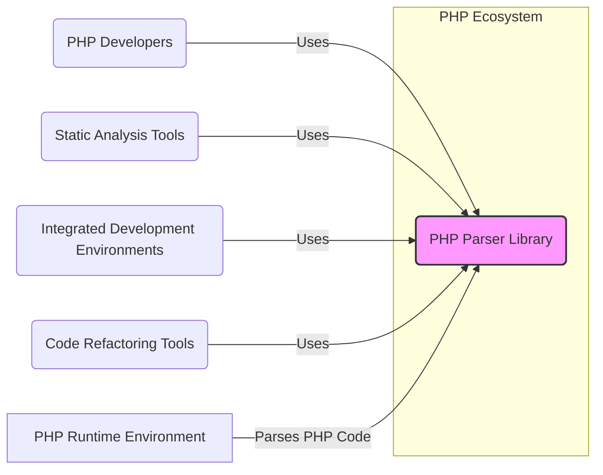
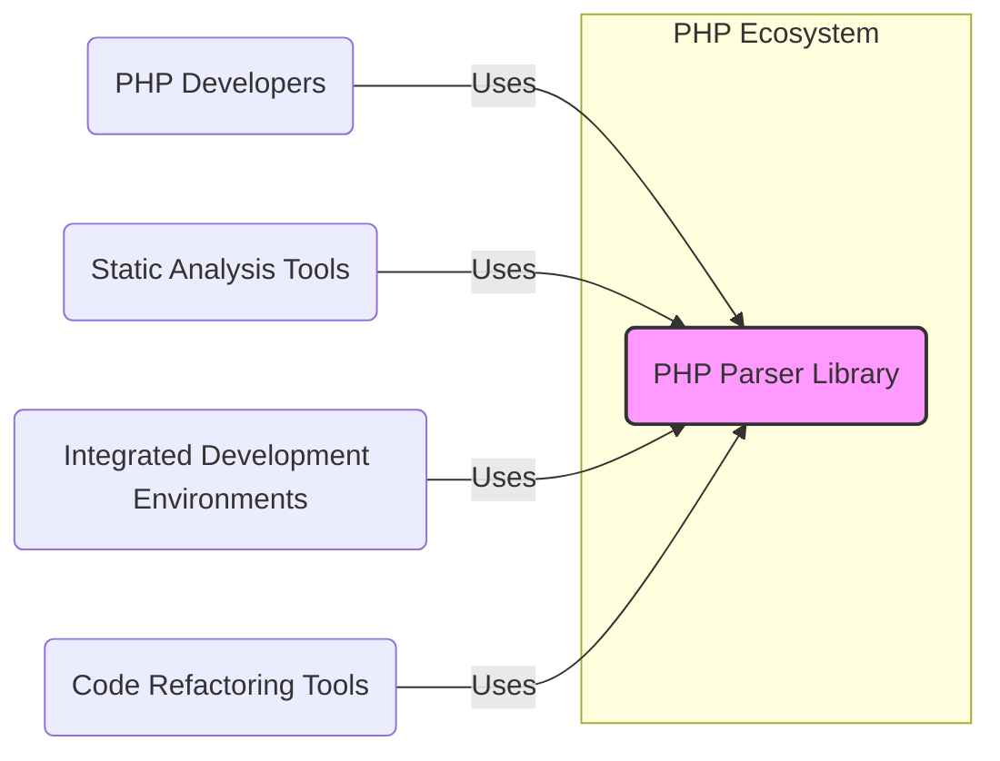
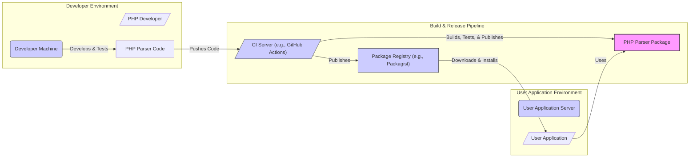
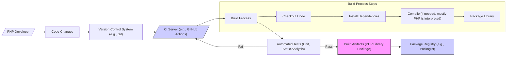

# BUSINESS POSTURE

This project, php-parser, provides a PHP parser library. The primary business goal is to offer a robust, reliable, and accurate tool for parsing PHP code. This library serves as a foundational component for various software development tools and applications that need to understand, analyze, or manipulate PHP code programmatically.

Business priorities include:
- Accuracy: The parser must correctly interpret the PHP language syntax to ensure tools built upon it function as expected.
- Performance:  Efficient parsing is crucial for tools that need to process large volumes of PHP code quickly.
- Compatibility:  Support for various PHP versions is important to cater to a wide range of users and projects.
- Maintainability:  The library should be easy to maintain and update to address bug fixes, security vulnerabilities, and support for new PHP language features.
- Community Adoption:  Widespread adoption by the PHP development community enhances the library's value and sustainability.

Most important business risks that need to be addressed:
- Incorrect parsing:  Bugs in the parser can lead to misinterpretations of PHP code, causing malfunctions in tools that rely on it.
- Security vulnerabilities in the parser:  Exploitable vulnerabilities in the parser itself could be leveraged to attack applications that use it to process untrusted PHP code.
- Lack of maintenance:  If the library is not actively maintained, it may become outdated, incompatible with newer PHP versions, and vulnerable to security issues.
- Performance bottlenecks:  Inefficient parsing can slow down tools and applications, impacting user experience.
- Limited adoption:  Low adoption can hinder the library's long-term viability and limit its impact on the PHP ecosystem.

# SECURITY POSTURE

Existing security controls:
- security control: Code review - The project is open source and hosted on GitHub, allowing for community code review. (Implemented on GitHub)
- security control: Static analysis -  Likely used by developers during development, although not explicitly stated in the repository. (Developer responsibility)
- security control: Unit testing -  The repository includes a test suite, indicating unit testing is performed. (Implemented in repository's test suite)
- security control: Open source - Transparency of open source allows for public scrutiny and vulnerability reporting. (Nature of open source project)

Accepted risks:
- accepted risk: Dependency vulnerabilities -  The project depends on PHP itself and potentially development tools. Vulnerabilities in these dependencies are an accepted risk.
- accepted risk:  Community reported vulnerabilities - Reliance on community reporting for vulnerability discovery introduces a delay between vulnerability introduction and discovery.

Recommended security controls:
- security control: Automated static analysis - Integrate automated static analysis tools into the CI/CD pipeline to proactively identify potential security vulnerabilities in code changes.
- security control: Dependency scanning - Implement automated dependency scanning to detect and alert on known vulnerabilities in project dependencies.
- security control: Fuzz testing -  Consider incorporating fuzz testing to discover edge cases and potential vulnerabilities related to parsing complex or malformed PHP code.
- security control: Security focused code review -  Incorporate security focused code review practices, specifically looking for common parsing vulnerabilities (e.g., injection flaws, denial of service).
- security control: Vulnerability disclosure policy -  Establish a clear vulnerability disclosure policy to guide security researchers on how to report vulnerabilities responsibly.

Security requirements:
- Authentication: Not applicable - As a library, php-parser does not handle user authentication.
- Authorization: Not applicable - As a library, php-parser does not handle user authorization.
- Input validation: security requirement: Robust input validation is critical. The parser must be able to handle various forms of PHP code, including potentially malicious or malformed input, without crashing or exhibiting unexpected behavior. Input validation should be performed during the parsing process to ensure that the input conforms to the expected PHP syntax and structure.
- Cryptography: Not applicable -  As a parser, php-parser itself does not directly implement or require cryptography. However, it may parse PHP code that uses cryptography.

# DESIGN

## C4 CONTEXT

### C4 Context Elements

- Name: PHP Parser Library
  - Type: Software System
  - Description:  A PHP library that parses PHP code into an Abstract Syntax Tree (AST). This AST can then be used by other tools for analysis, manipulation, and code generation.
  - Responsibilities:
    - Accurately parse PHP code according to the PHP language specification.
    - Generate an Abstract Syntax Tree (AST) representing the parsed code.
    - Provide an API for accessing and traversing the AST.
  - Security controls:
    - security control: Input validation -  Parser logic includes validation to handle various PHP syntax and potentially malformed input.
    - security control: Memory management -  Efficient memory management to prevent denial of service attacks through excessive resource consumption during parsing.

- Name: PHP Developers
  - Type: Person
  - Description: Software developers who use the php-parser library directly in their projects or indirectly through other tools.
  - Responsibilities:
    - Integrate the php-parser library into their tools and applications.
    - Utilize the AST provided by the parser for their intended purposes.
    - Report bugs and contribute to the library's development.
  - Security controls:
    - security control: Secure coding practices - Developers are responsible for using the library securely within their own applications and handling the parsed AST appropriately.

- Name: Static Analysis Tools
  - Type: Software System
  - Description: Tools that analyze PHP code to identify potential bugs, security vulnerabilities, and code quality issues. These tools use php-parser to understand the structure of the code.
  - Responsibilities:
    - Utilize the php-parser library to parse PHP code.
    - Perform static analysis on the AST to detect code defects.
    - Report analysis results to developers.
  - Security controls:
    - security control: Input sanitization - Static analysis tools should sanitize or validate input PHP code before parsing to prevent potential injection attacks against the parser itself (though less likely in this context).

- Name: Integrated Development Environments (IDEs)
  - Type: Software System
  - Description: Software applications that provide comprehensive facilities to computer programmers for software development. IDEs use php-parser for features like code completion, syntax highlighting, and refactoring.
  - Responsibilities:
    - Integrate php-parser to enhance PHP code editing and development features.
    - Provide a user-friendly interface for developers to interact with PHP code.
  - Security controls:
    - security control: Secure plugin management - IDEs should have secure mechanisms for managing plugins and extensions, including those that might use php-parser, to prevent malicious extensions from compromising the IDE or the developer's system.

- Name: Code Refactoring Tools
  - Type: Software System
  - Description: Tools that automate the process of restructuring existing computer code—changing the factoring—without changing its external behavior. These tools rely on php-parser to understand the code structure for safe refactoring.
  - Responsibilities:
    - Use php-parser to parse and understand PHP code.
    - Apply refactoring operations to the AST.
    - Generate modified PHP code from the refactored AST.
  - Security controls:
    - security control:  Code generation safety - Refactoring tools must ensure that code generation from the modified AST is safe and does not introduce new vulnerabilities.

- Name: PHP Runtime Environment
  - Type: Software System
  - Description: The environment in which PHP code is executed. While not directly interacting with php-parser at runtime of applications using the library, the PHP runtime defines the language specification that php-parser must adhere to.
  - Responsibilities:
    - Execute PHP code.
    - Define the PHP language specification.
  - Security controls:
    - security control:  PHP Security Model - The PHP runtime environment itself has its own security model, including features like safe mode (deprecated), open_basedir, and security extensions, which indirectly influence the security context of applications using php-parser.

## C4 CONTAINER

### C4 Container Elements

- Name: PHP Parser Library
  - Type: Library (PHP)
  - Description:  A single PHP library providing the functionality to parse PHP code and generate an Abstract Syntax Tree (AST).  In this case, the container diagram is essentially the same as the context diagram as it's a single library.
  - Responsibilities:
    - Encapsulate all parsing logic within a reusable PHP library.
    - Provide a well-defined API for other PHP applications to use.
  - Security controls:
    - security control: API security -  Design a clear and secure API to minimize the risk of misuse by consuming applications.
    - security control:  Input validation (within library) -  All input processing within the library should include validation to prevent unexpected behavior or vulnerabilities.

- Name: PHP Developers, Static Analysis Tools, IDEs, Code Refactoring Tools
  - Type: External Systems/Users
  - Description:  Same as in the C4 Context diagram. They interact with the PHP Parser Library by including it in their projects or tools.
  - Responsibilities: Same as in the C4 Context diagram.
  - Security controls: Same as in the C4 Context diagram.

## DEPLOYMENT

For a PHP library, the "deployment" is primarily about how it's distributed and used by other PHP projects. A common deployment scenario is via package managers like Composer.

### Deployment Elements

- Name: Developer Machine
  - Type: Environment
  - Description: The local development environment of a PHP developer where they write, test, and debug the php-parser library code.
  - Responsibilities:
    - Code development and testing.
    - Running unit tests and potentially manual testing.
    - Committing and pushing code changes to a version control system.
  - Security controls:
    - security control: Developer workstation security - Standard security practices for developer workstations, such as OS hardening, antivirus, and access controls.

- Name: CI Server (e.g., GitHub Actions)
  - Type: Infrastructure
  - Description: A Continuous Integration server that automates the build, test, and release process for the php-parser library.
  - Responsibilities:
    - Automated building of the library.
    - Running automated tests (unit tests, static analysis).
    - Packaging the library for distribution.
    - Publishing the library package to a package registry.
  - Security controls:
    - security control: CI/CD pipeline security - Secure configuration of the CI/CD pipeline, including access controls, secret management, and secure build environments.
    - security control: Automated testing - Automated tests, including unit tests and static analysis, to detect vulnerabilities early in the development cycle.

- Name: Package Registry (e.g., Packagist)
  - Type: Infrastructure
  - Description: A public package registry where PHP packages, including php-parser, are published and made available for download by other PHP projects.
  - Responsibilities:
    - Hosting and distributing PHP packages.
    - Providing package management functionalities (e.g., versioning, dependency management).
  - Security controls:
    - security control: Package registry security - Security measures implemented by the package registry provider to protect against malware uploads and supply chain attacks.
    - security control: Package signing (if supported by registry) -  Using package signing to ensure the integrity and authenticity of the php-parser package.

- Name: User Application Server
  - Type: Environment
  - Description: The server environment where applications that depend on php-parser are deployed and run.
  - Responsibilities:
    - Running PHP applications.
    - Utilizing the php-parser library as a dependency.
  - Security controls:
    - security control: Server security - Standard server security practices, including OS hardening, firewalls, intrusion detection, and regular security updates.
    - security control: Dependency management - Securely managing dependencies, including php-parser, and keeping them updated to patch vulnerabilities.

## BUILD

### Build Elements

- Name: Developer
  - Type: Person
  - Description:  A software developer contributing to the php-parser project.
  - Responsibilities:
    - Writing and modifying code.
    - Running local tests.
    - Committing code changes.
  - Security controls:
    - security control: Secure coding practices - Writing secure code and following secure development guidelines.
    - security control: Code review (self and peer) - Reviewing code for potential security vulnerabilities before committing.

- Name: Version Control System (VCS) (e.g., Git)
  - Type: Infrastructure
  - Description:  A system for tracking changes to source code over time. GitHub is used for php-parser.
  - Responsibilities:
    - Storing and managing source code.
    - Tracking code changes and history.
    - Facilitating collaboration among developers.
  - Security controls:
    - security control: Access control -  Restricting access to the repository to authorized developers.
    - security control: Branch protection -  Using branch protection rules to prevent unauthorized changes to critical branches.
    - security control: Audit logging -  Logging access and changes to the repository.

- Name: CI Server (e.g., GitHub Actions)
  - Type: Infrastructure
  - Description:  A Continuous Integration server that automates the build and test process.
  - Responsibilities:
    - Automating the build process.
    - Running automated tests.
    - Performing static analysis and security checks.
    - Publishing build artifacts.
  - Security controls:
    - security control: CI/CD pipeline security -  Securing the CI/CD pipeline infrastructure and configurations.
    - security control: Automated security checks -  Integrating static analysis, linters, and dependency scanning into the build process.
    - security control: Secure build environment -  Using secure and isolated build environments to prevent build tampering.

- Name: Build Process
  - Type: Process
  - Description:  The automated steps involved in building the php-parser library from source code.
  - Responsibilities:
    - Checkout code from VCS.
    - Install dependencies.
    - Compile code (if necessary).
    - Package the library.
  - Security controls:
    - security control: Dependency management -  Using secure dependency management practices to prevent supply chain attacks.
    - security control: Build reproducibility -  Ensuring that builds are reproducible to verify integrity.

- Name: Automated Tests (Unit, Static Analysis)
  - Type: Process
  - Description:  Automated tests run during the build process to verify code correctness and identify potential issues.
  - Responsibilities:
    - Unit testing: Verify individual components of the library.
    - Static analysis:  Identify potential code quality and security vulnerabilities.
  - Security controls:
    - security control: Comprehensive test suite -  Maintaining a comprehensive test suite to cover various aspects of the library's functionality and security.
    - security control: Static analysis tools -  Using up-to-date and effective static analysis tools.

- Name: Artifacts (PHP Library Package)
  - Type: Data
  - Description:  The packaged PHP library (e.g., a ZIP or Phar file) produced by the build process.
  - Responsibilities:
    - Representing the distributable version of the php-parser library.
  - Security controls:
    - security control: Artifact integrity -  Ensuring the integrity of build artifacts through checksums or signing.

- Name: Package Registry (e.g., Packagist)
  - Type: Infrastructure
  - Description:  A public package registry for distributing PHP packages.
  - Responsibilities:
    - Hosting and distributing the php-parser package.
  - Security controls:
    - security control: Package registry security -  Relying on the security controls of the package registry provider.

# RISK ASSESSMENT

Critical business process we are trying to protect:
- Providing a reliable and accurate PHP parsing library.  The core business process is the development, maintenance, and distribution of the php-parser library itself.  Its reliability and accuracy are paramount for its users.

Data we are trying to protect and their sensitivity:
- Source code of the php-parser library:  Sensitivity is moderate.  While open source, unauthorized modification or corruption of the source code could lead to vulnerabilities or backdoors in the library, impacting all users.
- Build artifacts (PHP library package): Sensitivity is high.  Compromised build artifacts distributed through package registries could directly introduce malware or vulnerabilities into user applications, representing a significant supply chain risk.
- Development and build infrastructure: Sensitivity is high.  Compromise of developer machines or the CI/CD pipeline could lead to unauthorized code changes or compromised build artifacts.

# QUESTIONS & ASSUMPTIONS

Questions:
- Are there any specific compliance requirements for this project (e.g., GDPR, PCI DSS)? (Assumption: No specific compliance requirements beyond general good security practices for open-source software).
- Are there any specific performance benchmarks or requirements for the parser? (Assumption: Performance is important, but no specific hard requirements are provided beyond general efficiency).
- Is there a formal vulnerability disclosure policy in place? (Assumption:  A formal policy might not exist, but responsible disclosure is expected in the open-source community).
- Are there specific types of PHP code or language features that are particularly critical to parse correctly for the library's users? (Assumption:  General PHP language parsing accuracy is the primary goal, covering a wide range of PHP versions and syntax).

Assumptions:
- BUSINESS POSTURE: The primary business goal is to provide a general-purpose, reliable, and accurate PHP parser library for the PHP ecosystem.  Profitability is not the primary driver, but community adoption and sustainability are important.
- SECURITY POSTURE:  Security is important, but resources are likely limited, typical for open-source projects.  Focus should be on cost-effective security measures like automated checks, community engagement, and responsible disclosure.  The project benefits from the inherent transparency of open source.
- DESIGN: The design is relatively straightforward as it's a library.  The main design considerations are API clarity, parsing efficiency, and robustness in handling various PHP code inputs. Deployment is primarily through package managers.