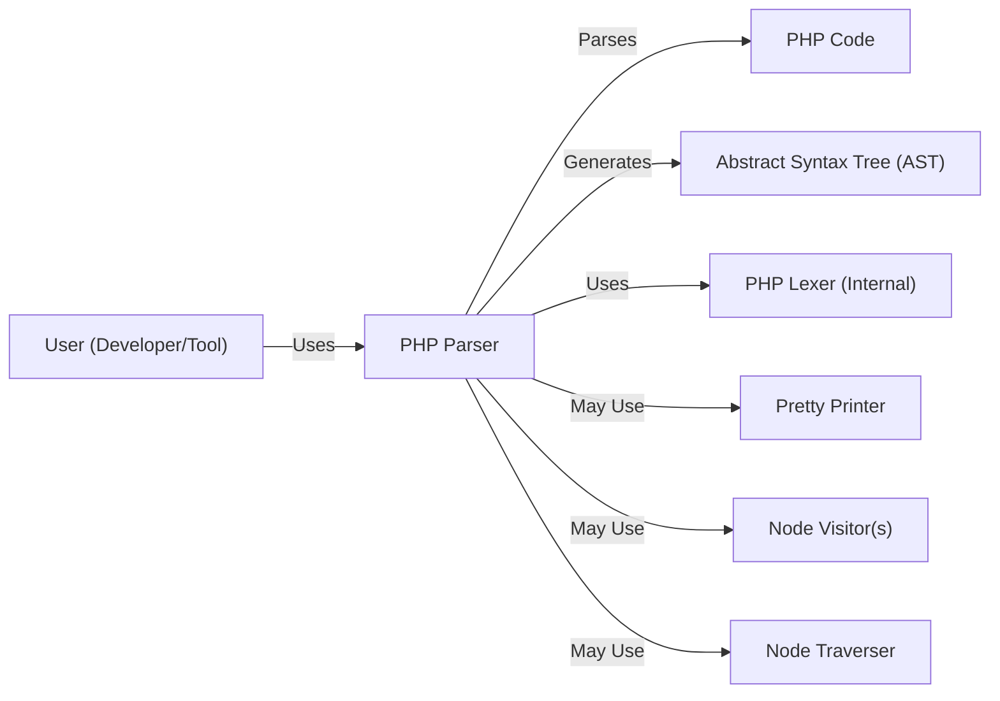
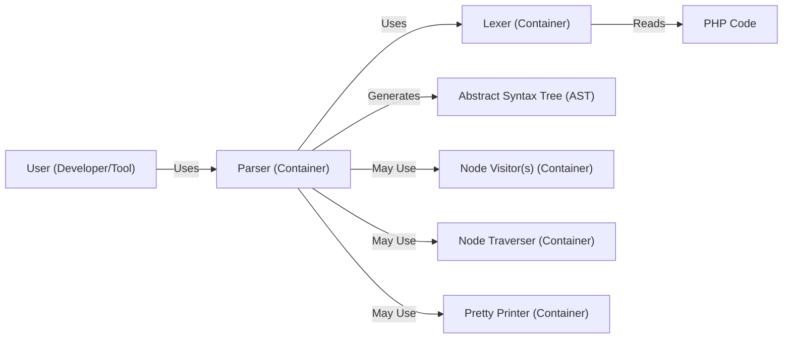
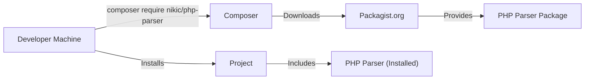
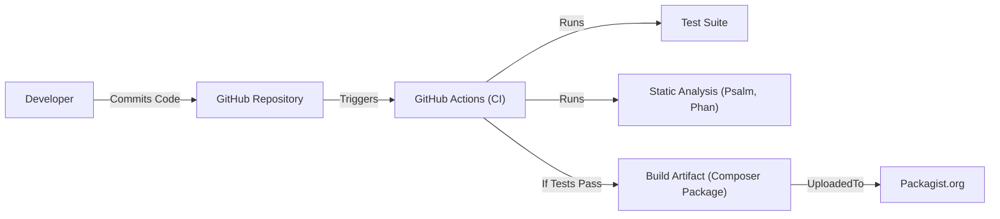

# BUSINESS POSTURE

Business Priorities and Goals:

*   Provide a robust and reliable PHP parser written in PHP.
*   Enable static analysis tools for PHP code.
*   Facilitate code refactoring and manipulation tools.
*   Support multiple PHP versions.
*   Maintain high performance and low memory consumption.
*   Provide clear and well-documented API.
*   Foster an active and engaged community.

Business Risks:

*   Inability to parse valid PHP code (correctness risk).
*   Incorrect parsing of valid PHP code (correctness risk).
*   Vulnerabilities in the parser that could be exploited by malicious code (security risk).
*   Performance bottlenecks that limit the parser's usefulness in large projects (performance risk).
*   Lack of support for new PHP versions, leading to obsolescence (maintenance risk).
*   Difficult to use API, limiting adoption (usability risk).

# SECURITY POSTURE

Existing Security Controls:

*   security control: The project uses a lexer (tokenizer) and a parser generator (nikic/php-parser itself relies on a grammar). This separation of concerns helps to reduce the attack surface.
*   security control: The project includes an extensive test suite that covers a wide range of PHP code, including edge cases and potential security vulnerabilities. (test suite in /test directory)
*   security control: The project is widely used, which means that it has been tested by a large number of users and developers, increasing the likelihood that vulnerabilities have been found and fixed.
*   security control: The project is open source, which allows for public scrutiny of the code and encourages contributions from security researchers.
*   security control: The project follows semantic versioning, which helps users to understand the impact of updates and to avoid breaking changes.
*   accepted risk: The parser may be vulnerable to denial-of-service (DoS) attacks if it is given extremely large or complex input.
*   accepted risk: The parser may not be able to handle all possible PHP code, especially code that uses obscure or deprecated features.

Recommended Security Controls:

*   security control: Implement fuzz testing to proactively identify potential vulnerabilities.
*   security control: Integrate static analysis tools into the development workflow to catch potential security issues early.
*   security control: Consider using a memory-safe language for performance-critical parts of the parser to mitigate memory corruption vulnerabilities. (This is a major architectural change and may not be feasible).
*   security control: Develop a security policy that outlines how vulnerabilities are reported, handled, and disclosed.

Security Requirements:

*   Authentication: Not applicable, as the parser is a library, not a service.
*   Authorization: Not applicable, as the parser is a library, not a service.
*   Input Validation: The parser must handle a wide range of inputs, including potentially malicious code. The lexer and parser should be designed to be robust against invalid or unexpected input. The parser should reject code that does not conform to the PHP grammar.
*   Cryptography: Not directly applicable, although the parser may be used to analyze code that uses cryptography.
*   Error Handling: The parser should handle errors gracefully and provide informative error messages. Errors should not expose sensitive information or lead to crashes.

# DESIGN

## C4 CONTEXT

Element Descriptions:

*   Element:
    *   Name: User (Developer/Tool)
    *   Type: Person
    *   Description: A developer or an automated tool that utilizes the PHP Parser library.
    *   Responsibilities: Integrates the PHP Parser into their projects, provides PHP code as input, and processes the resulting AST.
    *   Security controls: Not directly applicable, as this is an external entity.

*   Element:
    *   Name: PHP Parser
    *   Type: Software System
    *   Description: The core library that parses PHP code and generates an Abstract Syntax Tree (AST).
    *   Responsibilities: Parsing PHP code, generating AST, providing API for traversing and manipulating the AST.
    *   Security controls: Lexer/Parser separation, extensive test suite, wide usage, open-source nature, semantic versioning.

*   Element:
    *   Name: PHP Code
    *   Type: Input
    *   Description: The PHP code to be parsed.
    *   Responsibilities: Provides the source code for analysis.
    *   Security controls: Not directly applicable, as this is input data.

*   Element:
    *   Name: Abstract Syntax Tree (AST)
    *   Type: Output
    *   Description: The tree representation of the PHP code's structure.
    *   Responsibilities: Represents the parsed code in a structured format.
    *   Security controls: Not directly applicable, as this is output data.

*   Element:
    *   Name: PHP Lexer (Internal)
    *   Type: Component
    *   Description: Internal component responsible for tokenizing the PHP code.
    *   Responsibilities: Converts the raw PHP code into a stream of tokens.
    *   Security controls: Part of the Lexer/Parser separation.

*   Element:
    *   Name: Pretty Printer
    *   Type: Component
    *   Description: Optional component for converting the AST back into formatted PHP code.
    *   Responsibilities: Generates human-readable PHP code from the AST.
    *   Security controls: Input validation (of the AST).

*   Element:
    *   Name: Node Visitor(s)
    *   Type: Component
    *   Description: Optional components that implement the visitor pattern for traversing the AST.
    *   Responsibilities: Perform specific actions on different types of nodes in the AST.
    *   Security controls: Input validation (of the AST).

*   Element:
    *   Name: Node Traverser
    *   Type: Component
    *   Description: Optional component that manages the traversal of the AST using Node Visitors.
    *   Responsibilities: Controls the order in which nodes are visited.
    *   Security controls: Input validation (of the AST).

## C4 CONTAINER

Element Descriptions:

*   Element:
    *   Name: User (Developer/Tool)
    *   Type: Person
    *   Description: A developer or an automated tool that utilizes the PHP Parser library.
    *   Responsibilities: Integrates the PHP Parser into their projects, provides PHP code as input, and processes the resulting AST.
    *   Security controls: Not directly applicable.

*   Element:
    *   Name: Parser (Container)
    *   Type: Container
    *   Description: The main container that orchestrates the parsing process.
    *   Responsibilities: Manages the Lexer, Parser, Node Traverser, and Pretty Printer. Provides the main API for users.
    *   Security controls: Input validation, error handling.

*   Element:
    *   Name: Lexer (Container)
    *   Type: Container
    *   Description: The container responsible for lexical analysis (tokenization).
    *   Responsibilities: Converts the raw PHP code into a stream of tokens.
    *   Security controls: Robust handling of invalid input.

*   Element:
    *   Name: Abstract Syntax Tree (AST)
    *   Type: Data
    *   Description: The tree representation of the PHP code's structure.
    *   Responsibilities: Represents the parsed code in a structured format.
    *   Security controls: Not directly applicable.

*   Element:
    *   Name: Node Visitor(s) (Container)
    *   Type: Container
    *   Description: Containers that implement the visitor pattern for traversing the AST.
    *   Responsibilities: Perform specific actions on different types of nodes in the AST.
    *   Security controls: Input validation (of the AST).

*   Element:
    *   Name: Node Traverser (Container)
    *   Type: Container
    *   Description: Container that manages the traversal of the AST using Node Visitors.
    *   Responsibilities: Controls the order in which nodes are visited.
    *   Security controls: Input validation (of the AST).

*   Element:
    *   Name: Pretty Printer (Container)
    *   Type: Container
    *   Description: Container for converting the AST back into formatted PHP code.
    *   Responsibilities: Generates human-readable PHP code from the AST.
    *   Security controls: Input validation (of the AST).

*   Element:
    *   Name: PHP Code
    *   Type: Input
    *   Description: The PHP code to be parsed.
    *   Responsibilities: Provides the source code.
    *   Security controls: Not directly applicable.

## DEPLOYMENT

Possible Deployment Solutions:

1.  Composer Package: The primary deployment method is as a Composer package. This allows developers to easily integrate the library into their PHP projects.
2.  Standalone PHAR: A standalone PHAR file could be provided for users who don't use Composer.
3.  Docker Image: A Docker image could be created to provide a consistent environment for running the parser, especially for use in CI/CD pipelines.

Chosen Deployment Solution (Composer Package):

Element Descriptions:

*   Element:
    *   Name: Developer Machine
    *   Type: Infrastructure Node
    *   Description: The machine where the developer is working on their project.
    *   Responsibilities: Runs Composer commands, manages project dependencies.
    *   Security controls: Standard developer machine security practices.

*   Element:
    *   Name: Composer
    *   Type: Software
    *   Description: PHP's dependency management tool.
    *   Responsibilities: Resolves and downloads project dependencies.
    *   Security controls: Composer uses checksums to verify the integrity of downloaded packages.

*   Element:
    *   Name: Packagist.org
    *   Type: Infrastructure Node
    *   Description: The main Composer package repository.
    *   Responsibilities: Hosts PHP packages and their metadata.
    *   Security controls: Packagist.org has its own security measures to protect against malicious packages.

*   Element:
    *   Name: PHP Parser Package
    *   Type: Software
    *   Description: The PHP Parser library packaged for Composer.
    *   Responsibilities: Contains the library's code and metadata.
    *   Security controls: Versioning, checksum verification by Composer.

*   Element:
    *   Name: Project
    *   Type: Software System
    *   Description: The developer's PHP project that uses the PHP Parser.
    *   Responsibilities: The project that utilizes PHP Parser functionality.
    *   Security controls: Project-specific security controls.

*   Element:
    *   Name: PHP Parser (Installed)
    *   Type: Software
    *   Description: The PHP Parser library installed within the project.
    *   Responsibilities: Provides parsing functionality to the project.
    *   Security controls: Inherits security controls from the package and project.

## BUILD

Build Process Description:

1.  Developers commit code to the GitHub repository.
2.  GitHub Actions is triggered by commits and pull requests.
3.  The GitHub Actions workflow runs the test suite (using PHPUnit).
4.  The workflow also runs static analysis tools (e.g., Psalm, Phan) to identify potential code quality and security issues.
5.  If all tests and static analysis checks pass, a build artifact (the Composer package) is created.
6.  The artifact is not directly uploaded to Packagist.org from CI. Releases are likely created manually by tagging a commit, which then triggers a separate process (not shown) to publish to Packagist.

Security Controls in Build Process:

*   security control: Automated testing (PHPUnit) ensures code correctness and helps prevent regressions.
*   security control: Static analysis (Psalm, Phan) identifies potential code quality and security issues before deployment.
*   security control: GitHub Actions provides a consistent and reproducible build environment.
*   security control: Code review process (through pull requests) ensures that changes are reviewed by other developers before being merged.

# RISK ASSESSMENT

Critical Business Processes:

*   Providing a reliable and accurate PHP parsing capability.
*   Enabling static analysis and code manipulation tools.

Data to Protect:

*   Source Code (Input): Sensitivity varies depending on the code being parsed. The parser itself doesn't store the code, but it processes it. The primary concern is not confidentiality, but integrity – ensuring the parser correctly interprets the code.
*   Abstract Syntax Tree (AST) (Output): Similar to the source code, the sensitivity depends on the original code. Again, integrity is the primary concern.
*   No user data or credentials are handled by the parser itself.

# QUESTIONS & ASSUMPTIONS

Questions:

*   Are there any specific performance targets or limitations for the parser?
*   Are there any plans to support parsing of other languages or dialects related to PHP (e.g., Hack)?
*   What is the process for handling security vulnerability reports?
*   Is there a specific coding standard or style guide that should be followed?

Assumptions:

*   BUSINESS POSTURE: The primary goal is to provide a robust and reliable PHP parser for use in other tools and projects.
*   SECURITY POSTURE: The project prioritizes correctness and security, but performance is also a significant concern.
*   DESIGN: The existing design using a lexer and parser generator is sound and should be maintained. The use of Composer for dependency management is standard practice.