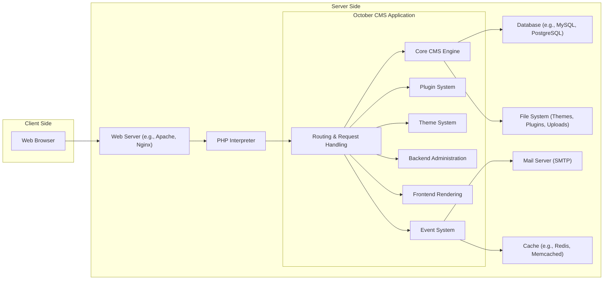

## Project Design Document: October CMS (Improved)

**1. Introduction**

This document provides an enhanced architectural design of the October CMS project, an open-source, self-hosted platform built upon the Laravel PHP Framework. This revised document aims to offer a more granular understanding of the system's components, their interactions, and data flow, specifically tailored for effective threat modeling.

**2. Project Overview**

October CMS remains a free, open-source, self-hosted content management system (CMS) leveraging the robust foundation of the Laravel PHP framework. Its core strengths lie in its simplicity, performance, and extensibility, catering primarily to web developers. It offers an intuitive backend interface for content management while providing a powerful and adaptable platform for constructing bespoke web applications and websites.

**3. Goals and Objectives**

*   Deliver a more detailed and refined overview of the October CMS architecture.
*   Provide a deeper understanding of the responsibilities and functionalities of key components.
*   Illustrate data flow with greater specificity, highlighting data transformation points.
*   Emphasize potential security concerns at an architectural level, categorized for clarity.
*   Serve as a robust and comprehensive foundation for subsequent threat modeling exercises.

**4. High-Level Architecture**



**5. Component Breakdown (Detailed)**

*   **Web Browser:** The user's primary interface for interacting with both the public website and the administrative backend.
*   **Web Server (e.g., Apache, Nginx):**  The entry point for all HTTP requests. It handles request routing, serves static assets, and passes dynamic requests to the PHP interpreter.
*   **PHP Interpreter:** Executes the PHP code that constitutes the October CMS application.
*   **October CMS Application:** The central logic of the system, encompassing several key sub-components:
    *   **Routing & Request Handling:**  Responsible for mapping incoming HTTP requests to specific controllers and actions within the application (provided by Laravel).
    *   **Core CMS Engine:**  Manages core CMS functionalities such as content management (pages, content blocks), user authentication and authorization, settings management, and media management.
    *   **Plugin System:**  Provides a modular architecture for extending CMS functionality. Plugins can introduce new features, modify existing behavior, and integrate with external services.
    *   **Theme System:**  Controls the presentation layer of the website. Themes define the layout, styling, and templates used to render content.
    *   **Backend Administration:**  The web interface used by administrators to manage the CMS, including content, users, plugins, themes, and settings. It handles authentication, authorization, and provides CRUD (Create, Read, Update, Delete) operations for various entities.
    *   **Frontend Rendering:**  Responsible for generating the HTML output served to website visitors based on the requested page, associated theme, and data retrieved from the database.
    *   **Event System:**  A mechanism for decoupling components and allowing plugins and themes to react to specific events within the CMS lifecycle.
*   **Database (e.g., MySQL, PostgreSQL):**  The persistent storage layer for all dynamic data:
    *   Content items (pages, blog posts, etc.) and their attributes.
    *   User accounts, roles, and permissions.
    *   System configuration settings.
    *   Plugin and theme configurations and data.
    *   Media library metadata.
*   **File System (Themes, Plugins, Uploads):** Stores various files essential to the CMS:
    *   Theme files (templates, stylesheets, JavaScript, images).
    *   Plugin code, assets, and configuration files.
    *   User-uploaded media files (images, documents, videos).
*   **Mail Server (SMTP):**  Facilitates the sending of emails triggered by the CMS, such as:
    *   Password reset requests.
    *   User registration confirmations.
    *   Form submission notifications.
    *   System alerts.
*   **Cache (e.g., Redis, Memcached):** An optional but highly recommended component for improving performance by storing frequently accessed data in memory, reducing database load.

**6. Data Flow (Detailed)**

*   **Frontend Page Request (Enhanced Detail):**
    *   User's web browser initiates an HTTP request for a specific URL.
    *   The **Web Server** receives the request.
    *   The **Web Server** forwards the request to the **PHP Interpreter**.
    *   **October CMS Application (Routing & Request Handling)** analyzes the URL and determines the appropriate route and controller.
    *   The designated controller in the **Core CMS Engine** or a **Plugin** processes the request.
    *   The controller may interact with the **Database** to retrieve content data using Eloquent ORM.
    *   The controller passes data to the **Theme System**.
    *   The **Theme System** uses Blade templates to render the HTML output.
    *   The rendered HTML is returned to the **PHP Interpreter**.
    *   The **PHP Interpreter** sends the response back to the **Web Server**.
    *   The **Web Server** delivers the HTML to the user's **Web Browser**.

    ```mermaid
    graph LR
        A["Web Browser"] --> B["Web Server"]
        B --> C["PHP Interpreter"]
        C --> D["October CMS Application - Routing"]
        D --> E["October CMS Application - Controller (Core/Plugin)"]
        E --> K["Database"]
        K -- Data --> E
        E --> G["October CMS Application - Theme System"]
        G -- Rendered HTML --> C
        C --> B
        B --> A
    ```

*   **Backend Content Creation (Enhanced Detail):**
    *   Administrator interacts with the **Backend Administration** interface in the web browser, submitting content creation data.
    *   The browser sends an authenticated HTTP request to the **Web Server**.
    *   The **Web Server** forwards the request to the **PHP Interpreter**.
    *   **October CMS Application (Routing & Request Handling)** routes the request to the appropriate backend controller.
    *   The backend controller in the **Core CMS Engine** handles authentication and authorization.
    *   The controller validates the submitted data.
    *   The controller interacts with the **Database** to create a new content record.
    *   The controller may trigger **Events** that other plugins can listen to.
    *   The controller may interact with the **File System** to store uploaded media.
    *   The controller may invalidate or update the **Cache**.
    *   A response indicating success or failure is returned to the **PHP Interpreter**.
    *   The **PHP Interpreter** sends the response back to the **Web Server**.
    *   The **Web Server** delivers the response to the administrator's **Web Browser**.

    ```mermaid
    graph LR
        A["Admin Web Browser"] --> B["Web Server"]
        B --> C["PHP Interpreter"]
        C --> D["October CMS Application - Routing (Backend)"]
        D --> H["October CMS Application - Backend Controller"]
        H -- Authenticate/Authorize --> E["October CMS Application - Core CMS Engine"]
        H -- Validate Data --> H
        H -- Write Data --> K["Database"]
        H --> L["File System"]
        H --> N["Cache (Optional)"]
        H --> J["October CMS Application - Event System"]
        J -- Trigger Event --> F["October CMS Application - Plugins"]
        H --> C
        C --> B
        B --> A
    ```

**7. Security Considerations (Categorized)**

*   **Authentication and Authorization:**
    *   Weak or default credentials for administrative accounts.
    *   Insufficient protection against brute-force attacks on login forms.
    *   Vulnerabilities in session management leading to session hijacking or fixation.
    *   Inadequate role-based access control, allowing unauthorized access to sensitive features.
*   **Input Validation and Output Encoding:**
    *   Lack of proper input sanitization leading to Cross-Site Scripting (XSS) vulnerabilities.
    *   Insufficient input validation allowing for SQL Injection attacks.
    *   Failure to sanitize user-uploaded files, potentially leading to remote code execution.
    *   Improper handling of data leading to Cross-Site Request Forgery (CSRF) vulnerabilities.
*   **Data Protection:**
    *   Storing sensitive data (e.g., passwords) without proper encryption.
    *   Lack of secure communication (HTTPS) exposing data in transit.
    *   Insufficient access controls on the database and file system.
    *   Exposure of sensitive information through error messages or debugging output.
*   **Plugin and Theme Security:**
    *   Vulnerabilities in third-party plugins or themes introducing security flaws.
    *   Lack of secure coding practices in plugin and theme development.
    *   Installation of plugins or themes from untrusted sources.
*   **Configuration and Deployment:**
    *   Exposed configuration files containing sensitive information.
    *   Using default or insecure server configurations.
    *   Lack of regular security updates for the CMS core, framework, and dependencies.
    *   Insufficient monitoring and logging for security events.

**8. Technology Stack (Specifics)**

*   **Programming Language:** PHP (version 7.4 or higher recommended)
*   **Framework:** Laravel (version 6.0 or higher recommended)
*   **Database:** MySQL (version 5.6+), PostgreSQL (version 9.2+), SQLite
*   **Web Server:** Apache (with mod_php or PHP-FPM), Nginx (with PHP-FPM)
*   **Frontend Technologies:** HTML5, CSS3, JavaScript
*   **Templating Engine:** Blade (Laravel's templating engine)
*   **Caching (Optional):** Redis, Memcached, APCu
*   **Package Manager:** Composer (for managing PHP dependencies)
*   **JavaScript Package Manager:** npm or Yarn (for managing frontend dependencies)

**9. Deployment Model (Security Implications)**

*   **Shared Hosting:**  Security is heavily reliant on the hosting provider. Limited control over server configuration increases the risk of vulnerabilities affecting multiple websites.
*   **Virtual Private Server (VPS):** Offers more control over the server environment, allowing for better security hardening. Requires more technical expertise for configuration and maintenance.
*   **Cloud Platforms (e.g., AWS, Google Cloud, Azure):** Provides scalable infrastructure and various security services. Security responsibilities are shared between the cloud provider and the user. Proper configuration of cloud security features is crucial.
*   **Dedicated Server:** Offers the highest level of control and isolation, allowing for maximum security customization. Requires significant technical expertise and resources for management.

**10. Conclusion**

This improved design document provides a more detailed and structured understanding of the October CMS architecture, specifically tailored for threat modeling. By elaborating on component responsibilities, data flow, and categorizing potential security concerns, this document serves as a more robust foundation for identifying and mitigating potential vulnerabilities within the system. Continuous review and updates to this document are recommended as the project evolves.