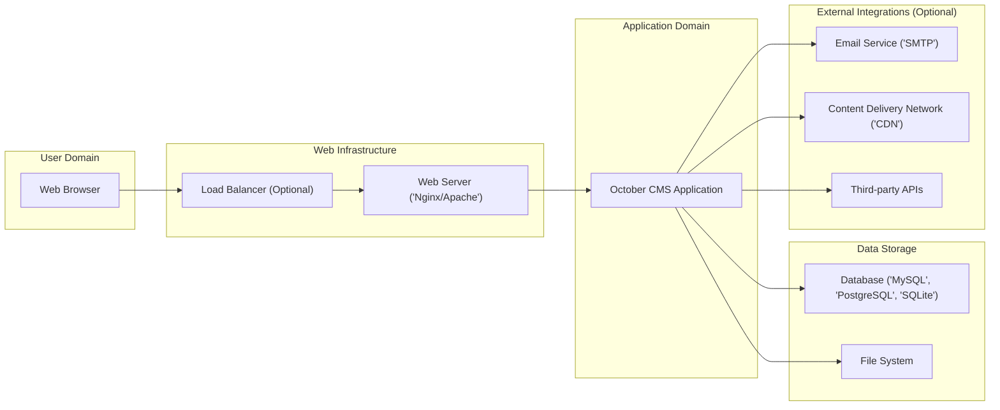
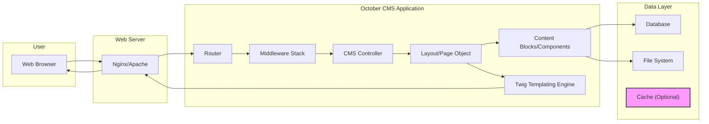

## Project Design Document: October CMS (Improved)

**1. Introduction**

This document provides a detailed architectural design of the October CMS, an open-source, self-hosted content management system built upon the robust Laravel PHP Framework. The purpose of this document is to clearly delineate the key components, their interactions, and the overall system structure. This detailed design serves as a foundational resource for subsequent threat modeling and security analysis activities.

**2. Goals and Objectives**

*   Provide a comprehensive and easily understandable overview of the October CMS architecture.
*   Clearly identify and describe the responsibilities of each key component within the system.
*   Illustrate the flow of data throughout the application lifecycle.
*   Highlight critical security considerations inherent in the architecture to facilitate threat identification.
*   Serve as a definitive reference point for future threat modeling exercises and security assessments.

**3. High-Level Architecture**

**Description:**

*   **User Domain:** Represents the end-user interacting with the October CMS website or application through a web browser.
*   **Web Infrastructure:**
    *   **Load Balancer (Optional):** Distributes incoming traffic across multiple web server instances for scalability and high availability.
    *   **Web Server ('Nginx/Apache'):**  Receives incoming HTTP requests from users and routes them to the October CMS application. Common choices are Nginx or Apache.
*   **Application Domain:** This is the core of the October CMS, built on the Laravel framework. It encompasses the application logic, request processing, and interactions with the data storage layer.
*   **Data Storage:**
    *   **Database ('MySQL', 'PostgreSQL', 'SQLite'):** Stores structured data, including website content, user information, system settings, and plugin data.
    *   **File System:** Stores unstructured data such as media assets (images, videos), theme files, plugin files, and configuration files.
*   **External Integrations (Optional):** October CMS can integrate with various external services to extend its functionality:
    *   **Email Service ('SMTP'):** Used for sending transactional emails and notifications.
    *   **Content Delivery Network ('CDN'):**  Caches static assets closer to users, improving website performance.
    *   **Third-party APIs:** Enables integration with external services for features like payment processing, social media integration, and analytics.

**4. Component Breakdown**

This section provides a more detailed breakdown of the key components within the October CMS application domain.

*   **Frontend Rendering Engine (Themes & Layouts):**
    *   Primary responsibility is the presentation of content to the end-user.
    *   Utilizes the Twig templating engine for dynamic content rendering and separation of concerns.
    *   Manages static assets including CSS stylesheets, JavaScript files, and images.
    *   Supports a flexible and hierarchical structure of layouts, partial views, and content blocks, allowing for modular design.
    *   Handles theme customization and management through the backend interface or file system.

*   **Backend Administration Panel:**
    *   Provides a secure interface for administrators and authorized users to manage the website and its content.
    *   Handles user authentication (login) and authorization (permissions) for accessing administrative functions.
    *   Offers a range of features including content creation and management, user and permission management, plugin installation and configuration, system settings adjustments, and media library management.
    *   Built using backend controllers, Eloquent models, and Blade templates (inheriting from Laravel).

*   **Core Application Logic (Laravel Framework & October CMS Core):**
    *   Leverages the robust features of the Laravel framework for routing, request handling, dependency injection, service providers, and security features.
    *   Includes October CMS-specific extensions and functionalities built upon Laravel, such as the CMS engine, the powerful plugin system, the event system for extending core functionality, and the AJAX framework for dynamic interactions.
    *   Manages the application lifecycle, handles incoming requests, and orchestrates interactions between different components.

*   **Database Interaction Layer (Eloquent ORM):**
    *   Provides an object-relational mapper (ORM) called Eloquent, simplifying interactions with the database.
    *   Abstracts database-specific queries, allowing developers to interact with database records as objects, improving code readability and maintainability.
    *   Supports various database systems including MySQL, PostgreSQL, and SQLite through database drivers.
    *   Handles database migrations and seeders for managing database schema and initial data.

*   **Plugin and Extension Management System:**
    *   A core feature of October CMS, enabling modularity and extensibility.
    *   Allows developers to create and install plugins that add new features, content types, backend modules, and integrations without modifying the core system.
    *   Plugins follow a specific directory structure and utilize the October CMS API for interacting with the core and other plugins.
    *   Provides a marketplace for discovering and installing community-developed plugins.

*   **Media Management Module:**
    *   Provides a user-friendly interface for uploading, organizing, and managing media files (images, videos, documents).
    *   Handles file uploads, storage (typically in the file system), and access control.
    *   Offers features for resizing, cropping, and manipulating images.
    *   Integrates with the content editor for easy insertion of media into content.

**5. Data Flow (Detailed Example: Page Request)**

This section describes the detailed flow of a typical user request for a website page.

1. **User Request:** A user enters a URL or clicks a link, initiating an HTTP request in their web browser (A).
2. **Web Server Reception:** The web server (B) receives the incoming HTTP request.
3. **Routing:** The web server passes the request to the October CMS application's entry point (typically `index.php`). The **Router (C)** analyzes the request URL and matches it to a defined route.
4. **Middleware Processing:** The request passes through a **Middleware Stack (D)**. Middleware components can perform tasks like authentication, authorization, request logging, and modifying the request or response.
5. **Controller Invocation:** The router dispatches the request to the appropriate **CMS Controller (E)**. For a typical page request, this might be a controller responsible for rendering frontend content.
6. **Data Retrieval:** The controller interacts with **Layout/Page Objects (F)**. These objects represent the structure and content of the requested page. They may fetch data from the **Database (I)** (e.g., page content, settings) and the **File System (J)** (e.g., theme files, assets). The system may also check the **Cache (K)** for previously rendered content to improve performance.
7. **Component Rendering:** The Layout/Page object may contain **Content Blocks/Components (G)**. These components encapsulate specific pieces of functionality or content and may also fetch data from the database or other sources.
8. **Template Rendering:** The controller passes data to the **Twig Templating Engine (H)**. Twig processes the template files, combining the data with the HTML structure and assets to generate the final HTML output.
9. **Response Generation:** The rendered HTML is returned to the web server (B).
10. **Web Server Response:** The web server sends the HTML response back to the user's web browser (A).
11. **User Display:** The web browser renders the received HTML and displays the website page to the user.

**6. Security Considerations (Expanded)**

This section expands on the key security aspects to consider for threat modeling, providing more granular detail.

*   **Authentication and Authorization Mechanisms:**
    *   **User Authentication:** Securely verifying the identity of users attempting to access protected resources (both frontend and backend). This includes strong password hashing algorithms (e.g., bcrypt), protection against brute-force attacks, and potentially multi-factor authentication.
    *   **Session Management:** Securely managing user sessions using cryptographically secure session IDs, proper session cookie attributes (HttpOnly, Secure, SameSite), and protection against session fixation and hijacking.
    *   **Role-Based Access Control (RBAC):** Implementing a granular permission system to control access to specific features and data based on user roles. This applies to both backend administrative functions and potentially restricted frontend content.
    *   **API Authentication:** Securely authenticating requests to any APIs exposed by the October CMS, using methods like API keys, OAuth 2.0, or JWT.

*   **Input Validation and Output Encoding Practices:**
    *   **Input Sanitization and Validation:** Rigorously validating all user inputs (from forms, URLs, APIs) on the server-side to prevent injection attacks (SQL injection, cross-site scripting, command injection). Employing whitelisting techniques where possible.
    *   **Output Encoding/Escaping:** Encoding output data before rendering it in HTML, JavaScript, or other contexts to prevent cross-site scripting (XSS) vulnerabilities. Utilizing context-aware encoding techniques.

*   **Database Security Measures:**
    *   **Protection Against SQL Injection:**  Strictly using parameterized queries or prepared statements when interacting with the database to prevent SQL injection vulnerabilities.
    *   **Principle of Least Privilege:**  Granting database users only the necessary permissions required for their specific tasks.
    *   **Secure Database Configuration:**  Properly configuring the database server, including strong passwords, disabling unnecessary features, and keeping it updated with security patches.

*   **File Handling and Upload Security:**
    *   **Secure File Upload Handling:** Implementing robust checks on file uploads, including validating file types, sizes, and content. Preventing execution of uploaded files by storing them outside the webroot or using appropriate access controls.
    *   **Protection Against Directory Traversal:** Preventing attackers from accessing files outside of the intended directories through path manipulation vulnerabilities.

*   **Plugin Ecosystem Security:**
    *   **Plugin Security Audits:** Recognizing that plugins are a potential attack vector and encouraging or implementing security audits for popular or critical plugins.
    *   **Plugin Isolation:**  Considering mechanisms to isolate plugins to prevent a vulnerability in one plugin from compromising the entire system.
    *   **Dependency Management for Plugins:** Ensuring plugins manage their own dependencies securely and are kept up-to-date.

*   **Dependency Management and Vulnerability Scanning:**
    *   **Regular Dependency Updates:**  Keeping the underlying Laravel framework, PHP version, and all other dependencies up-to-date to patch known security vulnerabilities.
    *   **Using Security Scanning Tools:**  Employing tools to scan dependencies for known vulnerabilities and proactively address them.

*   **General Security Best Practices:**
    *   **HTTPS Enforcement:**  Enforcing HTTPS to encrypt all communication between the user's browser and the web server, protecting sensitive data in transit.
    *   **Security Headers:**  Utilizing security headers (e.g., Content Security Policy, HTTP Strict Transport Security, X-Frame-Options) to mitigate various client-side attacks.
    *   **Regular Security Audits and Penetration Testing:** Conducting periodic security assessments to identify and address potential vulnerabilities.

**7. Deployment Considerations (Specific Examples)**

*   **Cloud-Based Deployments:**
    *   **Platform as a Service (PaaS):** Deploying October CMS on platforms like Heroku, AWS Elastic Beanstalk, or Google App Engine, which handle infrastructure management.
    *   **Containerization (Docker):**  Packaging October CMS in Docker containers for consistent deployments across different environments, often orchestrated with Kubernetes.
    *   **Infrastructure as a Service (IaaS):** Deploying on virtual machines on providers like AWS EC2, Azure Virtual Machines, or Google Compute Engine, requiring more manual infrastructure configuration.

*   **Traditional Hosting Environments:**
    *   **Shared Hosting:** Deploying on shared hosting environments, which may have limitations on configuration and security controls.
    *   **Virtual Private Servers (VPS):**  Deploying on VPS instances, providing more control over the server environment.
    *   **Dedicated Servers:** Deploying on dedicated physical servers for maximum performance and control.

*   **Database Configuration:**
    *   Choosing an appropriate database engine (MySQL, PostgreSQL, SQLite) based on project requirements and scale.
    *   Configuring database backups and disaster recovery strategies.
    *   Optimizing database performance through indexing and query optimization.

*   **Caching Strategies:**
    *   Implementing caching mechanisms (e.g., Redis, Memcached, file-based caching) to improve website performance and reduce database load.
    *   Configuring appropriate cache invalidation strategies.

**8. Technologies Used**

*   **Primary Programming Language:** PHP
*   **Core Framework:** Laravel (PHP Framework)
*   **Templating Engine:** Twig
*   **Supported Databases:** MySQL, PostgreSQL, SQLite
*   **Recommended Web Servers:** Nginx, Apache
*   **PHP Package Manager:** Composer
*   **Frontend Technologies:** HTML, CSS, JavaScript (with potential frameworks like Vue.js or React used in plugins or custom themes)

This improved design document provides a more detailed and comprehensive understanding of the October CMS architecture, crucial for effective threat modeling and security analysis. The expanded sections on component breakdown, data flow, and security considerations offer a deeper insight into the system's inner workings and potential vulnerabilities.