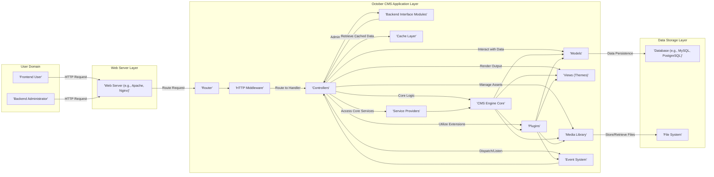
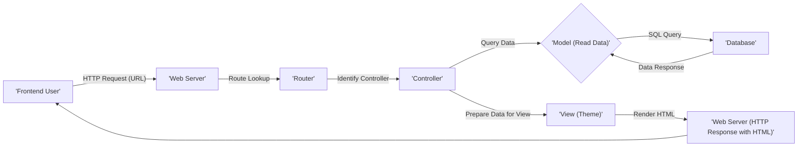
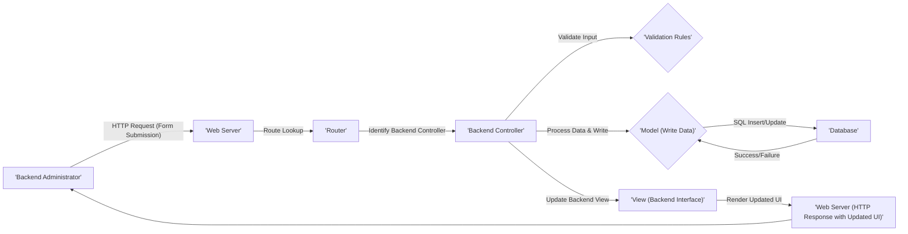
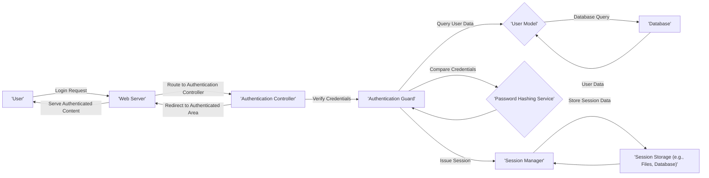

## Project Design Document: October CMS (Improved)

**1. Introduction**

This document provides an enhanced and more detailed design overview of the October CMS project, an open-source, self-hosted content management system built upon the robust Laravel PHP framework. This improved document aims to offer a deeper understanding of the system's architecture, individual components, and the intricate pathways of data flow. This comprehensive view will serve as a stronger foundation for subsequent threat modeling activities, enabling a more thorough security analysis.

**2. Project Goals**

* Deliver a clear, concise, and significantly more detailed architectural overview of October CMS.
* Precisely identify key components, elaborating on their responsibilities and interactions.
* Thoroughly describe the data flow within the system, including specific data types and interactions.
* Highlight the core technologies and dependencies, providing context for potential vulnerabilities.
* Establish a robust and comprehensive baseline for future security analysis and threat modeling efforts.

**3. Scope**

This document encompasses the core architectural components of October CMS with greater granularity, including:

* Detailed explanation of the frontend website rendering process.
* In-depth analysis of the backend administration interface functionalities.
* Comprehensive breakdown of the plugin and theme architecture and their extension points.
* Detailed description of media management processes and storage.
* Thorough examination of user and permission management systems and roles.
* Explicit description of database interactions and data models (at a high level).
* Key configuration aspects and their security implications.

This document continues to exclude:

* Specific implementation details of individual plugins.
* Granular code-level implementation specifics.
* Detailed infrastructure setup and deployment specifics (beyond general security considerations).
* Exhaustive details of all possible third-party integrations (unless they are core to the platform's functionality).

**4. High-Level Architecture**

October CMS employs a well-defined Model-View-Controller (MVC) architecture, inheriting the strengths and conventions of the Laravel framework. The following diagram illustrates the primary interactions within the system:

**5. Component Details**

* **Frontend User:** An anonymous or authenticated visitor interacting with the public-facing website to consume content or utilize frontend features.
* **Backend Administrator:** An authenticated user with elevated privileges accessing the administrative backend to manage content, users, settings, plugins, and themes.
* **Web Server (e.g., Apache, Nginx):**  The entry point for all HTTP requests. It handles request routing, SSL termination, and serving static assets. Security configurations at this level are critical.
* **Router:**  Examines incoming HTTP requests and maps them to specific controller actions based on defined routes. This component is crucial for controlling application flow.
* **HTTP Middleware:**  Provides a mechanism to filter HTTP requests entering the application. This is used for tasks like authentication, authorization, request logging, and CSRF protection.
* **Controllers:**  Receive requests from the router, orchestrate interactions between models and other services, and prepare responses (often by selecting a view to render).
* **Models:** Represent data structures and business logic related to specific data entities. They handle interactions with the database through Eloquent ORM.
* **Views (Themes):**  Responsible for rendering the user interface presented to the user. Themes consist of HTML templates, CSS stylesheets, and JavaScript files. They determine the visual appearance and user experience.
* **Plugins:**  Modular packages that extend the core functionality of October CMS. They can introduce new features, content types, backend modules, API endpoints, and more. Plugins are a significant extension point and potential security risk if not developed securely.
* **Media Library:**  Manages uploaded files, including images, documents, and other assets. It provides functionalities for organizing, resizing, and serving these files. Access control and security of uploaded files are important considerations.
* **Backend Interface Modules:**  Specific controllers, views, and logic dedicated to the administrative backend. These modules provide the tools for managing the CMS. Access to these modules should be strictly controlled.
* **CMS Engine Core:**  The fundamental logic of October CMS, responsible for core functionalities like content management, page rendering, user management, and event handling.
* **Event System:**  A publish-subscribe mechanism that allows different parts of the system (including plugins) to communicate and react to events occurring within the application lifecycle. This enables loose coupling and extensibility.
* **Cache Layer:**  Improves performance by storing frequently accessed data in memory or other fast storage mechanisms (e.g., Redis, Memcached). Proper cache invalidation is important for data consistency.
* **Service Providers:**  Central points for registering services and binding them into the application's service container. They are crucial for dependency injection and managing application components.
* **Database (e.g., MySQL, PostgreSQL):**  Stores persistent data, including content, user information, settings, and plugin data. Secure database configuration and access control are paramount.
* **File System:**  Stores application code, themes, plugins, uploaded media, configuration files, and logs. Proper file permissions and access control are essential for security.

**6. Data Flow Diagrams**

**6.1. Frontend Page Request (Detailed):**

* A frontend user initiates a request by entering a URL or clicking a link.
* The web server receives the HTTP request.
* The router analyzes the URL and identifies the corresponding controller.
* The controller interacts with models to retrieve necessary data from the database using Eloquent ORM.
* The database executes the SQL query and returns the requested data.
* The controller prepares the retrieved data for presentation.
* The view (theme) uses the data to render the HTML content.
* The web server sends the generated HTML response back to the user's browser.

**6.2. Backend Content Creation (Detailed):**

* A backend administrator submits a form to create or update content.
* The web server receives the HTTP request containing the form data.
* The router directs the request to the appropriate backend controller.
* The backend controller validates the submitted data against defined validation rules.
* The controller interacts with models to write the validated data to the database.
* The database executes the insert or update query.
* The controller updates the backend view to reflect the changes.
* The web server sends the updated backend interface back to the administrator's browser.

**6.3. User Login Process:**

* A user submits login credentials.
* The web server routes the request to the authentication controller.
* The authentication controller uses the authentication guard to verify credentials.
* The authentication guard queries the user model to retrieve user data from the database.
* The password hashing service is used to compare the provided password with the stored hash.
* Upon successful verification, the session manager creates and stores a session.
* The user is redirected to an authenticated area of the application.

**7. Security Considerations (Detailed)**

* **Authentication and Authorization:**
    * **Weaknesses:** Brute-force attacks on login forms, insecure password storage, insufficient role-based access control.
    * **Mitigations:** Implementing rate limiting, using strong password hashing algorithms (e.g., bcrypt), enforcing strong password policies, robust role and permission management.
* **Input Validation:**
    * **Weaknesses:** SQL injection, cross-site scripting (XSS), command injection, path traversal.
    * **Mitigations:**  Strict input validation on all user-provided data (both frontend and backend), using parameterized queries or ORM features to prevent SQL injection, encoding output to prevent XSS, avoiding direct execution of user-provided commands.
* **Output Encoding:**
    * **Weaknesses:** Cross-site scripting (XSS) vulnerabilities.
    * **Mitigations:**  Properly escaping and encoding output data based on the context (HTML, JavaScript, URLs). Utilizing templating engine features for automatic escaping.
* **Session Management:**
    * **Weaknesses:** Session fixation, session hijacking, insecure session cookies.
    * **Mitigations:**  Using secure session cookie attributes (HttpOnly, Secure, SameSite), regenerating session IDs after login, implementing session timeouts, storing session data securely.
* **Password Management:**
    * **Weaknesses:** Storing passwords in plain text or using weak hashing algorithms.
    * **Mitigations:**  Using strong, salted hashing algorithms (e.g., bcrypt, Argon2) for password storage.
* **File Upload Security:**
    * **Weaknesses:** Uploading malicious files (e.g., web shells), path traversal vulnerabilities.
    * **Mitigations:**  Validating file types and sizes, sanitizing filenames, storing uploaded files outside the webroot, implementing access controls for uploaded files.
* **Database Security:**
    * **Weaknesses:** SQL injection, insecure database credentials, insufficient access controls.
    * **Mitigations:**  Using parameterized queries or ORM features, securing database credentials, limiting database user privileges, regularly patching the database server.
* **Plugin Security:**
    * **Weaknesses:** Vulnerabilities in third-party plugins, malicious plugins.
    * **Mitigations:**  Regularly auditing and updating plugins, obtaining plugins from trusted sources, implementing a plugin security review process.
* **Configuration Security:**
    * **Weaknesses:** Exposing sensitive configuration data, using default or weak credentials.
    * **Mitigations:**  Storing sensitive configuration data securely (e.g., using environment variables), avoiding default credentials, restricting access to configuration files.
* **Cross-Site Request Forgery (CSRF):**
    * **Weaknesses:** Unauthorized actions performed on behalf of an authenticated user.
    * **Mitigations:**  Implementing CSRF protection mechanisms (e.g., synchronizer tokens).
* **Security Headers:**
    * **Weaknesses:** Lack of protection against certain types of attacks (e.g., XSS, clickjacking).
    * **Mitigations:**  Configuring appropriate security headers (e.g., Content-Security-Policy, X-Frame-Options, Strict-Transport-Security).

**8. Technologies Used**

* **Primary Programming Language:** PHP
* **Core Framework:** Laravel (specifying the major version is recommended for more precise threat analysis)
* **Templating Engine:** Twig
* **Database Support:** MySQL, PostgreSQL, SQLite, and potentially others supported by Laravel's database abstraction layer.
* **Web Server Compatibility:** Apache, Nginx (with recommended configurations for security and performance)
* **Frontend Technologies:** HTML, CSS, JavaScript (and potentially specific JavaScript frameworks or libraries used within themes and plugins)
* **Package Management:** Composer
* **Version Control System:** Git (as evidenced by the provided GitHub repository)
* **PHP Extensions:**  List key PHP extensions required or commonly used (e.g., `pdo`, `mbstring`, `openssl`, `gd`).

**9. Deployment Considerations (Security Focused)**

* **Secure Server Configuration:**  Hardening the web server (Apache or Nginx) with appropriate security configurations.
* **HTTPS Enforcement:**  Mandatory use of HTTPS for all communication to protect data in transit.
* **Firewall Configuration:**  Implementing a firewall to restrict access to the server and specific ports.
* **Regular Security Updates:**  Maintaining up-to-date versions of PHP, the web server, the operating system, and all dependencies.
* **File System Permissions:**  Setting restrictive file system permissions to prevent unauthorized access and modification.
* **Database Security Hardening:**  Following database security best practices, including strong passwords, restricted access, and regular backups.
* **Security Audits and Penetration Testing:**  Regularly conducting security assessments to identify and address potential vulnerabilities.
* **Intrusion Detection/Prevention Systems (IDS/IPS):**  Consider implementing IDS/IPS for real-time threat detection and prevention.
* **Secure Backups and Recovery:**  Establishing secure backup procedures and a disaster recovery plan.

**10. Conclusion**

This improved design document provides a more comprehensive and detailed understanding of the October CMS architecture, focusing on aspects relevant to security analysis and threat modeling. The enhanced component descriptions, detailed data flow diagrams, and expanded security considerations offer a solid foundation for identifying and mitigating potential vulnerabilities. This document should be considered a living document, subject to updates and refinements as the project evolves.