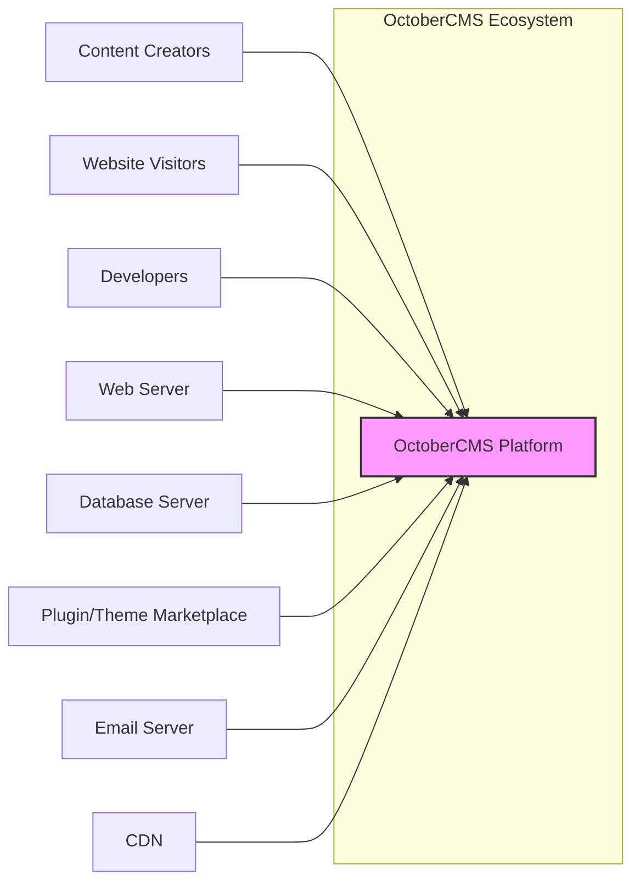

# BUSINESS POSTURE

This project, OctoberCMS, is a free, open-source, self-hosted content management system (CMS) based on the Laravel PHP Framework. Its primary business goal is to provide a user-friendly and flexible platform for building and managing websites and web applications. It targets web developers, designers, and content creators who need a robust and customizable CMS solution.

Business Priorities and Goals:
- Provide a stable and reliable CMS platform.
- Offer a user-friendly interface for content management.
- Enable customization and extensibility through themes and plugins.
- Foster a strong community and ecosystem around the CMS.
- Maintain the open-source nature of the project.

Business Risks:
- Security vulnerabilities in the core CMS or plugins could damage user trust and reputation.
- Lack of community support or developer contributions could hinder project growth and maintenance.
- Competition from other CMS platforms could reduce market share.
- Changes in underlying technologies (PHP, Laravel) could require significant updates and refactoring.
- Hosting and infrastructure costs for the project's website and services.

# SECURITY POSTURE

Existing Security Controls:
- security control: Regular security updates and patches for the core CMS (described in release notes and security advisories on the OctoberCMS website and GitHub).
- security control: Input validation and sanitization to prevent common web vulnerabilities (likely implemented throughout the codebase, but specific details would require code review).
- security control: Protection against Cross-Site Scripting (XSS) attacks (likely implemented through templating engine and output encoding, but specific details would require code review).
- security control: Protection against SQL Injection attacks (likely mitigated by Laravel's Eloquent ORM and parameterized queries, but specific details would require code review).
- security control: Authentication and authorization mechanisms for backend access (implemented within the OctoberCMS core, details in documentation and codebase).
- security control: Password hashing for user accounts (likely using bcrypt or similar strong hashing algorithms, details in codebase).

Accepted Risks:
- accepted risk: Reliance on community-developed plugins and themes introduces potential security risks if these extensions are not properly vetted.
- accepted risk: Self-hosted nature means users are responsible for securing their own hosting environment and keeping the CMS updated.
- accepted risk: Open-source nature means vulnerabilities can be publicly disclosed before patches are available.

Recommended Security Controls:
- security control: Implement automated security scanning (SAST/DAST) in the development and release pipeline.
- security control: Establish a formal security vulnerability reporting and response process.
- security control: Conduct regular penetration testing or security audits by external security experts.
- security control: Provide security guidelines and best practices for plugin and theme developers.
- security control: Implement a plugin/theme review process to identify and mitigate security risks in extensions.
- security control: Encourage or enforce the use of Content Security Policy (CSP) to mitigate XSS risks.
- security control: Implement rate limiting and brute-force protection for login attempts.
- security control: Regularly update dependencies, including Laravel and PHP, to address known vulnerabilities.

Security Requirements:
- Authentication:
    - requirement: Secure authentication mechanism for backend users (administrators, editors).
    - requirement: Support for strong passwords and password complexity requirements.
    - requirement: Option for multi-factor authentication (MFA) to enhance login security.
    - requirement: Secure session management to prevent session hijacking.
- Authorization:
    - requirement: Role-based access control (RBAC) to manage user permissions and access to different CMS features.
    - requirement: Granular permissions to control access to specific content and functionalities.
    - requirement: Principle of least privilege should be applied to user roles and permissions.
- Input Validation:
    - requirement: Comprehensive input validation for all user-supplied data to prevent injection attacks (SQL injection, XSS, etc.).
    - requirement: Server-side validation should be enforced.
    - requirement: Use of parameterized queries or ORM to prevent SQL injection.
    - requirement: Output encoding to prevent XSS attacks.
- Cryptography:
    - requirement: Secure storage of sensitive data, such as passwords, using strong encryption or hashing algorithms.
    - requirement: Use of HTTPS for all communication to protect data in transit.
    - requirement: Consider encryption for sensitive data at rest in the database.

# DESIGN

## C4 CONTEXT



Context Diagram Elements:

- Element:
    - Name: OctoberCMS Platform
    - Type: Software System
    - Description: The core OctoberCMS application, providing content management, website building, and customization features.
    - Responsibilities:
        - Managing website content (pages, posts, media).
        - Providing a user interface for content creation and administration.
        - Handling user authentication and authorization.
        - Processing website requests and generating web pages.
        - Interacting with the database to store and retrieve data.
        - Integrating with plugins and themes for extensibility.
    - Security controls:
        - Input validation and sanitization.
        - Output encoding.
        - Authentication and authorization mechanisms.
        - Password hashing.
        - Security updates and patches.

- Element:
    - Name: Content Creators
    - Type: User
    - Description: Users who create, edit, and manage content within the OctoberCMS backend.
    - Responsibilities:
        - Creating and publishing website content.
        - Managing website structure and navigation.
        - Configuring CMS settings.
    - Security controls:
        - Strong password management.
        - Role-based access control limiting their administrative privileges.

- Element:
    - Name: Website Visitors
    - Type: User
    - Description: Public users who access the website's frontend to view content.
    - Responsibilities:
        - Browsing website content.
        - Interacting with website features (forms, comments, etc.).
    - Security controls:
        - Limited interaction with the system, primarily read-only access to public content.

- Element:
    - Name: Developers
    - Type: User
    - Description: Users who develop, customize, and maintain OctoberCMS websites, themes, and plugins.
    - Responsibilities:
        - Developing custom themes and plugins.
        - Customizing the core CMS functionality.
        - Deploying and maintaining OctoberCMS installations.
    - Security controls:
        - Secure coding practices.
        - Access control to development environments and production systems.

- Element:
    - Name: Web Server
    - Type: Software System
    - Description: Web server (e.g., Apache, Nginx) that hosts the OctoberCMS application and serves web pages to visitors.
    - Responsibilities:
        - Handling HTTP requests and responses.
        - Serving static files (images, CSS, JavaScript).
        - Forwarding requests to the PHP interpreter.
        - SSL/TLS termination for HTTPS.
    - Security controls:
        - Web server hardening (configuration best practices).
        - Access control to server resources.
        - DDoS protection.
        - Regular security updates.

- Element:
    - Name: Database Server
    - Type: Software System
    - Description: Database server (e.g., MySQL, PostgreSQL) that stores OctoberCMS data, including content, user information, and settings.
    - Responsibilities:
        - Storing and retrieving data for the CMS.
        - Ensuring data integrity and availability.
        - Managing database users and permissions.
    - Security controls:
        - Database server hardening (configuration best practices).
        - Access control to the database.
        - Regular security updates.
        - Database backups and recovery.
        - Encryption at rest (optional, depending on sensitivity).

- Element:
    - Name: Plugin/Theme Marketplace
    - Type: Software System
    - Description: Online marketplace where users can download and install plugins and themes for OctoberCMS.
    - Responsibilities:
        - Hosting and distributing plugins and themes.
        - Providing a platform for developers to share their extensions.
        - Potentially reviewing and vetting plugins/themes (depending on marketplace policies).
    - Security controls:
        - Security scanning of uploaded plugins/themes (if implemented).
        - User reviews and ratings to provide community feedback.
        - Secure platform for transactions and downloads.

- Element:
    - Name: Email Server
    - Type: Software System
    - Description: Email server used by OctoberCMS to send emails, such as password reset emails, notifications, and form submissions.
    - Responsibilities:
        - Sending emails from the CMS application.
        - Receiving emails (potentially for contact forms, etc.).
    - Security controls:
        - Secure email server configuration.
        - SPF, DKIM, and DMARC records to prevent email spoofing.
        - TLS encryption for email transmission.

- Element:
    - Name: CDN
    - Type: Software System
    - Description: Content Delivery Network (CDN) to cache and serve static assets (images, CSS, JavaScript) closer to website visitors, improving performance.
    - Responsibilities:
        - Caching and delivering static content.
        - Reducing load on the web server.
        - Improving website loading speed.
        - DDoS protection (often provided by CDN).
    - Security controls:
        - CDN security features (e.g., DDoS protection, WAF).
        - Secure CDN configuration.
        - HTTPS delivery of content.

## C4 CONTAINER

```mermaid
flowchart LR
    subgraph "OctoberCMS Platform"
        A["Web Application" <br> (PHP, Laravel)]
        B["Database" <br> (MySQL, PostgreSQL, SQLite)]
        C["Plugins & Themes"]
    end
    U1["Content Creators"] --> A
    U2["Website Visitors"] --> A
    U3["Developers"] --> C
    A --> B
    A --> C
    style A fill:#f9f,stroke:#333,stroke-width:2px
    style B fill:#ccf,stroke:#333,stroke-width:2px
    style C fill:#ccf,stroke:#333,stroke-width:2px
```

Container Diagram Elements:

- Element:
    - Name: Web Application
    - Type: Container
    - Description: The core PHP application built on the Laravel framework, responsible for handling web requests, business logic, and user interface.
    - Responsibilities:
        - Handling HTTP requests and responses.
        - Routing requests to appropriate controllers.
        - Implementing business logic for content management, user authentication, etc.
        - Rendering web pages using templates.
        - Interacting with the Database container.
        - Loading and executing Plugins and Themes.
    - Security controls:
        - Input validation and sanitization within the application code.
        - Output encoding in templates.
        - Authentication and authorization logic.
        - Session management.
        - Vulnerability scanning of application dependencies.

- Element:
    - Name: Database
    - Type: Container
    - Description: Relational database system used to store persistent data for OctoberCMS.
    - Responsibilities:
        - Storing website content (pages, posts, media).
        - Storing user accounts and permissions.
        - Storing CMS configuration settings.
        - Providing data persistence and retrieval for the Web Application.
    - Security controls:
        - Database access control (user permissions).
        - Database server hardening.
        - Regular database backups.
        - Encryption at rest (optional).

- Element:
    - Name: Plugins & Themes
    - Type: Container
    - Description:  Collection of plugins and themes that extend the functionality and appearance of OctoberCMS. These are typically files stored on the file system.
    - Responsibilities:
        - Providing additional features and functionalities to OctoberCMS.
        - Customizing the visual appearance of websites.
        - Extending the CMS backend and frontend.
    - Security controls:
        - Plugin/theme code review (ideally, but often community-driven).
        - File system permissions to restrict access to plugin/theme files.
        - Security guidelines for plugin/theme developers.

## DEPLOYMENT

Deployment Architecture Option: Cloud VM (e.g., AWS EC2, Google Compute Engine, Azure VM)

```mermaid
flowchart LR
    subgraph "Cloud Environment"
        subgraph "Virtual Machine"
            A["Web Server" <br> (Nginx/Apache)]
            B["PHP-FPM"]
            C["OctoberCMS Application Files"]
        end
        D["Database Server" <br> (RDS, Cloud SQL, Azure DB)]
        E["File Storage" <br> (S3, Cloud Storage, Azure Blob)]
    end
    F["Internet"] --> A
    A --> B
    B --> C
    C --> D
    C --> E

    style A fill:#f9f,stroke:#333,stroke-width:2px
    style B fill:#ccf,stroke:#333,stroke-width:2px
    style C fill:#ccf,stroke:#333,stroke-width:2px
    style D fill:#ccf,stroke:#333,stroke-width:2px
    style E fill:#ccf,stroke:#333,stroke-width:2px
```

Deployment Diagram Elements (Cloud VM):

- Element:
    - Name: Web Server (Nginx/Apache)
    - Type: Software
    - Description: Web server software running on the virtual machine, responsible for handling HTTP requests.
    - Responsibilities:
        - Receiving HTTP requests from the Internet.
        - Serving static files.
        - Proxying PHP requests to PHP-FPM.
        - SSL/TLS termination.
    - Security controls:
        - Web server hardening.
        - Regular security updates.
        - Firewall rules to restrict access.

- Element:
    - Name: PHP-FPM
    - Type: Software
    - Description: FastCGI Process Manager, a PHP processor that executes the OctoberCMS application code.
    - Responsibilities:
        - Executing PHP code.
        - Interacting with the OctoberCMS application files.
        - Communicating with the Database Server.
    - Security controls:
        - PHP-FPM configuration hardening.
        - Restricting access to PHP-FPM processes.
        - Regular security updates.

- Element:
    - Name: OctoberCMS Application Files
    - Type: Filesystem
    - Description: Files containing the OctoberCMS application code, plugins, and themes, stored on the virtual machine's file system.
    - Responsibilities:
        - Storing the application codebase.
        - Providing access to application files for PHP-FPM.
    - Security controls:
        - File system permissions to restrict access.
        - Regular backups of application files.

- Element:
    - Name: Database Server (RDS, Cloud SQL, Azure DB)
    - Type: Managed Service
    - Description: Managed database service provided by the cloud provider, hosting the OctoberCMS database.
    - Responsibilities:
        - Providing a managed database instance.
        - Handling database backups and maintenance.
        - Ensuring database availability and scalability.
    - Security controls:
        - Cloud provider's security controls for managed databases.
        - Database access control (user permissions).
        - Encryption at rest and in transit (provided by the managed service).

- Element:
    - Name: File Storage (S3, Cloud Storage, Azure Blob)
    - Type: Managed Service
    - Description: Cloud-based object storage service used to store media files and potentially other static assets for OctoberCMS.
    - Responsibilities:
        - Storing media files (images, videos, etc.).
        - Providing scalable and durable storage.
        - Serving media files to website visitors (potentially via CDN).
    - Security controls:
        - Cloud provider's security controls for object storage.
        - Access control policies for storage buckets.
        - Encryption at rest and in transit (provided by the managed service).

## BUILD

```mermaid
flowchart LR
    A["Developer"] --> B["Code Repository" <br> (GitHub)]
    B --> C["CI/CD Pipeline" <br> (GitHub Actions, Jenkins)]
    C --> D["Build Artifacts" <br> (ZIP, Composer Packages)]
    D --> E["Release Repository" <br> (GitHub Releases, Packagist)]

    style A fill:#f9f,stroke:#333,stroke-width:2px
    style B fill:#ccf,stroke:#333,stroke-width:2px
    style C fill:#ccf,stroke:#333,stroke-width:2px
    style D fill:#ccf,stroke:#333,stroke-width:2px
    style E fill:#ccf,stroke:#333,stroke-width:2px
```

Build Process Diagram Elements:

- Element:
    - Name: Developer
    - Type: User
    - Description: Software developers who contribute code to the OctoberCMS project.
    - Responsibilities:
        - Writing and testing code.
        - Committing code changes to the code repository.
        - Participating in code reviews.
    - Security controls:
        - Secure development practices.
        - Code review process.
        - Access control to the code repository.
        - Developer training on secure coding.

- Element:
    - Name: Code Repository (GitHub)
    - Type: Software System
    - Description: Version control system (GitHub) used to store and manage the OctoberCMS source code.
    - Responsibilities:
        - Storing code history and changes.
        - Facilitating collaboration among developers.
        - Triggering CI/CD pipelines on code changes.
    - Security controls:
        - Access control to the repository (permissions).
        - Branch protection rules.
        - Audit logs of code changes.

- Element:
    - Name: CI/CD Pipeline (GitHub Actions, Jenkins)
    - Type: Software System
    - Description: Automated CI/CD pipeline that builds, tests, and packages the OctoberCMS application.
    - Responsibilities:
        - Automating the build process.
        - Running automated tests (unit, integration, security).
        - Performing static analysis and security scans (SAST).
        - Packaging build artifacts (ZIP files, Composer packages).
    - Security controls:
        - Secure CI/CD pipeline configuration.
        - Dependency scanning and vulnerability checks.
        - SAST and DAST security scans.
        - Code signing of build artifacts (optional).
        - Access control to the CI/CD system.

- Element:
    - Name: Build Artifacts (ZIP, Composer Packages)
    - Type: Files
    - Description: Packaged versions of OctoberCMS, ready for distribution and deployment.
    - Responsibilities:
        - Providing installable packages of OctoberCMS.
        - Including all necessary files for deployment.
    - Security controls:
        - Integrity checks (checksums, signatures) for build artifacts.
        - Secure storage of build artifacts.

- Element:
    - Name: Release Repository (GitHub Releases, Packagist)
    - Type: Software System
    - Description: Platforms used to distribute and make OctoberCMS releases available to users.
    - Responsibilities:
        - Hosting and distributing OctoberCMS releases.
        - Providing version management and package management.
        - Making releases publicly accessible.
    - Security controls:
        - Secure release process.
        - Integrity checks for downloaded releases.
        - Access control to release management systems.

# RISK ASSESSMENT

Critical Business Processes:
- Website content management: Ensuring content creators can reliably manage website content without data loss or corruption.
- Website availability: Maintaining website uptime and accessibility for visitors.
- User account management: Securely managing user accounts and permissions for backend access.
- Plugin/theme installation and updates: Providing a safe and reliable way to extend CMS functionality.

Data Sensitivity:
- User credentials (passwords): Highly sensitive, require strong encryption and secure storage.
- Website content: Sensitivity varies depending on the website's purpose, could include personal data, confidential information, or public content.
- CMS configuration settings: Potentially sensitive, may include database credentials or API keys.
- Website visitor data (if collected): Sensitivity depends on the type of data collected (e.g., personal information, analytics data).

# QUESTIONS & ASSUMPTIONS

Questions:
- What is the process for security vulnerability reporting and response for OctoberCMS?
- Are there any formal security audits or penetration testing conducted on OctoberCMS?
- What security review process is in place for plugins and themes in the marketplace?
- Are there specific security guidelines provided to plugin and theme developers?
- What is the typical update frequency for security patches and core CMS updates?
- Is multi-factor authentication (MFA) supported for backend users?
- Is there a Content Security Policy (CSP) implemented by default or recommended for OctoberCMS websites?

Assumptions:
- BUSINESS POSTURE: Assumed that the primary business goal is to provide a secure and reliable open-source CMS platform.
- SECURITY POSTURE: Assumed that basic security controls like input validation, output encoding, and password hashing are implemented in the core CMS. Assumed that security updates are released regularly.
- DESIGN: Assumed a typical web application architecture with a web server, application code, and database. Assumed a cloud VM deployment scenario for detailed description. Assumed a standard CI/CD pipeline for build and release process.