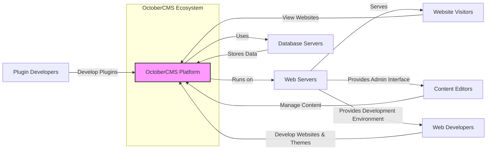
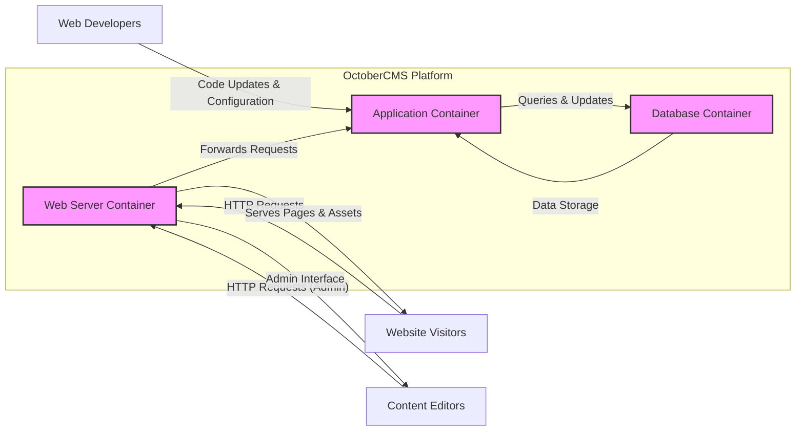
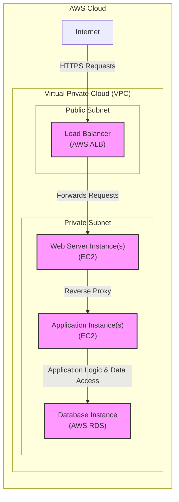
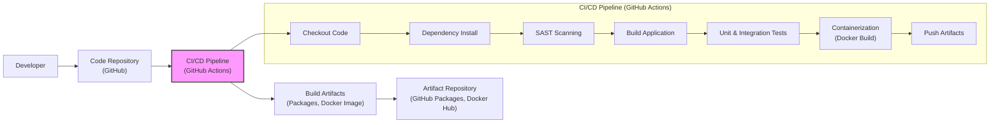

# BUSINESS POSTURE

- Business Priorities and Goals:
  - Provide a flexible and extensible Content Management System (CMS) platform for web developers and designers.
  - Offer a user-friendly interface for content management.
  - Enable rapid development of websites and web applications.
  - Foster a strong community around the platform.
  - Maintain a stable and reliable open-source CMS solution.
- Business Risks:
  - Security vulnerabilities in the platform could damage reputation and user trust.
  - Lack of community support or developer adoption could lead to project stagnation.
  - Competition from other CMS platforms.
  - Difficulty in maintaining compatibility with evolving web technologies.
  - Open-source nature may lead to unauthorized modifications or distributions.

# SECURITY POSTURE

- Existing Security Controls:
  - security control: Secure Software Development Lifecycle (SSDLC) - Implemented through community contributions, code reviews (implicitly via pull requests), and issue tracking on GitHub.
  - security control: Input validation - Implemented within the OctoberCMS core and framework to sanitize user inputs and prevent common web vulnerabilities.
  - security control: Authentication and Authorization - Implemented within the OctoberCMS core, providing user and role-based access control to the backend and frontend functionalities.
  - security control: Protection against common web vulnerabilities - Framework based on Laravel, which includes built-in protection against common web vulnerabilities like CSRF, XSS, and SQL injection.
  - security control: Regular security updates - Provided by the OctoberCMS team and community, addressing reported vulnerabilities.
- Accepted Risks:
  - accepted risk: Vulnerabilities in third-party plugins - OctoberCMS relies on a plugin ecosystem, and security of these plugins is dependent on individual plugin developers.
  - accepted risk: Misconfiguration by users - Users deploying and configuring OctoberCMS might introduce security misconfigurations.
  - accepted risk: Delayed patching by users - Users might not apply security updates promptly, leaving systems vulnerable.
- Recommended Security Controls:
  - security control: Automated Security Scanning - Implement automated SAST and DAST scanning in the CI/CD pipeline for core OctoberCMS development.
  - security control: Dependency Scanning - Implement dependency scanning to identify and manage vulnerabilities in third-party libraries used by OctoberCMS.
  - security control: Security awareness training for core developers and plugin developers - Enhance security knowledge and best practices among contributors.
  - security control: Bug bounty program - Establish a bug bounty program to incentivize security researchers to find and report vulnerabilities.
  - security control: Penetration testing - Conduct regular penetration testing on OctoberCMS to identify potential weaknesses.
- Security Requirements:
  - Authentication:
    - Requirement: Secure authentication mechanism for backend administrators and frontend users.
    - Requirement: Support for strong password policies and multi-factor authentication (MFA) as an option.
    - Requirement: Protection against brute-force attacks and account enumeration.
  - Authorization:
    - Requirement: Role-based access control (RBAC) to manage permissions for backend functionalities.
    - Requirement: Granular permission management for different areas of the CMS.
    - Requirement: Secure authorization checks throughout the application to prevent unauthorized access to resources and functionalities.
  - Input Validation:
    - Requirement: Comprehensive input validation and sanitization for all user-provided data.
    - Requirement: Protection against common injection attacks (SQL injection, XSS, command injection, etc.).
    - Requirement: Use of parameterized queries or ORM to prevent SQL injection.
    - Requirement: Output encoding to prevent XSS vulnerabilities.
  - Cryptography:
    - Requirement: Secure storage of sensitive data, including passwords and API keys, using strong encryption algorithms.
    - Requirement: Use of HTTPS for all communication to protect data in transit.
    - Requirement: Secure handling of cryptographic keys and secrets.

# DESIGN

## C4 CONTEXT

- Context Diagram Elements:
  - - Name: OctoberCMS Platform
    - Type: Software System
    - Description: The OctoberCMS platform itself, providing content management, website building, and plugin extension capabilities.
    - Responsibilities:
      - Managing website content and structure.
      - Rendering websites for visitors.
      - Providing an administrative interface for content editors and developers.
      - Handling user authentication and authorization.
      - Processing user requests and interactions.
    - Security controls:
      - Input validation and sanitization.
      - Authentication and authorization mechanisms.
      - Protection against common web vulnerabilities.
      - Security updates and patching.
  - - Name: Website Visitors
    - Type: Person
    - Description: End-users who access websites built with OctoberCMS.
    - Responsibilities:
      - Browsing website content.
      - Interacting with website features (e.g., forms, comments).
    - Security controls:
      - Client-side security measures (browser security settings, antivirus).
  - - Name: Content Editors
    - Type: Person
    - Description: Users who create, edit, and manage content within OctoberCMS backend.
    - Responsibilities:
      - Creating and updating website content.
      - Managing media and assets.
      - Configuring website settings.
    - Security controls:
      - Strong password management.
      - Multi-factor authentication (optional).
      - Role-based access control within OctoberCMS.
  - - Name: Web Developers
    - Type: Person
    - Description: Users who develop themes, plugins, and custom functionalities for OctoberCMS.
    - Responsibilities:
      - Developing and customizing website themes and templates.
      - Creating and extending OctoberCMS functionality through plugins.
      - Integrating with external systems.
    - Security controls:
      - Secure coding practices.
      - Access control to development environments.
  - - Name: Plugin Developers
    - Type: Person
    - Description: Developers who create and publish plugins for the OctoberCMS marketplace.
    - Responsibilities:
      - Developing reusable plugins for OctoberCMS.
      - Maintaining and updating plugins.
      - Ensuring plugin security and compatibility.
    - Security controls:
      - Secure coding practices.
      - Code signing (optional).
  - - Name: Web Servers
    - Type: Infrastructure
    - Description: Servers hosting the OctoberCMS application and serving website content. Examples: Apache, Nginx.
    - Responsibilities:
      - Hosting the OctoberCMS application code.
      - Serving website content to visitors.
      - Handling HTTP requests and responses.
    - Security controls:
      - Web server hardening and configuration.
      - HTTPS configuration and certificate management.
      - Firewall and intrusion detection/prevention systems.
  - - Name: Database Servers
    - Type: Infrastructure
    - Description: Servers storing the OctoberCMS database, including website content, user data, and settings. Examples: MySQL, PostgreSQL.
    - Responsibilities:
      - Storing and managing website data.
      - Providing data access to the OctoberCMS application.
      - Ensuring data integrity and availability.
    - Security controls:
      - Database server hardening and configuration.
      - Access control to the database.
      - Data encryption at rest (optional).
      - Regular backups and disaster recovery.

## C4 CONTAINER

- Container Diagram Elements:
  - - Name: Web Server Container
    - Type: Container
    - Description:  Handles incoming HTTP requests, serves static assets, and acts as a reverse proxy to the Application Container. Examples: Nginx, Apache.
    - Responsibilities:
      - Receiving and routing HTTP requests.
      - Serving static files (images, CSS, JavaScript).
      - Handling SSL/TLS termination.
      - Load balancing (in scaled deployments).
    - Security controls:
      - Web server hardening (disabling unnecessary modules, setting appropriate permissions).
      - HTTPS configuration and certificate management.
      - Rate limiting and request filtering.
      - Web Application Firewall (WAF) integration (optional).
  - - Name: Application Container
    - Type: Container
    - Description: Contains the OctoberCMS application code (PHP, Laravel framework, OctoberCMS core, themes, and plugins). Executes application logic, interacts with the database, and generates dynamic content.
    - Responsibilities:
      - Running the OctoberCMS application.
      - Handling application logic and business rules.
      - Processing user requests and generating responses.
      - Interacting with the Database Container for data persistence.
      - Managing user sessions and authentication.
    - Security controls:
      - Secure coding practices within the application.
      - Input validation and sanitization within the application code.
      - Authentication and authorization logic implemented in the application.
      - Regular security updates for the application and its dependencies.
  - - Name: Database Container
    - Type: Container
    - Description:  Stores the OctoberCMS database, which holds website content, user data, settings, and application data. Examples: MySQL, PostgreSQL.
    - Responsibilities:
      - Storing and managing persistent data for OctoberCMS.
      - Providing data access to the Application Container.
      - Ensuring data integrity, consistency, and availability.
      - Performing database backups and recovery.
    - Security controls:
      - Database server hardening (restricting network access, disabling unnecessary features).
      - Strong database user authentication and authorization.
      - Data encryption at rest (optional, depending on database engine and infrastructure).
      - Regular database backups and disaster recovery procedures.

## DEPLOYMENT

Deployment Solution: Cloud-based Deployment (Example: AWS)

- Deployment Diagram Elements:
  - - Name: Load Balancer (AWS ALB)
    - Type: Cloud Service
    - Description: AWS Application Load Balancer distributes incoming traffic across multiple Web Server Instances. Provides high availability and scalability.
    - Responsibilities:
      - Distributing traffic to Web Server Instances.
      - SSL/TLS termination.
      - Health checks for backend instances.
    - Security controls:
      - AWS WAF integration.
      - DDoS protection (AWS Shield).
      - Security groups to control inbound and outbound traffic.
  - - Name: Web Server Instance(s) (EC2)
    - Type: Virtual Machine
    - Description: EC2 instances running web server software (e.g., Nginx, Apache) configured as reverse proxies to Application Instances.
    - Responsibilities:
      - Reverse proxying requests to Application Instances.
      - Serving static assets.
    - Security controls:
      - EC2 instance hardening (OS patching, security configurations).
      - Security groups to restrict access.
      - Instance-level firewall.
  - - Name: Application Instance(s) (EC2)
    - Type: Virtual Machine
    - Description: EC2 instances running the OctoberCMS Application Container (PHP runtime, application code).
    - Responsibilities:
      - Running the OctoberCMS application.
      - Processing application logic.
      - Interacting with the Database Instance.
    - Security controls:
      - EC2 instance hardening.
      - Security groups to restrict access.
      - Application-level security controls (as described in Container Diagram).
  - - Name: Database Instance (AWS RDS)
    - Type: Managed Database Service
    - Description: AWS Relational Database Service (RDS) instance running a supported database engine (e.g., MySQL, PostgreSQL) for OctoberCMS.
    - Responsibilities:
      - Managed database service for OctoberCMS.
      - Data storage and retrieval.
      - Automated backups and patching.
    - Security controls:
      - AWS RDS security features (encryption at rest, encryption in transit).
      - Security groups to control database access.
      - Database user access control.
  - - Name: Internet
    - Type: Network
    - Description: Public internet through which website visitors access the OctoberCMS application.
    - Responsibilities:
      - Providing network connectivity for users.
    - Security controls:
      - No direct security controls managed by the OctoberCMS deployment, relies on perimeter security and client-side security.

## BUILD

- Build Process Elements:
  - - Name: Developer
    - Type: Person
    - Description: Software developer contributing code to the OctoberCMS project.
    - Responsibilities:
      - Writing and committing code changes.
      - Performing local testing.
      - Creating pull requests for code review.
    - Security controls:
      - Secure development environment.
      - Code review process.
      - Access control to code repository.
  - - Name: Code Repository (GitHub)
    - Type: Version Control System
    - Description: GitHub repository hosting the OctoberCMS source code.
    - Responsibilities:
      - Version control of source code.
      - Collaboration platform for developers.
      - Triggering CI/CD pipeline on code changes.
    - Security controls:
      - Access control and permissions management.
      - Branch protection rules.
      - Audit logging of code changes.
  - - Name: CI/CD Pipeline (GitHub Actions)
    - Type: Automation System
    - Description: GitHub Actions workflow automating the build, test, and publishing process for OctoberCMS.
    - Responsibilities:
      - Automated build process.
      - Running security scans (SAST).
      - Executing unit and integration tests.
      - Creating build artifacts (packages, Docker images).
      - Publishing artifacts to artifact repositories.
    - Security controls:
      - Secure pipeline configuration and access control.
      - Secrets management for API keys and credentials.
      - Automated security checks (SAST scanning).
      - Dependency scanning.
  - - Name: Build Artifacts (Packages, Docker Image)
    - Type: Software Artifacts
    - Description: Output of the build process, including installable packages (e.g., ZIP archives) and Docker images of OctoberCMS.
    - Responsibilities:
      - Deployable units of OctoberCMS software.
      - Distribution to users and deployment environments.
    - Security controls:
      - Integrity checks (e.g., checksums, signatures) for packages.
      - Vulnerability scanning of Docker images.
  - - Name: Artifact Repository (GitHub Packages, Docker Hub)
    - Type: Artifact Storage
    - Description: Repositories for storing and distributing build artifacts. Examples: GitHub Packages for packages, Docker Hub for Docker images.
    - Responsibilities:
      - Secure storage of build artifacts.
      - Distribution of artifacts to users.
      - Versioning and release management.
    - Security controls:
      - Access control to artifact repository.
      - Vulnerability scanning of stored artifacts (if supported by repository).
      - Audit logging of artifact access and changes.

# RISK ASSESSMENT

- Critical Business Processes:
  - Content Management: Ensuring content editors can create, update, and publish website content reliably and securely.
  - Website Availability: Maintaining website uptime and accessibility for visitors.
  - Data Integrity: Protecting website data from unauthorized modification or deletion.
  - Plugin Ecosystem: Ensuring the security and reliability of the plugin ecosystem, as it extends core functionality.
- Data Sensitivity:
  - User Data: User accounts, profiles, and potentially personal information collected through forms. Sensitivity: Medium to High (depending on data collected and regulatory requirements like GDPR).
  - Website Content: Text, images, media files, and website structure. Sensitivity: Low to Medium (business impact if compromised or lost).
  - Configuration Data: Database credentials, API keys, and system settings. Sensitivity: High (critical for system security and access).
  - Application Code: Source code of OctoberCMS, themes, and plugins. Sensitivity: Medium to High (intellectual property, potential for vulnerability exploitation if exposed).

# QUESTIONS & ASSUMPTIONS

- Questions:
  - What are the specific compliance requirements for OctoberCMS deployments (e.g., GDPR, PCI DSS)?
  - Are there specific industry verticals or use cases that OctoberCMS primarily targets, which might influence security priorities?
  - What is the process for security incident response and vulnerability disclosure for OctoberCMS?
  - Are there any existing security policies or guidelines for OctoberCMS development and deployment?
- Assumptions:
  - BUSINESS POSTURE: The primary business goal is to provide a widely adopted and trusted open-source CMS platform. Security and community trust are critical for achieving this goal.
  - SECURITY POSTURE: OctoberCMS follows common security practices for web applications and open-source projects. Security is a shared responsibility between the core team, plugin developers, and users.
  - DESIGN: The design assumes a typical three-tier web application architecture with web servers, application servers, and database servers. Deployment is flexible and can be adapted to various environments, including cloud and on-premise. Build process includes basic security checks but could be enhanced with more comprehensive automated security testing.