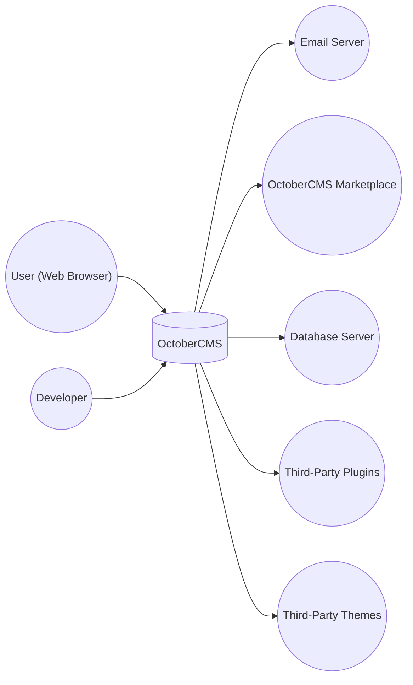
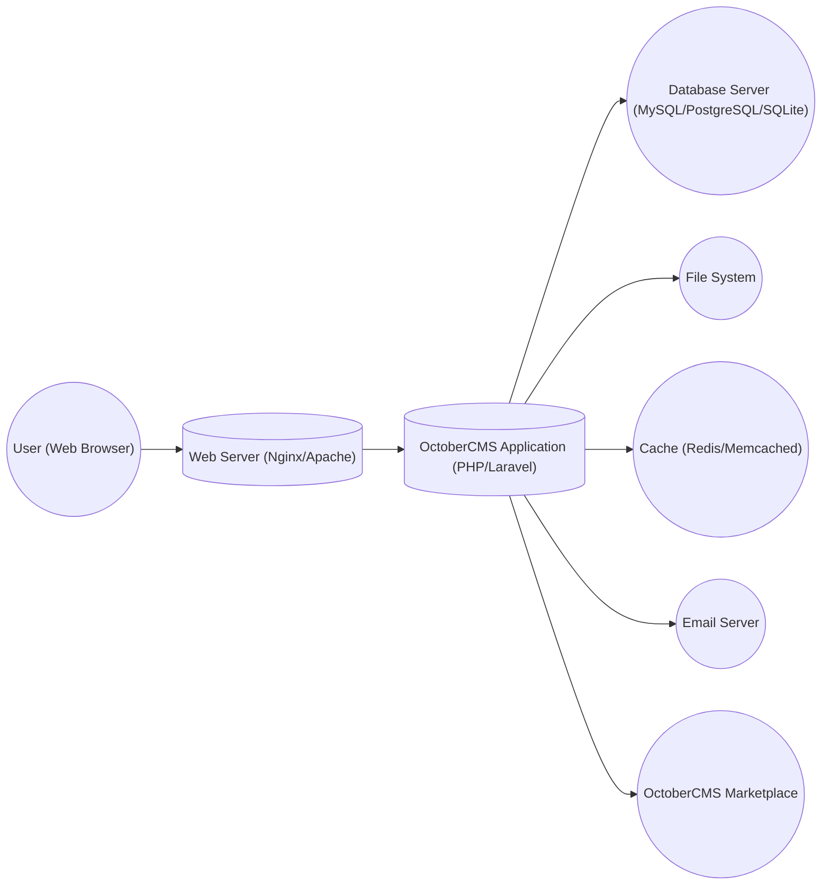
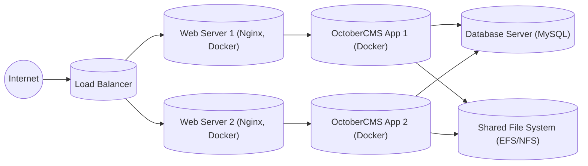
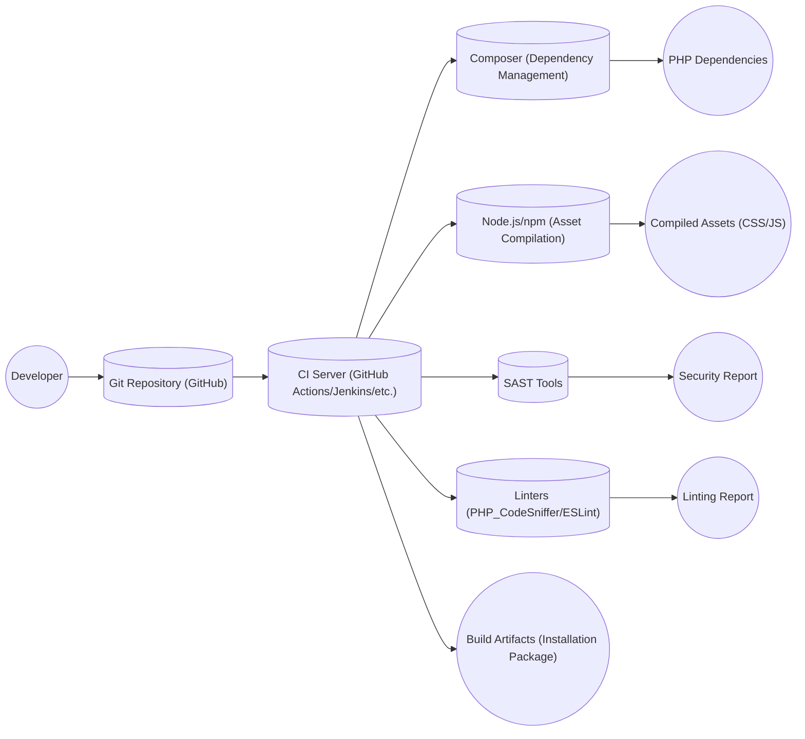

Okay, let's create a design document for OctoberCMS based on the provided GitHub repository.

# BUSINESS POSTURE

OctoberCMS is a self-hosted Content Management System (CMS) platform based on the Laravel PHP framework.  The business priorities appear to be:

*   Provide a flexible and extensible CMS platform for developers and content creators.
*   Offer a simple and intuitive user interface for managing content.
*   Enable rapid website development and deployment.
*   Foster a strong community and ecosystem around the platform.
*   Provide a marketplace for themes and plugins.

Business Goals:

*   Increase user adoption and market share.
*   Maintain a high level of user satisfaction.
*   Ensure the long-term sustainability of the platform.
*   Monetize the platform through the marketplace and potentially premium features.

Most Important Business Risks:

*   Security vulnerabilities that could lead to website compromise and data breaches.
*   Competition from other CMS platforms (e.g., WordPress, Drupal, Joomla).
*   Lack of adoption or engagement from the developer community.
*   Performance issues or scalability limitations that hinder user experience.
*   Inability to keep up with evolving web technologies and security threats.
*   Reputational damage due to security incidents or poor user experience.

# SECURITY POSTURE

Existing Security Controls:

*   security control: Laravel Framework Security Features: OctoberCMS inherits the security features of the underlying Laravel framework, which include protection against common web vulnerabilities such as cross-site scripting (XSS), cross-site request forgery (CSRF), and SQL injection. (Described in Laravel documentation)
*   security control: Input Validation: OctoberCMS and Laravel utilize input validation to sanitize user input and prevent malicious data from being processed. (Described in OctoberCMS and Laravel documentation)
*   security control: Authentication and Authorization: OctoberCMS provides a built-in authentication system for managing user accounts and permissions. (Described in OctoberCMS documentation)
*   security control: Templating Engine Security: The Twig templating engine used by OctoberCMS includes features to prevent XSS vulnerabilities by automatically escaping output. (Described in Twig documentation)
*   security control: File Upload Handling: OctoberCMS includes mechanisms for securely handling file uploads, including restricting file types and sizes. (Described in OctoberCMS documentation)
*   security control: Regular Updates: The OctoberCMS team and the Laravel community regularly release updates to address security vulnerabilities and improve the platform's security. (Described in OctoberCMS and Laravel release notes)

Accepted Risks:

*   accepted risk: Reliance on Third-Party Plugins and Themes: The security of an OctoberCMS website can be affected by the quality and security of third-party plugins and themes. Users are responsible for vetting and updating these components.
*   accepted risk: Server Configuration: The security of the underlying server environment (e.g., operating system, web server, database) is outside the direct control of OctoberCMS.
*   accepted risk: User Account Security: The security of individual user accounts depends on users choosing strong passwords and practicing good security hygiene.

Recommended Security Controls:

*   Implement a Content Security Policy (CSP) to mitigate the risk of XSS attacks.
*   Enable HTTP Strict Transport Security (HSTS) to enforce secure connections.
*   Implement a Web Application Firewall (WAF) to protect against common web attacks.
*   Regularly conduct security audits and penetration testing.
*   Implement a robust logging and monitoring system to detect and respond to security incidents.
*   Consider implementing two-factor authentication (2FA) for administrator accounts.

Security Requirements:

*   Authentication:
    *   All users must be authenticated before accessing administrative interfaces or sensitive data.
    *   Support for strong password policies (e.g., minimum length, complexity requirements).
    *   Protection against brute-force attacks (e.g., account lockout).
    *   Option for two-factor authentication (2FA).

*   Authorization:
    *   Role-based access control (RBAC) to restrict access to specific features and content based on user roles.
    *   Granular permissions to control access at a fine-grained level.

*   Input Validation:
    *   All user input must be validated and sanitized to prevent injection attacks (e.g., XSS, SQL injection).
    *   Validation rules should be enforced on both the client-side and server-side.

*   Cryptography:
    *   Sensitive data (e.g., passwords, API keys) must be stored securely using strong encryption algorithms.
    *   HTTPS must be enforced for all communication between the client and the server.
    *   Use of cryptographically secure random number generators where appropriate.

# DESIGN

## C4 CONTEXT

Element Descriptions:

*   Element:
    *   Name: User
    *   Type: Person
    *   Description: A person interacting with the OctoberCMS website through a web browser.
    *   Responsibilities: Browsing content, submitting forms, interacting with website features.
    *   Security controls: Browser-based security controls (e.g., same-origin policy, cookie security).

*   Element:
    *   Name: OctoberCMS
    *   Type: Software System
    *   Description: The OctoberCMS content management system.
    *   Responsibilities: Managing content, handling user requests, rendering web pages, interacting with plugins and themes.
    *   Security controls: Laravel framework security features, input validation, authentication, authorization, templating engine security, file upload handling.

*   Element:
    *   Name: Email Server
    *   Type: External System
    *   Description: An external email server used for sending transactional emails (e.g., password resets, notifications).
    *   Responsibilities: Sending emails on behalf of OctoberCMS.
    *   Security controls: Secure email protocols (e.g., TLS/SSL), sender authentication (e.g., SPF, DKIM, DMARC).

*   Element:
    *   Name: Marketplace
    *   Type: External System
    *   Description: The OctoberCMS marketplace for downloading themes and plugins.
    *   Responsibilities: Providing a repository of themes and plugins, handling downloads and updates.
    *   Security controls: Code signing, malware scanning, user reviews and ratings.

*   Element:
    *   Name: Database
    *   Type: External System
    *   Description: The database server used to store OctoberCMS data (e.g., content, users, settings).
    *   Responsibilities: Storing and retrieving data.
    *   Security controls: Database access controls, encryption at rest, regular backups.

*   Element:
    *   Name: Plugins
    *   Type: External System
    *   Description: Third-party plugins that extend the functionality of OctoberCMS.
    *   Responsibilities: Providing additional features and functionality.
    *   Security controls: Dependent on the individual plugin; users should vet plugins before installing.

*   Element:
    *   Name: Themes
    *   Type: External System
    *   Description: Third-party themes that control the visual appearance of OctoberCMS websites.
    *   Responsibilities: Defining the website's layout, styling, and presentation.
    *   Security controls: Dependent on the individual theme; users should vet themes before installing.

*   Element:
    *   Name: Developer
    *   Type: Person
    *   Description: A person who develops, customizes, and maintains the OctoberCMS installation, including themes and plugins.
    *   Responsibilities: Writing code, configuring the system, managing updates.
    *   Security controls: Secure coding practices, access controls, code review.

## C4 CONTAINER

Element Descriptions:

*   Element:
    *   Name: User
    *   Type: Person
    *   Description: A person interacting with the OctoberCMS website through a web browser.
    *   Responsibilities: Browsing content, submitting forms, interacting with website features.
    *   Security controls: Browser-based security controls (e.g., same-origin policy, cookie security).

*   Element:
    *   Name: Web Server
    *   Type: Container
    *   Description: The web server (e.g., Nginx, Apache) that handles incoming HTTP requests.
    *   Responsibilities: Serving static files, routing requests to the OctoberCMS application.
    *   Security controls: Web server configuration hardening, TLS/SSL encryption, access controls.

*   Element:
    *   Name: OctoberCMS Application
    *   Type: Container
    *   Description: The core OctoberCMS application, built on the Laravel PHP framework.
    *   Responsibilities: Handling application logic, managing content, interacting with the database and other services.
    *   Security controls: Laravel framework security features, input validation, authentication, authorization, templating engine security, file upload handling.

*   Element:
    *   Name: Database
    *   Type: Container
    *   Description: The database server (e.g., MySQL, PostgreSQL, SQLite) that stores OctoberCMS data.
    *   Responsibilities: Storing and retrieving data.
    *   Security controls: Database access controls, encryption at rest, regular backups.

*   Element:
    *   Name: File System
    *   Type: Container
    *   Description: The file system used to store website files (e.g., themes, plugins, uploaded files).
    *   Responsibilities: Storing and retrieving files.
    *   Security controls: File system permissions, secure file upload handling.

*   Element:
    *   Name: Cache
    *   Type: Container
    *   Description: A caching system (e.g., Redis, Memcached) used to improve performance.
    *   Responsibilities: Storing frequently accessed data in memory for faster retrieval.
    *   Security controls: Cache access controls, data validation.

*   Element:
    *   Name: Email Server
    *   Type: External System
    *   Description: An external email server used for sending transactional emails.
    *   Responsibilities: Sending emails on behalf of OctoberCMS.
    *   Security controls: Secure email protocols (e.g., TLS/SSL), sender authentication (e.g., SPF, DKIM, DMARC).

*   Element:
    *   Name: Marketplace
    *   Type: External System
    *   Description: The OctoberCMS marketplace for downloading themes and plugins.
    *   Responsibilities: Providing a repository of themes and plugins, handling downloads and updates.
    *   Security controls: Code signing, malware scanning, user reviews and ratings.

## DEPLOYMENT

Possible Deployment Solutions:

1.  Traditional Web Hosting: Deploying OctoberCMS on a shared or dedicated web hosting server.
2.  Cloud Hosting (IaaS): Deploying OctoberCMS on a virtual machine in a cloud environment (e.g., AWS EC2, Google Compute Engine, Azure Virtual Machines).
3.  Platform as a Service (PaaS): Deploying OctoberCMS on a PaaS platform (e.g., Heroku, AWS Elastic Beanstalk, Google App Engine).
4.  Containerized Deployment (Docker): Deploying OctoberCMS using Docker containers.

Chosen Solution (Cloud Hosting - IaaS with Docker):

This solution provides a good balance of flexibility, control, and scalability.

Element Descriptions:

*   Element:
    *   Name: Internet
    *   Type: External
    *   Description: The public internet.
    *   Responsibilities: Routing traffic to the load balancer.
    *   Security controls: N/A

*   Element:
    *   Name: Load Balancer
    *   Type: Infrastructure Node
    *   Description: A load balancer that distributes traffic across multiple web server instances.
    *   Responsibilities: Distributing traffic, health checks.
    *   Security controls: TLS/SSL termination, DDoS protection.

*   Element:
    *   Name: Web Server 1 & 2
    *   Type: Infrastructure Node
    *   Description: Web server instances (e.g., Nginx) running inside Docker containers.
    *   Responsibilities: Serving static files, routing requests to the OctoberCMS application.
    *   Security controls: Web server configuration hardening, container isolation.

*   Element:
    *   Name: OctoberCMS App 1 & 2
    *   Type: Container
    *   Description: OctoberCMS application instances running inside Docker containers.
    *   Responsibilities: Handling application logic, managing content.
    *   Security controls: Laravel framework security features, input validation, authentication, authorization, container isolation.

*   Element:
    *   Name: Database Server
    *   Type: Infrastructure Node
    *   Description: A managed database server (e.g., MySQL on AWS RDS, Google Cloud SQL).
    *   Responsibilities: Storing and retrieving data.
    *   Security controls: Database access controls, encryption at rest, regular backups, firewall rules.

*   Element:
    *   Name: Shared File System
    *   Type: Infrastructure Node
    *   Description: A shared file system (e.g., AWS EFS, NFS) used to store website files that need to be accessible by all application instances.
    *   Responsibilities: Storing and retrieving files.
    *   Security controls: File system permissions, access controls.

## BUILD

The OctoberCMS build process involves several steps, from development to the creation of installation packages.  While the core OctoberCMS repository doesn't use a CI environment like GitHub Actions directly for building release packages (based on the provided repository link), a typical build process for OctoberCMS and its plugins/themes would involve the following:

Build Process Description:

1.  Developer: A developer writes code for OctoberCMS, a plugin, or a theme.
2.  Git Repository: The code is committed and pushed to a Git repository (e.g., GitHub).
3.  CI Server: A continuous integration (CI) server (e.g., GitHub Actions, Jenkins) is triggered by the push event.
4.  Composer: Composer is used to manage PHP dependencies and install required libraries.
5.  Node.js/npm: Node.js and npm are used to compile assets (e.g., CSS, JavaScript) using tools like Webpack or Laravel Mix.
6.  SAST Tools: Static Application Security Testing (SAST) tools (e.g., PHPStan, Psalm) are run to analyze the code for potential security vulnerabilities.
7.  Linters: Linters (e.g., PHP_CodeSniffer, ESLint) are used to enforce coding standards and identify potential code quality issues.
8.  Build Artifacts: The CI server creates build artifacts, which typically include an installation package (e.g., a ZIP file) containing the OctoberCMS core, plugins, or themes.

Security Controls in the Build Process:

*   Dependency Management: Composer helps manage dependencies and ensures that known vulnerable versions of libraries are not used. Tools like Dependabot (on GitHub) can automatically create pull requests to update dependencies.
*   Asset Compilation: Secure asset compilation practices prevent vulnerabilities like XSS in compiled CSS and JavaScript.
*   SAST: SAST tools help identify security vulnerabilities early in the development lifecycle.
*   Linters: Linters enforce coding standards that can help prevent security issues.
*   Code Review: Code reviews (e.g., through pull requests) provide an opportunity for manual security checks.
*   Signed Packages: Release packages can be digitally signed to ensure their integrity and authenticity.

# RISK ASSESSMENT

Critical Business Processes:

*   Content Management: The ability for users to create, edit, and publish content is the core function of OctoberCMS.
*   Website Availability: Ensuring that websites built with OctoberCMS are accessible and performant is crucial.
*   Plugin and Theme Management: The ability to extend OctoberCMS functionality through plugins and themes is a key feature.
*   User Management: Managing user accounts and permissions is essential for security and access control.
*   Marketplace Operations: The OctoberCMS marketplace is important for the ecosystem and monetization.

Data Sensitivity:

*   Website Content: The sensitivity of website content varies depending on the nature of the website (e.g., public blog vs. e-commerce site with customer data).  Could range from public information to confidential business data.
*   User Data: User data (e.g., usernames, email addresses, passwords) is considered sensitive and must be protected.  Passwords should be hashed and salted.
*   Configuration Data: Configuration data (e.g., database credentials, API keys) is highly sensitive and must be protected from unauthorized access.
*   Plugin and Theme Data: Some plugins and themes may store their own data, which could have varying levels of sensitivity.
*   Financial Data (Marketplace): If the marketplace handles transactions, financial data (e.g., credit card information) is extremely sensitive and requires the highest level of protection (PCI DSS compliance).

# QUESTIONS & ASSUMPTIONS

Questions:

*   What specific security certifications or compliance requirements (e.g., GDPR, HIPAA, PCI DSS) are relevant to OctoberCMS installations? This depends on the specific use case of each installation.
*   What is the expected scale and traffic volume for typical OctoberCMS websites? This will influence the deployment architecture and performance requirements.
*   What is the process for reporting and handling security vulnerabilities discovered in OctoberCMS core or in third-party plugins/themes?
*   Are there any specific security concerns related to the OctoberCMS marketplace?
*   What level of support and maintenance is provided for OctoberCMS and its official plugins/themes?

Assumptions:

*   BUSINESS POSTURE: It is assumed that OctoberCMS users are responsible for securing their own server environments and for vetting third-party plugins and themes.
*   SECURITY POSTURE: It is assumed that OctoberCMS follows secure coding practices and regularly addresses security vulnerabilities.
*   DESIGN: It is assumed that a typical OctoberCMS deployment will involve a web server, a database server, and a file system. The deployment architecture may vary depending on the specific needs of the website. It is assumed that users will follow best practices for securing their chosen deployment environment.