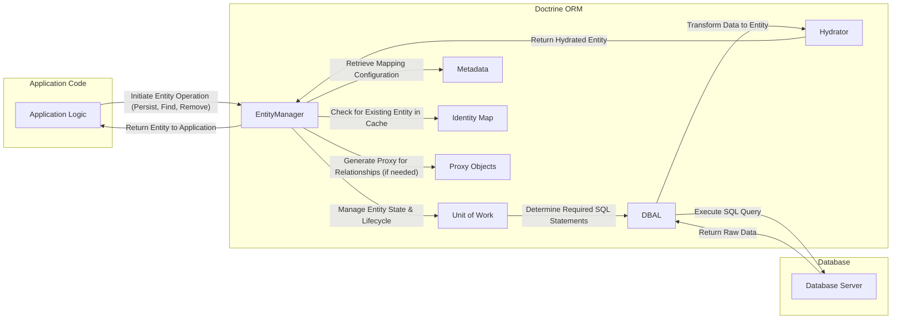

## Project Design Document: Doctrine ORM (Improved)

**1. Introduction**

This document provides an enhanced design overview of the Doctrine Object-Relational Mapper (ORM), a crucial PHP library for managing database interactions by mapping application objects to database tables. This improved document is specifically tailored to facilitate comprehensive threat modeling activities. It offers a detailed breakdown of the key architectural components, data flow pathways, and external interactions of Doctrine ORM, with a strong emphasis on security considerations.

**2. Goals and Objectives**

The core objectives of Doctrine ORM are:

* **Abstracting Database Complexity:** To offer a high-level, object-oriented interface for database operations, freeing developers from writing and managing raw SQL queries directly.
* **Enabling Object-Relational Mapping:** To seamlessly map PHP objects to corresponding database tables, allowing developers to interact with data through familiar object structures.
* **Streamlining Data Persistence:** To efficiently manage the lifecycle of objects in the database, encompassing the creation, retrieval, modification, and deletion of data records.
* **Facilitating Relationship Management:** To handle intricate relationships between different entities (including one-to-one, one-to-many, and many-to-many associations) with ease.
* **Ensuring Data Integrity:** To provide built-in mechanisms for maintaining data consistency and accuracy, such as transaction management and data validation capabilities.
* **Providing Powerful Querying Capabilities:** To offer a flexible and expressive query language (Doctrine Query Language - DQL) for retrieving data based on object properties and relationships.

**3. Architectural Overview**

Doctrine ORM's architecture revolves around the central **EntityManager**, which serves as the primary point of interaction for all ORM functionalities. The following list details the key components and their interactions within the system:

* **EntityManager:**
    * The central orchestrator for managing the lifecycle of entities.
    * Responsible for core operations like persisting new entities, finding existing ones, removing entities, and refreshing entity states.
    * Manages the internal Unit of Work to track changes.
    * Establishes and maintains the connection to the underlying database.
    * Provides access to the comprehensive metadata describing entity mappings.
* **Unit of Work:**
    * A crucial component responsible for tracking all modifications made to managed entities during a request's lifecycle.
    * Calculates the precise SQL statements required to synchronize these changes with the database during the flush operation.
    * Manages the order in which entities need to be persisted or updated to maintain data integrity.
* **Entity Manager Factory:**
    * The factory class responsible for instantiating and configuring the EntityManager instance.
    * Reads and processes configuration parameters, including database connection details, entity mapping configurations, and other settings.
* **Metadata:**
    * Contains comprehensive information describing the mapping between PHP classes (entities) and their corresponding database tables.
    * Includes details about table names, column names, data types, primary keys, relationships to other entities, and more.
    * Mapping information can be defined using various methods: annotations directly within the entity classes, external XML files, or YAML configuration files.
* **Identity Map:**
    * An in-memory cache that stores already loaded entity instances within the scope of the current Unit of Work.
    * Ensures that each entity is loaded from the database only once per request, significantly improving performance and guaranteeing object identity.
* **Proxy Objects:**
    * Placeholder objects that stand in for related entities that haven't been fully loaded yet.
    * Enable lazy loading, where related entities are only fetched from the database when they are actually accessed, optimizing performance for complex object graphs.
* **Database Abstraction Layer (DBAL):**
    * Provides a layer of abstraction over different relational database management systems (RDBMS) such as MySQL, PostgreSQL, and SQLite.
    * Handles establishing and managing database connections, executing SQL queries, and processing result sets in a database-agnostic manner.
    * Shields the core ORM logic from database-specific SQL dialects and functionalities.
* **Query Language (DQL):**
    * An object-oriented query language specifically designed for Doctrine ORM. It resembles SQL but operates on entities and their properties instead of database tables and columns.
    * DQL queries are translated into native SQL by the ORM before being executed against the database.
* **Query Builder:**
    * A programmatic interface for constructing DQL queries in a more structured and type-safe way.
    * Offers a fluent and chainable API for building complex queries step-by-step, reducing the risk of syntax errors.
* **Hydrator:**
    * Responsible for transforming raw data retrieved from the database (typically in the form of arrays or result sets) into fully instantiated PHP entity objects.
    * Handles the creation of entity instances and populates their properties with the corresponding data from the database.
* **Event System:**
    * A powerful mechanism that allows developers to hook into various stages of the entity lifecycle, such as before an entity is persisted (`prePersist`), after it's loaded from the database (`postLoad`), and more.
    * Enables the implementation of custom logic, auditing, and other cross-cutting concerns without directly modifying the core ORM code.
* **Cache (Optional):**
    * Doctrine supports integration with various caching systems (e.g., Memcached, Redis, APCu) to further enhance performance.
    * Caching can be applied at different levels: metadata caching (storing mapping information), query result caching (storing the results of frequently executed queries), and second-level entity caching (storing fully hydrated entity objects).

**4. Data Flow**

The following diagram illustrates the typical data flow within Doctrine ORM for common data manipulation operations:

**Detailed Data Flow for Key Operations:**

* **Persisting a New Entity:**
    1. The application code creates a new instance of an entity object.
    2. This entity object is passed to the `EntityManager::persist()` method, signaling the intention to save it to the database.
    3. The EntityManager registers the entity with the Unit of Work, marking it as a new, managed entity.
    4. When `EntityManager::flush()` is called (either explicitly or at the end of the request), the Unit of Work analyzes the managed entities.
    5. For new entities, the Unit of Work consults the Metadata to determine the corresponding database table and column mappings.
    6. The Unit of Work generates an `INSERT` SQL statement based on the entity's data and the metadata.
    7. The DBAL executes the generated `INSERT` statement against the configured database.
    8. The database server executes the insert and may return a generated identifier (e.g., for auto-incrementing primary keys).
    9. The EntityManager updates the entity object with the generated identifier.

* **Finding an Existing Entity:**
    1. The application code calls `EntityManager::find()` (or a repository method) with the entity class name and the identifier of the desired entity.
    2. The EntityManager first checks the Identity Map. If an entity with the given identifier is already loaded and managed, it's returned directly from the cache.
    3. If the entity is not found in the Identity Map, the EntityManager uses the Metadata to construct a `SELECT` SQL query to retrieve the entity from the database.
    4. The DBAL executes the `SELECT` query against the database.
    5. The database server returns the matching row(s) as a result set.
    6. The Hydrator takes the raw data from the result set and transforms it into a fully instantiated entity object.
    7. The EntityManager stores the newly loaded entity in the Identity Map for future access.
    8. The hydrated entity object is returned to the application code.

* **Updating an Existing Entity:**
    1. The application code retrieves an existing, managed entity (either by finding it or through a relationship).
    2. The application code modifies the properties of the retrieved entity object.
    3. When `EntityManager::flush()` is called, the Unit of Work compares the current state of the managed entity with its original state (snapshot).
    4. The Unit of Work identifies the changed properties.
    5. The Unit of Work uses the Metadata to generate an `UPDATE` SQL statement that includes only the modified columns and their new values.
    6. The DBAL executes the `UPDATE` statement against the database.

* **Removing an Entity:**
    1. The application code passes the entity object to be removed to the `EntityManager::remove()` method.
    2. The EntityManager registers the entity with the Unit of Work, marking it for deletion.
    3. When `EntityManager::flush()` is called, the Unit of Work consults the Metadata to determine the corresponding database table.
    4. The Unit of Work generates a `DELETE` SQL statement to remove the entity's record from the database.
    5. The DBAL executes the `DELETE` statement against the database.

**5. Security Considerations**

Doctrine ORM, while providing a layer of abstraction, necessitates careful attention to security to prevent potential vulnerabilities:

* **SQL Injection:**
    * Doctrine's DQL and Query Builder inherently protect against SQL injection by utilizing parameterized queries. User-provided values are treated as data, not executable code.
    * **Risk:**  Introducing SQL injection vulnerabilities is possible through the use of native SQL queries or by manually concatenating strings into DQL queries.
    * **Mitigation:**  Strictly adhere to using parameterized queries via DQL or the Query Builder. Avoid direct SQL manipulation unless absolutely necessary and, in such cases, sanitize inputs rigorously.
* **Authorization and Access Control:**
    * Doctrine ORM itself does not handle user authentication or authorization. These aspects are the responsibility of the application layer.
    * **Risk:**  Without proper authorization checks, users might be able to access or modify data they are not permitted to.
    * **Mitigation:** Implement robust authentication and authorization mechanisms within the application logic. Control access to entities and their properties based on user roles and permissions. Consider using security voters or access control lists (ACLs).
* **Data Validation:**
    * Doctrine allows defining validation rules for entities, ensuring data integrity before persistence.
    * **Risk:**  Insufficient or missing validation can lead to invalid or malicious data being stored in the database, potentially causing application errors or security breaches.
    * **Mitigation:**  Define comprehensive validation rules for all entities, covering data types, formats, and constraints. Leverage Doctrine's validation features or integrate with dedicated validation libraries.
* **Mass Assignment Vulnerabilities:**
    * While Doctrine doesn't have a direct "mass assignment" feature like some frameworks, developers should be cautious when setting entity properties directly from user input.
    * **Risk:**  Allowing users to set arbitrary entity properties can lead to unintended modification of sensitive data or bypass business logic.
    * **Mitigation:**  Be explicit about which entity properties can be set from user input. Utilize Data Transfer Objects (DTOs) to act as an intermediary, controlling which data is transferred to entities. Avoid directly binding request data to entity objects.
* **Second-Level Cache Poisoning (if enabled):**
    * If a second-level cache is used, vulnerabilities in the cache implementation or improper cache invalidation strategies can lead to serving stale or incorrect data.
    * **Risk:**  Serving outdated or manipulated data from the cache, potentially leading to incorrect application behavior or security issues.
    * **Mitigation:**  Choose a reputable and secure caching provider. Implement robust cache invalidation strategies to ensure data consistency. Secure the communication channels with the cache server.
* **Information Disclosure:**
    * Error messages or debug information generated by Doctrine or the underlying database can inadvertently reveal sensitive information.
    * **Risk:**  Exposing database schema details, query structures, or internal application state to unauthorized users.
    * **Mitigation:**  Configure error reporting appropriately for production environments. Avoid displaying detailed error messages to end-users. Log errors securely and review them regularly.
* **Denial of Service (DoS):**
    * Complex or poorly optimized DQL queries can potentially lead to performance bottlenecks and denial-of-service conditions by overloading the database.
    * **Risk:**  Making the application unresponsive or unavailable due to excessive database load.
    * **Mitigation:**  Optimize DQL queries, use indexes effectively, implement pagination for large datasets, and consider implementing rate limiting for database interactions.
* **Security of Mapping Metadata:**
    * The metadata defining the entity mappings is critical for the ORM's functionality.
    * **Risk:** If the metadata files (annotations, XML, YAML) are compromised, attackers could potentially manipulate the mapping, leading to unauthorized data access or modification.
    * **Mitigation:** Secure the metadata files and ensure they are not publicly accessible. Implement proper access controls and versioning for these files.

**6. Potential Threats (Specific Examples for Threat Modeling)**

This section provides more concrete examples of potential threats that should be considered during a dedicated threat modeling exercise:

* **Exploiting Native SQL:** A developer uses `EntityManager::getConnection()->executeQuery()` with unsanitized user input, leading to **SQL Injection**.
* **Bypassing Authorization:** A vulnerability in the application's authorization logic allows a user to access or modify entities they shouldn't, even though Doctrine itself is functioning correctly.
* **Data Tampering via Mass Assignment:**  A form allows users to submit data that is directly bound to an entity without proper filtering, enabling them to modify sensitive fields they shouldn't have access to.
* **Cache Poisoning Attack:** An attacker manages to inject malicious data into the second-level cache, causing all subsequent requests to retrieve this tainted data.
* **Error Message Exploitation:** Detailed database error messages are displayed to users, revealing information about the database schema that can be used for further attacks.
* **Slow Query DoS:** An attacker crafts a complex DQL query that consumes excessive database resources, causing performance degradation for other users.
* **Metadata Manipulation:** An attacker gains access to the entity mapping files and modifies them to alter relationships or data types, leading to data corruption or unauthorized access.

**7. Dependencies**

Doctrine ORM relies on the following key components:

* **PHP (version requirement specified in Doctrine's documentation):** The programming language in which Doctrine ORM is developed and executed.
* **Doctrine DBAL (Database Abstraction Layer):**  A fundamental dependency that provides the database-agnostic interface.
* **Composer:** The standard dependency management tool for PHP, used to install and manage Doctrine and its dependencies.
* **A compatible PHP Database Extension (e.g., PDO_MySQL, PDO_pgsql, pdo_sqlite):**  Required to connect to the specific database system being used.
* **Optional Caching Libraries (e.g., memcached, redis, apcu):**  Required if second-level caching is implemented.

**8. Deployment**

Doctrine ORM is deployed as a library within a PHP application. The application's codebase includes the Doctrine ORM library, typically installed via Composer. The application's configuration specifies the database connection parameters and entity mapping details that Doctrine ORM uses to interact with the database. No separate deployment process is required for the ORM itself.

**9. Future Considerations**

* **Continuous improvement of security documentation and best practices for developers using Doctrine ORM.**
* **Development of more sophisticated static analysis tools to automatically detect potential security vulnerabilities in DQL queries and entity mappings.**
* **Enhanced integration with security scanning tools and platforms to facilitate automated vulnerability assessments.**
* **Exploration of more fine-grained authorization mechanisms that can be integrated directly within the ORM layer.**

This improved design document provides a more detailed and security-focused overview of Doctrine ORM. It serves as a valuable resource for conducting thorough threat modeling and identifying potential security risks associated with its use.
