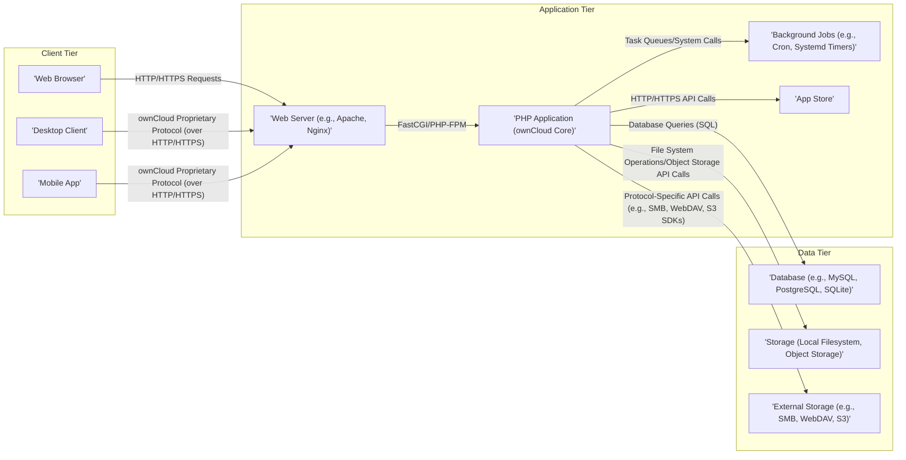

# Project Design Document: ownCloud Core

**Version:** 1.1
**Date:** October 26, 2023
**Author:** AI Software Architect

## 1. Introduction

This document provides an enhanced architectural design of the ownCloud Core project, based on the codebase at [https://github.com/owncloud/core](https://github.com/owncloud/core). This revised document aims to provide a more granular and comprehensive understanding of the system's components, interactions, and data flow, specifically tailored for effective threat modeling activities. It builds upon the previous version by adding more detail and clarifying key aspects.

## 2. Goals and Objectives

The primary goal of this design document remains to clearly articulate the architecture of ownCloud Core to facilitate effective threat modeling. Specific objectives include:

*   Clearly identifying and describing key components and their specific responsibilities.
*   Providing detailed mappings of data flow within the system for various operations.
*   Elaborating on the interactions and communication protocols between different components.
*   Highlighting potential security-relevant aspects of the design with more specific examples.
*   Providing a well-structured and detailed overview for security analysts, developers, and operations teams.

## 3. High-Level Architecture

ownCloud Core is a self-hosted file sync and share platform built upon a layered architecture. This diagram illustrates the primary tiers and their interactions.



## 4. Detailed Component Description

This section provides a more granular look at the key components of ownCloud Core, detailing their responsibilities and technologies.

*   **Client Tier:**
    *   **Web Browser:**  Utilizes standard web technologies (HTML, CSS, JavaScript) to provide a user interface for file management, sharing, administration, and app interaction.
    *   **Desktop Client:** A native application (available for Windows, macOS, Linux) that synchronizes files using a proprietary protocol over HTTP/HTTPS. It handles conflict resolution, versioning, and background synchronization.
    *   **Mobile App:** Native applications (available for iOS and Android) providing access to ownCloud files and features, also using a proprietary protocol over HTTP/HTTPS.

*   **Application Tier:**
    *   **Web Server (e.g., Apache, Nginx):** Acts as the entry point for all client requests.
        *   **Responsibilities:**  Receives and routes HTTP/HTTPS requests, handles SSL/TLS termination, serves static content, and forwards dynamic requests to the PHP application via FastCGI or PHP-FPM.
        *   **Security Considerations:** Vulnerable to web server-specific attacks if not properly configured and patched.
    *   **PHP Application (ownCloud Core):** The core business logic of ownCloud, primarily written in PHP, often leveraging frameworks like the ownCloud App Framework and potentially Symfony components.
        *   **Responsibilities:**
            *   **Authentication and Authorization:** Manages user logins, sessions, and access control based on roles and permissions.
            *   **File Management:** Handles file uploads, downloads, versioning, locking, and metadata management.
            *   **Sharing:** Manages internal and external sharing of files and folders, including permissions and link management.
            *   **API Endpoints:** Provides RESTful APIs for clients and apps to interact with the core functionalities.
            *   **App Management:**  Handles the installation, enabling, and management of ownCloud apps.
            *   **Event System:**  Provides a mechanism for components and apps to subscribe to and publish events within the system.
        *   **Security Considerations:**  Susceptible to common web application vulnerabilities like XSS, CSRF, SQL injection (if not using prepared statements correctly), and insecure deserialization.
    *   **Background Jobs (e.g., Cron, Systemd Timers):** Executes scheduled tasks outside the context of a user request.
        *   **Responsibilities:** Performing maintenance tasks (e.g., cleaning up temporary files, running database optimizations), processing asynchronous operations (e.g., generating previews, sending notifications), and handling scheduled file scans.
        *   **Security Considerations:**  If not properly secured, these jobs could be exploited to gain unauthorized access or disrupt service.
    *   **App Store:** A component within the ownCloud ecosystem that allows users to discover, download, and install additional applications.
        *   **Responsibilities:**  Providing a curated or community-driven marketplace for extending ownCloud's functionality.
        *   **Security Considerations:**  Requires careful vetting of apps to prevent the introduction of malicious code or vulnerabilities.

*   **Data Tier:**
    *   **Database (e.g., MySQL, PostgreSQL, SQLite):** Stores structured data related to users, files, shares, settings, and app configurations.
        *   **Responsibilities:** Persisting application state and metadata.
        *   **Security Considerations:**  Requires secure configuration, access control, and protection against SQL injection attacks.
    *   **Storage (Local Filesystem, Object Storage):** The primary storage backend for user files.
        *   **Responsibilities:**  Storing and retrieving file data.
        *   **Security Considerations:**  Requires appropriate file system permissions, encryption at rest (if configured), and secure access controls.
    *   **External Storage (e.g., SMB, WebDAV, S3):** Enables ownCloud to connect to and manage files stored on external services.
        *   **Responsibilities:**  Providing access to files residing on other platforms.
        *   **Security Considerations:**  Relies on the security of the external storage provider and the secure configuration of the connection (e.g., secure credentials management, encrypted communication).

## 5. Data Flow

This section provides more detailed data flow diagrams for common operations.

*   **User Authentication (Web Browser):**
    ```mermaid
    graph LR
        A["'Web Browser'"]
        B["'Web Server'"]
        C["'PHP Application'"]
        D["'Database'"]

        A -- "1. Login Request (HTTPS)" --> B
        B -- "2. Forward to PHP Application" --> C
        C -- "3. Query User Credentials" --> D
        D -- "4. Return Credentials" --> C
        C -- "5. Verify Credentials" --> C
        C -- "6. Create Session, Return Session Cookie (HTTPS)" --> A
    ```

*   **File Upload (Desktop Client):**
    ```mermaid
    graph LR
        A["'Desktop Client'"]
        B["'Web Server'"]
        C["'PHP Application'"]
        D["'Storage'"]
        E["'Database'"]

        A -- "1. Initiate Upload (ownCloud Protocol over HTTPS)" --> B
        B -- "2. Forward to PHP Application" --> C
        C -- "3. Authenticate and Authorize" --> C
        C -- "4. Prepare Storage Location" --> C
        C -- "5. Receive File Chunks (ownCloud Protocol over HTTPS)" --> B
        B -- "6. Forward File Chunks" --> C
        C -- "7. Store File Chunks" --> D
        C -- "8. Update File Metadata" --> E
        E -- "9. Acknowledge Metadata Update" --> C
        C -- "10. Return Upload Success (ownCloud Protocol over HTTPS)" --> A
    ```

*   **Sharing a File (Web Browser):**
    ```mermaid
    graph LR
        A["'Web Browser'"]
        B["'Web Server'"]
        C["'PHP Application'"]
        D["'Database'"]

        A -- "1. Share Request (HTTPS)" --> B
        B -- "2. Forward to PHP Application" --> C
        C -- "3. Authenticate and Authorize" --> C
        C -- "4. Create Share Record" --> D
        D -- "5. Acknowledge Share Creation" --> C
        C -- "6. Send Notification (if applicable)" --> C
        C -- "7. Return Share Success (HTTPS)" --> A
    ```

## 6. Key Interactions

This section elaborates on the communication methods and protocols used between components.

*   **Client-Server Communication:**
    *   **Web Browser:** Primarily uses standard HTTP/HTTPS requests and responses, including AJAX for dynamic updates. Data is often exchanged in JSON format.
    *   **Desktop and Mobile Clients:** Utilize a proprietary protocol built on top of HTTP/HTTPS. This protocol handles synchronization-specific operations, chunked transfers, and metadata exchange.
*   **PHP Application - Database Communication:**  Uses PHP Data Objects (PDO) or similar database abstraction layers with specific database drivers (e.g., `pdo_mysql`, `pdo_pgsql`). SQL queries (often parameterized to prevent SQL injection) are used for data manipulation.
*   **PHP Application - Storage Communication:**
    *   **Local Filesystem:** Uses standard PHP file system functions (e.g., `fopen`, `fwrite`, `fread`).
    *   **Object Storage:** Interacts via SDKs or APIs provided by the object storage service (e.g., AWS SDK for PHP, OpenStack Swift API).
*   **PHP Application - External Storage Communication:**  Relies on specific protocols and libraries for each external storage type.
    *   **SMB/CIFS:** May use libraries like `smbclient-php`.
    *   **WebDAV:** Uses HTTP client libraries to perform WebDAV operations.
    *   **S3:** Uses the AWS SDK for PHP.
*   **PHP Application - Background Jobs:**  Communication is often asynchronous.
    *   **Task Queues:**  May use a task queue system (e.g., Redis, RabbitMQ) to enqueue jobs for background processing.
    *   **Database:**  Background jobs might be triggered by changes in the database or update the database with their status.
    *   **Operating System Scheduling:** Relies on cron jobs or systemd timers to initiate background processes.
*   **PHP Application - App Store:** Communicates with the app store (either the official ownCloud marketplace or a configured alternative) via HTTP/HTTPS API calls to retrieve app information, download packages, and manage installations.

## 7. Security Considerations

This section provides a more detailed breakdown of security considerations, categorized for clarity.

*   **Authentication and Authorization:**
    *   **Multi-Factor Authentication (MFA):**  Support for MFA is crucial to enhance login security.
    *   **Brute-Force Protection:** Implementing measures to prevent brute-force attacks on login endpoints.
    *   **Password Policies:** Enforcing strong password requirements.
    *   **Role-Based Access Control (RBAC):**  Properly defining and enforcing roles and permissions for users and groups.
*   **Session Management:**
    *   **Secure Session Cookies:** Using `HttpOnly` and `Secure` flags for session cookies.
    *   **Session Fixation Protection:** Preventing session fixation attacks.
    *   **Session Timeout:** Implementing appropriate session timeouts.
    *   **Logout Functionality:** Providing secure logout mechanisms.
*   **Input Validation and Output Encoding:**
    *   **Sanitization of User Inputs:**  Preventing injection attacks (SQL injection, XSS, LDAP injection, etc.) by validating and sanitizing all user-provided data.
    *   **Context-Aware Output Encoding:** Encoding output data based on the context (HTML, JavaScript, URL) to prevent XSS.
*   **Data Encryption:**
    *   **Encryption in Transit:** Enforcing HTTPS for all communication.
    *   **Encryption at Rest:** Supporting encryption of data stored in the primary storage and potentially the database.
*   **Access Control:**
    *   **File and Folder Permissions:** Implementing granular permissions for accessing and modifying files and folders.
    *   **Share Permissions:**  Controlling access levels for shared files and folders (read-only, read-write, etc.).
*   **Secure File Handling:**
    *   **Virus Scanning:** Integrating with antivirus software to scan uploaded files.
    *   **File Size Limits:**  Enforcing limits on uploaded file sizes to prevent denial-of-service attacks.
    *   **Secure Temporary File Handling:**  Properly managing and deleting temporary files.
*   **Dependency Management:**
    *   **Regularly Updating Dependencies:** Keeping third-party libraries and components up-to-date to patch known vulnerabilities.
    *   **Software Composition Analysis (SCA):**  Using tools to identify vulnerabilities in dependencies.
*   **App Security:**
    *   **App Vetting Process:** Implementing a process for reviewing and vetting apps in the app store.
    *   **Sandboxing or Isolation:**  Potentially isolating apps to limit their access to system resources.
    *   **Permissions for Apps:**  Defining and controlling the permissions requested by apps.
*   **External Storage Security:**
    *   **Secure Credential Management:**  Storing credentials for external storage securely (e.g., using encryption).
    *   **Least Privilege Principle:**  Granting only necessary permissions to external storage.
*   **Rate Limiting and Denial of Service Protection:**
    *   **Rate Limiting API Endpoints:**  Protecting against abuse by limiting the number of requests from a single IP address or user.
    *   **Web Application Firewall (WAF):**  Using a WAF to filter malicious traffic.
*   **Logging and Monitoring:**
    *   **Comprehensive Logging:**  Logging security-relevant events for auditing and incident response.
    *   **Security Monitoring:**  Implementing systems to monitor for suspicious activity.

## 8. Deployment Model

The deployment model significantly impacts the security posture of ownCloud Core.

*   **Single Server Deployment:**  Simpler to set up but presents a single point of failure and may have a larger attack surface if all components are exposed. Requires careful hardening of the single server.
*   **Multi-Server Deployment:**  Offers better scalability and resilience. Security can be enhanced by isolating components on separate servers (e.g., separating the database server). Requires secure communication channels between servers.
*   **Containerized Deployment (e.g., Docker, Kubernetes):**  Provides isolation and simplifies deployment. Security depends on the security of the container images and the underlying container orchestration platform. Requires careful configuration of network policies and resource limits.

## 9. Assumptions and Constraints

*   The underlying operating system and network infrastructure are assumed to be reasonably secure and properly configured.
*   This document focuses on the core ownCloud application. The security of individual apps is a separate concern, although the app store mechanism is considered.
*   The specific technologies used for the web server, database, and storage can vary, but the general architectural principles remain the same.
*   Developers are expected to follow secure coding practices and adhere to security guidelines.

## 10. Conclusion

This enhanced design document provides a more detailed and comprehensive architectural overview of ownCloud Core, specifically tailored for threat modeling. By outlining the components, data flows, interactions, and security considerations in greater detail, this document aims to facilitate a more thorough and effective threat modeling process, ultimately contributing to a more secure ownCloud platform. This document will be maintained and updated as the architecture evolves.