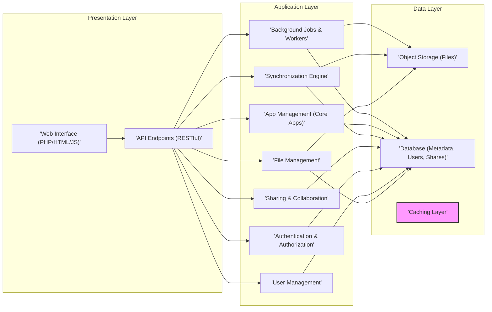
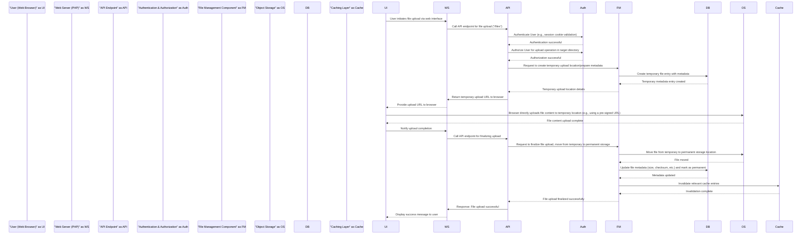

## Project Design Document: ownCloud Core

**Document Version:** 1.1
**Date:** October 26, 2023
**Author:** AI Software Architect

### 1. Introduction

This document outlines the detailed design of the ownCloud Core project, a self-hosted file sync and share platform. This document provides a comprehensive understanding of the system's architecture, its constituent components, and their interactions. It is specifically crafted to serve as a robust foundation for subsequent threat modeling exercises.

### 2. Goals and Objectives

*   Provide a clear, detailed, and unambiguous overview of the ownCloud Core architecture.
*   Thoroughly identify key components, delineate their specific responsibilities, and highlight their interdependencies.
*   Illustrate the primary data flows within the system with sufficient detail for security analysis.
*   Highlight initial security considerations relevant to the design, anticipating potential vulnerabilities.
*   Serve as a definitive and reliable foundation for subsequent threat modeling activities, enabling accurate identification of threats and attack vectors.

### 3. Target Audience

This document is primarily intended for:

*   Security engineers tasked with performing threat modeling, penetration testing, and security assessments of the ownCloud Core.
*   Software developers actively contributing to the ownCloud Core project, requiring a deep understanding of the system's architecture.
*   System administrators responsible for the secure deployment, configuration, and maintenance of ownCloud instances.
*   Technical stakeholders seeking a comprehensive and in-depth understanding of the ownCloud Core architecture and its security implications.

### 4. Scope

This document focuses exclusively on the design of the `owncloud/core` repository, representing the core functionalities of the ownCloud platform. The scope encompasses:

*   The web interface facilitating user interaction and management.
*   The API endpoints enabling programmatic access for client applications and integrations.
*   The fundamental file management operations, including storage, retrieval, versioning, and trash management.
*   The user and group management systems, encompassing user authentication and authorization.
*   The mechanisms for authentication and authorization controlling access to resources and functionalities.
*   The storage abstraction layer, detailing how ownCloud interacts with different storage backends.

This document explicitly excludes:

*   Specific details of client applications (desktop, mobile) and their internal workings.
*   The intricacies of external integrations and third-party applications beyond the core functionalities provided by the `owncloud/core` repository.
*   Low-level implementation specifics within individual components, focusing instead on architectural design.
*   Detailed specifics of deployment infrastructure, such as exact server configurations, operating systems, or network topologies.

### 5. High-Level Architecture

The ownCloud Core architecture is structured into three primary logical layers, each with distinct responsibilities:

*   **Presentation Layer:** This layer is responsible for handling user interactions and providing access points for external applications. It includes the web interface for direct user interaction and API endpoints for programmatic access.
*   **Application Layer:** This layer contains the core business logic of ownCloud, orchestrating the functionalities related to file management, user administration, security, and collaboration.
*   **Data Layer:** This layer manages the persistent storage of data, including both the actual file content and the associated metadata, user information, and sharing configurations.

### 6. Component Details

This section provides a more granular description of the key components within each layer, elaborating on their functionalities and potential security considerations.

#### 6.1. Presentation Layer

*   **Web Interface (PHP/HTML/JS):**
    *   Provides the primary graphical user interface for users to interact with ownCloud via web browsers.
    *   Built using a combination of PHP for server-side logic and HTML, CSS, and JavaScript for the client-side experience.
    *   Handles user login, file browsing, uploading, downloading, sharing, user profile management, and application settings.
    *   Relies heavily on the API Endpoints for data retrieval and manipulation, acting as a client to the Application Layer.
    *   **Security Considerations:** Susceptible to client-side attacks such as Cross-Site Scripting (XSS). Requires robust input sanitization and output encoding. Session management security is critical here.
*   **API Endpoints (RESTful):**
    *   Offers a set of RESTful APIs that allow client applications (desktop, mobile, and third-party integrations) to programmatically interact with the ownCloud Core.
    *   Provides endpoints for managing files, users, shares, and other core functionalities.
    *   Typically uses JSON for request and response payloads, facilitating interoperability.
    *   Enforces authentication and authorization for all API requests to ensure secure access.
    *   **Security Considerations:** Requires strict authentication and authorization mechanisms. Vulnerable to API-specific attacks if not properly secured (e.g., injection flaws, broken authentication). Rate limiting is important to prevent abuse.

#### 6.2. Application Layer

*   **File Management:**
    *   Manages all aspects of file operations, including creating, reading, updating, deleting, renaming, and moving files and directories.
    *   Implements file versioning, allowing users to revert to previous versions of files.
    *   Handles the trash functionality for deleted files.
    *   Interacts with the Object Storage to store and retrieve the actual file data.
    *   Updates the Database with file metadata (name, size, modification time, owner, etc.).
    *   **Security Considerations:** Requires robust access control to prevent unauthorized file access or modification. Vulnerable to path traversal issues if not carefully implemented.
*   **User Management:**
    *   Manages user accounts, including creation, modification, deletion, and password management.
    *   Handles group management, allowing administrators to organize users into groups for easier permission management.
    *   Manages user attributes, such as email addresses, display names, and quotas.
    *   Provides interfaces for user authentication.
    *   **Security Considerations:** Critical for overall security. Vulnerable to account enumeration, brute-force attacks, and insecure password storage if not implemented correctly.
*   **Authentication & Authorization:**
    *   Authenticates users based on provided credentials (username/password, potentially other methods like OAuth or SAML).
    *   Authorizes user actions based on their roles, permissions, group memberships, and sharing settings.
    *   Integrates with the User Management component to retrieve user information and verify credentials.
    *   Enforces access control policies across the platform.
    *   **Security Considerations:** A primary target for attackers. Weaknesses here can lead to complete system compromise. Requires multi-factor authentication support and protection against credential stuffing.
*   **Sharing & Collaboration:**
    *   Enables users to share files and folders with other users within the ownCloud instance or with external recipients via public links.
    *   Manages different types of shares (internal, public links with optional passwords and expiration dates, federated shares).
    *   Enforces access permissions on shared resources, controlling what actions shared users can perform.
    *   Stores sharing information, including permissions and share recipients, in the Database.
    *   **Security Considerations:** Public links require careful management to prevent unauthorized access to sensitive data. Federated sharing introduces complexities in trust management.
*   **Synchronization Engine:**
    *   Handles the synchronization of files between client devices (desktop and mobile apps) and the server.
    *   Detects changes in local and remote files and propagates these changes efficiently.
    *   Resolves conflicts that may arise when the same file is modified on multiple devices.
    *   May use protocols like WebDAV or a custom synchronization protocol for communication with clients.
    *   **Security Considerations:** Requires secure communication channels (HTTPS). Vulnerable to man-in-the-middle attacks if not properly secured. Client-side vulnerabilities can also impact synchronization security.
*   **App Management (Core Apps):**
    *   Provides a mechanism for managing and enabling/disabling core ownCloud applications (e.g., Calendar, Contacts, Mail).
    *   Allows administrators to control which applications are available to users.
    *   These core apps extend the functionality of the platform beyond basic file storage and sharing.
    *   **Security Considerations:**  App vulnerabilities can impact the security of the entire platform. Requires secure app installation and update mechanisms.
*   **Background Jobs & Workers:**
    *   Handles asynchronous tasks and background processing, such as file scanning, thumbnail generation, and email notifications.
    *   Ensures that long-running operations do not block user requests.
    *   May use a message queue or a similar mechanism for managing background tasks.
    *   **Security Considerations:**  Improperly secured background jobs could be exploited to gain unauthorized access or execute malicious code.

#### 6.3. Data Layer

*   **Object Storage (Files):**
    *   Stores the actual binary data of the files uploaded by users.
    *   Can be implemented using various storage backends, including local filesystem storage, cloud object storage services (like Amazon S3 or Azure Blob Storage), or network-attached storage (NAS).
    *   Provides mechanisms for efficient storage, retrieval, and potentially versioning of large files.
    *   **Security Considerations:** Requires strong access control to prevent unauthorized access to raw file data. Encryption at rest is crucial for protecting sensitive information.
*   **Database (Metadata, Users, Shares):**
    *   Stores metadata about files (name, size, modification time, ownership), user account information, group memberships, permissions, and details about file shares.
    *   Typically a relational database management system (RDBMS) such as MySQL, PostgreSQL, or SQLite.
    *   Critical for the overall functionality of ownCloud.
    *   **Security Considerations:**  A primary target for attacks. Requires strong authentication and authorization, protection against SQL injection, and regular backups.
*   **Caching Layer:**
    *   Improves performance by storing frequently accessed data in a temporary storage location for faster retrieval.
    *   Can be implemented using various caching technologies like Redis or Memcached.
    *   Reduces the load on the database and object storage.
    *   **Security Considerations:**  Cached data may contain sensitive information. Secure configuration and access control are necessary.

### 7. Data Flow

This section illustrates a more detailed data flow for a common user action: uploading a file, highlighting the interactions between different components.

### 8. Security Considerations (Detailed)

This section expands on the initial security considerations, providing more specific examples and linking them to the relevant components and data flows.

*   **Authentication and Authorization:**
    *   **Web Interface & API Endpoints:** Implement robust session management with appropriate timeouts and secure cookie attributes (HttpOnly, Secure, SameSite). Enforce strong password policies and consider multi-factor authentication. Protect against brute-force attacks on login endpoints.
    *   **API Endpoints:** Utilize secure API key management or OAuth 2.0 for third-party integrations. Implement proper scope management for API access.
    *   **Authentication & Authorization Component:** Ensure this component is thoroughly tested for vulnerabilities. Securely store and manage user credentials (using hashing and salting).
*   **Input Validation:**
    *   **Web Interface & API Endpoints:** Sanitize all user inputs to prevent Cross-Site Scripting (XSS) attacks. Validate data types and formats to prevent injection attacks (SQL injection, command injection).
    *   **File Management Component:** Implement strict validation of file paths and names to prevent path traversal vulnerabilities. Validate file sizes and types to prevent malicious uploads.
*   **Data Encryption:**
    *   **All Layers:** Enforce HTTPS/TLS for all communication to protect data in transit.
    *   **Object Storage:** Implement encryption at rest for stored files. Consider using server-side encryption or client-side encryption.
    *   **Database:** Encrypt sensitive data at rest within the database.
*   **Access Control:**
    *   **File Management & Sharing:** Implement fine-grained access control lists (ACLs) to manage permissions on files and folders. Ensure that sharing permissions are correctly enforced.
    *   **User Management:** Implement role-based access control (RBAC) to manage user privileges.
*   **Session Management:**
    *   **Web Interface & API Endpoints:** Use secure session identifiers and regenerate session IDs after login to prevent session fixation attacks. Implement proper session timeouts.
*   **Storage Security:**
    *   **Object Storage:** Configure appropriate access controls on the underlying storage backend to prevent unauthorized access.
    *   **Database:** Secure database access credentials and restrict access to authorized components only.
*   **Dependency Management:**
    *   **All Layers:** Regularly update third-party libraries and dependencies to patch known vulnerabilities. Implement a process for tracking and managing dependencies.
*   **Rate Limiting:**
    *   **API Endpoints:** Implement rate limiting to prevent denial-of-service attacks and brute-force attempts.
*   **Auditing and Logging:**
    *   **All Layers:** Implement comprehensive logging of user actions, API requests, and system events for security monitoring and incident response. Securely store and manage audit logs.
*   **Background Jobs & Workers:**
    *   Ensure that background jobs are executed with appropriate privileges and do not introduce security vulnerabilities. Sanitize inputs and validate outputs.

### 9. Deployment Considerations

The secure deployment of ownCloud Core requires careful consideration of various factors:

*   **Web Server Configuration:** Secure the web server (e.g., Apache, Nginx) by disabling unnecessary modules, configuring appropriate security headers, and keeping the server software up-to-date.
*   **PHP Configuration:** Secure the PHP environment by disabling dangerous functions, configuring appropriate security settings, and keeping PHP updated.
*   **Database Security:** Secure the database server by using strong passwords, restricting network access, and keeping the database software updated.
*   **Object Storage Configuration:** Secure the object storage backend by configuring appropriate access controls and encryption settings.
*   **Network Security:** Implement firewalls and intrusion detection/prevention systems to protect the ownCloud instance from network-based attacks.
*   **Regular Security Audits:** Conduct regular security audits and penetration testing to identify and address potential vulnerabilities.
*   **Backup and Recovery:** Implement a robust backup and recovery strategy to protect against data loss.

Deployment choices (on-premise, cloud-based, containerized) will influence the specific security measures required.

### 10. Future Considerations

*   Detailed design specifications for individual components, such as the Synchronization Engine and the App Management system.
*   Further elaboration on the architecture of the app ecosystem and its integration with the core.
*   In-depth consideration of federation and inter-server communication protocols and security implications.
*   A comprehensive threat model derived from this design document, identifying potential threats, vulnerabilities, and attack vectors.
*   Detailed security requirements and guidelines for developers contributing to the project.
*   Plans for ongoing security assessments and vulnerability management.

This document provides a detailed and comprehensive overview of the ownCloud Core architecture, serving as a crucial resource for development, security analysis, and, most importantly, for conducting thorough and effective threat modeling activities.