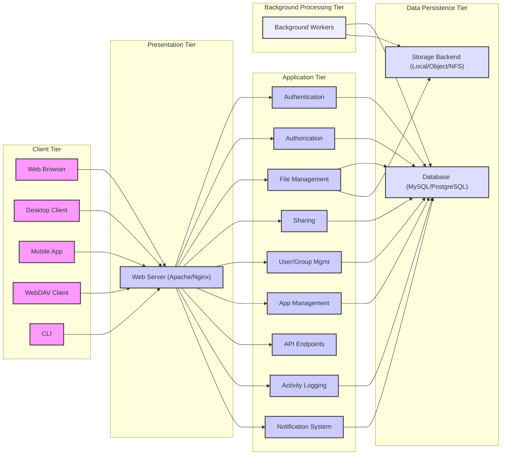

## Project Design Document: ownCloud Core

**Version:** 1.1
**Date:** October 26, 2023
**Author:** AI Software Architect

### 1. Project Overview

This document provides a detailed design overview of the ownCloud Core project. ownCloud Core serves as the central platform for self-hosted file synchronization and sharing, offering users control over their data. This document details the system's architecture, data flow, and security considerations, forming the basis for subsequent threat modeling activities.

### 2. Goals and Objectives

The primary goals of ownCloud Core are:

*   **Secure Data Storage:** Provide a robust and secure platform for users to store and manage their digital assets.
*   **Cross-Device Synchronization:** Enable seamless and reliable synchronization of files across various devices (desktops, laptops, mobile devices).
*   **Collaborative Sharing:** Facilitate secure and controlled sharing of files and folders with internal and external users or groups.
*   **Extensibility and Customization:** Offer a modular architecture that allows for the development and integration of additional functionalities through apps.
*   **User Privacy and Control:** Empower users with complete control over their data location and access.
*   **Open Source Foundation:** Maintain an open and transparent development process.

### 3. Target Audience

This document is intended for:

*   Security architects and engineers responsible for threat modeling and security assessments of ownCloud deployments.
*   Software developers contributing to or integrating with the ownCloud Core codebase.
*   System administrators involved in the deployment, configuration, and maintenance of ownCloud instances.
*   Technical stakeholders requiring a comprehensive understanding of the ownCloud Core system architecture.

### 4. System Architecture

ownCloud Core employs a multi-layered architecture, with each layer responsible for specific functionalities.

*   **Client Tier:**  Represents the various interfaces users interact with:
    *   **Web Interface:** A browser-based interface providing access to files and features.
    *   **Desktop Sync Clients:** Native applications for Windows, macOS, and Linux that synchronize files between local devices and the ownCloud server.
    *   **Mobile Apps:** Applications for Android and iOS devices enabling file access and synchronization on mobile platforms.
    *   **WebDAV Interface:** Allows third-party applications and services to interact with ownCloud using the WebDAV protocol.
    *   **Command Line Interface (CLI):** Provides command-line access for administrative tasks and scripting.

*   **Presentation Tier (Web Server):** Handles incoming client requests and manages communication:
    *   **Web Server Software:** Typically Apache or Nginx, responsible for serving static content and proxying requests to the application layer.
    *   **SSL/TLS Termination:** Handles secure communication over HTTPS.

*   **Application Tier (PHP Application):** Contains the core business logic and functionalities:
    *   **Authentication Module:** Manages user login and authentication processes (e.g., username/password, OAuth2, LDAP).
    *   **Authorization Module:** Enforces access control policies, determining user permissions for files and folders.
    *   **File Management Module:** Handles operations like upload, download, rename, delete, and versioning of files.
    *   **Sharing Module:** Manages the creation, modification, and revocation of file and folder shares.
    *   **User and Group Management Module:**  Handles the creation, modification, and management of user accounts and groups.
    *   **App Management Module:**  Provides the functionality to install, update, and manage optional applications.
    *   **API Endpoints:** Exposes RESTful APIs for client applications and third-party integrations.
    *   **Activity Logging:** Records user actions and system events for auditing and monitoring.
    *   **Notification System:** Manages and delivers notifications to users about relevant events.

*   **Data Persistence Tier:** Responsible for storing persistent data:
    *   **Database System:** Stores metadata about files, users, shares, and application settings. Common choices include MySQL/MariaDB, PostgreSQL, and SQLite.
    *   **Storage Backend:** Manages the actual storage of user files. This can be:
        *   **Local File System:** Files are stored directly on the server's file system.
        *   **Object Storage:** Integration with object storage services like Amazon S3, OpenStack Swift, or Ceph.
        *   **Network File Systems:** Mounting network shares like NFS or SMB/CIFS.
        *   **External Storage Providers:** Connecting to external services like Dropbox or Google Drive (via apps).

*   **Background Processing Tier:** Handles asynchronous and scheduled tasks:
    *   **Background Workers:** Processes tasks like file version cleanup, trash management, and scheduled maintenance jobs.
    *   **Cron Jobs/Task Scheduler:**  Triggers scheduled tasks.

### 5. Data Flow

The following illustrates the typical data flow for key operations within ownCloud Core:

*   **User Login:**
    *   Client Application -> "Web Server": Sends login credentials (username/password).
    *   "Web Server" -> "Application Layer": Forwards credentials for authentication.
    *   "Application Layer" -> "Database Layer": Verifies credentials against user data.
    *   "Database Layer" -> "Application Layer": Returns authentication result.
    *   "Application Layer" -> "Web Server": Creates a session upon successful authentication.
    *   "Web Server" -> Client Application: Returns session cookie or token.

*   **File Upload:**
    *   Client Application -> "Web Server": Sends file data and metadata.
    *   "Web Server" -> "Application Layer": Handles the upload request, performs authorization checks.
    *   "Application Layer" -> "Storage Layer": Writes the file data to the configured storage backend.
    *   "Application Layer" -> "Database Layer": Updates file metadata (size, modification time, etc.).
    *   "Database Layer" -> "Application Layer": Acknowledges metadata update.
    *   "Application Layer" -> "Web Server": Sends confirmation to the client.

*   **File Download:**
    *   Client Application -> "Web Server": Requests a specific file.
    *   "Web Server" -> "Application Layer": Handles the download request, performs authorization checks.
    *   "Application Layer" -> "Database Layer": Retrieves file metadata and storage location.
    *   "Database Layer" -> "Application Layer": Returns file information.
    *   "Application Layer" -> "Storage Layer": Retrieves the file content from the storage backend.
    *   "Storage Layer" -> "Application Layer": Streams the file content.
    *   "Application Layer" -> "Web Server": Streams the file content to the client.

*   **Sharing a File:**
    *   Client Application -> "Web Server": Sends a request to share a file with a user or group.
    *   "Web Server" -> "Application Layer": Processes the sharing request, performs authorization checks.
    *   "Application Layer" -> "Database Layer": Creates or updates sharing records with permissions and recipients.
    *   "Database Layer" -> "Application Layer": Acknowledges the sharing update.
    *   "Application Layer" -> "Notification System" (optional): Sends notifications to involved users.
    *   "Application Layer" -> "Web Server": Sends confirmation to the client.

### 6. Security Considerations

Security is a paramount concern in ownCloud Core. Key considerations include:

*   **Authentication and Authorization:**
    *   Strong password policies and enforcement.
    *   Multi-factor authentication (MFA) support.
    *   Role-based access control (RBAC) for managing permissions.
    *   Secure handling of authentication tokens and session management.
    *   Protection against brute-force attacks and account lockout mechanisms.

*   **Data Protection:**
    *   Encryption at rest using server-side or client-side encryption.
    *   Encryption in transit using HTTPS (TLS/SSL).
    *   Secure handling of encryption keys.
    *   Data integrity checks to prevent data corruption.

*   **Input Validation and Output Encoding:**
    *   Thorough validation of all user inputs to prevent injection attacks (e.g., SQL injection, cross-site scripting).
    *   Proper encoding of output data to prevent cross-site scripting (XSS) vulnerabilities.

*   **File Handling Security:**
    *   Protection against path traversal vulnerabilities.
    *   Secure temporary file handling.
    *   Antivirus integration for scanning uploaded files.
    *   Prevention of arbitrary file uploads.

*   **Session Management:**
    *   Secure session ID generation and management.
    *   Session timeouts and idle timeouts.
    *   Protection against session fixation and session hijacking.

*   **Third-Party App Security:**
    *   Code review and security audits for official and community apps.
    *   Sandboxing or isolation of third-party apps.
    *   Clear permissions model for apps.

*   **Vulnerability Management:**
    *   Regular security audits and penetration testing.
    *   Prompt patching of known vulnerabilities in ownCloud Core and its dependencies.
    *   Security advisories and communication channels for reporting vulnerabilities.

*   **Denial of Service (DoS) Protection:**
    *   Rate limiting for API requests and login attempts.
    *   Input validation to prevent resource exhaustion.

*   **Content Security Policy (CSP):**
    *   Implementation of CSP headers to mitigate XSS attacks.

*   **Subresource Integrity (SRI):**
    *   Using SRI for externally hosted resources to ensure integrity.

### 7. Technologies Used

ownCloud Core leverages a combination of technologies:

*   **Primary Programming Language:** PHP
*   **Web Server Compatibility:** Apache HTTP Server, Nginx
*   **Database Support:** MySQL/MariaDB, PostgreSQL, SQLite
*   **Frontend Technologies:** HTML, CSS, JavaScript
*   **Interoperability Protocols:** WebDAV
*   **Operating System Compatibility (Server):** Primarily Linux-based distributions, with some support for Windows.
*   **Operating System Compatibility (Clients):** Windows, macOS, Linux, Android, iOS.

### 8. Deployment Model

ownCloud Core offers flexible deployment options:

*   **Single Instance Deployment:** All components (web server, application, database, storage) are installed on a single server. This is suitable for smaller deployments or testing environments.
    *   **Advantages:** Simpler to set up and manage initially.
    *   **Disadvantages:** Limited scalability and single point of failure.

*   **Scalable Deployment:** Components are distributed across multiple servers for improved performance, scalability, and resilience.
    *   **Load Balancer:** Distributes traffic across multiple web servers.
    *   **Separate Database Server:** Offloads database operations to a dedicated server.
    *   **Distributed Storage:** Utilizing object storage or clustered file systems for scalable storage.
    *   **Advantages:** Improved performance, scalability, and high availability.
    *   **Disadvantages:** More complex to set up and manage.

*   **Containerized Deployment (Docker, Kubernetes):**  Deploying ownCloud Core within containers for easier management, scaling, and portability.
    *   **Advantages:** Consistent environment, simplified deployment and scaling.
    *   **Disadvantages:** Requires familiarity with containerization technologies.

*   **Cloud-Based Deployment:** Deploying ownCloud Core on cloud platforms like AWS, Azure, or Google Cloud, leveraging their infrastructure and services.
    *   **Advantages:** Scalability, reliability, and managed services.
    *   **Disadvantages:** Potential vendor lock-in and cost considerations.

### 9. Future Considerations

The evolution of ownCloud Core includes potential enhancements such as:

*   **Enhanced Real-time Collaboration:** Integrating more advanced real-time document editing and collaboration features.
*   **Improved Federation Capabilities:** Streamlining and enhancing the ability to share data between different ownCloud instances.
*   **Advanced Search Functionality:** Implementing more sophisticated search capabilities for files and content.
*   **Artificial Intelligence (AI) Integration:** Exploring AI-powered features like intelligent tagging or content analysis.
*   **Strengthened Security Measures:** Continuously evaluating and implementing new security best practices and technologies.
*   **Improved Mobile User Experience:** Further optimizing the performance and features of mobile applications.

This document provides a comprehensive overview of the ownCloud Core project's design. It serves as a valuable resource for understanding the system's architecture and will be instrumental in conducting thorough threat modeling exercises.