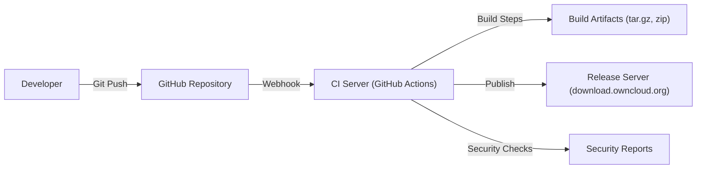

Okay, let's create a design document for the ownCloud core project, focusing on aspects relevant for threat modeling.

# BUSINESS POSTURE

ownCloud is an open-source file sync and share solution, allowing users to store and access their files, calendars, contacts, and other data on a server they control.  It competes with commercial offerings like Dropbox, Google Drive, and Microsoft OneDrive, but with a focus on data privacy and control.  The core project provides the foundational server-side components.

Business Priorities:

*   Provide a reliable and stable file sync and share platform.
*   Maintain user data privacy and security.
*   Enable self-hosting and on-premises deployments.
*   Offer a flexible and extensible platform through apps and APIs.
*   Foster a strong open-source community and ecosystem.
*   Attract and retain users, both individuals and organizations.
*   Maintain compatibility with various storage backends (local, object storage, etc.).

Business Goals:

*   Increase user adoption and market share in the self-hosted file sync and share space.
*   Become the leading open-source alternative to commercial cloud storage providers.
*   Establish a sustainable development model through community contributions and enterprise offerings.

Most Important Business Risks:

*   Data breaches or loss of user data, leading to reputational damage and loss of trust.
*   Security vulnerabilities that could be exploited by attackers to gain unauthorized access.
*   Inability to scale to meet the demands of large organizations or high user loads.
*   Lack of features or functionality compared to commercial competitors.
*   Failure to maintain compatibility with evolving web standards and client platforms.
*   Legal or regulatory challenges related to data privacy and security.

# SECURITY POSTURE

Existing Security Controls (based on reviewing the GitHub repository and general knowledge of ownCloud):

*   security control: Authentication: User authentication via username/password, with support for two-factor authentication (2FA) through apps. Implemented in core authentication logic and various authentication apps.
*   security control: Authorization: Role-based access control (RBAC) and granular permissions for files and folders. Implemented in core file access and sharing logic.
*   security control: Encryption: Server-side encryption at rest (optional, configurable). Encryption in transit using HTTPS (TLS).  End-to-end encryption is available via a separate app. Described in documentation and implemented in encryption apps and core file handling.
*   security control: Input Validation: Validation of user inputs to prevent common web vulnerabilities like cross-site scripting (XSS) and SQL injection. Implemented throughout the codebase, particularly in request handling and data processing.
*   security control: CSRF Protection: Measures to prevent Cross-Site Request Forgery attacks. Implemented using CSRF tokens.
*   security control: Regular Security Audits: ownCloud encourages security audits and has a bug bounty program. Documented on the ownCloud website.
*   security control: Security Headers: Use of security-related HTTP headers (e.g., HSTS, CSP, X-Frame-Options). Implemented in web server configuration and core response handling.
*   security control: File Integrity Checking: Mechanisms to detect unauthorized modifications to files. Implemented in core file handling.
*   security control: Brute-Force Protection: Measures to mitigate brute-force login attempts. Implemented in authentication logic.
*   security control: Session Management: Secure handling of user sessions. Implemented in core authentication and session management.

Accepted Risks:

*   accepted risk: Reliance on third-party libraries and dependencies, which may introduce vulnerabilities.
*   accepted risk: Potential for misconfiguration by administrators, leading to security weaknesses.
*   accepted risk: The complexity of the codebase and the large number of features increase the attack surface.
*   accepted risk: The open-source nature of the project means that vulnerabilities may be discovered and exploited before patches are available.

Recommended Security Controls:

*   Implement a comprehensive Content Security Policy (CSP) to mitigate XSS and data injection attacks.
*   Integrate static application security testing (SAST) and dynamic application security testing (DAST) tools into the CI/CD pipeline.
*   Implement a robust secrets management solution to protect API keys, passwords, and other sensitive data.
*   Provide more detailed security hardening guides for administrators.
*   Consider implementing a Web Application Firewall (WAF) to protect against common web attacks.

Security Requirements:

*   Authentication:
    *   Support for strong password policies.
    *   Mandatory two-factor authentication (2FA) option for administrators.
    *   Integration with external identity providers (e.g., LDAP, SAML, OAuth 2.0).
    *   Session timeout and automatic logout after a period of inactivity.

*   Authorization:
    *   Fine-grained access control lists (ACLs) for files and folders.
    *   Ability to define different roles with specific permissions.
    *   Auditing of all authorization decisions.

*   Input Validation:
    *   Strict validation of all user inputs, including file names, paths, and metadata.
    *   Protection against common web vulnerabilities (XSS, SQL injection, CSRF, etc.).
    *   Regular expression validation for specific input fields.

*   Cryptography:
    *   Use of strong, industry-standard cryptographic algorithms (e.g., AES, RSA, SHA-256).
    *   Secure key management practices.
    *   Protection of data in transit using TLS 1.3 or higher.
    *   Optional server-side encryption at rest with user-managed keys.
    *   Support for end-to-end encryption.

# DESIGN

## C4 CONTEXT

```mermaid
graph LR
    User["User (Web Browser, Desktop Client, Mobile App)"] -- "HTTPS" --> OC["ownCloud Server"];
    OC -- "Database Connection" --> DB[(Database)];
    OC -- "Storage Access" --> FS[(File Storage)];
    OC -- "LDAP/AD" --> LDAP[("LDAP/Active Directory")];
    OC -- "SMTP" --> SMTP[(SMTP Server)];
    OC -- "App Store" --> AppStore["ownCloud App Store"];
    OC -- "External Storage" --> ExtStorage[(External Storage (e.g., S3, Dropbox))];

```

C4 Context Element Descriptions:

*   Element:
    *   Name: User
    *   Type: Person
    *   Description: A person who interacts with ownCloud to store, access, and share files.
    *   Responsibilities: Authenticates to ownCloud, uploads/downloads files, manages shares, configures settings.
    *   Security controls: Strong passwords, 2FA (optional), session management.

*   Element:
    *   Name: ownCloud Server
    *   Type: Software System
    *   Description: The core ownCloud server application.
    *   Responsibilities: Handles user authentication, file storage and retrieval, sharing, user management, app management.
    *   Security controls: Authentication, authorization, input validation, encryption, CSRF protection, security headers, file integrity checking, brute-force protection.

*   Element:
    *   Name: Database
    *   Type: Database
    *   Description: Stores ownCloud metadata, user information, and configuration settings.
    *   Responsibilities: Persistently stores data required by ownCloud.
    *   Security controls: Database access controls, encryption at rest (optional), regular backups.

*   Element:
    *   Name: File Storage
    *   Type: File System/Object Storage
    *   Description: Stores the actual files uploaded by users.
    *   Responsibilities: Provides storage for user files.
    *   Security controls: File system permissions, encryption at rest (optional), data integrity checks.

*   Element:
    *   Name: LDAP/Active Directory
    *   Type: Software System
    *   Description: Optional external directory service for user authentication and management.
    *   Responsibilities: Provides user authentication and directory services.
    *   Security controls: Secure communication (LDAPS), strong passwords, access controls.

*   Element:
    *   Name: SMTP Server
    *   Type: Software System
    *   Description: Used for sending email notifications.
    *   Responsibilities: Sends emails for password resets, sharing notifications, etc.
    *   Security controls: Secure communication (TLS), authentication.

*   Element:
    *   Name: ownCloud App Store
    *   Type: Software System
    *   Description: Provides a repository of apps to extend ownCloud functionality.
    *   Responsibilities: Allows users to discover and install apps.
    *   Security controls: Code signing, app review process.

*   Element:
    *   Name: External Storage
    *   Type: Software System
    *   Description: Optional external storage services that can be integrated with ownCloud.
    *   Responsibilities: Provides additional storage options for users.
    *   Security controls: Secure communication, authentication, access controls (managed by the external service).

## C4 CONTAINER

```mermaid
graph LR
    User["User (Web Browser, Desktop Client, Mobile App)"] -- "HTTPS" --> WebServer["Web Server (Apache, Nginx)"];
    WebServer -- "PHP-FPM" --> AppServer["Application Server (PHP)"];
    AppServer -- "Database Connection" --> DB[(Database (MySQL, PostgreSQL, SQLite))];
    AppServer -- "Storage Access" --> FS[(File Storage (Local, NFS, Object Storage))];
    AppServer -- "LDAP/AD" --> LDAP[("LDAP/Active Directory")];
    AppServer -- "SMTP" --> SMTP[(SMTP Server)];
    AppServer -- "App Management" --> Apps[(Apps)];

```

C4 Container Element Descriptions:

*   Element:
    *   Name: User
    *   Type: Person
    *   Description: A person who interacts with ownCloud.
    *   Responsibilities: Authenticates, uploads/downloads files, manages shares.
    *   Security controls: Strong passwords, 2FA (optional), session management.

*   Element:
    *   Name: Web Server
    *   Type: Web Server
    *   Description: Handles incoming HTTP requests and serves static content.
    *   Responsibilities: Receives requests, forwards them to the application server, serves static files.
    *   Security controls: TLS configuration, security headers, access controls.

*   Element:
    *   Name: Application Server
    *   Type: Application Server (PHP)
    *   Description: Executes the ownCloud core PHP code.
    *   Responsibilities: Handles business logic, user authentication, file operations, database interactions.
    *   Security controls: Authentication, authorization, input validation, encryption, CSRF protection, session management.

*   Element:
    *   Name: Database
    *   Type: Database
    *   Description: Stores ownCloud metadata and user information.
    *   Responsibilities: Persistently stores data.
    *   Security controls: Database access controls, encryption at rest (optional), regular backups.

*   Element:
    *   Name: File Storage
    *   Type: File System/Object Storage
    *   Description: Stores the actual files uploaded by users.
    *   Responsibilities: Provides storage for user files.
    *   Security controls: File system permissions, encryption at rest (optional), data integrity checks.

*   Element:
    *   Name: LDAP/Active Directory
    *   Type: Software System
    *   Description: Optional external directory service.
    *   Responsibilities: Provides user authentication and directory services.
    *   Security controls: Secure communication (LDAPS), strong passwords, access controls.

*   Element:
    *   Name: SMTP Server
    *   Type: Software System
    *   Description: Used for sending email notifications.
    *   Responsibilities: Sends emails.
    *   Security controls: Secure communication (TLS), authentication.

*   Element:
    *   Name: Apps
    *   Type: Application Components
    *   Description: Extend ownCloud functionality (e.g., calendar, contacts, tasks).
    *   Responsibilities: Provide additional features.
    *   Security controls: Follow ownCloud security guidelines, undergo code review.

## DEPLOYMENT

Possible Deployment Solutions:

1.  Traditional LAMP/LEMP stack on a single server.
2.  Docker container deployment.
3.  Kubernetes deployment.
4.  Deployment on a cloud provider (AWS, Azure, GCP) using virtual machines or managed services.

Chosen Deployment Solution (for detailed description): Docker Container Deployment

```mermaid
graph LR
    Internet["Internet"] -- "HTTPS" --> LoadBalancer["Load Balancer"];
    LoadBalancer -- "HTTPS" --> DockerHost1["Docker Host 1"];
    LoadBalancer -- "HTTPS" --> DockerHost2["Docker Host 2"];
    DockerHost1 -- "Docker Network" --> WebServer1["Web Server Container"];
    DockerHost1 -- "Docker Network" --> AppServer1["App Server Container"];
    DockerHost1 -- "Docker Network" --> DB1[(Database Container)];
    DockerHost1 -- "Docker Volume" --> FS1[(File Storage Volume)];
    DockerHost2 -- "Docker Network" --> WebServer2["Web Server Container"];
    DockerHost2 -- "Docker Network" --> AppServer2["App Server Container"];
    DockerHost2 -- "Docker Network" --> DB2[(Database Container (Replica))];
    DockerHost2 -- "Docker Volume" --> FS2[(File Storage Volume (Replicated))];

```

Deployment Element Descriptions:

*   Element:
    *   Name: Internet
    *   Type: External
    *   Description: The public internet.
    *   Responsibilities: Provides access to the ownCloud instance.
    *   Security controls: Firewall, intrusion detection/prevention systems.

*   Element:
    *   Name: Load Balancer
    *   Type: Load Balancer
    *   Description: Distributes incoming traffic across multiple Docker hosts.
    *   Responsibilities: Provides high availability and scalability.
    *   Security controls: TLS termination, DDoS protection.

*   Element:
    *   Name: Docker Host 1 & 2
    *   Type: Server
    *   Description: Physical or virtual servers running Docker.
    *   Responsibilities: Hosts the Docker containers.
    *   Security controls: Operating system hardening, Docker security best practices.

*   Element:
    *   Name: Web Server Container (1 & 2)
    *   Type: Docker Container
    *   Description: Runs the web server (e.g., Apache, Nginx).
    *   Responsibilities: Serves static content and forwards requests to the application server.
    *   Security controls: TLS configuration, security headers.

*   Element:
    *   Name: App Server Container (1 & 2)
    *   Type: Docker Container
    *   Description: Runs the ownCloud PHP application.
    *   Responsibilities: Handles business logic and user requests.
    *   Security controls: Application-level security controls (see C4 Container).

*   Element:
    *   Name: Database Container (1 & 2)
    *   Type: Docker Container
    *   Description: Runs the database server (e.g., MySQL, PostgreSQL).
    *   Responsibilities: Stores ownCloud data.
    *   Security controls: Database access controls, encryption at rest (optional).  Replication for high availability.

*   Element:
    *   Name: File Storage Volume (1 & 2)
    *   Type: Docker Volume
    *   Description: Persistent storage for user files.
    *   Responsibilities: Stores user files.
    *   Security controls: File system permissions, encryption at rest (optional). Replication or shared storage for high availability.

*   Element:
    *   Name: Docker Network
    *   Type: Network
    *   Description: Internal network for communication between containers.
    *   Responsibilities: Facilitates communication between containers on the same host.
    *   Security controls: Network segmentation, firewall rules.

## BUILD

The ownCloud core project uses a combination of tools and processes for building and publishing releases.



Build Process Description:

1.  Developers write code and push changes to the GitHub repository.
2.  GitHub Actions (CI/CD) is triggered by pushes and pull requests.
3.  The CI server runs build scripts, which typically involve:
    *   Checking out the code.
    *   Installing dependencies (using Composer for PHP).
    *   Running unit tests.
    *   Running integration tests.
    *   Performing static code analysis (e.g., PHPStan, linters).
    *   Building release packages (tar.gz, zip).
4.  Build artifacts are created and stored.
5.  Security checks are performed as part of the build process, including:
    *   Static Application Security Testing (SAST) - potentially using tools integrated into GitHub Actions or separate scanning tools.
    *   Dependency vulnerability scanning - checking for known vulnerabilities in third-party libraries.
6.  Successful builds are published to the release server (download.owncloud.org).

Security Controls in Build Process:

*   Automated Build: GitHub Actions ensures consistent and repeatable builds.
*   Dependency Management: Composer helps manage PHP dependencies and track versions.
*   Unit and Integration Tests: Automated tests help catch bugs and regressions.
*   Static Code Analysis: Tools like PHPStan and linters help identify potential code quality and security issues.
*   SAST (Potentially): Integration of SAST tools can help identify security vulnerabilities in the codebase.
*   Dependency Vulnerability Scanning: Tools can be used to scan for known vulnerabilities in dependencies.
*   Signed Releases (Potentially): Release packages could be digitally signed to ensure authenticity and integrity.

# RISK ASSESSMENT

Critical Business Processes:

*   File storage and retrieval: Ensuring users can reliably store and access their files.
*   File sharing: Enabling secure and controlled sharing of files with others.
*   User authentication and authorization: Protecting user accounts and data from unauthorized access.
*   Data synchronization: Keeping files synchronized across multiple devices.
*   App ecosystem: Providing a platform for extending functionality through apps.

Data Sensitivity:

*   User Files: Highly sensitive, potentially including personal, financial, or confidential business information.  Requires strong confidentiality, integrity, and availability protection.
*   User Metadata (file names, paths, sharing information): Moderately sensitive, could reveal information about user activities and relationships. Requires confidentiality and integrity protection.
*   User Account Information (usernames, passwords, email addresses): Highly sensitive, requires strong confidentiality and integrity protection.
*   Configuration Data: Moderately sensitive, could expose system vulnerabilities if compromised. Requires confidentiality and integrity protection.

# QUESTIONS & ASSUMPTIONS

Questions:

*   What specific SAST and DAST tools are currently used or planned for use in the CI/CD pipeline?
*   What is the current process for handling security vulnerabilities reported through the bug bounty program?
*   What are the specific requirements for data retention and deletion?
*   Are there any specific compliance requirements (e.g., GDPR, HIPAA) that need to be considered?
*   What is the disaster recovery plan for ownCloud instances?
*   What level of detail is required for logging and auditing?
*   What are the specific performance and scalability requirements?

Assumptions:

*   BUSINESS POSTURE: Assumes that ownCloud prioritizes data privacy and security as a key differentiator from commercial cloud storage providers.
*   SECURITY POSTURE: Assumes that basic security best practices are followed in the development and deployment of ownCloud. Assumes administrators will properly configure and maintain their ownCloud instances.
*   DESIGN: Assumes a standard LAMP/LEMP stack or Docker-based deployment. Assumes that the database and file storage are appropriately secured and backed up. Assumes that network communication is secured using TLS.