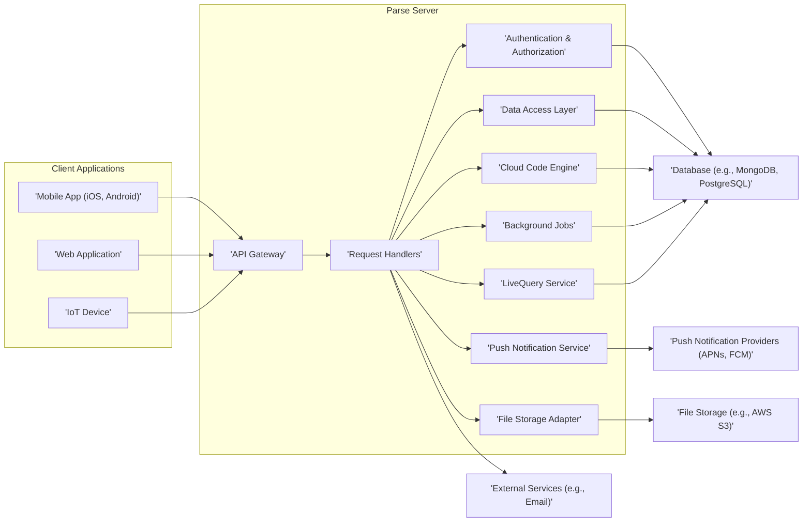
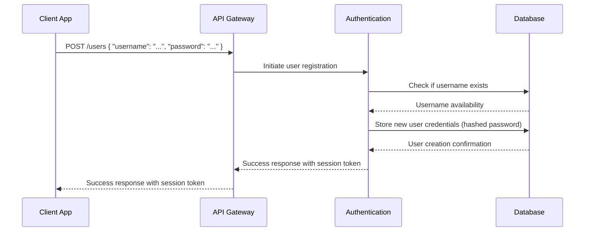
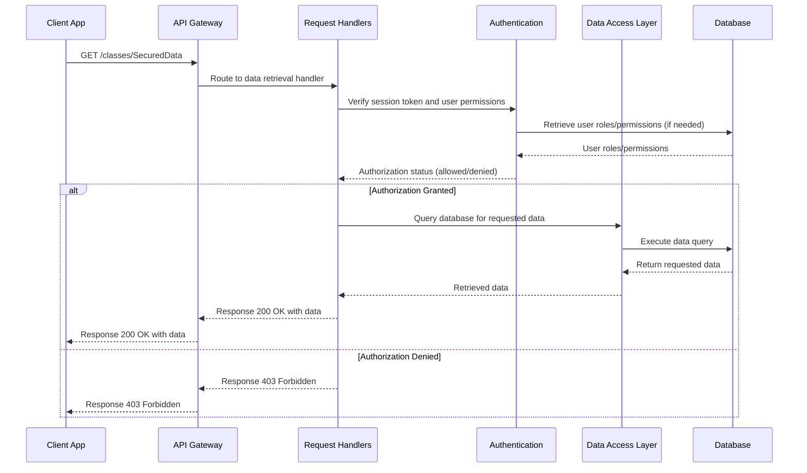
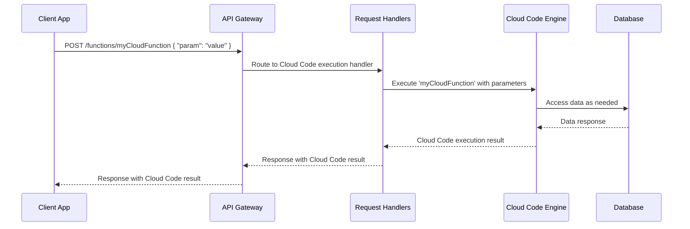

# Project Design Document: Parse Server

**Version:** 1.1
**Date:** October 26, 2023
**Prepared By:** AI Software Architecture Expert

## 1. Introduction

This document provides an enhanced design overview of the Parse Server project, intended for use in subsequent threat modeling activities. It details the key components, their interactions, and data flows, with a focus on security-relevant aspects. The information is based on the publicly available codebase of Parse Server at [https://github.com/parse-community/parse-server](https://github.com/parse-community/parse-server).

## 2. Goals and Non-Goals

* **Goals:**
    * Deliver a clear and comprehensive architectural overview of Parse Server.
    * Precisely identify key components and their functionalities relevant to security.
    * Accurately describe data flow within the system, highlighting security touchpoints.
    * Emphasize potential security considerations as a basis for threat modeling.
    * Maintain clear and concise language throughout the document.
    * Strictly adhere to specified formatting requirements (markdown, mermaid).

* **Non-Goals:**
    * Provide an exhaustive, line-by-line code analysis.
    * Detail every possible configuration parameter.
    * Offer platform-specific deployment instructions or playbooks.
    * Conduct formal threat modeling within this document.
    * Comprehensively cover all community-developed extensions and integrations.

## 3. High-Level Architecture Diagram

## 4. Component Descriptions

This section provides detailed descriptions of the major components within the Parse Server architecture:

* **Client Applications:**
    * Diverse platforms (mobile, web, IoT) interacting with the Parse Server API.
    * Utilize Parse SDKs for communication.
    * Initiate requests for data manipulation, user management, and other functionalities.

* **Parse Server:**
    * The core backend application, typically built using Node.js.
    * Centralized component responsible for processing client requests and managing application data.

    * **API Gateway:**
        * The single entry point for all incoming client requests.
        * Handles request routing, parsing, and may implement cross-cutting concerns like rate limiting and authentication checks.

    * **Request Handlers:**
        * Process specific API endpoint requests (e.g., creating objects, user login).
        * Contain the core business logic for each API function, orchestrating interactions with other components.

    * **Authentication & Authorization:**
        * Manages user identities, sessions, and authentication methods (e.g., username/password, OAuth).
        * Enforces access control policies to protect data and restrict actions based on user roles and permissions.

    * **Data Access Layer:**
        * Provides an abstraction layer for interacting with the underlying database system.
        * Handles data retrieval, persistence, querying, and potentially data transformation.

    * **Push Notification Service:**
        * Manages the process of sending push notifications to registered client devices.
        * Integrates with platform-specific push notification providers (APNs, FCM) to deliver messages.

    * **Cloud Code Engine:**
        * Enables developers to execute custom server-side logic in response to specific events or API calls.
        * Provides a sandboxed environment for running user-defined JavaScript code, extending server functionality.

    * **File Storage Adapter:**
        * Manages the storage and retrieval of files associated with Parse objects.
        * Supports various storage backends, abstracting the underlying storage mechanism (e.g., local filesystem, cloud storage services).

    * **LiveQuery Service:**
        * Provides real-time data synchronization capabilities to clients.
        * Utilizes WebSockets to push data updates to subscribed clients when changes occur in the database.

    * **Background Jobs:**
        * Allows scheduling and execution of server-side tasks asynchronously.
        * Useful for tasks like data processing, sending emails, or other operations that shouldn't block API request handling.

* **Database:**
    * The persistent storage layer for Parse Server's data.
    * Commonly MongoDB, but can also be PostgreSQL or other supported relational databases.
    * Stores application data, user credentials, session information, and other metadata.

* **Push Notification Providers:**
    * External services like Apple Push Notification service (APNs) and Firebase Cloud Messaging (FCM).
    * Responsible for the actual delivery of push notifications to target devices.

* **External Services:**
    * Integrations with third-party services to extend Parse Server's capabilities.
    * Examples include email providers for password resets, SMS gateways for phone verification, and analytics platforms.

* **File Storage:**
    * External storage services (e.g., AWS S3, Google Cloud Storage, Azure Blob Storage) used by the File Storage Adapter.
    * Stores files uploaded by users or managed by the application.

## 5. Data Flow Diagram

This section illustrates key data flows within Parse Server, focusing on security-relevant interactions.

**User Authentication Flow:**

**Data Retrieval with Authorization:**

**Cloud Code Execution Flow:**

## 6. Security Considerations (For Threat Modeling)

This section highlights potential security vulnerabilities and areas of concern that are crucial for effective threat modeling:

* **Authentication and Authorization:**
    * Weak or default password policies enabling brute-force attacks.
    * Insecure storage of session tokens or API keys, leading to unauthorized access.
    * Vulnerabilities in OAuth implementations or social login integrations, potentially leading to account takeover.
    * Privilege escalation vulnerabilities allowing users to perform actions beyond their authorized scope.
    * Lack of multi-factor authentication (MFA) increasing the risk of unauthorized access.

* **Data Security:**
    * Absence of encryption for sensitive data at rest in the database, exposing it in case of a breach.
    * Insufficient encryption for data in transit (e.g., not enforcing HTTPS), allowing eavesdropping.
    * Inadequate access controls on database level, potentially allowing unauthorized data manipulation.
    * Injection vulnerabilities (e.g., SQL injection, NoSQL injection) due to improper input validation and sanitization.
    * Exposure of sensitive information through error messages or verbose logging.

* **API Security:**
    * Lack of rate limiting or inadequate rate limiting, making the server susceptible to denial-of-service (DoS) attacks.
    * Exposure of sensitive data in API responses (e.g., user emails in lists).
    * Missing or weak input validation leading to unexpected behavior or vulnerabilities.
    * Cross-Site Scripting (XSS) vulnerabilities if the server renders user-provided content without proper sanitization.
    * Cross-Site Request Forgery (CSRF) vulnerabilities allowing attackers to perform actions on behalf of authenticated users.
    * Insecure Direct Object References (IDOR) allowing access to resources belonging to other users.

* **Push Notifications:**
    * Lack of proper authorization for sending push notifications, potentially leading to spam or malicious notifications.
    * Exposure of sensitive information within push notification payloads.
    * Vulnerabilities in the integration with push notification providers.

* **Cloud Code:**
    * Security vulnerabilities within user-provided Cloud Code (e.g., insecure dependencies, logic flaws).
    * Risks associated with the execution environment of Cloud Code, such as resource exhaustion or code injection.
    * Potential for privilege escalation within Cloud Code if not properly sandboxed.
    * Insecure handling of secrets or API keys within Cloud Code.

* **File Storage:**
    * Unauthorized access to stored files due to misconfigured access controls.
    * Publicly accessible files due to incorrect bucket or storage permissions.
    * Vulnerabilities in the File Storage Adapter allowing unauthorized file manipulation.

* **Dependency Management:**
    * Use of known vulnerable third-party libraries and dependencies.
    * Failure to regularly update dependencies and apply security patches.

* **Infrastructure Security:**
    * Vulnerabilities in the underlying infrastructure where Parse Server is deployed (e.g., operating system vulnerabilities, misconfigured firewalls).
    * Lack of proper network segmentation.

* **Logging and Monitoring:**
    * Insufficient logging to detect and respond to security incidents effectively.
    * Lack of real-time monitoring for suspicious activities or security breaches.
    * Inadequate security auditing practices.

* **Secrets Management:**
    * Storing sensitive information (API keys, database credentials) in insecure locations (e.g., environment variables without proper encryption, code repositories).
    * Lack of proper key rotation and management practices.

* **LiveQuery Security:**
    * Unauthorized access to real-time data streams.
    * Potential for denial-of-service attacks by overwhelming the LiveQuery service.

* **Background Jobs Security:**
    * Ensuring background jobs are executed securely and don't introduce vulnerabilities.
    * Protecting sensitive data handled by background jobs.

## 7. Technologies Used

* **Primary Programming Language:** JavaScript (Node.js)
* **Common Database Systems:** MongoDB, PostgreSQL
* **Underlying Web Framework:** Express.js
* **Real-time Communication (for LiveQuery):** WebSockets
* **Push Notification Integrations:** APNs (Apple), FCM (Google)
* **Cloud Code Execution Environment:** Node.js runtime

## 8. Deployment Considerations

* Parse Server offers flexible deployment options, including:
    * **Cloud Providers:** AWS, Google Cloud, Azure, and others.
    * **Platform-as-a-Service (PaaS):** Heroku, Render, etc.
    * **Self-Hosted Environments:** On-premises servers, containers (Docker, Kubernetes).

* Security considerations are heavily influenced by the chosen deployment method:
    * **Network Security:** Proper configuration of firewalls, security groups, and network segmentation is crucial.
    * **Database Security:** Secure configuration of the database instance, including access controls and encryption.
    * **HTTPS Enforcement:** Mandatory use of HTTPS with valid SSL/TLS certificates to protect data in transit.
    * **Regular Updates and Patching:** Keeping the underlying operating system, dependencies, and Parse Server itself up-to-date with security patches.
    * **Infrastructure Hardening:** Following security best practices for the chosen deployment environment.
    * **Secrets Management:** Securely managing environment variables and other sensitive configuration data.

This enhanced design document provides a more detailed and security-focused overview of the Parse Server architecture, intended to be a valuable resource for subsequent threat modeling exercises.
