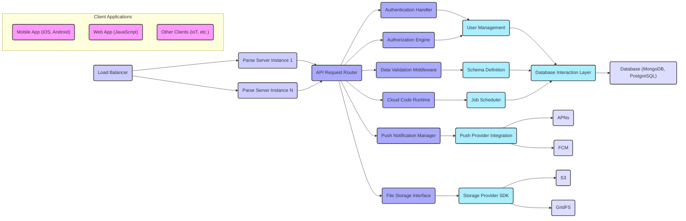
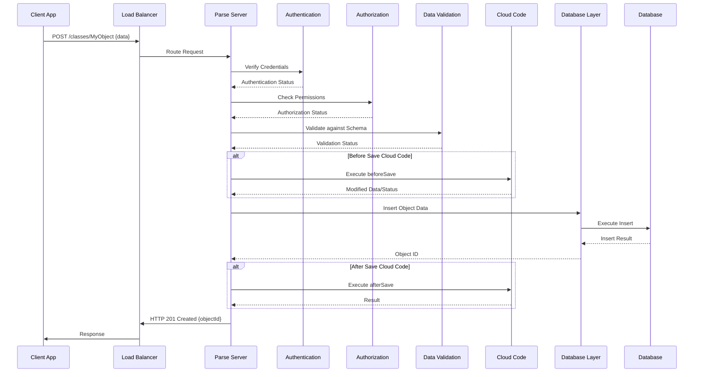

# Project Design Document: Parse Server

**Version:** 1.1
**Date:** October 26, 2023
**Author:** Gemini (AI Language Model)
**Project:** Parse Server Analysis for Threat Modeling

## 1. Introduction

This document provides an enhanced and more detailed architectural design of the Parse Server project, based on the publicly available codebase at [https://github.com/parse-community/parse-server](https://github.com/parse-community/parse-server). This refined design aims to provide a deeper understanding of the system's intricacies, making it even more suitable for comprehensive threat modeling activities.

## 2. Project Goals

The primary goal of this document is to present an improved and more granular architectural overview of Parse Server. This includes:

*   Providing more in-depth descriptions of the key components and their specific responsibilities.
*   Detailing the interactions and data flow between these components with greater precision.
*   Elaborating on external dependencies and integrations, including specific protocols and data formats.
*   Offering a richer level of detail to facilitate more effective and targeted threat modeling.

## 3. Architectural Overview

Parse Server acts as a versatile backend solution, deployable across various cloud environments or on-premises infrastructure. It exposes a RESTful API and offers SDKs to streamline the development of mobile and web applications. Its core functionalities encompass data management, user authentication, and the orchestration of diverse backend services.

## 4. Component Details

This section offers a more detailed breakdown of the key components within the Parse Server architecture, elaborating on their specific functions and responsibilities.

*   **Client Applications:**
    *   Represent diverse applications (mobile, web, IoT devices) interacting with the Parse Server API via REST or SDKs.
    *   Initiate requests using standard HTTP methods (GET, POST, PUT, DELETE) with JSON payloads.
    *   Handle user interface rendering, data presentation, and user interaction logic.
    *   Employ Parse SDKs to abstract API interactions, manage local data caching, and handle offline scenarios.

*   **Load Balancer:**
    *   Distributes incoming client requests across multiple Parse Server instances using algorithms like round-robin or least connections.
    *   Enhances system availability by routing traffic away from unhealthy instances.
    *   Improves scalability by distributing the workload.
    *   May perform SSL termination, offloading encryption/decryption from the backend servers.

*   **Parse Server Instance:**
    *   The core application server, typically implemented in Node.js, responsible for processing client requests and managing backend logic.
    *   Can be scaled horizontally by deploying multiple instances behind a load balancer.
    *   Configured via environment variables or configuration files, defining database connections, authentication settings, and other parameters.

*   **API Request Router:**
    *   Receives incoming HTTP requests and routes them to the appropriate handlers based on the URL path and HTTP method.
    *   Handles request parsing, extracting parameters, headers, and request body.
    *   Manages API versioning and routing to different versions of the API.

*   **Authentication Handler:**
    *   Verifies the identity of the client making the request.
    *   Supports various authentication mechanisms:
        *   Username/password authentication, potentially with password hashing (e.g., bcrypt).
        *   Session tokens stored in cookies or local storage.
        *   OAuth 2.0 for social logins (Facebook, Google, etc.).
        *   API keys for specific client applications.
    *   Manages user registration, login, logout, and password reset flows.

*   **Authorization Engine:**
    *   Determines if an authenticated user has the necessary permissions to perform the requested action on the specific resource.
    *   Enforces access control lists (ACLs) defined on Parse objects.
    *   Supports role-based access control (RBAC) for managing user permissions.
    *   Evaluates permissions based on the user's roles, object ownership, and defined ACLs.

*   **Data Validation Middleware:**
    *   Intercepts incoming requests and validates the request data against predefined schemas.
    *   Ensures data integrity and prevents invalid data from being persisted.
    *   Performs type checking, format validation, and custom validation rules defined in the Parse schema.
    *   Returns error responses to the client if validation fails.

*   **Cloud Code Runtime:**
    *   Executes custom server-side logic written by developers in JavaScript.
    *   Supports Cloud Functions, which are triggered by API requests or other events.
    *   Supports Cloud Jobs, which are executed on a scheduled basis.
    *   Provides access to the Parse Server SDK, allowing interaction with the database and other Parse services.
    *   Runs in a sandboxed environment to prevent interference with the core Parse Server.

*   **Push Notification Manager:**
    *   Handles the orchestration of sending push notifications to client devices.
    *   Manages device tokens associated with user installations.
    *   Provides APIs for sending targeted push notifications based on user segments or installation criteria.
    *   Handles retries and error handling for push notification delivery.

*   **File Storage Interface:**
    *   Provides an abstraction layer for interacting with different file storage providers.
    *   Handles file uploads, downloads, and deletions.
    *   Manages file metadata and access control.

*   **User Management:**
    *   Manages user accounts, including creation, retrieval, update, and deletion.
    *   Handles password management, including hashing and salting.
    *   Provides functionalities for managing user sessions and tokens.

*   **Schema Definition:**
    *   Stores the definitions of the data models (classes) and their fields.
    *   Defines data types, constraints, and relationships between different classes.
    *   Used by the Data Validation Middleware and the Database Interaction Layer.

*   **Job Scheduler:**
    *   Manages the scheduling and execution of Cloud Jobs.
    *   Persists job schedules and execution history.

*   **Push Provider Integration:**
    *   Handles the specific communication with different push notification providers (APNs for iOS, FCM for Android).
    *   Formats notification payloads according to the provider's requirements.
    *   Manages API keys and credentials for each provider.

*   **Storage Provider SDK:**
    *   Provides the necessary libraries and APIs to interact with the chosen storage provider (e.g., AWS SDK for S3, MongoDB driver for GridFS).

*   **Database Interaction Layer:**
    *   Abstracts the underlying database system, allowing Parse Server to work with different databases (currently MongoDB and PostgreSQL).
    *   Translates Parse Query Language (PQL) into database-specific queries.
    *   Handles database connection management and pooling.

*   **APNs (Apple Push Notification service):**
    *   Apple's service for delivering push notifications to iOS, macOS, and other Apple devices.

*   **FCM (Firebase Cloud Messaging):**
    *   Google's cross-platform messaging solution for delivering notifications and messages.

*   **S3 (Amazon Simple Storage Service):**
    *   Amazon's object storage service for storing files.

*   **GridFS:**
    *   A specification for storing and retrieving large files in MongoDB.

*   **Database (MongoDB, PostgreSQL):**
    *   The persistent data store for all application data, including users, objects, files, and configuration.

## 5. Data Flow

The following outlines a more detailed data flow for a typical client request to create a new object:

1. A client application sends an HTTP POST request to the Parse Server API endpoint (e.g., `/classes/MyObject`). The request includes a JSON payload representing the object data.
2. The Load Balancer receives the request and forwards it to an available Parse Server instance.
3. The API Request Router on the Parse Server instance identifies the appropriate handler for the `/classes` endpoint.
4. The Authentication Handler verifies the user's identity by checking for valid session tokens, API keys, or other authentication credentials in the request headers or body.
5. The Authorization Engine checks if the authenticated user has the necessary permissions (e.g., create permissions on the `MyObject` class) based on ACLs and roles.
6. The Data Validation Middleware retrieves the schema definition for the `MyObject` class.
7. The Data Validation Middleware validates the incoming JSON payload against the schema, checking data types, required fields, and constraints.
8. If the request triggers a beforeSave Cloud Function for the `MyObject` class, the Cloud Code Runtime executes this function. The Cloud Function can modify the object data or prevent the save operation.
9. The Database Interaction Layer translates the validated object data into a database-specific insert operation.
10. The Database executes the insert operation and stores the new object in the database.
11. The Database returns the result of the insert operation, including the newly generated object ID.
12. The Database Interaction Layer returns the database response to the Parse Server instance.
13. If an afterSave Cloud Function is defined for the `MyObject` class, the Cloud Code Runtime executes this function.
14. The Parse Server instance formats the response as a JSON payload, including the object ID and creation timestamp.
15. The Parse Server sends the HTTP response back to the client application through the Load Balancer.

## 6. Security Considerations

This section provides a more detailed examination of potential security considerations, offering specific examples and areas of concern.

*   **Authentication and Authorization:**
    *   **Vulnerabilities:** Weak password hashing algorithms, predictable session token generation, lack of account lockout policies after multiple failed login attempts, insecure storage of API keys in client applications, insufficient validation of OAuth redirect URIs leading to potential authorization code interception.
    *   **Threats:** Brute-force attacks on login forms, session hijacking, unauthorized access via compromised API keys, OAuth token theft.

*   **Data Validation:**
    *   **Vulnerabilities:** Insufficient sanitization of user inputs leading to Cross-Site Scripting (XSS) attacks, lack of proper escaping of data in database queries leading to SQL or NoSQL injection, allowing excessively large file uploads leading to Denial of Service (DoS).
    *   **Threats:** Execution of malicious scripts in user browsers, unauthorized data access or modification, application crashes due to resource exhaustion.

*   **Cloud Code Security:**
    *   **Vulnerabilities:** Injection vulnerabilities in Cloud Functions if they directly construct database queries from user input, overly broad permissions granted to Cloud Functions allowing them to access sensitive data or perform administrative actions without proper authorization, exposure of sensitive API keys or credentials within Cloud Function code.
    *   **Threats:** Data breaches, privilege escalation, unauthorized modification of application logic.

*   **Push Notification Security:**
    *   **Vulnerabilities:** Lack of proper authorization checks when sending push notifications, allowing attackers to send notifications to arbitrary users, exposure or compromise of push notification provider credentials allowing unauthorized sending of notifications, sending sensitive information in push notification payloads.
    *   **Threats:** Spamming users with unwanted notifications, phishing attacks via notifications, exposure of sensitive data.

*   **File Storage Security:**
    *   **Vulnerabilities:** Publicly accessible file storage buckets due to misconfiguration, insecure generation of pre-signed URLs allowing unauthorized access to files, lack of proper access controls on stored files.
    *   **Threats:** Unauthorized access to sensitive files, data leaks.

*   **Database Security:**
    *   **Vulnerabilities:** Default database credentials, publicly accessible database instances, lack of encryption for data at rest or in transit, SQL/NoSQL injection vulnerabilities in the Database Interaction Layer.
    *   **Threats:** Data breaches, unauthorized data modification or deletion.

*   **API Security:**
    *   **Vulnerabilities:** Lack of rate limiting allowing attackers to overwhelm the server with requests, exposure of sensitive information in API error messages, Cross-Site Request Forgery (CSRF) vulnerabilities if proper anti-CSRF tokens are not implemented, lack of HTTPS enforcement leading to man-in-the-middle attacks.
    *   **Threats:** Denial of service, information disclosure, unauthorized actions performed on behalf of legitimate users.

*   **Dependency Management:**
    *   **Vulnerabilities:** Using outdated versions of Node.js libraries with known security vulnerabilities.
    *   **Threats:** Exploitation of known vulnerabilities in dependencies leading to various security breaches.

*   **Infrastructure Security:**
    *   **Vulnerabilities:** Unpatched operating systems, open ports on server instances, insecure network configurations.
    *   **Threats:** Unauthorized access to server instances, data breaches.

## 7. Deployment Considerations

The security implications of different deployment environments require careful consideration:

*   **Cloud Platforms (AWS, Azure, GCP):**
    *   **Security Benefits:** Access to robust security services like IAM, security groups, and encryption services.
    *   **Security Considerations:** Proper configuration of cloud provider security settings is crucial. Misconfigured IAM roles or overly permissive security groups can expose the application. The shared responsibility model requires understanding which security aspects are managed by the cloud provider and which are the responsibility of the application owner.

*   **Containerized Environments (Docker, Kubernetes):**
    *   **Security Benefits:** Isolation of application components, facilitating secure resource management.
    *   **Security Considerations:** Secure container image management is essential to prevent the introduction of vulnerabilities. Proper configuration of Kubernetes network policies is needed to control traffic flow between containers. Secrets management within containers requires careful attention.

*   **On-Premises:**
    *   **Security Considerations:** The organization is fully responsible for all aspects of security, including physical security, network security, server hardening, and database security. This requires significant expertise and resources.

*   **Environment Variables and Secrets Management:**
    *   **Security Considerations:** Storing sensitive information like database credentials and API keys directly in code or configuration files is highly insecure. Secure secrets management solutions (e.g., HashiCorp Vault, AWS Secrets Manager) should be used to store and access these credentials. Environment variables should be handled carefully and not exposed in logs or error messages.

## 8. Conclusion

This enhanced design document provides a more granular and detailed architectural overview of Parse Server, offering deeper insights into its components, data flow, and security considerations. This improved understanding will significantly aid in conducting more targeted and effective threat modeling exercises, ultimately leading to a more secure and resilient application. The next step involves leveraging this detailed design to systematically identify and analyze potential threats, enabling the development and implementation of appropriate mitigation strategies.