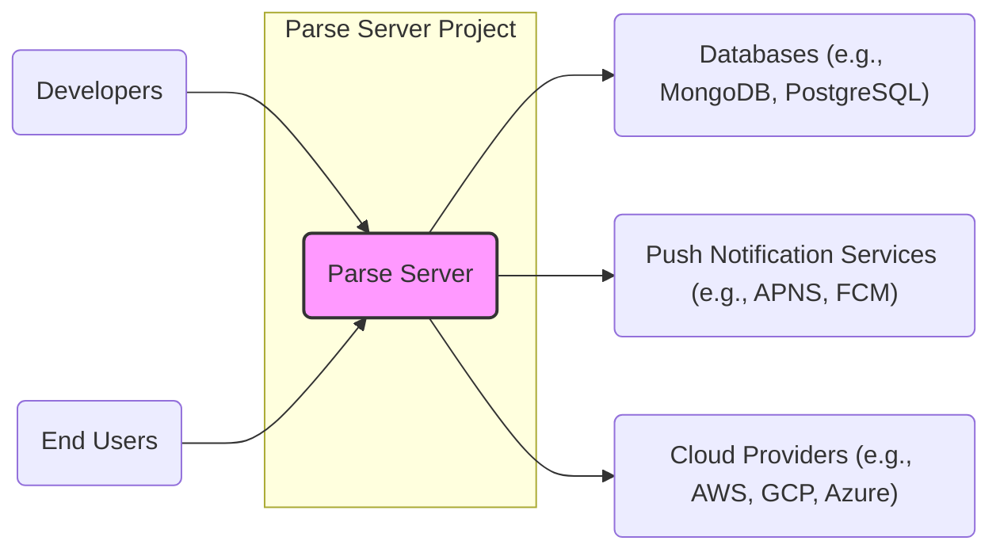
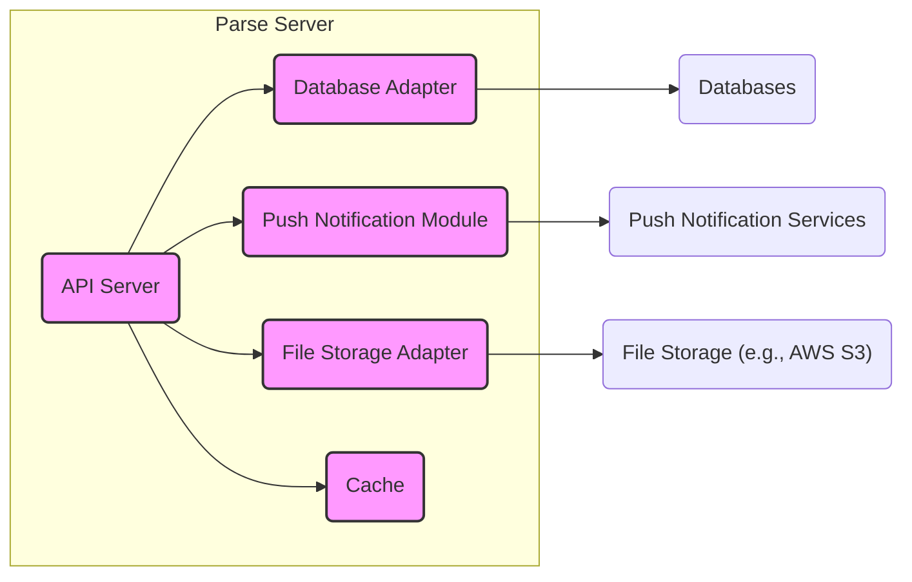
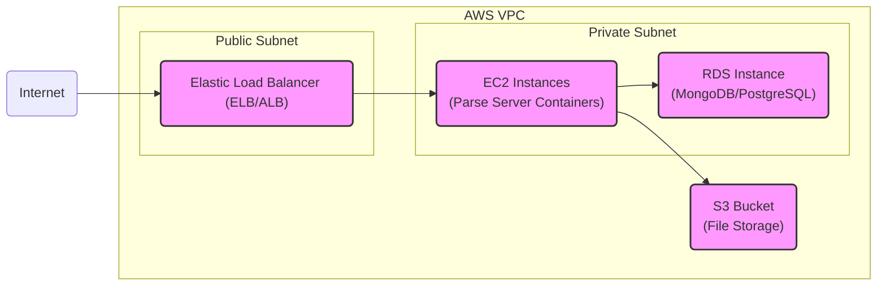
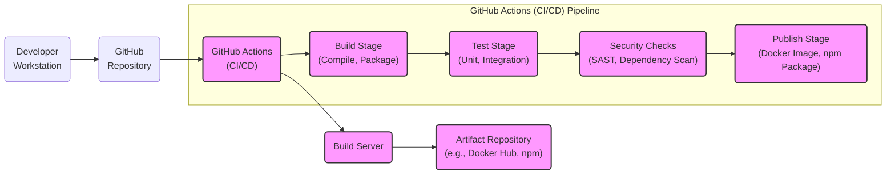

# BUSINESS POSTURE

This project, parse-server, aims to provide a flexible and scalable open-source backend solution for web and mobile applications. It allows developers to rapidly build and deploy applications without the need to manage complex backend infrastructure from scratch.

Business priorities for parse-server include:
- Rapid application development: Enabling developers to quickly prototype and launch applications.
- Scalability and flexibility: Supporting applications with varying levels of user traffic and data volume.
- Community driven innovation: Leveraging the open-source community for continuous improvement and feature enhancements.
- Platform independence: Allowing deployment across various cloud providers and on-premise environments.

Key business risks associated with parse-server include:
- Data security and privacy breaches: Potential exposure of sensitive application data due to vulnerabilities or misconfigurations.
- Service disruption and availability: Risk of downtime impacting applications relying on parse-server.
- Compliance and regulatory risks: Failure to meet data protection and privacy regulations (e.g., GDPR, HIPAA) depending on the application and data handled.
- Open-source dependency risks: Reliance on community support and potential vulnerabilities in open-source components.

# SECURITY POSTURE

Existing security controls for parse-server project:
- security control Input validation: Parse Server framework includes input validation mechanisms to prevent common injection attacks. Implemented within the Parse Server codebase.
- security control Authentication: Parse Server provides built-in user authentication and session management. Implemented within the Parse Server codebase.
- security control Authorization: Parse Server supports role-based access control (ACLs and CLPs) to manage data access. Implemented within the Parse Server codebase.
- security control HTTPS/TLS: Recommended and generally assumed for all communication with Parse Server. Deployment configuration.
- security control Database security: Security of the underlying database (e.g., MongoDB, PostgreSQL) is delegated to the database system itself and its configuration. Deployment configuration and database documentation.

Accepted risks for parse-server project:
- accepted risk Reliance on community for security vulnerability discovery and patching.
- accepted risk Potential misconfigurations during deployment by users leading to security weaknesses.
- accepted risk Vulnerabilities in third-party dependencies.

Recommended security controls to implement:
- security control Dependency scanning: Implement automated scanning of dependencies for known vulnerabilities in the build process.
- security control Static Application Security Testing (SAST): Integrate SAST tools into the CI/CD pipeline to identify potential code-level vulnerabilities.
- security control Dynamic Application Security Testing (DAST): Perform DAST on deployed instances to identify runtime vulnerabilities.
- security control Security Audits: Conduct regular security audits and penetration testing by security experts.
- security control Rate Limiting: Implement rate limiting to protect against brute-force attacks and denial-of-service attempts.
- security control DDoS Protection: Employ DDoS protection mechanisms at the infrastructure level.
- security control Regular Security Updates: Establish a process for promptly applying security updates to Parse Server and its dependencies.

Security requirements for parse-server project:
- Authentication:
    - Requirement: Securely authenticate users and applications accessing the Parse Server API.
    - Requirement: Support multi-factor authentication for administrative access.
    - Requirement: Implement strong password policies and account lockout mechanisms.
- Authorization:
    - Requirement: Enforce fine-grained authorization controls to manage access to data and functionalities based on user roles and permissions.
    - Requirement: Implement secure access control lists (ACLs) and class-level permissions (CLPs).
    - Requirement: Follow principle of least privilege for all access controls.
- Input Validation:
    - Requirement: Validate all user inputs to prevent injection attacks (e.g., SQL injection, NoSQL injection, cross-site scripting).
    - Requirement: Sanitize and encode outputs to prevent cross-site scripting vulnerabilities.
    - Requirement: Implement robust error handling to avoid information leakage.
- Cryptography:
    - Requirement: Use strong encryption for sensitive data at rest and in transit.
    - Requirement: Securely manage cryptographic keys and secrets.
    - Requirement: Utilize HTTPS/TLS for all communication channels.
    - Requirement: Consider encryption for sensitive data fields within the database.

# DESIGN

## C4 CONTEXT

Context Diagram Elements:

- Name: Parse Server
    - Type: Software System
    - Description: Open-source backend server that provides a REST API and SDKs for building web and mobile applications. It handles data storage, user authentication, push notifications, and other backend functionalities.
    - Responsibilities:
        - Exposing a secure and well-documented API for application interaction.
        - Managing application data persistence and retrieval.
        - Handling user authentication and authorization.
        - Facilitating push notifications to mobile devices.
        - Providing a flexible and extensible platform for backend logic.
    - Security controls:
        - security control API Authentication and Authorization.
        - security control Input Validation and Output Encoding.
        - security control Data encryption in transit (HTTPS).
        - security control Access control lists (ACLs) and class-level permissions (CLPs).

- Name: Developers
    - Type: Person
    - Description: Software developers who use Parse Server to build and manage their applications. They interact with Parse Server through SDKs and the REST API to define data models, implement business logic, and manage application deployments.
    - Responsibilities:
        - Developing and maintaining applications using Parse Server.
        - Configuring and deploying Parse Server instances.
        - Managing application data and users through Parse Server.
        - Ensuring secure coding practices in their applications.
    - Security controls:
        - security control Secure coding practices in application development.
        - security control Secure configuration of Parse Server instances.
        - security control Management of application-level secrets and API keys.

- Name: End Users
    - Type: Person
    - Description: Users who interact with applications built using Parse Server. Their interactions are primarily through the application's user interface, which communicates with Parse Server in the backend.
    - Responsibilities:
        - Using applications built on Parse Server.
        - Providing data to applications.
        - Expecting secure and reliable application functionality.
    - Security controls:
        - security control User authentication within applications.
        - security control Data privacy and protection by applications and Parse Server.

- Name: Databases (e.g., MongoDB, PostgreSQL)
    - Type: External System
    - Description: Databases used by Parse Server to store application data. Parse Server supports various database systems, with MongoDB being the most commonly used.
    - Responsibilities:
        - Persistently storing application data.
        - Providing data access and retrieval to Parse Server.
        - Ensuring data integrity and availability.
    - Security controls:
        - security control Database access control and authentication.
        - security control Data encryption at rest (database feature).
        - security control Regular database backups and disaster recovery.
        - security control Network security to restrict database access.

- Name: Push Notification Services (e.g., APNS, FCM)
    - Type: External System
    - Description: Third-party services used by Parse Server to send push notifications to mobile devices. Examples include Apple Push Notification service (APNS) and Firebase Cloud Messaging (FCM).
    - Responsibilities:
        - Delivering push notifications to end-user devices.
        - Managing device tokens and notification delivery status.
    - Security controls:
        - security control Secure API communication with push notification services (API keys, tokens).
        - security control Management of push notification credentials.
        - security control Data privacy considerations when sending push notifications.

- Name: Cloud Providers (e.g., AWS, GCP, Azure)
    - Type: External System
    - Description: Cloud infrastructure providers that can be used to host Parse Server and its dependencies. Examples include Amazon Web Services (AWS), Google Cloud Platform (GCP), and Microsoft Azure.
    - Responsibilities:
        - Providing infrastructure for hosting Parse Server and databases.
        - Ensuring infrastructure availability and scalability.
        - Providing network and security services for the infrastructure.
    - Security controls:
        - security control Cloud provider security controls (firewalls, VPCs, IAM).
        - security control Infrastructure security hardening.
        - security control Monitoring and logging of infrastructure components.

## C4 CONTAINER

Container Diagram Elements:

- Name: API Server
    - Type: Container
    - Description: The core component of Parse Server, responsible for handling API requests from applications. It implements the Parse REST API, manages authentication and authorization, executes business logic, and interacts with other containers.
    - Responsibilities:
        - Receiving and processing API requests.
        - Authenticating and authorizing users and applications.
        - Enforcing business logic and data validation.
        - Orchestrating data access through the Database Adapter.
        - Managing push notifications through the Push Notification Module.
        - Handling file storage operations through the File Storage Adapter.
        - Caching data for performance optimization.
    - Security controls:
        - security control API Authentication and Authorization logic.
        - security control Input validation and output encoding within API handlers.
        - security control Rate limiting and request throttling.
        - security control Logging and monitoring of API requests.

- Name: Database Adapter
    - Type: Container
    - Description: An abstraction layer that allows Parse Server to interact with different database systems. It translates Parse Server's data queries into database-specific queries and manages database connections.
    - Responsibilities:
        - Providing a consistent interface for data access regardless of the underlying database.
        - Handling database connection management and pooling.
        - Translating Parse queries into database-specific queries.
        - Optimizing database interactions for performance.
    - Security controls:
        - security control Secure database connection configuration (credentials management, encryption).
        - security control Input sanitization for database queries to prevent injection attacks.
        - security control Database access control enforcement.

- Name: Push Notification Module
    - Type: Container
    - Description: Responsible for handling push notification functionalities. It interacts with push notification services (e.g., APNS, FCM) to send push notifications to mobile devices based on application events or API requests.
    - Responsibilities:
        - Managing push notification device tokens.
        - Constructing and sending push notification payloads.
        - Handling push notification delivery feedback and errors.
        - Interacting with push notification services APIs.
    - Security controls:
        - security control Secure storage and management of push notification credentials.
        - security control Secure communication with push notification services APIs.
        - security control Input validation for push notification content.

- Name: File Storage Adapter
    - Type: Container
    - Description: Provides an abstraction layer for file storage. It allows Parse Server to store and retrieve files from different storage systems, such as local file systems or cloud storage services like AWS S3.
    - Responsibilities:
        - Providing a consistent interface for file storage operations.
        - Managing file uploads, downloads, and deletions.
        - Interacting with underlying file storage systems.
    - Security controls:
        - security control Access control for file storage (authorization to upload, download, delete files).
        - security control Secure configuration of file storage connections and credentials.
        - security control Input validation for file names and metadata.

- Name: Cache
    - Type: Container
    - Description: An optional caching layer to improve performance by storing frequently accessed data in memory. It can reduce database load and improve API response times.
    - Responsibilities:
        - Caching frequently accessed data.
        - Providing fast data retrieval from cache.
        - Maintaining cache consistency.
    - Security controls:
        - security control Secure access control to the cache.
        - security control Consider encryption for sensitive data in cache if applicable.
        - security control Cache invalidation and eviction mechanisms.

## DEPLOYMENT

Deployment Architecture: Cloud Provider (AWS)

Deployment Diagram Elements (AWS):

- Name: Elastic Load Balancer (ELB/ALB)
    - Type: Infrastructure
    - Description: AWS Elastic Load Balancer distributes incoming traffic across multiple EC2 instances running Parse Server containers. It enhances availability and scalability.
    - Responsibilities:
        - Load balancing incoming API requests.
        - SSL/TLS termination.
        - Health checks for backend instances.
        - Routing traffic to healthy Parse Server instances.
    - Security controls:
        - security control SSL/TLS encryption for traffic termination.
        - security control Security groups to control inbound and outbound traffic.
        - security control DDoS protection (AWS Shield).

- Name: EC2 Instances (Parse Server Containers)
    - Type: Infrastructure
    - Description: Amazon EC2 instances running Docker containers that host the Parse Server application. Multiple instances are deployed for redundancy and scalability.
    - Responsibilities:
        - Running Parse Server containers.
        - Processing API requests.
        - Interacting with the database and other services.
    - Security controls:
        - security control Instance hardening and security patching.
        - security control Security groups to restrict inbound and outbound traffic.
        - security control Container security best practices.
        - security control Access control and IAM roles for EC2 instances.

- Name: RDS Instance (MongoDB/PostgreSQL)
    - Type: Infrastructure
    - Description: AWS Relational Database Service (RDS) instance running either MongoDB or PostgreSQL, used as the persistent data store for Parse Server.
    - Responsibilities:
        - Storing application data persistently.
        - Providing database services to Parse Server instances.
        - Ensuring database availability and backups.
    - Security controls:
        - security control Database access control and authentication.
        - security control Data encryption at rest and in transit (RDS features).
        - security control Security groups to restrict database access.
        - security control Regular database backups and point-in-time recovery.

- Name: S3 Bucket (File Storage)
    - Type: Infrastructure
    - Description: AWS Simple Storage Service (S3) bucket used for storing files uploaded through Parse Server.
    - Responsibilities:
        - Storing files uploaded by applications.
        - Providing scalable and durable file storage.
    - Security controls:
        - security control S3 bucket access policies and permissions.
        - security control Data encryption at rest (S3 encryption).
        - security control Bucket logging and monitoring.

## BUILD

Build Process Elements:

- Name: Developer Workstation
    - Type: Infrastructure
    - Description: Developer's local machine where code is written, tested locally, and committed to the repository.
    - Responsibilities:
        - Code development and local testing.
        - Version control using Git.
        - Running local build and test processes.
    - Security controls:
        - security control Secure workstation configuration.
        - security control Code review and secure coding practices.
        - security control Developer authentication and authorization for repository access.

- Name: GitHub Repository
    - Type: Software System
    - Description: Central repository for source code, configuration, and build scripts.
    - Responsibilities:
        - Version control and source code management.
        - Triggering CI/CD pipelines on code changes.
        - Storing code history and collaboration.
    - Security controls:
        - security control Access control and permissions for repository access.
        - security control Branch protection and code review workflows.
        - security control Audit logging of repository activities.

- Name: GitHub Actions (CI/CD)
    - Type: Software System
    - Description: GitHub's CI/CD platform used to automate the build, test, security checks, and publishing process.
    - Responsibilities:
        - Automating the software build and release pipeline.
        - Running build, test, and security check stages.
        - Publishing build artifacts to artifact repositories.
    - Security controls:
        - security control Secure configuration of CI/CD pipelines.
        - security control Secrets management for CI/CD workflows.
        - security control Isolation of build environments.
        - security control Audit logging of CI/CD activities.

- Name: Build Server
    - Type: Infrastructure
    - Description: Server environment where build jobs are executed by the CI/CD pipeline.
    - Responsibilities:
        - Executing build, test, and security check commands.
        - Providing necessary build tools and dependencies.
        - Generating build artifacts.
    - Security controls:
        - security control Hardened build server environment.
        - security control Access control to build server.
        - security control Monitoring and logging of build server activities.

- Name: Artifact Repository (e.g., Docker Hub, npm)
    - Type: Software System
    - Description: Repository for storing and distributing build artifacts, such as Docker images or npm packages.
    - Responsibilities:
        - Storing build artifacts securely.
        - Providing access to build artifacts for deployment.
        - Versioning and managing build artifacts.
    - Security controls:
        - security control Access control and authentication for artifact repository.
        - security control Vulnerability scanning of published artifacts.
        - security control Secure artifact signing and verification.

- Name: Security Checks (Stage in CI/CD)
    - Type: Stage in CI/CD Pipeline
    - Description: Automated security checks performed during the build process, including SAST, dependency scanning, and linting.
    - Responsibilities:
        - Identifying potential security vulnerabilities in code and dependencies.
        - Enforcing code quality and security standards.
        - Providing feedback to developers on security issues.
    - Security controls:
        - security control Configuration and integration of SAST and dependency scanning tools.
        - security control Automated vulnerability reporting and alerting.
        - security control Fail-fast mechanisms to prevent vulnerable code from being published.

# RISK ASSESSMENT

Critical business processes protected by parse-server include:
- Application data management: Ensuring the confidentiality, integrity, and availability of application data.
- User authentication and authorization: Securely managing user identities and access permissions.
- API access control: Protecting the Parse Server API from unauthorized access and attacks.

Data being protected and its sensitivity:
- Application data: This can include various types of data depending on the application built on top of Parse Server. Sensitivity can range from low (public data) to high (personally identifiable information (PII), financial data, health records). The sensitivity level is highly dependent on the specific application's use case.
- User credentials: Usernames, passwords, and other authentication factors used to access applications. These are highly sensitive and require strong protection.
- API keys and secrets: Credentials used for accessing Parse Server API and integrating with external services. These are sensitive and need secure management.

# QUESTIONS & ASSUMPTIONS

Questions:
- What is the specific use case for Parse Server? (e.g., mobile gaming backend, e-commerce platform, internal tool). The use case will heavily influence the sensitivity of data and specific security requirements.
- What is the target company size and risk appetite? (Startup vs. Fortune 500). This will impact the prioritization of security controls and accepted risks.
- What are the compliance requirements for the application and data? (e.g., GDPR, HIPAA, PCI DSS). Compliance requirements will dictate specific security controls and policies.
- What is the existing security infrastructure and expertise within the organization? This will influence the feasibility and implementation of recommended security controls.
- What is the expected scale and performance requirements for Parse Server? Scale and performance needs can impact deployment architecture and security considerations.

Assumptions:
- Parse Server is deployed in a cloud environment (AWS as example).
- The application built on Parse Server handles moderately sensitive user data.
- Security is a relevant concern, but rapid development and deployment are also important priorities.
- The organization has some level of technical expertise but may not have dedicated security specialists.
- The deployment architecture is a typical three-tier web application architecture.