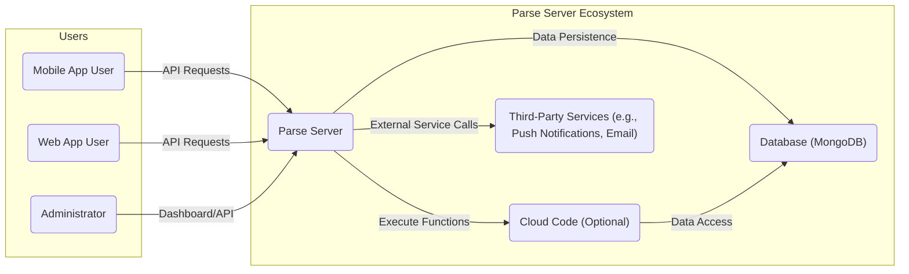
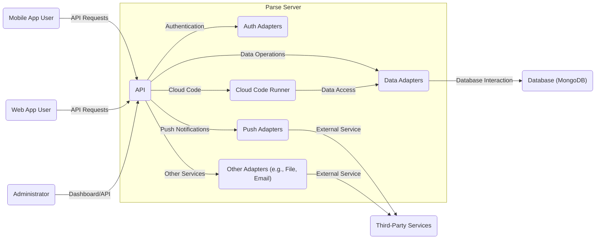
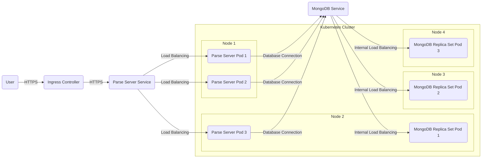
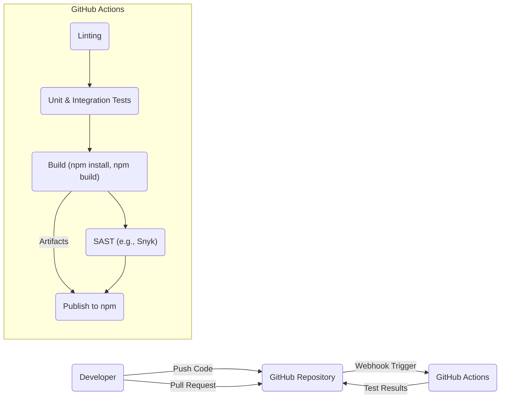

Okay, let's create a design document for the Parse Server project.

# BUSINESS POSTURE

Parse Server is an open-source backend framework that simplifies building and deploying application backends. It's often used by startups and individual developers for rapid prototyping and building MVPs, but can also be scaled for larger applications. The business priorities likely revolve around:

*   Ease of Use: Making it simple for developers of all skill levels to create and manage application backends.
*   Speed of Development: Enabling rapid development cycles.
*   Flexibility and Extensibility: Allowing developers to customize and extend the server's functionality to meet their specific needs.
*   Community Support: Fostering a strong community to provide support, contribute to the project, and build extensions.
*   Scalability: Providing a path for applications to grow from small prototypes to large-scale deployments.
*   Cost-Effectiveness: Offering a cost-effective solution compared to building a backend from scratch or using proprietary Backend-as-a-Service (BaaS) platforms.

Based on these priorities, the most important business risks are:

*   Data Breaches: Unauthorized access to user data stored within Parse Server instances. This is a critical risk given the sensitive nature of data often handled by applications.
*   Service Downtime: Outages or performance issues that disrupt application functionality, leading to user dissatisfaction and potential business losses.
*   Lack of Adoption: Insufficient adoption by developers, hindering the project's growth and sustainability.
*   Competition: Competition from other open-source backend frameworks and commercial BaaS providers.
*   Security Vulnerabilities: Exploitable vulnerabilities in the Parse Server codebase or its dependencies, leading to data breaches or service disruptions.
*   Maintainability: Difficulty in maintaining and updating the codebase, leading to technical debt and hindering future development.

# SECURITY POSTURE

Parse Server has several built-in security features and allows for various security configurations. However, the actual security posture depends heavily on how it's deployed and configured.

Existing Security Controls:

*   security control: Authentication: Supports various authentication methods, including username/password, social logins (Facebook, Google, etc.), and custom authentication adapters. Described in the documentation and implemented in the core codebase.
*   security control: Authorization: Role-Based Access Control (RBAC) using Parse's built-in roles and Class-Level Permissions (CLPs) to control access to data. Described in the documentation and implemented in the core codebase.
*   security control: Data Validation: Basic data validation through schema definitions. Described in the documentation and implemented in the core codebase.
*   security control: HTTPS Support: Can be configured to use HTTPS for secure communication. This is typically handled by a reverse proxy (e.g., Nginx, Apache) or load balancer in front of Parse Server. Described in deployment guides.
*   security control: API Rate Limiting: Can be configured to limit API requests to prevent abuse and denial-of-service attacks. Described in the documentation and implemented in the core codebase.
*   security control: Password Hashing: Uses secure password hashing algorithms (bcrypt) to store passwords. Implemented in the core codebase.

Accepted Risks:

*   accepted risk: Default Configuration: The default configuration may not be secure for all deployments. It's the responsibility of the deployer to properly configure security settings.
*   accepted risk: Third-Party Dependencies: Relies on third-party libraries, which may have their own vulnerabilities.
*   accepted risk: Custom Code: Cloud Code and custom adapters introduce the potential for security vulnerabilities if not carefully developed and reviewed.
*   accepted risk: Database Security: The security of the underlying database (typically MongoDB) is the responsibility of the deployer.

Recommended Security Controls:

*   security control: Input Sanitization: Implement robust input sanitization and validation for all user-provided data, both in Cloud Code and client-side applications, to prevent injection attacks (e.g., NoSQL injection).
*   security control: Regular Security Audits: Conduct regular security audits and penetration testing to identify and address potential vulnerabilities.
*   security control: Dependency Management: Implement a robust dependency management process to track and update third-party libraries, addressing known vulnerabilities promptly.
*   security control: Security Headers: Configure appropriate security headers (e.g., Content Security Policy, Strict-Transport-Security) to mitigate common web vulnerabilities.
*   security control: Monitoring and Logging: Implement comprehensive monitoring and logging to detect and respond to security incidents.
*   security control: Least Privilege: Apply the principle of least privilege to all database users and application roles, granting only the necessary permissions.

Security Requirements:

*   Authentication:
    *   Support for multi-factor authentication (MFA).
    *   Secure session management with appropriate timeouts and protection against session hijacking.
    *   Account lockout mechanisms to prevent brute-force attacks.
*   Authorization:
    *   Fine-grained access control beyond basic roles and CLPs, potentially using attribute-based access control (ABAC).
    *   Auditing of authorization decisions.
*   Input Validation:
    *   Strict validation of all input data against predefined schemas and rules.
    *   Protection against NoSQL injection and other injection attacks.
    *   Safe handling of file uploads.
*   Cryptography:
    *   Use of strong, industry-standard cryptographic algorithms for all sensitive data, both in transit and at rest.
    *   Proper key management practices.
    *   Data encryption at rest for sensitive data stored in the database.

# DESIGN

## C4 CONTEXT

Element Descriptions:

*   1. Name: Mobile App User
    *   Type: User
    *   Description: End-user interacting with the application through a mobile app.
    *   Responsibilities: Accessing application features, viewing data, submitting data.
    *   Security controls: Authentication, authorization (via Parse Server).

*   2. Name: Web App User
    *   Type: User
    *   Description: End-user interacting with the application through a web browser.
    *   Responsibilities: Accessing application features, viewing data, submitting data.
    *   Security controls: Authentication, authorization (via Parse Server).

*   3. Name: Administrator
    *   Type: User
    *   Description: User responsible for managing the Parse Server instance and application data.
    *   Responsibilities: Configuring Parse Server, managing users and roles, accessing data for administrative purposes.
    *   Security controls: Authentication, authorization (via Parse Server), potentially with higher privileges.

*   4. Name: Parse Server
    *   Type: System
    *   Description: The core backend framework providing API endpoints and data management.
    *   Responsibilities: Handling API requests, managing data persistence, executing Cloud Code, interacting with third-party services.
    *   Security controls: Authentication, authorization, rate limiting, data validation, password hashing.

*   5. Name: Database (MongoDB)
    *   Type: System
    *   Description: The database used to store application data (typically MongoDB).
    *   Responsibilities: Storing and retrieving data.
    *   Security controls: Database authentication, access control, encryption at rest (if configured).

*   6. Name: Cloud Code (Optional)
    *   Type: System
    *   Description: Custom server-side logic written by developers.
    *   Responsibilities: Extending Parse Server functionality, performing complex operations, interacting with the database.
    *   Security controls: Input validation, secure coding practices, adherence to least privilege principle.

*   7. Name: Third-Party Services (e.g., Push Notifications, Email)
    *   Type: System
    *   Description: External services integrated with Parse Server.
    *   Responsibilities: Providing specific functionalities like push notifications, email sending, etc.
    *   Security controls: Secure API keys, secure communication protocols (e.g., HTTPS).

## C4 CONTAINER

Element Descriptions:

*   1. Name: API
    *   Type: Container
    *   Description: The main entry point for client requests.
    *   Responsibilities: Handling API requests, routing requests to appropriate components, enforcing security policies.
    *   Security controls: Authentication, authorization, rate limiting, input validation.

*   2. Name: Data Adapters
    *   Type: Container
    *   Description: Handles interaction with the database.
    *   Responsibilities: Translating API requests into database queries, managing data persistence.
    *   Security controls: Secure database connection, adherence to least privilege principle.

*   3. Name: Auth Adapters
    *   Type: Container
    *   Description: Manages user authentication.
    *   Responsibilities: Authenticating users, managing sessions, handling password resets.
    *   Security controls: Secure password hashing, session management, account lockout.

*   4. Name: Cloud Code Runner
    *   Type: Container
    *   Description: Executes Cloud Code functions.
    *   Responsibilities: Running custom server-side logic, providing a sandboxed environment for Cloud Code execution.
    *   Security controls: Input validation, secure coding practices, resource limits.

*   5. Name: Push Adapters
    *   Type: Container
    *   Description: Handles push notifications.
    *   Responsibilities: Interacting with third-party push notification services (e.g., APNs, FCM).
    *   Security controls: Secure API keys, secure communication protocols.

*   6. Name: Other Adapters (e.g., File, Email)
    *   Type: Container
    *   Description: Handles other functionalities like file storage and email sending.
    *   Responsibilities: Interacting with third-party services or local storage.
    *   Security controls: Secure API keys, secure communication protocols, secure file storage.

*   7. Name: Database (MongoDB)
    *   Type: System
    *   Description: The database used to store application data.
    *   Responsibilities: Storing and retrieving data.
    *   Security controls: Database authentication, access control, encryption at rest (if configured).

*   8. Name: Third-Party Services
    *   Type: System
    *   Description: External services integrated with Parse Server.
    *   Responsibilities: Providing specific functionalities like push notifications, email sending, etc.
    *   Security controls: Secure API keys, secure communication protocols (e.g., HTTPS).

*   9. Name: Mobile App User
    *   Type: User
    *   Description: End-user interacting with the application through a mobile app.
    *   Responsibilities: Accessing application features, viewing data, submitting data.
    *   Security controls: Authentication, authorization (via Parse Server).

*   10. Name: Web App User
    *   Type: User
    *   Description: End-user interacting with the application through a web browser.
    *   Responsibilities: Accessing application features, viewing data, submitting data.
    *   Security controls: Authentication, authorization (via Parse Server).

*   11. Name: Administrator
    *   Type: User
    *   Description: User responsible for managing the Parse Server instance and application data.
    *   Responsibilities: Configuring Parse Server, managing users and roles, accessing data for administrative purposes.
    *   Security controls: Authentication, authorization (via Parse Server), potentially with higher privileges.

## DEPLOYMENT

Parse Server can be deployed in various ways, including:

1.  Self-hosting on a Virtual Machine (VM) (e.g., AWS EC2, Google Compute Engine, Azure VM).
2.  Using a Platform-as-a-Service (PaaS) provider (e.g., Heroku, AWS Elastic Beanstalk).
3.  Deploying to a container orchestration platform (e.g., Kubernetes, Docker Swarm).
4.  Using a managed Parse Server provider.

We'll describe deployment to Kubernetes, as it offers scalability, resilience, and flexibility.

Element Descriptions:

*   1. Name: User
    *   Type: User
    *   Description: End-user or administrator accessing the application.
    *   Responsibilities: Interacting with the application.
    *   Security controls: Authentication, authorization (handled by Parse Server).

*   2. Name: Ingress Controller
    *   Type: Infrastructure
    *   Description: Handles external access to the Kubernetes cluster.
    *   Responsibilities: Routing traffic to the appropriate services, terminating SSL/TLS.
    *   Security controls: HTTPS, TLS configuration, potentially a Web Application Firewall (WAF).

*   3. Name: Parse Server Service
    *   Type: Kubernetes Service
    *   Description: A Kubernetes Service that provides a stable endpoint for accessing Parse Server pods.
    *   Responsibilities: Load balancing traffic across Parse Server pods.
    *   Security controls: Network policies.

*   4. Name: Parse Server Pod 1, 2, 3
    *   Type: Kubernetes Pod
    *   Description: Instances of the Parse Server application running in containers.
    *   Responsibilities: Handling API requests, interacting with the database.
    *   Security controls: All Parse Server security controls (authentication, authorization, etc.), container security best practices.

*   5. Name: MongoDB Service
    *   Type: Kubernetes Service
    *   Description: A Kubernetes Service that provides a stable endpoint for accessing MongoDB replica set pods.
    *   Responsibilities: Load balancing traffic across MongoDB pods.
    *   Security controls: Network policies.

*   6. Name: MongoDB Replica Set Pod 1, 2, 3
    *   Type: Kubernetes Pod
    *   Description: Instances of the MongoDB database running in containers, configured as a replica set for high availability and data redundancy.
    *   Responsibilities: Storing and retrieving application data.
    *   Security controls: Database authentication, access control, encryption at rest (if configured), network policies.

*   7. Name: Node 1, 2, 3, 4
    *   Type: Kubernetes Node
    *   Description: Physical or virtual machines that are part of the Kubernetes cluster.
    *   Responsibilities: Running Kubernetes pods.
    *   Security controls: Node-level security hardening, network policies.

## BUILD

Parse Server's build process is managed through its GitHub repository and uses Node.js and npm (Node Package Manager).

Build Process Description:

1.  Developers write code and push it to the Parse Server GitHub repository.
2.  A pull request is created for code review.
3.  GitHub Actions is triggered by events (push, pull request) in the repository.
4.  Linting: Code is checked for style and potential errors using a linter (e.g., ESLint).
5.  Unit & Integration Tests: Automated tests are run to verify the functionality of the code.
6.  Build: The `npm install` command installs project dependencies, and `npm build` (or a similar script) compiles the code.
7.  SAST (Static Application Security Testing): A SAST tool (e.g., Snyk, which is integrated into the Parse Server repository) scans the code and its dependencies for known vulnerabilities.
8.  Publish to npm: If all checks pass, the package is published to the npm registry.

Security Controls in Build Process:

*   security control: Code Review: Pull requests require review and approval from other developers before merging, helping to catch potential security issues.
*   security control: Linting: Enforces coding standards and helps prevent common errors that could lead to vulnerabilities.
*   security control: Automated Testing: Unit and integration tests help ensure that code changes don't introduce security regressions.
*   security control: SAST: Scans the codebase and dependencies for known vulnerabilities.
*   security control: Dependency Management: npm and tools like Snyk help manage dependencies and identify vulnerable packages.
*   security control: GitHub Actions: Provides a secure and automated environment for building and testing the code.

# RISK ASSESSMENT

Critical Business Processes:

*   User Authentication and Authorization: Ensuring only authorized users can access the application and its data.
*   Data Management: Storing, retrieving, and managing user data securely and reliably.
*   Application Functionality: Providing the core features and services of the application.
*   API Availability and Performance: Ensuring the API is responsive and available to users.

Data Sensitivity:

The data stored by Parse Server can vary greatly in sensitivity depending on the application. It can range from non-sensitive public data to highly sensitive Personally Identifiable Information (PII), financial data, or health data. Therefore, it's crucial to classify data based on its sensitivity and apply appropriate security controls.

*   High Sensitivity: PII (names, addresses, email addresses, phone numbers), financial data, health data, authentication credentials.
*   Medium Sensitivity: User preferences, application settings, usage data.
*   Low Sensitivity: Publicly available data, non-sensitive metadata.

# QUESTIONS & ASSUMPTIONS

Questions:

*   What specific third-party services are commonly integrated with Parse Server deployments in this context? (This helps assess the security of those integrations.)
*   What is the expected scale of deployments? (This helps determine the appropriate level of security controls and performance considerations.)
*   What are the specific compliance requirements (e.g., GDPR, HIPAA, PCI DSS) that need to be considered?
*   What level of access do administrators have to user data? (This helps define appropriate access control policies.)
*   Are there any existing security incident response plans?

Assumptions:

*   BUSINESS POSTURE: The primary goal is to provide a secure and reliable backend framework for application development, balancing ease of use with security.
*   SECURITY POSTURE: Developers using Parse Server have a basic understanding of security principles but may not be security experts. The default configuration is assumed to be insecure, and deployers are responsible for configuring security settings.
*   DESIGN: Parse Server is deployed on a Kubernetes cluster with a MongoDB replica set for data persistence. HTTPS is used for all external communication. The build process utilizes GitHub Actions for CI/CD, including SAST scanning.