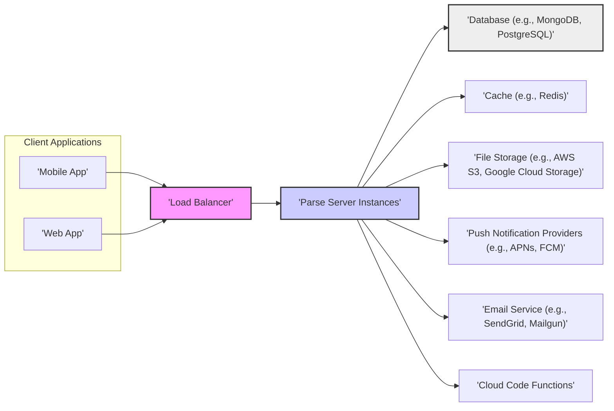
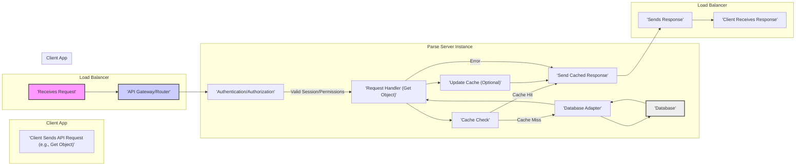

# Project Design Document: Parse Server

**Version:** 1.1
**Date:** October 26, 2023
**Author:** AI Software Architect

## 1. Introduction

This document details the architectural design of the Parse Server project, an open-source backend deployable across various infrastructure providers. It aims to provide a clear understanding of the system's components, data flow, and core functionalities, serving as a foundation for subsequent threat modeling activities.

## 2. Goals

*   Clearly define the architecture and components of Parse Server.
*   Illustrate the data flow within the system for typical operations.
*   Identify key functionalities and their interactions.
*   Provide a solid basis for identifying potential security vulnerabilities during threat modeling exercises.
*   Serve as a reference for developers, security professionals, and operations teams.

## 3. Architectural Overview

Parse Server, a Node.js application, acts as a backend for web and mobile applications. It replicates much of the original Parse.com backend API, facilitating migration and new development with a familiar interface. The architecture centers on handling client requests, database interactions, and providing various backend services.

**Key Architectural Layers:**

*   **Client Layer:**  Represents applications (mobile, web, IoT devices) interacting with the Parse Server API.
*   **Load Balancing Layer:** Distributes incoming traffic across multiple Parse Server instances, enhancing scalability and availability.
*   **Application Layer (Parse Server):** The core, responsible for handling API requests, executing business logic, and managing data access.
*   **Data Storage Layer:** Persists application data, typically using a NoSQL (e.g., MongoDB) or relational (e.g., PostgreSQL) database.
*   **Caching Layer:** Improves performance by storing frequently accessed data in a fast, in-memory store.
*   **External Services Layer:** Integrates with external services for functionalities like file storage, push notifications, email delivery, and custom cloud code execution environments.

## 4. Component Details

This section provides detailed information about the key components within the Parse Server architecture.

*   **API Gateway/Router:**
    *   Receives and routes incoming API requests from client applications.
    *   Enforces authentication and authorization policies for API endpoints.
    *   Performs request validation and transformation as needed.
    *   Typically implemented using Express.js middleware within the Node.js application.

*   **Request Handlers:**
    *   Specific modules or functions dedicated to processing individual API endpoints (e.g., user creation, object retrieval, data updates).
    *   Contain the core business logic associated with each API operation.
    *   Interact with the database adapter, authentication module, and other relevant services.

*   **Database Adapter:**
    *   Provides an abstraction layer enabling Parse Server to interact with various database systems (e.g., MongoDB, PostgreSQL).
    *   Translates Parse Query Language (PQL) into database-specific queries.
    *   Manages database connection pooling and error handling.

*   **Authentication and Authorization Module:**
    *   Manages user registration, login, session management, and password recovery.
    *   Supports diverse authentication methods, including username/password, session tokens, and third-party providers (e.g., Facebook, Google).
    *   Enforces access control based on user roles, permissions, and object-level access control lists (ACLs).

*   **Cloud Code Engine:**
    *   Enables developers to write custom server-side logic in JavaScript.
    *   Executes in response to specific events (e.g., before/after save hooks, triggers) or when called directly as Cloud Functions.
    *   Provides access to the Parse Server SDK and external Node.js libraries.

*   **Push Notification Module:**
    *   Handles the process of sending push notifications to mobile devices via providers like Apple Push Notification service (APNs) and Firebase Cloud Messaging (FCM).
    *   Manages device tokens, notification content, and delivery status.

*   **File Storage Adapter:**
    *   Provides an interface for storing and retrieving files associated with application data.
    *   Supports various storage providers, including local filesystem and cloud storage services like AWS S3 and Google Cloud Storage.

*   **Background Jobs Module:**
    *   Facilitates the scheduling and execution of asynchronous tasks that don't need immediate processing.
    *   Useful for tasks like data cleanup, sending bulk emails, and complex data processing.

*   **Cache Module:**
    *   Implements caching mechanisms to improve application performance by storing frequently accessed data in memory.
    *   Can utilize in-memory data stores like Redis or Memcached.

## 5. Data Flow

This section illustrates the typical data flow for a common operation, such as retrieving a specific object.

**Detailed Data Flow for Object Retrieval:**

1. **Client Sends API Request:** The client application sends an HTTP request (e.g., GET) to the Parse Server API endpoint to retrieve a specific object.
2. **Load Balancer Receives Request:** The load balancer distributes the incoming request to an available Parse Server instance.
3. **API Gateway/Router:** The Parse Server instance's API gateway receives the request and routes it to the appropriate handler.
4. **Authentication/Authorization:** The authentication module verifies the user's session and checks if they have the necessary permissions to access the requested object.
5. **Request Handler:** The specific request handler for object retrieval processes the request.
6. **Cache Check:** The request handler checks if the requested object is available in the cache.
7. **Cache Hit:** If the object is in the cache, the cached response is sent directly to the client.
8. **Cache Miss:** If the object is not in the cache, the request handler proceeds to fetch it from the database.
9. **Database Adapter:** The request handler interacts with the database adapter to translate the request into a database query (e.g., a SELECT statement).
10. **Database:** The database retrieves the requested object data.
11. **Response:** The database sends the object data back to the database adapter.
12. **Request Handler (Response):** The request handler processes the database response.
13. **Update Cache (Optional):** The request handler may update the cache with the retrieved object data for future requests.
14. **Parse Server Instance (Response):** The Parse Server instance sends an HTTP response containing the object data back to the load balancer.
15. **Load Balancer Sends Response:** The load balancer forwards the response to the client application.
16. **Client Receives Response:** The client application receives the requested object data.

## 6. Key Functionalities

*   **Data Management:**  Storing, querying, updating, and deleting structured data with flexible schemas.
*   **User Authentication:** Securely managing user accounts, sessions, and authentication through various methods.
*   **Cloud Code Execution:** Running custom server-side logic triggered by events or direct calls.
*   **Push Notifications:** Sending targeted notifications to mobile devices across different platforms.
*   **File Storage:**  Managing file uploads, downloads, and storage with configurable storage adapters.
*   **Real-time Data (LiveQuery):**  Subscribing to real-time updates for data changes, enabling interactive applications.
*   **Background Jobs:**  Scheduling and executing asynchronous tasks for background processing.
*   **Social Login Integration:**  Authenticating users using popular social media providers.
*   **Email Communication:**  Sending emails for user verification, password resets, and other notifications.

## 7. Security Considerations (For Threat Modeling)

This section outlines key security considerations relevant for threat modeling activities.

*   **Authentication and Authorization Vulnerabilities:**
    *   **Broken Authentication:** Weak password policies, insecure session management, lack of multi-factor authentication.
    *   **Broken Authorization:**  Bypassing access controls, privilege escalation, insecure direct object references.
*   **Input Validation Flaws:**
    *   **Injection Attacks:** SQL injection, NoSQL injection, command injection through unsanitized user inputs.
    *   **Cross-Site Scripting (XSS):**  Injecting malicious scripts into web pages served by the application.
    *   **Cross-Site Request Forgery (CSRF):**  Forcing authenticated users to perform unintended actions.
*   **Data Protection Issues:**
    *   **Insufficient Data Encryption:**  Sensitive data stored or transmitted without proper encryption.
    *   **Exposure of Sensitive Information:**  Accidental disclosure of API keys, database credentials, or personal data in logs or error messages.
*   **API Security Weaknesses:**
    *   **Lack of Rate Limiting:**  Vulnerability to denial-of-service attacks and brute-force attacks.
    *   **Mass Assignment:**  Allowing clients to modify unintended object properties.
    *   **Insecure API Design:**  Exposing sensitive information in API responses or using insecure HTTP methods.
*   **Dependency Vulnerabilities:**  Using outdated libraries or frameworks with known security flaws.
*   **Secrets Management:**  Storing sensitive credentials (API keys, database passwords) insecurely.
*   **Logging and Monitoring Deficiencies:**  Insufficient logging to detect and respond to security incidents.
*   **Cloud Code Security Risks:**  Vulnerabilities introduced through custom cloud code logic, including insecure API calls or data handling.
*   **File Storage Security:**  Inadequate access controls or insecure configurations for file storage, leading to unauthorized access or data breaches.

## 8. Future Considerations

*   **Enhanced Scalability and Performance:**  Exploring further optimizations for handling increased load and data volume, potentially through horizontal scaling and database sharding.
*   **Improved Observability:**  Implementing more robust monitoring, tracing, and logging solutions for better insights into system behavior and performance.
*   **Containerization and Orchestration:**  Adopting container technologies (e.g., Docker) and orchestration platforms (e.g., Kubernetes) for simplified deployment, management, and scaling.
*   **Multi-Tenancy Enhancements:**  Developing features to better support multiple independent applications on a single Parse Server instance with strong isolation.
*   **GraphQL API Support:**  Considering the addition of a GraphQL API as an alternative to the RESTful API for more efficient data fetching.

This improved document provides a more detailed and refined design overview of the Parse Server project, offering a stronger foundation for effective threat modeling and a better understanding of the system's architecture.
