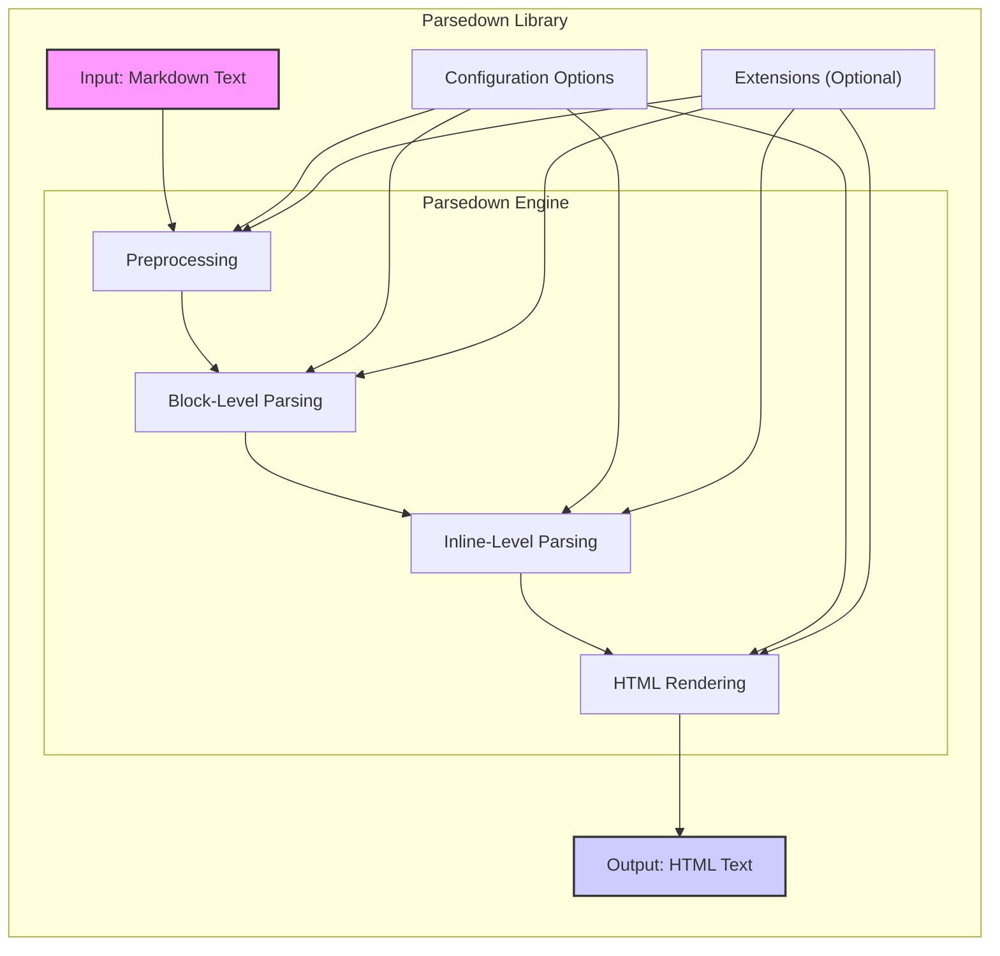
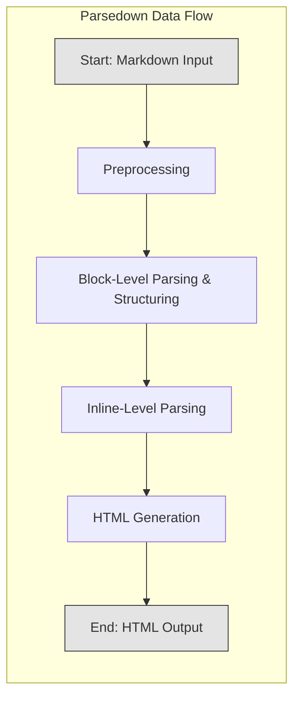

# Project Design Document: Parsedown (Improved)

**Version:** 1.1
**Date:** October 26, 2023
**Author:** AI Software Architect

## 1. Introduction

This document provides an enhanced design overview of the Parsedown library, a Markdown parser written in PHP. This iteration aims to provide a more granular understanding of the library's architecture, data flow, and key components to facilitate more effective and targeted threat modeling. It will serve as a refined reference point for security assessments and discussions.

## 2. Goals

*   Provide a detailed and precise description of the Parsedown library's architecture, including internal processing stages.
*   Clearly outline the data flow within the library, highlighting key transformations.
*   Identify key components and their interactions with greater specificity.
*   Establish a robust foundation for comprehensive threat modeling activities.

## 3. Non-Goals

*   This document does not provide a line-by-line code-level analysis of Parsedown.
*   It does not delve into the intricacies of every specific Markdown syntax rule implemented.
*   It does not aim to be an exhaustive catalog of all possible valid and invalid Markdown input combinations.
*   It does not offer prescriptive security solutions or code-level fixes for potential vulnerabilities.

## 4. System Architecture

Parsedown is architected as a single, cohesive class in PHP, responsible for transforming Markdown formatted text into HTML. It is designed for seamless integration within PHP-based applications.

### 4.1. Components

*   **Input: Markdown Text:** The raw Markdown formatted string provided to Parsedown for conversion. The origin of this input is external to Parsedown and depends on the embedding application (e.g., user submissions, file contents, API responses).
*   **Parsedown Engine:** The core processing unit, internally structured into several stages:
    *   **Preprocessing:** Initial steps like normalizing line endings and handling basic input cleanup.
    *   **Block-Level Parsing:**  Identifies and processes block-level elements in Markdown, such as paragraphs, headings, lists, code blocks, and blockquotes. This stage often involves iterating through lines of input and identifying patterns that signify the start of a block element.
    *   **Inline-Level Parsing:**  Once block elements are identified, this stage focuses on parsing inline elements within those blocks, such as emphasis (bold, italics), links, images, and inline code. This involves scanning within the text content of block elements for specific Markdown syntax.
    *   **HTML Rendering:**  The final stage where the parsed Markdown structure is translated into corresponding HTML tags and attributes. This involves generating the appropriate HTML markup based on the identified block and inline elements.
*   **Configuration Options:**  Settings that allow customization of Parsedown's behavior. These can influence how specific Markdown syntax is interpreted and how HTML is generated. Examples include:
    *   Enabling/disabling specific Markdown features (e.g., tables, strikethrough).
    *   Setting HTML attributes for certain elements (e.g., `target="_blank"` for links).
    *   Defining allowed HTML tags or attributes.
*   **Extensions (Optional):**  Mechanisms to extend Parsedown's functionality by adding custom Markdown parsing rules or modifying existing behavior. Extensions can hook into different stages of the parsing process.
*   **Output: HTML Text:** The resulting HTML formatted string generated by the Parsedown engine after processing the input Markdown. This output is intended for rendering in web browsers or other HTML interpreters.

### 4.2. Interactions

1. A PHP application provides a Markdown text string to the Parsedown library instance.
2. The application may optionally configure Parsedown by setting various configuration options before parsing.
3. The application may optionally load and register Parsedown extensions, which can modify the parsing process.
4. The Parsedown Engine receives the input Markdown text and initiates the parsing process.
5. **Preprocessing** is performed on the input.
6. **Block-Level Parsing** identifies and structures the block elements.
7. **Inline-Level Parsing** processes the content within the identified block elements.
8. **HTML Rendering** generates the final HTML output based on the parsed structure.
9. The Parsedown library returns the generated HTML text to the calling PHP application.
10. The PHP application then typically uses this HTML for display or further manipulation.

## 5. Data Flow

The data flow within Parsedown involves a series of transformations applied to the input Markdown text:

*   **Input Stage:** Raw Markdown text enters the Parsedown library.
*   **Preprocessing Stage:** The input text undergoes initial normalization, such as standardizing line endings.
*   **Block-Level Parsing Stage:**
    *   The preprocessed text is analyzed line by line or in chunks to identify block-level Markdown elements.
    *   Internal data structures are created to represent these block elements (e.g., an array of paragraphs, headings, etc.).
*   **Inline-Level Parsing Stage:**
    *   The text content within each identified block element is further analyzed for inline Markdown syntax.
    *   Inline elements are identified and marked within the internal representation of the block.
*   **HTML Generation Stage:**
    *   The internal representation of the parsed Markdown (block and inline elements) is traversed.
    *   Corresponding HTML tags and attributes are generated for each identified element.
    *   The generated HTML fragments are concatenated to form the final HTML output string.
*   **Output Stage:** The fully generated HTML text is returned by the Parsedown library.

## 6. Security Considerations

Given Parsedown's role in generating HTML from user-provided content, security is paramount. Potential vulnerabilities include:

*   **Cross-Site Scripting (XSS):** Maliciously crafted Markdown input could bypass the parser's logic and result in the generation of HTML containing arbitrary JavaScript. For example:
    *   Escaping failures in inline link or image handling: `[evil](javascript:alert('XSS'))`
    *   Improper handling of HTML tags within Markdown: ``
*   **Denial of Service (DoS):** Carefully constructed Markdown input could exploit inefficiencies in the parsing algorithm, leading to excessive CPU or memory consumption. Examples include:
    *   Deeply nested lists or blockquotes.
    *   Extremely long lines without natural breaks.
    *   Repetitive patterns that cause backtracking in regular expressions.
*   **Code Injection (Primarily through Extensions):** If extensions are not rigorously developed and vetted, they could introduce vulnerabilities allowing for the execution of arbitrary PHP code on the server. This could occur if an extension directly processes raw input without proper sanitization or uses unsafe PHP functions.
*   **Server-Side Request Forgery (SSRF) (Less likely, but consider extensions):** If extensions allow fetching external resources based on user-provided URLs within the Markdown, a malicious user could potentially trigger requests to internal or unintended external systems.
*   **Information Disclosure:** While less common, errors in parsing or error handling could potentially reveal sensitive information about the server environment or internal application structure.

## 7. Deployment Considerations

The security of applications utilizing Parsedown depends heavily on how the library is integrated and the surrounding security measures:

*   **Contextual Output Encoding:** The application displaying the HTML generated by Parsedown *must* implement appropriate output encoding (e.g., HTML entity encoding) to prevent XSS, even if Parsedown is considered secure. Simply relying on Parsedown's output as inherently safe is insufficient.
*   **Input Validation and Sanitization (Upstream):** While Parsedown handles Markdown parsing, the application should perform preliminary input validation to reject obviously malicious or excessively large input before it reaches Parsedown. This can help mitigate DoS risks.
*   **Secure Extension Management:** Exercise extreme caution when using Parsedown extensions. Only use extensions from trusted sources, and ideally, conduct security reviews of their code. Disable any unnecessary extensions.
*   **Regular Updates and Patching:** Keep Parsedown updated to the latest stable version to benefit from bug fixes and security patches released by the developers.
*   **Resource Limits:** Implement appropriate resource limits (e.g., execution time, memory limits) for PHP processes to mitigate potential DoS attacks, even if the vulnerability lies within Parsedown.
*   **Content Security Policy (CSP):** Implement a strong Content Security Policy to further mitigate the impact of potential XSS vulnerabilities, even if they originate from the parsed Markdown.

## 8. Dependencies

Parsedown is designed to be a zero-dependency library, which simplifies deployment and reduces the attack surface associated with managing external dependencies. This is a significant security advantage.

## 9. Threat Modeling Focus Areas

When conducting threat modeling for systems using Parsedown, the following areas warrant particular attention:

*   **Parsedown's Core Parsing Logic:** Thoroughly analyze the parsing logic for potential vulnerabilities related to XSS, DoS, and other injection attacks. Focus on how different Markdown syntax elements are handled and how edge cases are processed.
*   **Attack Surface of Extensions:** If extensions are used, they represent a significant expansion of the attack surface. Each extension should be treated as a separate component requiring its own threat model.
*   **Interaction with Configuration Options:** Evaluate if any configuration options, when set to specific values, could inadvertently introduce security weaknesses or bypass intended security measures.
*   **Error Handling and Logging:** Analyze how Parsedown handles errors and whether error messages could leak sensitive information.
*   **Resource Consumption under Malicious Input:** Specifically test Parsedown's resilience against maliciously crafted input designed to consume excessive resources.
*   **Downstream HTML Handling:** While not a vulnerability in Parsedown itself, the way the generated HTML is handled and displayed by the consuming application is a critical area for threat modeling, particularly concerning output encoding and XSS prevention.

This improved design document provides a more detailed and nuanced understanding of the Parsedown library, enabling more effective and targeted threat modeling efforts. By focusing on the specific components, data flow, and potential vulnerabilities outlined here, security assessments can be more comprehensive and lead to more robust security measures.
