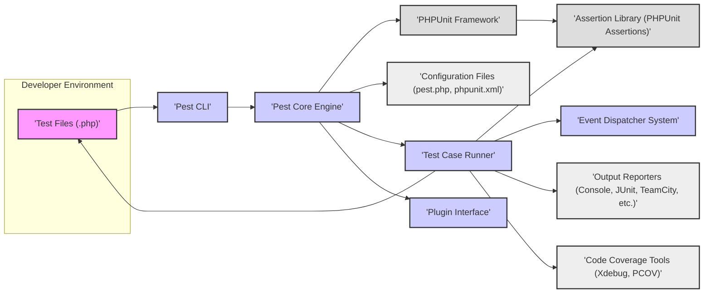
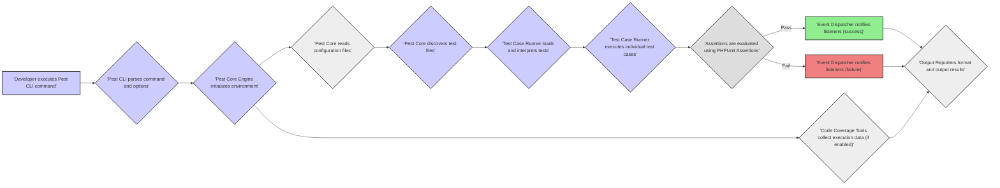

# Project Design Document: Pest PHP Testing Framework

**Version:** 1.1
**Date:** October 26, 2023
**Author:** AI Software Architect

## 1. Introduction

This document provides an enhanced design overview of the Pest PHP testing framework, building upon the previous version. It details the system's architecture, key components, data flow, and security considerations with a focus on providing the necessary information for effective threat modeling.

## 2. Project Overview

Pest is a developer-centric PHP Testing Framework designed for elegance and simplicity. It offers a fluent and expressive API for writing tests, aiming to improve developer satisfaction and test maintainability. Pest leverages the robust foundation of PHPUnit, extending its capabilities with a more streamlined and enjoyable testing experience.

## 3. Goals and Objectives

*   Enhance the developer experience in writing and maintaining PHP tests.
*   Minimize boilerplate code typically associated with traditional PHPUnit test setups.
*   Provide a highly readable and chainable API for defining test scenarios and expectations.
*   Ensure seamless compatibility and interoperability with existing PHPUnit test suites.
*   Simplify the process of discovering and executing tests within a project.
*   Offer advanced features such as parallel test execution and integrated code coverage reporting.

## 4. Target Audience

The primary users of Pest are PHP developers involved in various aspects of software development and quality assurance. This includes:

*   Backend engineers developing server-side logic and APIs.
*   Full-stack developers working on web applications and services.
*   Open-source contributors creating and maintaining PHP libraries and frameworks.
*   Quality Assurance (QA) engineers responsible for automating test cases.

## 5. System Architecture

Pest's architecture is composed of interconnected components that work together to facilitate the test execution process.

### 5.1. Component Details

*   **Test Files (.php):** These are PHP files where developers define their test cases using Pest's specific syntax. These files are the primary source of instructions for the testing process.
*   **Pest CLI:** The command-line interface (CLI) is the primary entry point for interacting with Pest. It handles user commands for running tests, generating reports, and other functionalities.
*   **Pest Core Engine:** This is the central component of Pest, responsible for orchestrating the entire testing process. Its responsibilities include:
    *   Bootstrapping the testing environment and loading necessary components.
    *   Discovering and parsing test files based on configured paths.
    *   Interpreting Pest's expressive syntax and translating it into executable PHP code compatible with PHPUnit.
    *   Managing the lifecycle of test execution, including setup and teardown phases.
*   **PHPUnit Framework:** Pest fundamentally relies on the PHPUnit framework for its core testing functionalities. Pest essentially acts as a wrapper and extension to PHPUnit.
*   **Configuration Files (pest.php, phpunit.xml):** These files provide configuration options for both Pest and PHPUnit. `pest.php` typically contains Pest-specific configurations, while `phpunit.xml` provides standard PHPUnit configuration settings.
*   **Test Case Runner:** This component is responsible for executing individual test cases. It iterates through the discovered tests and runs the code defined within each test.
*   **Assertion Library (PHPUnit Assertions):** Pest utilizes PHPUnit's robust assertion library to verify expected outcomes within test cases. Assertions are used to check if the actual results match the expected results.
*   **Event Dispatcher System:** Pest incorporates an event dispatcher that allows for custom actions and extensions to be triggered at various stages of the testing process. This enables plugins and listeners to interact with the test lifecycle.
*   **Plugin Interface:** Pest provides a plugin system that allows developers to extend its functionality. Plugins can introduce new reporters, modify test execution behavior, or add entirely new features.
*   **Output Reporters (Console, JUnit, TeamCity, etc.):** This component handles the formatting and presentation of test results. Pest supports various output formats, making it compatible with different reporting tools and CI/CD systems.
*   **Code Coverage Tools (Xdebug, PCOV):** Pest integrates with code coverage tools like Xdebug and PCOV to generate reports on the percentage of application code covered by the executed tests.

## 6. Data Flow

The data flow during a typical Pest test execution can be visualized as follows:

1. A developer initiates the testing process by executing a Pest command through the CLI.
2. The Pest CLI parses the provided command and its associated options.
3. The Pest Core Engine initializes the testing environment, setting up necessary components and resources.
4. The Core Engine reads configuration settings from `pest.php` and `phpunit.xml` to customize the test execution.
5. Pest Core discovers test files by scanning configured directories for files adhering to naming conventions.
6. The Test Case Runner loads the discovered test files and interprets the test definitions written using Pest's syntax.
7. The Test Case Runner executes each individual test case defined within the loaded files.
8. During test execution, assertions are evaluated using PHPUnit's assertion library to determine if the expected conditions are met.
9. The Event Dispatcher notifies registered listeners about the outcome of each test case (success or failure).
10. Output Reporters format the test results and output them in the desired format (e.g., console output, JUnit XML).
11. If code coverage is enabled, Code Coverage Tools collect data during test execution, which is then used to generate coverage reports.

## 7. Security Considerations

While Pest is primarily a development-time tool, security considerations are crucial, especially when considering its use in automated environments and the potential for executing arbitrary code.

*   **Malicious Test Code Execution:** Pest executes PHP code defined within test files. If a developer introduces malicious code within a test, it could potentially harm the testing environment, access sensitive data, or disrupt the testing process. This is a significant concern, especially in environments with multiple contributors.
*   **Vulnerabilities in Dependencies:** Pest relies on PHPUnit and other third-party packages. Security vulnerabilities in these dependencies could be exploited if not promptly patched. Regular dependency updates are essential.
*   **Exposure of Sensitive Information through Configuration:** Misconfigured `pest.php` or `phpunit.xml` files could inadvertently expose sensitive information, such as database credentials or API keys, if these configurations are not properly secured and managed.
*   **Security Risks in Plugins:**  Pest's plugin system allows for extending its functionality. However, poorly developed or malicious plugins could introduce security vulnerabilities, potentially compromising the testing environment or the application under test. Input validation and code reviews for plugins are important.
*   **Information Leakage in Test Reports:** Test reports, especially those generated in verbose mode or containing debugging information, might inadvertently leak sensitive data if tests interact with production systems or databases. Secure handling and storage of test reports are necessary.
*   **Code Coverage Data Manipulation:** While less critical, vulnerabilities in the code coverage engine or its integration could potentially lead to manipulated or inaccurate coverage reports, which could provide a false sense of security.
*   **Unauthorized Test Execution:** Access control to the testing environment and the ability to execute tests should be appropriately managed to prevent unauthorized execution of tests, especially in shared environments.
*   **Denial of Service through Resource Exhaustion:**  Maliciously crafted tests could potentially consume excessive resources (CPU, memory) leading to denial of service within the testing environment. Resource limits and monitoring might be necessary.

## 8. Dependencies

Pest's functionality relies on the following key dependencies:

*   **PHP (>= 7.3):** The core programming language. Pest requires a minimum PHP version to function correctly.
*   **PHPUnit (>= 8.0):** The underlying testing framework that Pest extends.
*   **Composer:** The standard PHP dependency management tool used for installing and managing Pest and its dependencies.
*   **Symfony Console Component:** Used for building the command-line interface.
*   **nikic/php-parser:** Used for static analysis of PHP code.
*   Potentially other Symfony components and various third-party packages for specific features and plugin functionalities.
*   **ext-xdebug or ext-pcov:** PHP extensions required for generating code coverage reports.

## 9. Deployment Model

Pest is typically deployed as a development dependency within a PHP project. It is installed using Composer and is primarily intended for use in development and CI/CD environments.

*   **Local Development Environments:** Developers install Pest as a `require-dev` dependency in their project's `composer.json` file.
*   **Continuous Integration/Continuous Deployment (CI/CD) Pipelines:** Pest is commonly used within CI/CD pipelines to automate the execution of tests as part of the software build and deployment process.

## 10. Future Considerations

*   **Enhanced Security Audits and Best Practices Documentation:** Providing more comprehensive guidance on secure testing practices with Pest.
*   **Improved Plugin Security Mechanisms:** Implementing stricter controls and validation for plugins to mitigate potential security risks.
*   **Integration with Static Analysis Tools for Test Code:**  Leveraging static analysis to identify potential security vulnerabilities or code quality issues within test files themselves.
*   **More Granular Access Control for Test Execution:** Implementing mechanisms to control which users or processes can execute specific test suites.
*   **Advanced Reporting and Logging Features:** Enhancing reporting capabilities to provide more detailed insights into test execution and potential security-related events.

This improved design document provides a more detailed and comprehensive overview of the Pest PHP testing framework, with a stronger emphasis on security considerations relevant for threat modeling. It aims to provide a solid foundation for identifying and mitigating potential risks associated with using Pest in various development and deployment scenarios.
